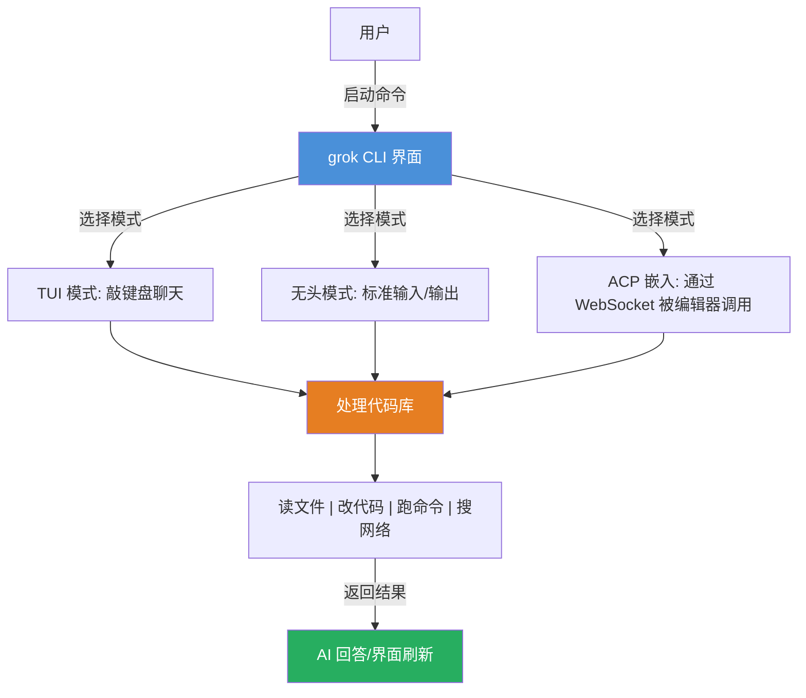
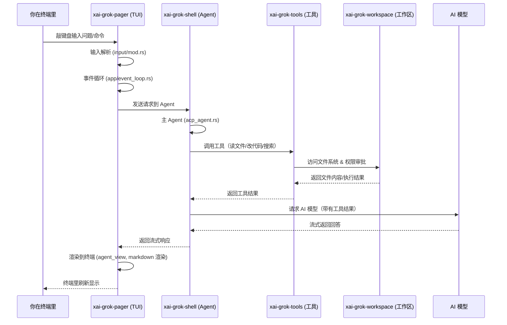

[← 返回首页](index.md)

# 项目总览

## 什么是 Grok Build？

**Grok Build** 是 xAI 出品的终端 AI 编程助手。你看它的全称——`grok` 命令行工具——做的事情就是：在终端里读懂你的代码库、帮你改文件、跑命令、搜网络，还能管理长时间运行的任务。

它有三种用法：

- **交互模式（TUI）**——全屏终端界面，你直接跟 AI 聊天，就像在命令行里开了一个 ChatGPT。
- **无头模式（Headless）**——适合脚本和 CI 流程，不需要终端界面，直接通过标准输入/输出跟 AI 交互。
- **嵌入模式**——通过 ACP（Agent Client Protocol，一个让其他程序连接智能体的网络协议）嵌入到编辑器里，作为 IDE 插件工作。



## 仓库是怎么划分的？

整个项目是 Rust 工作空间（`Cargo.toml` 里定义了所有成员 crate），代码集中在 `crates/` 下。我把它们按功能分成几大块，帮你快速摸清：

### 🎮 终端层（就是你能看见的部分）

| 路径 | 干啥的 |
|------|--------|
| `crates/codegen/xai-grok-pager` | TUI 主应用——捕捉按键、管理对话、渲染界面 |
| `crates/codegen/xai-grok-pager-render` | 终端渲染引擎——把 Markdown、代码、图片画到终端里 |
| `crates/codegen/xai-grok-pager-bin` | 最终的可执行文件 `xai-grok-pager`（发布时改名为 `grok`） |
| `crates/codegen/xai-grok-markdown` | Markdown 实时渲染库——把 AI 输出的 Markdown 转成终端颜色和格式 |

看 `crates/codegen/xai-grok-pager/src/lib.rs`，里面暴露了 `app`、`input`、`views` 这些模块——这整个 crate 就是你的"终端聊天窗口"。

### 🧠 Agent 层（AI 的大脑）

| 路径 | 干啥的 |
|------|--------|
| `crates/codegen/xai-grok-shell` | Agent 运行时——管理会话生命周期、认证、扩展能力 |
| `crates/codegen/xai-grok-shell-base` | Agent 的基础工具和环境变量 |
| `crates/codegen/xai-grok-sampler` | 采样器——负责跟 AI 模型通信，决定"模型下一步说什么" |
| `crates/codegen/xai-grok-agent` | 纯 AI 逻辑层——实现 Agent 内部的行为模式 |
| `crates/codegen/xai-agent-lifecycle` | Agent 生命周期钩子（启动、暂停、恢复、结束） |

入口在 `crates/codegen/xai-grok-shell/src/lib.rs`——这里面定义了 `agent`、`session`、`extensions`、`auth` 等模块，是整个 AI 能力的"总调度间"。

### 🔧 工具层（让 AI 能操作你的文件系统）

| 路径 | 干啥的 |
|------|--------|
| `crates/codegen/xai-grok-tools` | 30+ 种原子工具——读文件、写文件、搜索、跑命令、Git 操作 |
| `crates/codegen/xai-grok-tools-api` | 工具的 API 定义 |
| `crates/codegen/xai-hunk-tracker` | "Hunk"追踪器——记录代码片段的更改历史 |

工具层在 `crates/codegen/xai-grok-tools/src/lib.rs` 里通过 `bridge` 模块注册所有工具，模型通过协议调用它们。

### 🏗️ 工作区层（本地项目管理）

| 路径 | 干啥的 |
|------|--------|
| `crates/codegen/xai-grok-workspace` | 工作区核心——发现项目、读文件、权限审批、会话管理 |
| `crates/codegen/xai-grok-workspace-client` | 工作区客户端——远程连接工作区的封装 |
| `crates/codegen/xai-grok-workspace-types` | 工作区事件和类型定义 |
| `crates/codegen/xai-codebase-graph` | 代码索引——把代码仓库变成可查询的关系图 |
| `crates/codegen/xai-fast-worktree` | 快速工作树——高效文件变化检测 |

看 `crates/codegen/xai-grok-workspace/src/lib.rs`，里面有一个 `hub` 模块——它就是"管家"，负责扫描文件夹、拉起文件系统、管理权限。

### 📦 公共库（被多个模块共享的基础设施）

这些在 `crates/common/` 下：

| 路径 | 干啥的 |
|------|--------|
| `xai-tool-protocol` | 工具通信协议（类似 JSON-RPC） |
| `xai-tool-runtime` | 工具运行时——路由、调度、执行 |
| `xai-tool-types` | 工具的数据类型 |
| `xai-circuit-breaker` | 断路器——防止请求雪崩 |
| `xai-computer-hub-core/sdk` | 远程计算资源抽象层 |
| `xai-grok-compaction` | 对话压缩——把长对话缩成摘要 |
| `xai-tracing` | 统一日志和链路追踪 |

比如 `crates/common/xai-tool-protocol/src/lib.rs` 里定义了 `ToolCallParams`、`ToolCallResult` 这些帧结构——所有工具调用都走这套协议。

### 🎨 第三方库

`third_party/` 下放了直接搬进项目的源码，主要是 Mermaid 图表渲染：

| 路径 | 干啥的 |
|------|--------|
| `mermaid-to-svg` | 解析 Mermaid 语法并画出 SVG |
| `dagre_rust` | 布局算法——算每个节点该摆在哪 |
| `graphlib_rust` | 图结构库 |

### 🌱 其他辅助模块

| 路径 | 干啥的 |
|------|--------|
| `crates/codegen/xai-grok-config` | 配置管理——用户设置 |
| `crates/codegen/xai-grok-telemetry` | 遥测——记录行为、脱敏、上报 |
| `crates/codegen/xai-chat-state` | 聊天状态管理 |
| `crates/codegen/xai-grok-memory` | 长期记忆——向量化历史对话 |
| `crates/codegen/xai-grok-hooks` | 钩子系统——给外部事件绑定自定义行为 |
| `crates/codegen/xai-grok-mcp` | MCP（Model Context Protocol）服务器集成 |
| `crates/codegen/xai-grok-voice` | 语音支持 |
| `crates/codegen/xai-mixpanel` | Mixpanel 事件分析 |

### 整个架构的数据流长这样



## 技术栈一览

**语言**：全部用 Rust 写——e2024 版本（看 `Cargo.toml` 里的 `edition = "2024"`），追求性能和内存安全。

**终端界面**：基于 `ratatui`（0.29 版本）和 `crossterm`（0.28 版本）构建全屏 TUI。

**网络通信**：`reqwest` + `tokio` 做 HTTP，`tonic` 做 gRPC，`tokio-tungstenite` 做 WebSocket。

**AI 模型交互**：走 OpenAI 兼容的 API（`async-openai` crate），支持流式输出。

**渲染扩展**：`syntect`（代码高亮）、`pulldown-cmark`（Markdown 解析）、`mermaid-to-svg`（Mermaid 图表）。

**可观测性**：`tracing` + `opentelemetry` + `prometheus`——日志、链路追踪、指标都全了。

**协议**：`agent-client-protocol`（ACP）是核心通信协议，版本 0.10.4。同时支持 MCP（Model Context Protocol）让外部工具集成。

## 怎么开始？

### 安装预编译版本

```sh
# macOS / Linux / Git Bash
curl -fsSL https://x.ai/cli/install.sh | bash

# Windows PowerShell
irm https://x.ai/cli/install.ps1 | iex

grok --version
```

### 从源码构建

```sh
# 1. 确保 Rust 版本对上（rust-toolchain.toml 自动处理）
# 2. 安装 DotSlash（用来处理 protoc 等工具）
cargo install dotslash

# 3. 启动 TUI
cargo run -p xai-grok-pager-bin

# 4. 构建发布版
cargo build -p xai-grok-pager-bin --release
```

首次启动会打开浏览器让你登录认证——认证细节见《快速上手》页面。

## 与其它页面的关系

- 如果你想看**具体怎么安装、配置、首次聊天**，翻《快速上手》。
- 想理解**从按回车到 AI 回复**的完整通路的，翻《核心流程：从用户输入到 AI 回复》。
- 想深入**AI 怎么操作你的文件**的，翻《工具执行引擎》。
- 想搞懂**Agent 怎么分拆任务、管理多个子 Agent**的，翻《Agent 生命周期与多 Agent 协同》。

## 一句话总结

Grok Build 就是一个用 Rust 写的、全栈开源的终端 AI 编程助手——它接管了"写代码-查代码-改代码-跑代码"的完整闭环，让你在命令行里跟 AI 聊着天就把事情干了。仓库按"终端 → Agent → 工具 → 工作区 → 公共库 → 第三方"分层组织，每个层有自己的 crate，耦合很松，可以单独开发测试。
