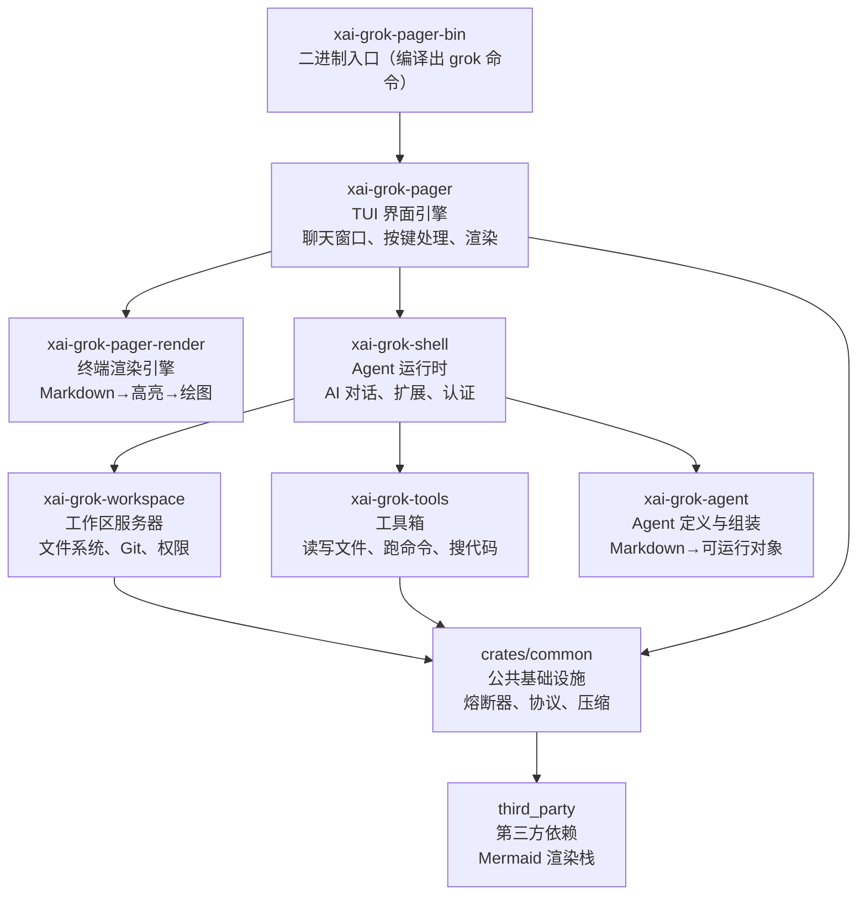
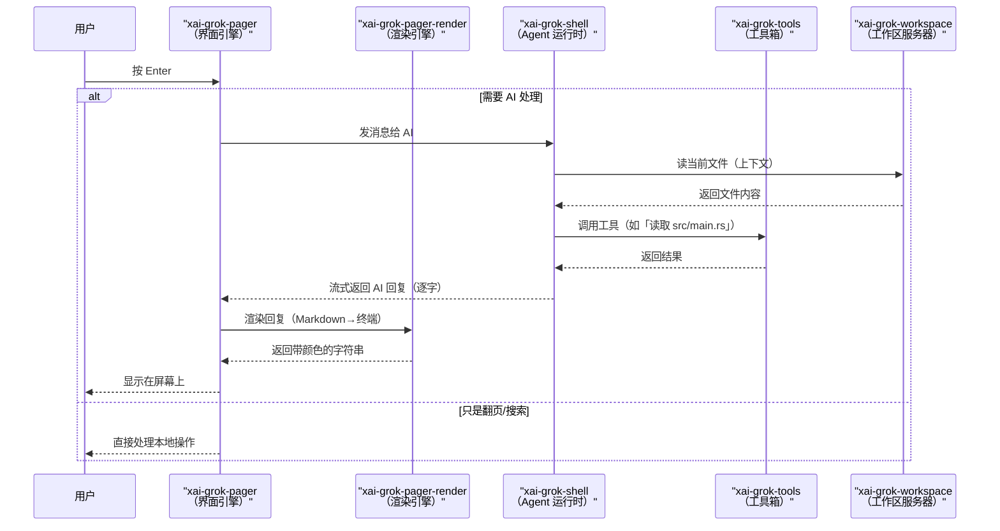

[← 返回首页](index.md)

# 项目总览

## Grok Build 是什么？

**Grok Build** 是 SpaceXAI 出品的一个终端里的 AI 编程助手。你打开它，就像在命令行里开了个能跟你聊天的窗口——它看得懂你的代码，能帮你改文件、跑命令、查资料、搜网页，还能长时间挂着帮你干活。

你可以把它当聊天窗口用（交互模式），也可以塞到脚本或 CI 流水线里让它自己跑（headless 模式），或者通过 Agent Client Protocol（ACP，一个让编辑器跟 AI 通信的协议）嵌到 VS Code 这类编辑器里。

> 这玩意儿是用 **Rust** 写的，仓库里几千个 `.rs` 文件，主要依赖 `tokio` 异步运行时搞定并发。

## 一句话说清各个零件

整个仓库分成几大块，每块管一个事：



**每个 crate 的具体用处（按上图从左到右）：**

| crate（路径） | 它干嘛的 |
|------|----------|
| `xai-grok-pager-bin`（`crates/codegen/xai-grok-pager-bin/`） | 整个程序的入口——编译出来就是 `grok` 命令。它只是把其他 crate 拼起来。 |
| `xai-grok-pager`（`crates/codegen/xai-grok-pager/`） | 终端里的聊天界面。管着用户怎么输入、 AI 怎么回复、屏幕怎么画。它的 `event_loop.rs` 是所有按键的调度中心。 |
| `xai-grok-pager-render`（`crates/codegen/xai-grok-pager-render/`） | 渲染引擎。把 Markdown 文本变成终端里五彩斑斓的代码高亮、图片占位符、 Mermaid 图。 |
| `xai-grok-shell`（`crates/codegen/xai-grok-shell/`） | AI 对话的核心运行时。Agent（小助手）在这里加载配置、认证、扩展，它决定怎么跟 AI 后端通信、怎么调用工具。 |
| `xai-grok-tools`（`crates/codegen/xai-grok-tools/`） | AI 的「手和眼睛」——里面几十个小工具，每个都能干一件事：读文件、写文件、跑 shell 命令、搜代码、查网页。AI 通过 JSON 指令调用它们。 |
| `xai-grok-workspace`（`crates/codegen/xai-grok-workspace/`） | 工作区大管家。管你本地文件系统、 Git 操作、权限控制、会话管理。它是一个长期运行的服务，通过 WebSocket 跟中心 Hub 通信。 |
| `xai-grok-agent`（`crates/codegen/xai-grok-agent/`） | Agent 的「生产线」。从 Markdown 定义文件读配置，组装提示词、绑定工具、挂上生命周期钩子，最后造出一个能干活的小助手。 |
| `crates/common/` 下的 | 公共零件箱。电路熔断器（保护下游不被压垮）、工具通信协议（二进制帧格式）、聊天内容压缩（省 Token 钱）、追踪和测试工具。所有上层 crate 都依赖它们。 |
| `third_party/` | 仓库里直接塞进来的第三方代码——一整套 Mermaid 图渲染栈（解析器、布局引擎、 SVG 渲染器）。因为要在终端里显示 Mermaid 图，干脆把上游代码复制过来了。 |

## 一次完整的对话大概是这样的

为了让你感觉一下这些零件怎么配合，下面画了一张时序图，展示「用户按回车发送问题 → AI 回复显示在终端」的完整流程：



## 怎么启动它

最直接的启动命令（在仓库根目录）：

```sh
# 编译并打开 TUI 界面
cargo run -p xai-grok-pager-bin

# 或者只编译出 release 版
cargo build -p xai-grok-pager-bin --release
# 然后运行 target/release/xai-grok-pager
```

> 第一次运行会弹出浏览器让你登录认证——具体流程见《快速上手：安装、运行、第一句对话》。

## 开发时要记住几件事

- **不要全量编译**。仓库里 crate 太多，`cargo check` 不加 `-p` 会慢死。永远指定你改的那个 crate，比如 `cargo check -p xai-grok-config`。
- **根目录的 Cargo.toml 是自动生成的**，你改了也白改——它会被定期覆盖。要改依赖版本或配置，去每个 crate 自己的 `Cargo.toml` 里改。
- **代码风格**有统一的 `rustfmt.toml` 和 `clippy.toml`，跑 `cargo fmt --all` 和 `cargo clippy -p <crate>` 检查就行。

## 再挖深一点

各个区域的详细拆解分别在：

- **《整体架构：分层与数据流》**——更完整的分层关系和各层之间的调用协议。
- **《用户按下一个键，背后发生了什么》**——从按键到显示的完整调用链，带逐行代码解释。
- **《工具箱概览：AI 的「手和眼睛」》**——翻遍 xai-grok-tools 里的每一个工具。
- **《工作区服务器：跟本地代码打交道的管家》**——xai-grok-workspace 的 RPC 服务、文件系统抽象和权限系统。
- **《终端渲染引擎：如何把 Markdown 变成赏心悦目的 TUI》**——三阶段渲染流水线。
- **《公共基础设施：熔断器、工具协议、压缩、追踪》**——crates/common 里的四个重要子系统。
