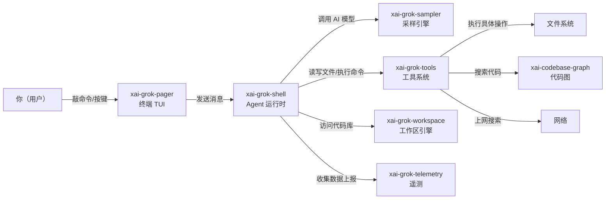

[← 返回首页](index.md)

# 项目总览

## 一句话讲清楚

**Grok Build** 是 SpaceXAI 出品的终端 AI 编程助手——一个 Rust 写的命令行工具，叫 `grok`。它能听懂你说话、看懂你代码、帮你改文件、帮你跑命令，一边跟你聊天一边干活。你就在终端里敲 `grok`，它全屏启动一个聊天界面，像跟一个懂代码的同事对话一样。

## 它能干什么？

| 你能让它做的事 | 大白话解释 |
|--------------|----------|
| 聊天式编程 | 直接说"帮我重构这个函数"，它理解上下文，给方案、改代码 |
| 读写文件 | "读一下 `src/main.rs` 第 20 行"→ 它读；"把日志改为 debug 级别"→ 它改 |
| 执行命令 | "帮我跑一下测试"→ 它在终端里帮你跑，结果实时显示 |
| 搜索代码 | "找找所有用到 `Tokenizer` 的地方"→ 它搜整个代码库 |
| 搜索网页 | "查一下 Rust 最新版有什么变化"→ 它上网搜了告诉你 |
| 管理会话 | 同时开多个聊天窗口（/session），每个独立记忆 |
| 插件扩展 | 装个 MCP 插件（模型上下文协议，就是外部服务接口），它能对接数据库、Slack 等 |
| 无头模式 | 不启动 TUI，直接脚本调用，适合 CI/CD 里自动化 |

所有功能的入口就是一个 `grok` 命令：你敲 `grok` 进聊天界面，或者 `grok --headless "帮我改配置文件"` 直接干活。

## 技术栈

代码仓库叫 `grok-build`，纯 Rust 写的（除了第三方依赖）。关键依赖从 `Cargo.toml` 里能看出来：

- **终端 UI**：`ratatui`（Rust 的 TUI 框架）+ `getch`/`terminput`（按键处理）
- **异步运行时**：`tokio` 全功能版
- **HTTP 客户端**：`reqwest` + `tower` 中间件
- **AI 推理**：`async-openai` 协议 + 自研采样器（`xai-grok-sampler`）
- **代码协作**：`gix`（git 操作）、“xai-grok-workspace”自家工作区引擎
- **Markdown 渲染**：`pulldown-cmark` 解析 + `syntect` 语法高亮
- **序列化和通讯**：`prost` + `tonic`（gRPC）、`serde`（JSON/YAML）
- **性能**：`tikv-jemallocator` 内存分配器、`fastrace` 分布式追踪

所有内部代码放在 `crates/codegen/` 下，按功能拆成几十个小 crate（因为 Rust 大项目都这么组织编译快）。入口 in `crates/codegen/xai-grok-pager-bin`，它把几个核心 crate 组合到一起：

```rust
// crates/codegen/xai-grok-pager/src/lib.rs（简略版，这是 TUI 的核心模块列表）
pub mod app;         // 事件循环、会话管理
pub mod input;       // 键盘输入解析
pub mod scrollback;  // 聊天历史缓冲区
pub mod views;       // UI 界面组件
pub mod acp;         // 代理间通信协议
```

## 一张图看清整体结构



## 一段话串起整个流程

你敲下 `grok` 回车，`xai-grok-pager` 在终端里全屏启动一个聊天界面（像 iMessage 但加代码高亮）。你输入一条消息（甚至一个命令 `/read main.rs`），`xai-grok-shell` 收到后，先处理会话状态（`xai-chat-state` 负责），然后调用采样引擎（`xai-grok-sampler`）向 AI 模型发推理请求。模型决定需要什么工具（比如读文件），通过 `xai-grok-tools` 执行，结果流式返回到聊天框里（`xai-grok-markdown` 负责流式渲染彩色代码块）。整个过程中，`xai-grok-workspace` 管着你项目的文件权限和 git 状态，`xai-grok-telemetry` 悄悄记录性能数据。

这整个对话的历史（包括压缩记忆）由 `xai-chat-state/src/actor.rs` 里的 `ChatStateActor` 管理——它像一个细心的秘书，帮你压缩长对话省的浪费 token（token 就是给 AI 算钱的最小单词单位），还能在不同会话间做记忆。详见《聊天状态与智能体生命周期》。

## 仓库怎么组织的

| 目录 | 干嘛的 |
|------|--------|
| `crates/codegen/xai-grok-pager-bin` | 入口：编译出 `grok` 二进制 |
| `crates/codegen/xai-grok-pager` | TUI 主代码：聊天界面、按键、渲染 |
| `crates/codegen/xai-grok-shell` | Agent 运行时：登录、聊天、扩展 |
| `crates/codegen/xai-grok-tools` | 所有工具（读文件、搜代码、跑命令） |
| `crates/codegen/xai-grok-workspace` | 工作区：文件系统、权限、git |
| `crates/codegen/xai-grok-sampler` | 采样引擎：调 AI 模型、流式响应 |
| `crates/codegen/xai-grok-markdown` | Markdown 流式渲染 |
| `crates/codegen/xai-grok-config` | 配置管理 |
| `crates/codegen/xai-grok-hooks` | 钩子系统，让插件拦截事件 |
| `crates/codegen/xai-grok-mcp` | MCP 协议支持（接入外部服务） |
| `crates/codegen/xai-grok-memory` | 记忆模块，跨会话记住东西 |
| `crates/common/xai-circuit-breaker` | 断路器：防止雪崩的通用组件 |
| `third_party/` | 第三方库（包括 Mermaid 渲染） |

重要的——`Cargo.toml` 是自动生成的（README.md 里明确说了：“The root `Cargo.toml` is **generated** — treat it as read-only.”），所以改依赖版本去各个 crate 自己的 `Cargo.toml` 里改，别动根目录那个。

## 开发者体验（怎么跑起来）

想试的话，macOS 或 Linux 上：

```bash
# 确保装了 Rust 和 dotslash（她生的工具下载器）
cargo install dotslash
dotslash --help  # 确认能用

# 启动 TUI
cargo run -p xai-grok-pager-bin
```

第一次启动会自动打开浏览器让你登录（OIDC 登录流程在 `crates/codegen/xai-grok-shell/src/auth/flow.rs`），之后就能直接跟 Grok 聊天了。详见《5 分钟快速上手》。

## 谁来维护

外部不接 PR（contributing 里写了不接受外部贡献），代码从 SpaceXAI 内部 monorepo 同步出来。所以看到奇怪的东西或者想提 feature，可以去 [x.ai/cli](https://x.ai/cli) 找反馈渠道，别往仓库发 issue（虽然可能开着但大概率不会有人回）。
