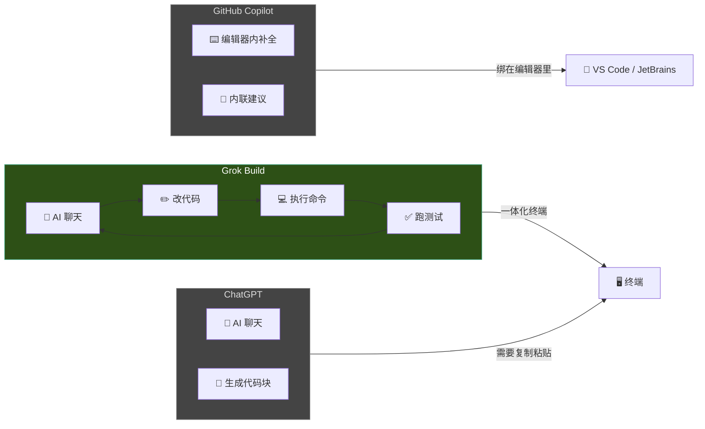
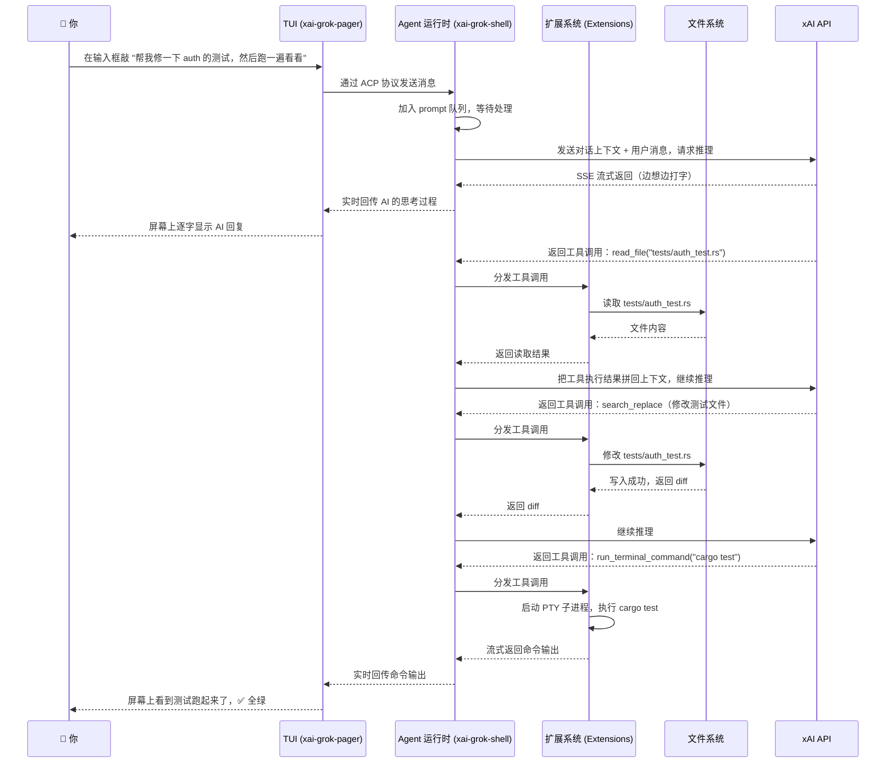
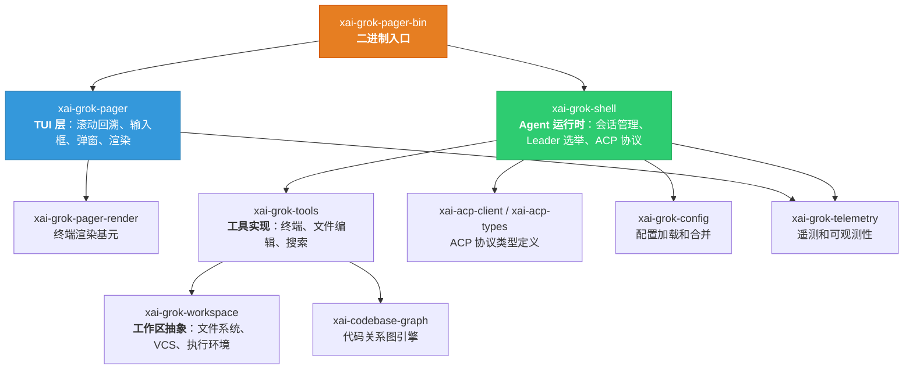

[← 返回首页](index.md)

# Grok Build 是什么

Grok Build（命令行里敲 `grok`）是 SpaceXAI 做的一个跑在终端里的 AI 编程助手。它把三件事揉到了一起：**跟 AI 聊天**、**改代码**、**执行终端命令**。你不用在浏览器、编辑器、终端之间来回切——所有东西都在一个全屏 TUI（终端用户界面，你看到的那些框框和颜色就是在终端里画出来的图形界面）里完成。

## 它到底长啥样

打开终端敲 `grok`，你会看到一个全屏界面：

- **上面一大片**是对话历史（我们叫它「滚动回溯区」，scrollback），AI 的回复、它执行过的命令、改过的文件、思考过程，全部以"块"的形式排在这里。
- **下面一小条**是输入框（prompt），你在那敲字，敲完回车就发给 AI。

```
┌─────────────────────────────────────────┐
│  对话历史区（scrollback）                 │
│  ┌───────────────────────────────────┐  │
│  │ 用户：帮我修一下 auth 的测试        │  │
│  ├───────────────────────────────────┤  │
│  │ 🤖 Agent：好的，我先看看测试文件     │  │
│  ├───────────────────────────────────┤  │
│  │ 🔧 工具调用：read_file tests/auth.rs│  │
│  │ [展开了文件内容]                     │  │
│  ├───────────────────────────────────┤  │
│  │ 🔧 工具调用：search_replace         │  │
│  │ [- 旧代码] [+ 新代码]               │  │
│  └───────────────────────────────────┘  │
├─────────────────────────────────────────┤
│ > 帮我修一下 auth 的测试          [发送] │
└─────────────────────────────────────────┘
```

真实的界面比这复杂得多——有语法高亮、折叠展开、差异对比（diff）、任务列表等等。整套渲染逻辑在 `crates/codegen/xai-grok-pager/src/` 里，靠事件驱动架构运转：终端输入事件 → dispatch 路由 → 更新应用状态 → views 渲染。详见《终端渲染流水线》和《滚动回溯引擎》。

## 跟 ChatGPT、Copilot 区别在哪

这是新人最容易搞混的问题，咱们拆开说：



| 工具 | 在哪用 | 能干吗 | 不能干吗 |
|------|--------|--------|----------|
| **Grok Build** | 终端里 | 聊天 + 改文件 + 跑命令 + 搜索代码库，全自动闭环 | 不能嵌到 VS Code 里当补全插件（不过编辑器可以通过 ACP 协议连过来，走后台模式） |
| **ChatGPT** | 浏览器/App | 聊天、生成代码块 | 不会真的去读你的项目文件、不能执行命令、你得手动把代码复制粘贴过去 |
| **GitHub Copilot** | 编辑器里 | 在光标位置补全代码、根据注释生成函数 | 不能帮你跑 `cargo test` 看有没有过、不能搜索整个仓库、不能管理多步骤任务 |

**一句话总结：Copilot 是你打字时帮你补全的助手；ChatGPT 是你切出去聊天问问题的顾问；Grok Build 是你直接在终端里干活、全程不切窗口的搭档——它不只是提建议，是真的动手改文件、跑命令。**

## 三种用法

根据你的场景，Grok Build 有三种截然不同的打开方式：

### 1. 全屏 TUI 模式（日常开发）

最常用的姿势，直接在终端敲：

```bash
grok
```

进去以后就是上面说的全屏界面。你可以：

- 直接打字跟 AI 聊天
- 用 `@src/main.rs` 这种语法把文件拽进对话（`@` 会弹出模糊文件选择器）
- 敲 `/` 开头的斜杠命令做快捷操作，比如 `/model grok-build` 切换模型、`/new` 开新会话
- 按 `Tab` 在输入框和对话历史之间切换焦点
- 按 `Ctrl+O` 切换"一键允许所有操作"模式（也可以启动时加 `--yolo`）

> 斜杠命令有近 50 个，完整清单见《用户命令与功能索引》，内部机制见《斜杠命令系统》。

### 2. 无头模式（脚本/CI）

不想看 TUI，只想让 AI 帮你跑一件事然后退出：

```bash
grok -p "Review 这次改动有没有 bug" --output-format json --yolo
```

`-p` 是 prompt 的意思，后面跟你的问题。输出格式支持：

| 格式 | 参数 | 什么时候用 |
|------|------|-----------|
| 纯文本（默认） | 不传 | 人工看 |
| JSON | `--output-format json` | 脚本解析，字段里有 `text`、`stopReason`、`sessionId` |
| 流式 JSON | `--output-format streaming-json` | 实时处理，一行一个 JSON 事件 |

CI 里常见玩法：`grok -p "..." --output-format json --yolo | jq -r '.text'`，把 AI 的回复丢给下一个步骤。

### 3. 最小模式（纯文本，不爱看 TUI）

有些人就是不喜欢全屏界面。Grok Build 提供了一种极简模式——没有滚动回溯区、没有面板分割，就是纯文本输入输出，像跟命令行聊天一样：

```bash
grok --minimal
```

想切回完整 TUI 就加 `--fullscreen` 或者在里面敲 `/fullscreen`。底层用的是一套共享逻辑，只是不画那些花里胡哨的框框。详见《Minimal 模式》。

## 一个典型的工作流，从零到跑通

下面是一次真实的使用过程——假设你在一个 Rust 项目里，有个测试挂了，你懒得自己查：



整个过程你只敲了一句话，剩下全是 Grok Build 自动完成的——读文件、改代码、跑测试，中间如果测试挂了它还会自己分析失败原因继续改。

## 安全和权限：AI 不能想干嘛就干嘛

**默认情况下，Grok Build 在执行任何 shell 命令或修改文件之前都会问你一声。** 这可不是摆设——你想想，要是 AI 一言不合就 `rm -rf /`，那就完蛋了。

权限控制的核心逻辑在 `crates/codegen/xai-grok-shell/src/util/config/permissions.rs` 和 `tool_approvals.rs` 里，本质上是一棵决策树：

```
这个工具要不要批准？
├── 用户在配置里标记了"永远允许"？→ 放行
├── 用户开了 --yolo（一键允许模式）？→ 放行
├── 这个操作危险等级太高（比如操作 /etc 下的系统文件）？→ 必须弹框问
└── 默认行为 → 弹框问用户（允许/拒绝/这次允许）
```

你可以：

- 在 TUI 里按 `Ctrl+O` 切换"一键允许"模式
- 启动时加 `--yolo` 参数：`grok --yolo`
- 敲 `/always-approve` 命令切换

另外整个执行环境还能关进沙箱（Linux namespace 隔离），让 AI 只能碰你允许它碰的目录。详见《终端执行与权限控制》和《沙箱隔离》。

## 它能感知你的整个代码库

Grok Build 不是"你给它一段代码它分析一段"——它启动时会扫描你的项目，用 tree-sitter 解析出整张符号关系图（ScopeGraph），记录每个函数、类型、变量的定义和引用关系。这意味 AI 能理解"这个函数在别的地方被谁调用了"、"这个类型从哪里导入的"。

这项能力由 `crates/codegen/xai-codebase-graph` 提供（详见《代码关系图引擎》），搜索结果通过 `crates/codegen/xai-grok-tools` 里的 grep 工具（底层是 ripgrep）暴露给 AI。

## 会话：它会记住你们聊过什么

每次你跟 Grok Build 的对话都是一个**会话（Session）**，自动保存在 `~/.grok/sessions/` 目录下，格式是 JSONL 文件。下次打开终端敲 `grok -c` 就能继续上次的话题。

会话支持的操作：

- **分支（fork）**：聊到一半想试试另一条路，可以开个分支，原会话不变。代码在 `crates/codegen/xai-grok-pager/src/app/dispatch/session/`。
- **压缩（compaction）**：聊了几十轮以后，token 窗口快满了，系统会自动把老历史总结成摘要塞回去，让 AI 不会失忆。详见《对话压缩》。
- **回退（rewind）**：AI 改坏了一个文件？`/rewind` 回到之前的状态。由 `crates/codegen/xai-grok-shell/src/session/acp_session_impl/rewind.rs` 实现。
- **回顾（recap）**：长时间对话里，系统会定期生成进度总结，让你一眼看到底做了啥。详见《Goal 系统》。

## 插件：让 AI 多学点本事

Grok Build 本事再大也不可能啥都会，所以它留了两个扩展开口：

1. **MCP 协议**（Model Context Protocol）：你在项目的 `.mcp.json` 里声明外部工具服务，Grok Build 帮你启动、建立连接，然后这些外部工具就变成 AI 能调用的了——比如连 GitHub API、连数据库。核心实现在 `crates/codegen/xai-grok-shell/src/session/mcp_*` 系列文件。详见《MCP 协议》。
2. **插件和钩子**：插件像是 App Store 里的应用，装上了就有新功能；钩子像是自动化脚本，在特定时机自动触发（比如 AI 改完文件后自动跑一遍格式检查）。详见《插件与钩子系统》。

## 整个系统的分工

README 里有一段仓库布局概览，其实就是这张图：



更完整的仓库地图和每个 crate 的职责，见《代码仓库导览》；三层协作的深度拆解，见《整体架构》。

## 怎么装

支持 macOS、Linux、Windows（通过 Git Bash 或 PowerShell）：

```bash
# macOS / Linux / Git Bash
curl -fsSL https://x.ai/cli/install.sh | bash

# Windows PowerShell
irm https://x.ai/cli/install.ps1 | iex

# 验证安装
grok --version

# 更新
grok update
```

第一次启动会弹浏览器让你登录 x.ai 账号，凭据存在 `~/.grok/auth.json`。如果是 CI 环境没法弹浏览器，设环境变量 `XAI_API_KEY` 就行。

> 安装和认证的详细步骤见《5 分钟上手》和《认证体系》。

## 一句话总结给赶时间的人

**Grok Build = ChatGPT 的对话能力 + Copilot 的代码理解 + 一个能真跑命令的终端，三合一，全程不切窗口。** 你敲一句话，它读代码、改文件、跑测试、搜网络，直到你把活干完。
