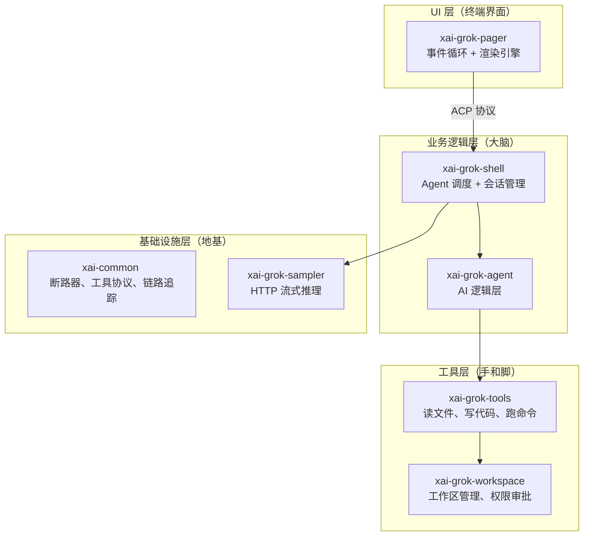
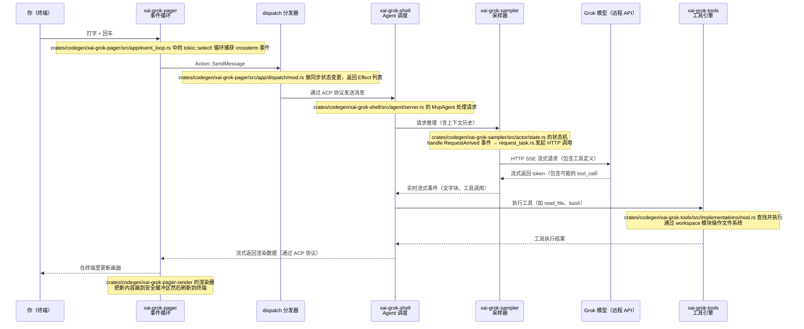
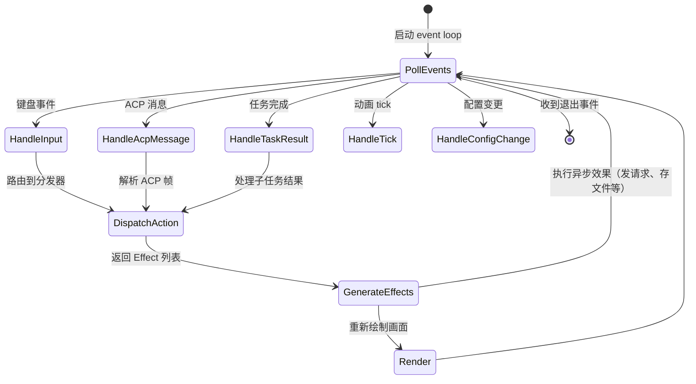
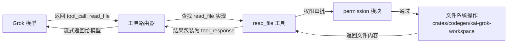
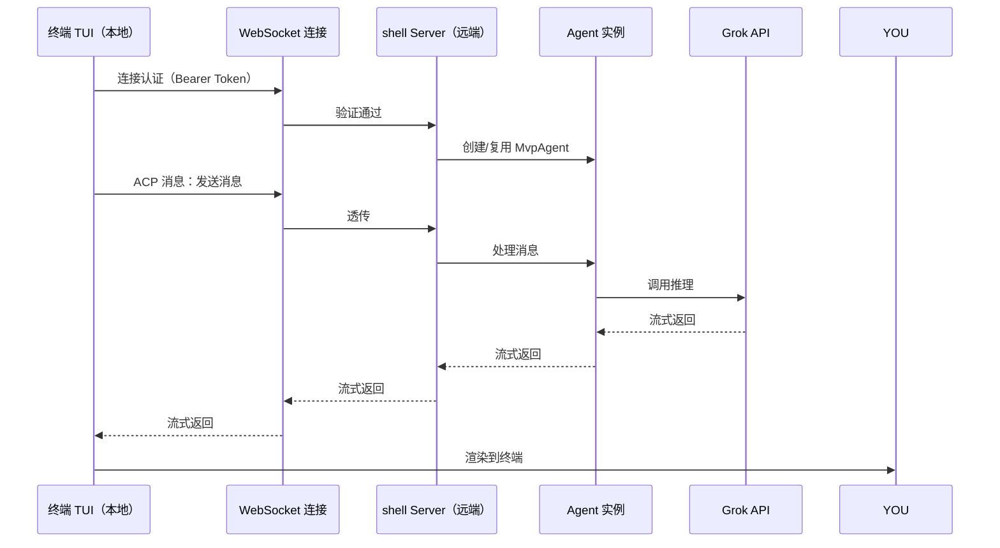
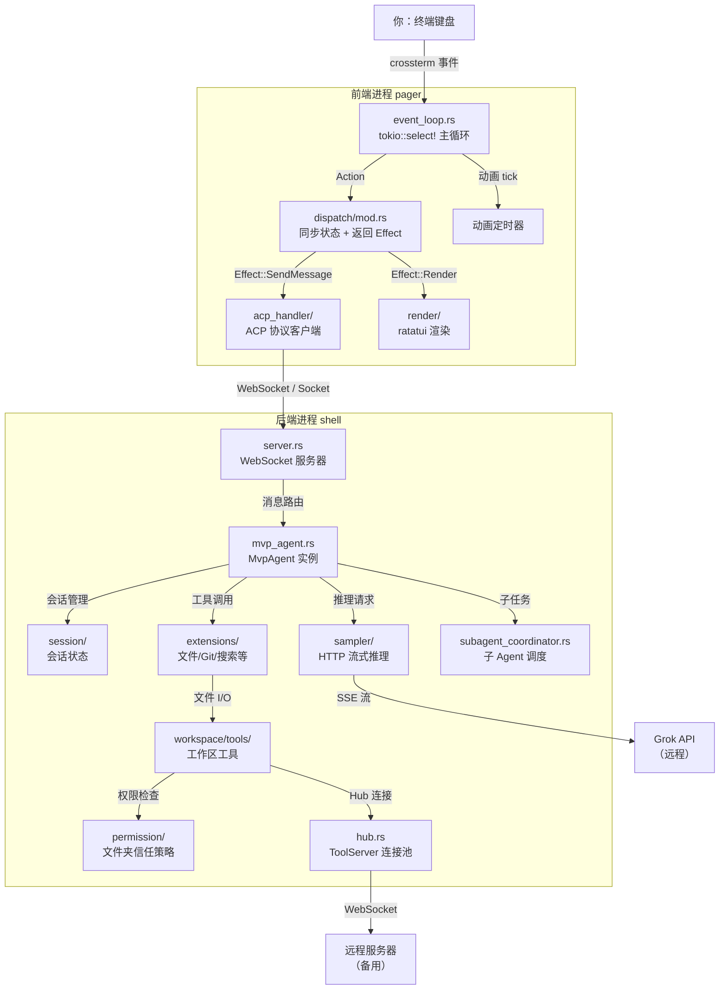

[← 返回首页](index.md)

# 整体架构

## 一句话说清楚

Grok Build 是一个运行在终端里的 AI 编程助手。它的工作方式可以理解为三个词：**听、想、做**。

- **听**：你在终端里敲键盘，TUI 层（`xai-grok-pager`）捕捉按键事件
- **想**：事件经过分发（`dispatch`），转化成 AI 可以理解的请求，送给采样器（`xai-grok-sampler`）调用 Grok 模型
- **做**：模型返回的响应里可能包含"读文件"、"改代码"、"跑命令"等工具调用，这些由工具引擎（`xai-grok-tools`）执行，结果再送回终端展示给你

整个过程发生在两个进程里：**前端进程**（pager，你看到的终端界面）和**后端进程**（shell，真正的业务逻辑和网络请求）。它们通过一个叫 ACP（Agent Client Protocol）的内部协议通信。

## 分层架构总览

整个项目按**职责**分了四层，每层管自己的事，不越界。



**各层一句话说明：**

| 层次 | 核心 crates | 它干什么 |
|------|-------------|----------|
| **UI 层** | `xai-grok-pager`, `xai-grok-pager-render` | 你在终端里看到的一切——聊天框、代码高亮、滚动条、链接点击。代码在 `crates/codegen/xai-grok-pager/src/app/event_loop.rs` 里跑一个死循环，等你的按键 |
| **业务逻辑层** | `xai-grok-shell`, `xai-grok-agent` | 决定"用户按了回车后要做什么"——是直接回答，还是拆成多个子任务让子 Agent 去干。入口在 `crates/codegen/xai-grok-shell/src/agent/server.rs` |
| **工具层** | `xai-grok-tools`, `xai-grok-workspace` | 模型说"帮我读这个文件"，就真去读文件系统。工作区管理在 `crates/codegen/xai-grok-workspace/src/hub.rs` 里通过 Hub 连接远程服务器 |
| **基础设施层** | `xai-common` 系列, `xai-grok-sampler` | 断路器防雪崩、工具调用协议、链路追踪 ID 透传。采样器在 `crates/codegen/xai-grok-sampler/src/actor/state.rs` 里跑状态机 |

- 断路器就像家里的电闸：调外部 API 连续失败太多次就自动跳闸，过一会再试，防止一个故障拖垮整个系统
- 链路追踪就像快递单号：每个请求都有一个 trace ID，从你按回车到 AI 回复，问题出在哪一步都能查出来

## 一次完整的请求：从键盘到屏幕

下面这个时序图描述了最核心的流程——你按下回车键之后发生的每一步。



### 模块之间怎么通信

所有分层之间的通信都走一个叫 **ACP（Agent Client Protocol）** 的协议，定义在 `agent-client-protocol` 这个 crate 里。简单说，它长得像 JSON-RPC：

```json
{
  "id": "req-123",
  "method": "message/send",
  "params": { "text": "帮我重构这个函数" }
}
```

前端（pager）和后端（shell）之间通过 WebSocket 或本地 Unix Socket 交换这种消息。后端发来的回复可以是流式的——先发一个 `content/delta`，再发 `content/done`，最后发 `tool_call`。

## 事件循环：永远不睡觉的司机

`xai-grok-pager` 的核心是一个 `tokio::select!` 循环，代码在 `crates/codegen/xai-grok-pager/src/app/event_loop.rs`。它像一个大堂服务员，同时盯着好几件事：

1. **你按键盘**（`crossterm::event::Event`）
2. **后端传来新消息**（ACP 通道）
3. **后台任务完成**（比如文件读完了）
4. **动画定时器到了**（比如加载转圈）
5. **配置文件热更新**（不用重启程序）



关键代码行摘录：
```rust
// 摘自 crates/codegen/xai-grok-pager/src/app/event_loop.rs
// 这行是核心——tokio::select! 同时等 5 件事
tokio::select! {
    Some(event) = input_rx.recv() => { /* 处理键盘输入 */ }
    Some(msg) = acp_rx.recv() => { /* 处理后端消息 */ }
    Some(result) = task_results.join_next() => { /* 后台任务完成 */ }
    _ = sleep_until(next_tick) => { /* 动画定时器到了 */ }
    _ = config_watcher.changed() => { /* 配置文件变了 */ }
}
```

## dispatch：无副作用的业务逻辑层

`dispatch` 模块（`crates/codegen/xai-grok-pager/src/app/dispatch/mod.rs`）是纯函数式的心脏。它的核心设计原则：

- **绝不碰终端、网络、文件系统**（方便测试）
- **输入一个 Action，输出一组 Effect**（Effect 描述"需要做什么"，但不真的去做）
- **所有操作同步且确定性**（同样的输入永远得到同样的输出）

```rust
// 摘自 crates/codegen/xai-grok-pager/src/app/dispatch/mod.rs
// dispatch 函数签名：Action → 状态变更 + Effect 列表
// 它只返回 Effect，不执行任何异步操作
pub(crate) fn dispatch(
    app: &mut AppView,
    action: Action,
) -> Vec<Effect> {
    match action {
        Action::SendMessage { text } => {
            // 把消息加入队列，返回需要真正发消息的 Effect
            vec![Effect::SendMessage { text }]
        }
        Action::SwitchSession { id } => {
            // 切换当前会话，返回需要重新渲染的 Effect
            vec![Effect::SwitchSession { id }]
        }
        _ => vec![],
    }
}
```

这样设计的最大好处是：**写单元测试时不需要启动任何东西**。你直接造一个 `AppView`，调 `dispatch`，断言返回的 Effect 列表对不对就行。`dispatch/mod.rs` 文件里有专门的 `tests` 子模块验证这种逻辑。

## Agent 生命周期：一个会转述任务的秘书

当 dispatch 决定要发消息时，消息会通过 ACP 协议传给 `xai-grok-shell` 端的 Agent。这里的结构稍微复杂一点，可以想象成一个**搬家团队**：

- **Leader Agent**（总指挥）——收到你的问题后，自己可以回答的当场回答，需要操作文件系统或跑命令的就派 SubAgent 去干
- **SubAgent**（工人）——接 Leader 分配的任务，执行完把结果交回来
- **Coordination**（调度台）——`crates/codegen/xai-grok-shell/src/agent/subagent_coordinator.rs` 负责把大任务切碎分配

这个机制的完整介绍见《Agent 生命周期与多 Agent 协同》，这里只提一句：Agent 本身存活在 `crates/codegen/xai-grok-shell/src/agent/server.rs` 里，它通过 WebSocket 接受远程连接，并且一个 Agent 实例可以**跨连接存活**——你断网重连后，正在进行的大模型推理不会中断。

## 工具执行：模型的手和脚

当模型决定"帮我查一下当前目录的文件结构"时，它会返回一个 `tool_call`（工具调用）。这个请求从采样器（`xai-grok-sampler`）出来，经过 shell 层路由到工具层（`xai-grok-tools`）。



具体怎么注册和执行这些工具的，看《工具执行引擎（模型如何操作文件系统）》，这里不展开。

## 工作区管理：AI 的本地工地

`xai-grok-workspace` 是 AI 操作你电脑的入口。它的 Hub（`crates/codegen/xai-grok-workspace/src/hub.rs`）像一个管家，负责：

1. **发现项目**——启动时扫描目录，找到 Git 仓库、项目配置
2. **统一文件访问**——不管文件在本地磁盘、远程服务器、还是客户端指定，统一成一套接口
3. **权限审批**——读敏感文件、跑危险命令前，先检查策略（自动放行/拒绝/弹窗问你）

`hub.rs` 文件的 `HubHandle::connect` 方法（大约第 430 行）负责建立与远程服务器的 WebSocket 连接，之后所有工具调用都走这个通道。完整的权限机制和会话管理在《工作区管理（Hub、文件系统、权限、会话）》里有详述。

## 跨进程/跨机器部署

有些场景下，Grok Build 的前端和后端跑在不同的机器上。比如你在笔记本上敲命令，AI 推理跑在服务器上。这时 `xai-grok-shell` 的 WebSocket 服务器（`crates/codegen/xai-grok-shell/src/agent/server.rs`）就派上用场了：



`server.rs` 文件里有个关键设计值得注意：**Agent 实例是持久化的**（`run_persistent_agent` 函数，大约第 246 行）。第一次连接时创建，之后即使 WebSocket 断开重连，同一个 Agent 实例继续服务。这意味着你断网后重新连接，正在进行的 AI 推理不会丢失。

## 与第三方集成（MCP 协议）

Grok Build 支持通过 **MCP（Model Context Protocol）** 连接外部工具和模型。`crates/codegen/xai-grok-workspace/src/mcp.rs` 提供了 MCP 服务器适配器，让外部的文件系统、数据库、API 都能变成 Grok 可以调用的工具。详细用法在《扩展机制：MCP 服务器、钩子、插件》里。

## 架构全景图

最后用一张大图总结所有模块怎么配合。这张图上你能看到每一个重要的 crate 和它们之间的数据流向。



**总结**：Grok Build 是一个典型的**分层事件驱动架构**。前端负责 UI 和交互，后端负责业务和 AI 调用，它们通过 ACP 协议解耦。每一层只关心自己的事——UI 层不知道文件系统，工具层不知道渲染细节。这样做的结果是：每一层都可以独立测试、替换、甚至跨机器部署。
