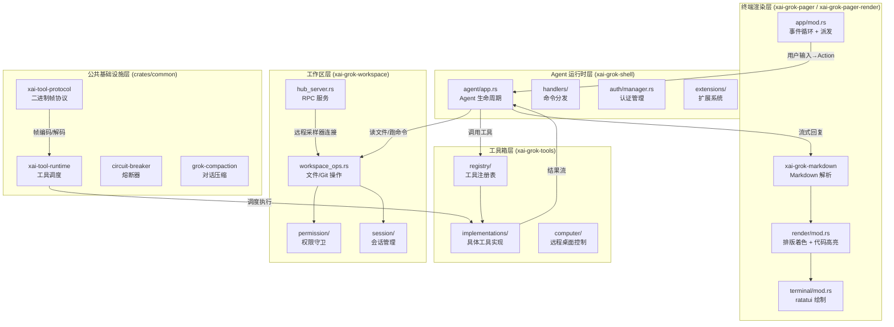
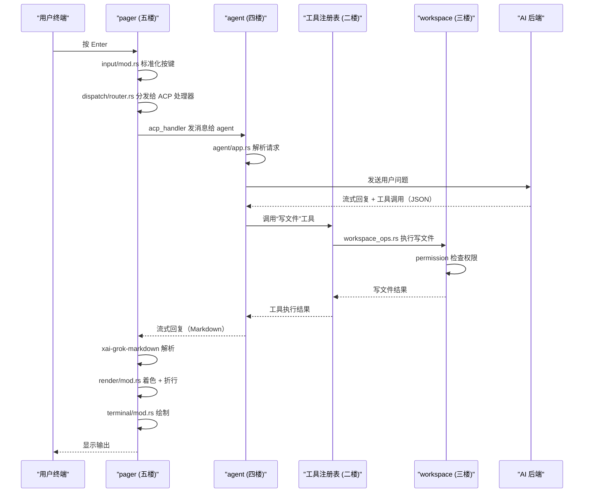

[← 返回首页](index.md)

# 整体架构：分层与数据流

## 一句话说清楚

Grok Build 是一个能在终端里跟你聊天、帮你改代码、跑命令的 AI 助手。它像一栋五层楼：

- **五楼（终端渲染层）**：你看到的漂亮界面——Markdown 转彩色、代码高亮、Mermaid 变 ASCII 图
- **四楼（Agent 运行时层）**：AI 的大脑——理解你的问题，决定用什么工具，跟 AI 后端通信
- **三楼（工作区层）**：管家——读写你的文件、跟 Git 打交道、管权限
- **二楼（工具箱层）**：AI 的手和眼睛——跑命令、搜代码、改文件
- **一楼（公共基础设施层）**：地基——熔断器、协议、追踪

## 整体架构图



## 一次完整的对话，数据怎么在各层流动

假设你在终端里输入 `/ask 帮我写一个排序函数`，然后按下 Enter。这是整条链路：



## 每一层在干什么（落代码）

### 五楼：终端渲染层

入口在 `crates/codegen/xai-grok-pager/src/app/mod.rs`，核心是 `run` 函数（第 185 行）。它负责：

1. 初始化终端（进入 alternate screen）
2. 启动事件循环——`event_loop.rs` 里有个 `tokio::select!` 循环，同时等用户按键和 AI 回复
3. 把 AI 吐回来的 Markdown 文字，通过 `xai-grok-markdown` 和 `xai-grok-pager-render` 转成彩色字符输出到屏幕

关键代码在 `app/mod.rs` 第 185 行：

```rust
pub async fn run(
    args: PagerArgs,
    bg_update_rx: Option<...>,
) -> anyhow::Result<bool> {
    // 加载配置
    let raw_config = xai_grok_shell::config::load_effective_config()?;
    // 初始化终端
    // 启动事件循环
    // ...
}
```

渲染流水线详见《终端渲染引擎：如何把 Markdown 变成赏心悦目的 TUI》。

### 四楼：Agent 运行时层

入口在 `crates/codegen/xai-grok-shell/src/agent/app.rs`。核心是 `spawn_agent_local` 函数（第 128 行），它：

1. 创建一个 `MvpAgent` 实例（`crates/codegen/xai-grok-shell/src/agent/mvp_agent.rs`）
2. 建立 ACP（Agent Client Protocol）连接——一个像聊天室一样的双向通道
3. 处理用户的每个请求：判断是自然语言还是命令，分发给对应 handler

关键代码在 `agent/app.rs`：

```rust
fn spawn_agent_local(
    agent_config: AgentConfig,
    auth_manager: Arc<AuthManager>,
    prefetched_models: Option<...>,
    ...
) -> impl Future<Output = Result<(), acp::Error>> {
    let mut agent = MvpAgent::new(gateway, &agent_config, auth_manager, ...);
    // 建立连接，启动处理循环
    let handle_io = spawn_agent_local(...);
    handle_io.await
}
```

Agent 的完整生命周期详见《Agent 生命周期：小助手是怎么诞生的》。

### 三楼：工作区层

入口在 `crates/codegen/xai-grok-workspace/src/lib.rs`。它是一个常驻服务（workspace-server），通过 WebSocket 连接中心 Hub，对外提供 RPC：

- `workspace_ops.rs`：封装所有文件操作（读写、搜索、Git 命令）
- `permission/`：每次执行敏感操作前弹窗确认
- `session/`：追踪项目变更、创建检查点

关键结构在 `lib.rs`：

```rust
pub mod file_system;     // 文件系统抽象
pub mod permission;      // 权限守卫
pub mod session;         // 会话管理（含 git/jj）
pub mod hub_server;      // RPC 服务
```

工作区服务器详情见《工作区服务器：跟本地代码打交道的管家》。

### 二楼：工具箱层

入口在 `crates/codegen/xai-grok-tools/src/lib.rs`。核心设计是"工具即函数"——每个工具都是一个结构体，注册进全局注册表，AI 通过名字调用。

注册表在 `registry/` 下，所有工具实现放在 `implementations/`：

```rust
// lib.rs 的关键常量
pub const DEFAULT_TOOL_OUTPUT_BYTES: usize = 40_000;  // 默认输出上限
pub const DEFAULT_TOOL_OUTPUT_CHARS: usize = 20_000;   // Shell 工具输出上限

pub mod registry;        // 工具注册表
pub mod implementations; // 具体工具
pub mod computer;        // 远程桌面控制
```

工具调用通过 `xai-tool-runtime`（`crates/common/xai-tool-runtime/src/dispatch.rs`）的 `ToolDispatch` trait 统一调度：

```rust
#[async_trait]
pub trait ToolDispatch: Send + Sync {
    async fn call(
        &self,
        tool_id: ToolId,
        args: Value,
        ctx: ToolCallContext,
    ) -> ToolStream<TypedToolOutput>;
}
```

所有工具的完整清单见《工具箱概览：AI 的「手和眼睛」》。

### 一楼：公共基础设施层

入口在 `crates/common` 目录下的几个 crate：

- **xai-tool-protocol**：定义工具调用的二进制帧协议，包括握手、方法调用、错误码
- **xai-tool-runtime**：加载、注册、调度工具，支持流式响应——上面 `ToolDispatch` trait 就在这里定义
- **circuit-breaker**：电路熔断器，当下游调用失败率太高时自动断开，保护系统不被压垮
- **grok-compaction**：用 LLM 把长对话/代码总结成短文本，省 token 钱

公共基础设施的详细用法见《公共基础设施：熔断器、工具协议、压缩、追踪》。

## 核心调用路径（三句话总结）

1. **你按键** → pager 收到 → 事件循环派发 → ACP 处理器发给 Agent → Agent 理解你要干啥
2. **Agent 要干活** → 查工具注册表 → 调 workspace 读写文件 / 调 tools 跑命令 → 拿结果回来
3. **AI 要回复** → 流式吐 Markdown → pager 实时解析 → 渲染器着色排版 → 画到终端上
