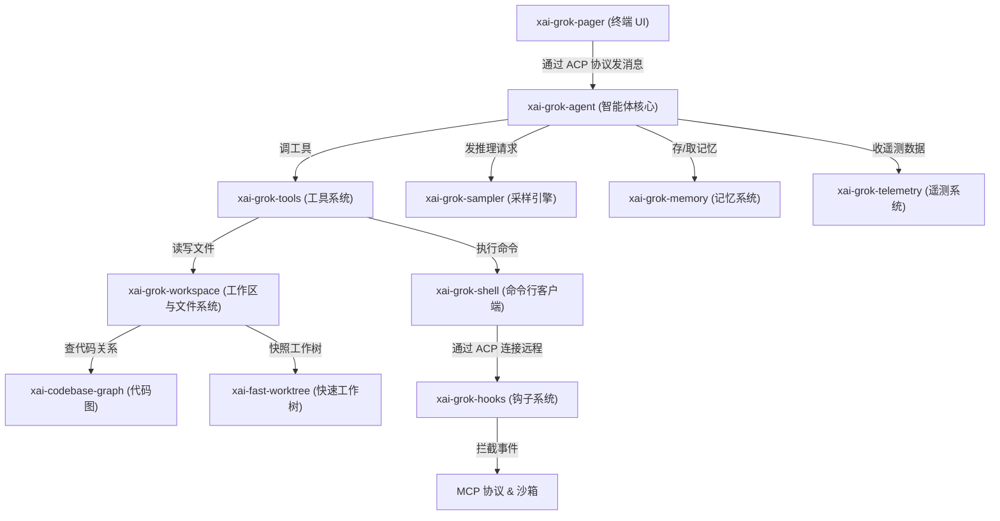
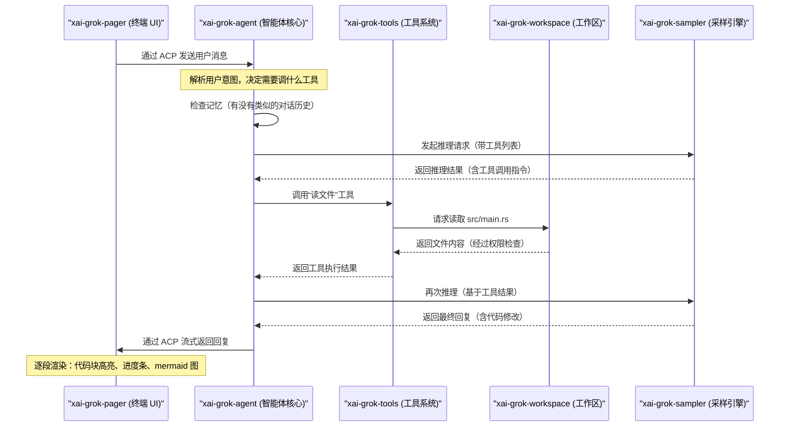

[← 返回首页](index.md)

# 整体架构：区域之间怎么合作

## 一句话说清楚

Grok-build 这个项目说白了就是：你在终端里跟一个 AI 助手聊天，它能看懂你的代码、改你的文件、跑命令、搜信息，还能记住你之前聊了什么。它分成好几个模块，每个模块管一摊事，通过一个叫 **ACP（Agent Client Protocol）** 的通信协议串起来。

## 这幅大图：所有区域怎么拼在一起的

下面这张图展示了各区域之间的核心调用关系。读懂了它，你就知道“我按了个键”到“AI 回复了一行代码”中间发生了什么。



### 各个模块的作用（一句话版）

| 模块路径 | 它是干嘛的 |
|------|------|
| `crates/codegen/xai-grok-pager/` | 终端里的聊天界面——你看到的彩色对话、代码块、进度条都归它管 |
| `crates/codegen/xai-grok-shell/` | 命令行客户端和智能体容器——负责启动、登录、管理会话 |
| `crates/codegen/xai-grok-agent/` | 智能体的“大脑”——决定下一步做什么、怎么回话 |
| `crates/codegen/xai-grok-tools/` | AI 能用的工具集合——读文件、搜代码、查包名 |
| `crates/codegen/xai-grok-workspace/` | 工作区管理——让 AI 看到你的代码，权限控制 |
| `crates/codegen/xai-grok-sampler/` | 采样引擎——跟底层 AI 模型通信，拿回复 |
| `crates/codegen/xai-grok-memory/` | 记忆系统——让 AI 记住你之前说过什么 |
| `crates/codegen/xai-grok-telemetry/` | 遥测系统——收集性能数据、上报错误 |
| `crates/codegen/xai-codebase-graph/` | 代码图——把代码关系整理成图供查询 |
| `crates/codegen/xai-fast-worktree/` | 快速工作树——极速克隆代码副本 |

## 核心交互：一次对话的完整路径

下面这张时序图展示了你问“帮我把这个函数改成异步”之后，各模块怎么接力干活。



## ACP 协议：连接一切的核心“语言”

**ACP（Agent Client Protocol）** 说白了就是：智能体和它的“客户端”（Pager 终端、WebSocket 远程客户端）之间约定好的一种消息格式。每条消息是 JSON 格式，一行一条（用换行符隔开），就像两个人发微信，每条消息是个 JSON。

看真实代码：`crates/codegen/xai-grok-shell/src/agent/server.rs` 里第 260 行左右，有一段构建内部消息的代码：

```rust
fn internal_reload_request_line(id: &str, method: &str, params: serde_json::Value) -> String {
    let msg = serde_json::json!({
        "jsonrpc": "2.0",
        "id": id,
        "method": format!("_{method}"),
        "params": params,
    });
    format!("{}\n", msg)
}
```

这段代码拼了一条什么样的消息？比如技能文件（`SKILL.md`）发生了改动，就会生成一条像下面这样的 JSON，然后塞进 ACP 的输入流里：

```json
{"jsonrpc":"2.0","id":"skills-reload","method":"_x.ai/internal/reload_skills","params":{}}
```

然后智能体读到这个消息，就知道“哦，技能文件变了，重新加载一下”。

### ACP 的两种连接方式

1. **标准输入/输出（stdio）**：Pager 直接启动一个 `grok agent stdio` 子进程，通过标准输入输出跟它通信。看 `crates/codegen/xai-grok-shell/src/agent/app.rs` 第 100 行左右：

```rust
pub async fn run_stdio_agent(
    agent_config: &AgentConfig,
    prefetched_models: Option<IndexMap<String, ModelEntry>>,
    memory_config: Option<crate::config::MemoryConfig>,
) -> anyhow::Result<()> {
    // ... 设置输入输出
    let outgoing = tokio::io::stdout().compat_write();
    // ...
}
```

2. **WebSocket 远程连接**：你可以在另一台机器上启动一个 WebSocket 服务器（`crates/codegen/xai-grok-shell/src/agent/server.rs`），然后本地 Pager 通过 `--remote ws://<ip>:<port>/ws --secret <token>` 连接过去。同一个智能体可以多次重连，会话不丢。

## 调度器：房间里的大管家

在 Pager 里，用户按下一个键之后，事件循环（`crates/codegen/xai-grok-pager/src/app/event_loop.rs`）读完输入，会交给**调度器**（`dispatch/router.rs`）决定这个按键应该触发什么操作。调度器像一个大管家：如果是快捷键，就调对应的处理函数；如果是普通打字，就传给智能体去推理。

看 `crates/codegen/xai-grok-pager/src/app/event_loop.rs` 第 1-10 行注释就清楚了：

```rust
//! Main event loop.
//!
//! A thin `tokio::select!` loop. All input routing, rendering, and state
//! management is delegated to [`AppView`]. The event loop only handles
//! IO plumbing: terminal events, ACP channel, spawned task results,
//! animation ticks, and hot-reloadable config changes.
```

翻译成人话：事件循环就是个“接线员”，它只管把终端事件、ACP 消息、动画定时器这些东西接到该去的地方，具体怎么处理全交给 `AppView`。

## 工具系统：AI 的“工具箱”

当 AI 觉得需要读文件、搜代码、执行命令时，它不会自己写代码，而是通过工具系统来调。工具系统在 `crates/codegen/xai-grok-tools/src/` 里，每种工具是一个独立模块。

例如 `crates/codegen/xai-grok-tools/src/lib.rs` 第 1-36 行定义了默认限制：

```rust
/// Default maximum output size (in bytes) for tool results sent to the model.
/// 40 KB ≈ 10 000 tokens
pub const DEFAULT_TOOL_OUTPUT_BYTES: usize = 40_000;
```

这个 `40 KB` 就是一条工具执行结果最多能带多少内容回去给 AI 模型——太长会被截断，不然 token 数爆了。

## 工作区与文件系统：让 AI 看到你的代码

工作区系统（`crates/codegen/xai-grok-workspace/src/workspace_ops.rs`）有两种模式：

- **Local（本地模式）**：工具调用直接通过 `WorkspaceHandle` 操作本地文件。
- **Proxy（代理模式）**：所有文件操作经过一个 WebSocket Hub 中转，适合远程场景。

文件读写之前，工作区会检查权限——比如 `crates/codegen/xai-grok-pager/src/app/event_loop.rs` 里有一段代码（第 180 行左右）用 `folder_trust::decide` 决定用户是否信任当前文件夹：

```rust
fn seed_trust_state(
    app: &mut AppView,
    remote: Option<&xai_grok_shell::util::config::RemoteSettings>,
) {
    // ... 检查文件夹信任状态
    app.trust_state = match decide(feature, &inputs) {
        TrustOutcome::Prompt => TrustState::Pending { workspace: key },
        TrustOutcome::Trusted | TrustOutcome::Untrusted => TrustState::Done,
    };
}
```

简单说：如果你在一个陌生人的项目目录里运行 Grok，它会弹出一个确认对话框问你“要不要信任这个文件夹”。不信任的话，就不让 AI 乱改文件。

## WebSocket 服务器：让 Pager 和智能体不在同一台机器上也能聊

`crates/codegen/xai-grok-shell/src/agent/server.rs` 实现了一个 WebSocket 服务器。它最关键的设计是：**智能体实例只创建一次，WebSocket 断连了也不丢失会话**。看第 130 行左右的注释：

```rust
//! The agent persists across WebSocket reconnections: a single MvpAgent instance
//! is created on first connection and reused for all subsequent connections. This
//! ensures that session actors (and any in-flight prompts) survive client
//! disconnects — when a client reconnects and loads an existing session, ongoing
//! work continues to stream to the new connection.
```

这样你网络断了重连，正在跑的推理任务不会中断。

## 各区域文件分布速览

看看仓库根目录的文件数统计，就知道每个模块的“分量”：

- `crates/codegen/xai-grok-pager/src`: 423 个文件（终端 UI，最大的一块）
- `crates/codegen/xai-grok-shell/src`: 396 个文件（命令行客户端）
- `crates/codegen/xai-grok-tools`: 214 个文件（工具系统）
- `crates/codegen/xai-grok-workspace`: 84 个文件（工作区管理）

Pager 和 Shell 加起来占了超过一半的代码量——因为一个负责好看又好用的界面，一个负责跟智能体通信和远程连接。

## 跟其他页面的关系

- 工具怎么注册、路由、执行：详见《工具系统：AI 的"工具箱"》
- 工作区怎么管理文件权限和 git 集成：详见《工作区与文件系统》
- 智能体怎么管理对话压缩和记忆：详见《聊天状态与智能体生命周期》
- 采样引擎怎么发起推理、流式返回：详见《采样引擎与遥测系统》
- 终端界面怎么一步步画出来：详见《Pager 终端 UI 与端到端测试》
- 钩子和 MCP 协议怎么拦截事件：详见《钩子、MCP 协议与沙箱》
