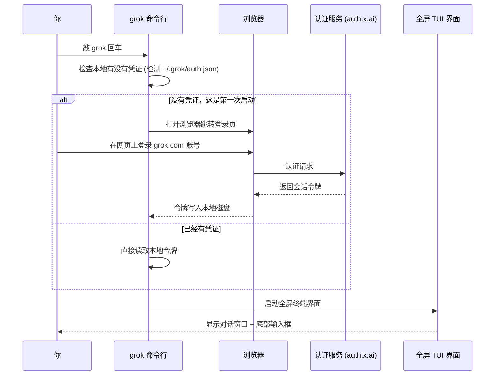
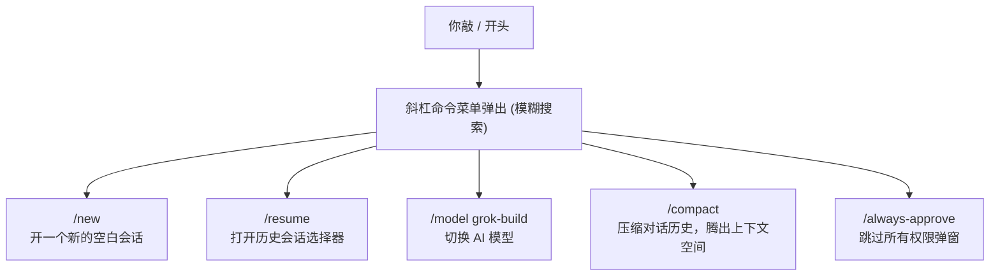

[← 返回首页](index.md)

# 5 分钟上手

先把 Grok Build 弄起来跑一跑。这一页不讲原理，就是一条一条命令敲下去，直到你在屏幕上看到 AI 的回复。

## 安装

打开终端，复制下面这行回车：

```bash
curl -fsSL https://x.ai/cli/install.sh | bash
```

这会把 `grok` 装到你的系统里。macOS、Linux、Windows 的 Git Bash 都一样用这行。Windows PowerShell 用户用这个：

```powershell
irm https://x.ai/cli/install.ps1 | iex
```

装完验证一下：

```bash
grok --version
```

屏幕上输出一个版本号（比如 `0.1.42`），就说明装好了。

> **想装指定版本？** 见 [《自动更新子系统》](33-update-autoupdate.md) 里的安装命令。后面想升级随时跑 `grok update`。

## 第一次启动

直接敲：

```bash
grok
```

这时候事情是这样的——整个启动流程会经过几个关键节点，看下面这张时序图就明白了：



### 如果你看到浏览器弹出来了

正常。Grok 第一次启动会打开浏览器让你登录 x.ai 的账号。登录成功后浏览器会自动关闭，终端里的 TUI 界面就出来了。

凭证存在 `~/.grok/auth.json` 里，下次启动就不会再弹浏览器了。Grok 会在后台自动刷新令牌，快过期的时候也会提前续。

### 如果不想用浏览器（比如在服务器上）

设置一个环境变量，用 API key 登录：

```bash
export XAI_API_KEY="xai-..."
grok
```

API key 从 [console.x.ai](https://console.x.ai) 生成。更多认证方式（企业 SSO、设备码流程、外部认证脚本）见 [详见《认证指南》](02-authentication.md)。

### 选一个工作目录

TUI 起来之后，Grok 会自动把你当前所在的目录作为工作目录——也就是 AI 能"看到"和操作的文件范围。如果想换个项目目录，关掉重开时这样：

```bash
grok --cwd ~/projects/my-app
```

`@` 引用文件、`run_terminal_command` 这些操作都在这个目录范围内。

## 第一次对话

TUI 界面分两个区域——上面一大片是对话历史（叫滚动回溯），底部一条是输入框。直接在最下面打一行字，回车发送。

```
帮我把 README.md 里的安装步骤改成中文
```

回车之后你会看到：

```
⊚ 正在处理...
```

然后 Agent 开始工作——它会读文件、改内容、把 diff 一行行显示出来。整个过程实时流式输出到屏幕上。

### 这时候你在键盘上能干什么

| 按键 | 效果 |
|------|------|
| `Ctrl+C` | 取消当前请求（如果输入框有草稿，先清草稿，再按一次才取消） |
| `Tab` | 把焦点从输入框切到对话历史，或者切回来 |
| `Ctrl+O` | 开启"永远批准"模式——AI 跑命令不再问你同不同意 |

用 `Tab` 切到对话历史区域后，用上下箭头可以选中不同的回复块，左右箭头可以折叠/展开。

### 引用文件

在输入框里打 `@` 会弹出一个模糊搜索的文件选择器：

```
@src/main.rs           # 附加这个文件
@src/main.rs:10-50     # 只附加第 10 到 50 行
@src/                  # 浏览目录
```

文件选择器默认尊重 `.gitignore`，隐藏文件看不到。想看隐藏文件就在 `@` 后面加一个 `!`：

```
@!.github              # 搜索隐藏目录
@!.env                 # 附加 .env 文件
```

## 最常用的几个斜杠命令

在输入框里打 `/` 会弹出命令菜单。下面是最常用的五个，够你第一周用了：



全部 50+ 个命令的完整说明见 [详见《斜杠命令系统》](11-slash-command-system.md)。

试一下：敲 `/model` 然后回车，会弹出一个模型选择器，用上下箭头选一个，回车就切换了。

## 接下来看什么

- 想搞清楚这玩意到底怎么工作的：[详见《整体架构：TUI → Agent → Workspace 三层协作》](04-architecture-overview.md)
- 想知道一次对话从头到尾数据怎么流转：[详见《一次完整对话的旅程》](05-one-full-turn.md)
- 想配成自己喜欢的颜色和快捷键：[详见《配置体系：三层优先级合并》](28-config-system.md)
- 想给 AI 装更多工具（比如接 GitHub、数据库）：[详见《MCP 协议：接入外部工具服务》](25-mcp-integration.md)

或者把命令快速参考贴在墙上：[详见《用户命令与功能索引》](36-command-reference.md)。
