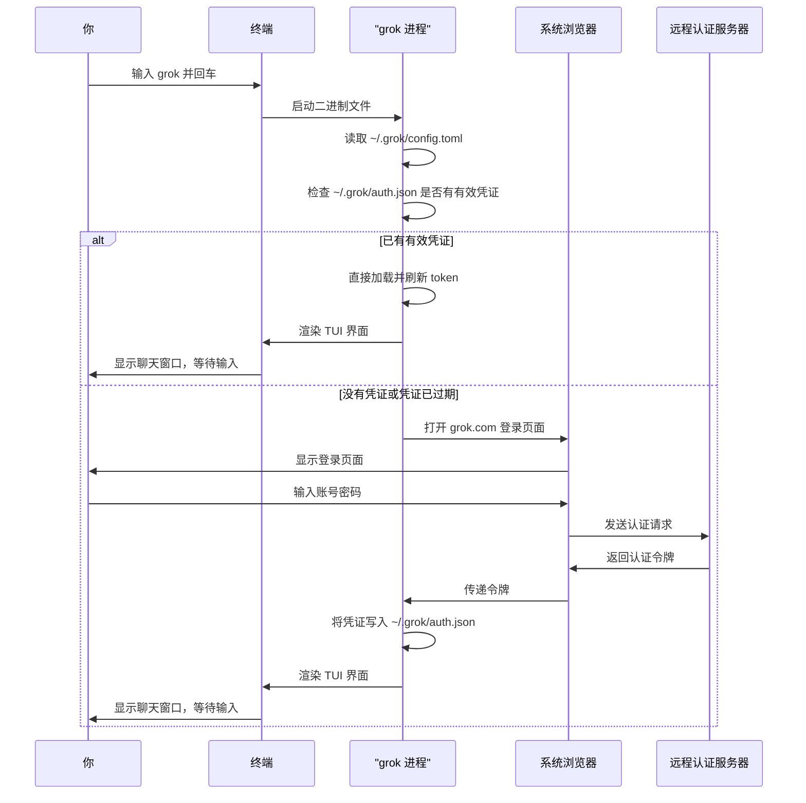
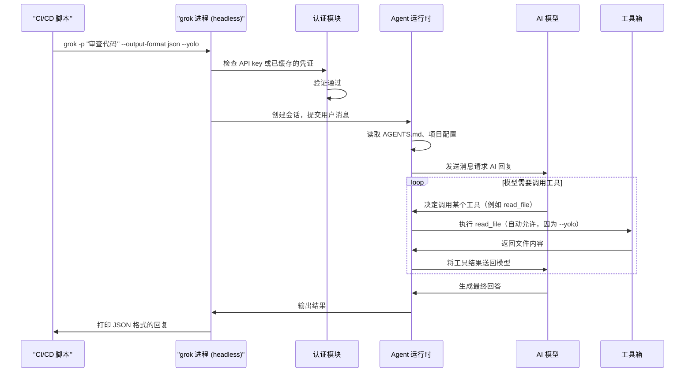

[← 返回首页](index.md)

# 快速上手

## 安装

### 安装预编译的二进制（推荐）

Grok Build 发布了 macOS、Linux 和 Windows 的预编译包。一句话安装：

```bash
curl -fsSL https://x.ai/cli/install.sh | bash   # macOS / Linux / Git Bash
irm https://x.ai/cli/install.ps1 | iex          # Windows PowerShell
```

想装某个特定版本，比如 `0.1.42`：

```bash
curl -fsSL https://x.ai/cli/install.sh | bash -s 0.1.42
```

Windows PowerShell 下指定版本：

```powershell
$env:GROK_VERSION="0.1.42"; irm https://x.ai/cli/install.ps1 | iex
```

装完后检查一下：

```bash
grok --version
```

想更新到最新版本，随时执行：

```bash
grok update
```

> **小贴士**：Windows 用户如果不用 PowerShell，用 Git Bash 或 MSYS2 也能跑 bash 脚本。WSL 用户自动拿到 Linux 版本。

### 从源码构建

如果你要自己编译（比如想定制或贡献代码），需要先准备好：

- **Rust 工具链**——版本号写在 `rust-toolchain.toml` 里，`rustup` 会在第一次构建时自动装好。目前用的是 Rust 1.92.0。
- **[DotSlash](https://dotslash-cli.com)**——用来下载 `bin/` 目录下的工具（比如 `bin/protoc`）。必须先装好 DotSlash 并确保它在你的 `PATH` 里：

  ```bash
  cargo install dotslash
  /usr/bin/env dotslash --help   # 检查是否装好了
  ```

- **protoc**——编译 proto 文件时需要。DotSlash 会自动管理 `bin/protoc`，如果 DotSlash 找不到，就回退到系统 `PATH` 上的 `protoc` 或 `$PROTOC` 环境变量。

然后就可以编译了：

```bash
cargo run -p xai-grok-pager-bin              # 编译并启动 TUI
cargo build -p xai-grok-pager-bin --release  # 生成 release 版本：target/release/xai-grok-pager
cargo check -p xai-grok-pager-bin            # 快速检查代码能否编译通过
```

编译出来的二进制叫 `xai-grok-pager`，但官方安装版会把命令名改成 `grok`。

## 第一次启动

直接在终端里敲：

```bash
grok
```

第一次启动时，它会打开浏览器让你登录 grok.com。登录成功后，你的凭证会存到 `~/.grok/auth.json`，之后每次启动就不用再登录了。凭证过期时 Grok 会自动刷新，如果刷新不了，会提示你重新登录。

如果要在没有浏览器的环境（比如 CI/CD 服务器）里跑，可以用 API key：

```bash
export XAI_API_KEY="xai-..."
grok
```

完整的认证方式（OIDC、外部认证提供商、设备码流程等）见《用户指南中的 Authentication》篇。

下面这张图展示了从你敲 `grok` 到看到聊天界面的完整流程：



## 怎么跟它聊天

登录成功之后，你会看到一个全屏的终端界面，主要分两块：

- **聊天记录区（Scrollback）**——上面一大块，显示你和 AI 的对话历史、工具调用、文件编辑结果等。
- **输入框（Prompt）**——屏幕最底部，你在那里打字。

打个字，按回车，它就开始了。Grok 会自己决定要不要读文件、跑命令、改代码——每一步都会实时在聊天记录区里显示出来。

按 `Tab` 可以在输入框和聊天记录区之间切换焦点。如果 AI 正在回答，按 `Ctrl+C` 可以中断它。空闲时按两次 `Esc`（800毫秒内）可以清空输入框。

### 文件引用

在输入框里用 `@` 引用文件：

```
@src/main.rs              # 引用某个文件
@src/main.rs:10-50        # 引用文件的第10到50行
@src/                     # 浏览目录，选一个文件
```

输入 `@` 后会出现一个模糊搜索的文件选择器。默认不显示隐藏文件和 `.gitignore` 忽略的文件。如果想搜隐藏文件，在前面加 `!`：

```
@!.github                 # 搜索隐藏文件
@!.env                    # 找一个 .env 文件
```

### 权限控制

默认情况下，Grok 在要执行命令或改文件之前，会先问你是否允许。你可以：

- 按 `Ctrl+O` 切换“总是允许”模式
- 启动时加 `--yolo` 参数：`grok --yolo`
- 在输入框里敲 `/always-approve` 切换

### 斜杠命令

在输入框里敲 `/` 可以看到完整的命令列表。几个常用的：

```
/model grok-build         # 切换模型
/compact                  # 压缩对话历史（节省 token）
/always-approve           # 切换“总是允许”模式
/new                      # 开始一个新会话
```

完整的斜杠命令列表见《用户指南中的 Slash Commands》篇。

## 会话管理

你的每一次对话都是一个**会话（Session）**。会话会自动保存到 `~/.grok/sessions/`，随时可以恢复。

- **新建会话**：`Ctrl+N` 或 `/new`
- **恢复之前的会话**：在 TUI 里敲 `/resume`，或者启动时加 `--resume <会话ID>`
- **继续最近一次的会话**：`grok -c`

## 常用启动选项

```bash
# 启动后直接发一条消息
grok "修复那个失败的认证测试并运行它"

# 在指定的工作树（worktree）里启动，并发送初始消息
grok --worktree=feat "重构模块 X"

# 基于某个分支创建新的 Git 工作树
grok -w --ref main "实现新功能"

# 指定项目目录
grok --cwd ~/projects/my-app

# 加一些项目专属规则
grok --rules "总是使用 TypeScript。倾向函数式组件。"

# 一键允许所有工具执行（适合熟悉的环境）
grok --yolo

# 指定模型
grok -m grok-build

# 恢复之前的会话
grok --resume <会话ID>

# 续接最近的会话
grok -c

# 极简模式（聊天记录内嵌在当前终端，不占全屏）
grok --minimal

# 回到全屏模式
grok --fullscreen
```

## 免交互模式（Headless）

如果你想把 Grok 集成到脚本或 CI/CD 里，可以用 `-p` 参数直接发问题，不用打开 TUI：

```bash
grok -p "解释一下这个代码库是干嘛的"
```

输出格式有几种：

| 格式 | 参数 | 说明 |
|------|------|------|
| `plain` | （默认） | 人类可读的纯文本 |
| `json` | `--output-format json` | 一个 JSON 对象，包含 `text`、`stopReason`、`sessionId`、`requestId` |
| `streaming-json` | `--output-format streaming-json` | NDJSON 事件流，适合实时处理 |

CI/CD 中的用法示例：

```bash
grok -p "审查这次变更中的 bug" --output-format json --yolo | jq -r '.text'
```

下图展示了一条免交互请求的完整流程——从你敲命令到拿到结果的每一步：



## 项目规则（AGENTS.md）

你可以给每个项目写一份专属指令文件 `AGENTS.md`。Grok 启动时会自动读它，把这些规则当成对话开始前的项目指令：

```
~/.grok/AGENTS.md           # 全局规则（对所有项目生效）
<项目根目录>/AGENTS.md       # 仓库级别的规则
<当前工作目录>/AGENTS.md     # 目录级别的规则（优先级最高）
```

文件越深，优先级越高。Grok 也能读 `CLAUDE.md`（兼容 Claude Code 的项目规则文件）。

## 配置在哪里

Grok 的配置有优先顺序（高的覆盖低的）：

1. **命令行参数**（比如 `--yolo`、`--model`）
2. **环境变量**（比如 `XAI_API_KEY`、`GROK_MEMORY`）
3. **`~/.grok/config.toml`**——你手动改的配置文件
4. **托管配置**——公司统一部署的 `managed_config.toml` / `requirements.toml`
5. **内置默认值**

大部分情况下你只需要改 `~/.grok/config.toml`。下面是一个常见的配置片段（来自 `crates/codegen/xai-grok-pager/docs/user-guide/05-configuration.md`）：

```toml
[cli]
auto_update = true                     # 启动时自动检查更新

[models]
default = "grok-build"                 # 新会话默认用的模型
web_search = "grok-4.20-multi-agent"   # web_search 工具用的模型
temperature = 0.7
top_p = 0.95
max_completion_tokens = 8192

[ui]
simple_mode = true                     # 输入框使用 readline 风格（默认）
vim_mode = false                       # 聊天记录区不使用 vim 键位
show_thinking_blocks = true            # 显示 AI 的思考过程

[features]
telemetry = false                      # 关闭匿名使用数据上报
lsp_tools = false                      # 不暴露 LSP 工具

[session]
auto_compact_threshold_percent = 85    # 上下文窗口用到 85% 时自动压缩
```

完整的配置说明和所有选项见《用户指南中的 Configuration》篇。

## 接下来去哪

| 文档 | 你会学到 |
|------|---------|
| 《用户指南中的 Authentication》 | 浏览器登录、API key、OIDC、设备码流程 |
| 《用户指南中的 Keyboard Shortcuts》 | 所有快捷键的完整参考 |
| 《用户指南中的 Slash Commands》 | 所有 `/` 开头的命令 |
| 《用户指南中的 Configuration》 | config.toml、环境变量、所有配置项 |
| 《整体架构》 | 从你按键盘到 AI 回复，完整的代码通路 |
| 《核心流程：从用户输入到 AI 回复》 | 按下回车后发生的每一件事 |
