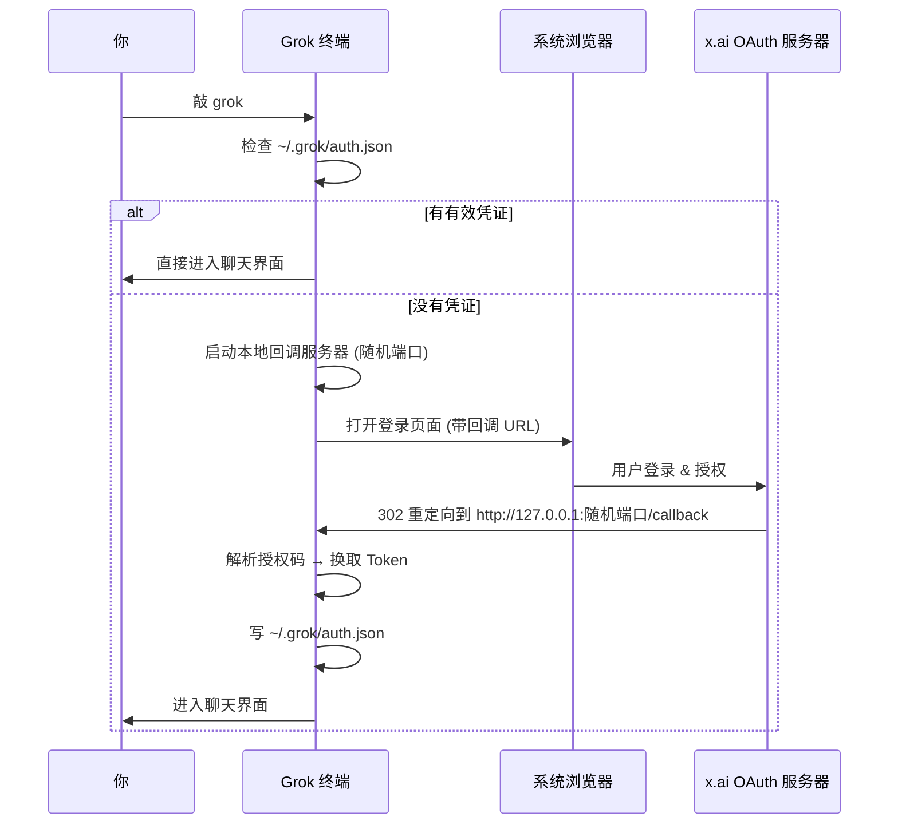
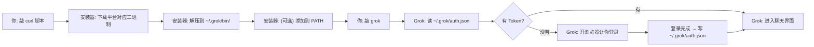

[← 返回首页](index.md)

# 5 分钟快速上手

你只需要跑两个命令就能跟 Grok 聊天。别的配置、理论、API 细节统统先不管，跑起来再说。

## 安装

打开终端，粘贴这一行然后回车：

```bash
curl -fsSL https://x.ai/cli/install.sh | bash
```

等它跑完，验证一下：

```bash
grok --version
```

如果看到版本号（比如 `0.1.220-alpha.4`），装好了。

**Windows 用户**用 PowerShell 装：

```powershell
irm https://x.ai/cli/install.ps1 | iex
```

它是从 `crates/codegen/xai-grok-pager/npm/grok/package.json` 里的 `bin` 字段定义的入口。安装脚本会自动把 `~/.grok/bin` 加到你的 PATH 里，之后随时敲 `grok update` 就能升级。

---

## 第一次启动

直接敲：

```bash
grok
```

终端会弹出一个全屏界面，同时你的浏览器会打开一个登录页面。选你的账号登录就行。

**不弹浏览器怎么办？**——在环境变量里塞一个 API Key（去 [console.x.ai](https://console.x.ai) 申请）：

```bash
export XAI_API_KEY="xai-..."
grok
```

登录一次之后，以后每次启动 Grok 都自动复用之前存的凭证（存在 `~/.grok/auth.json` 里）。想换账号就敲 `grok login`，想退出来就敲 `grok logout`。

登录流程（简单说：浏览器打开→你点确认→终端就通了）：



登录逻辑实现在 `crates/codegen/xai-grok-shell/src/auth/flow.rs`，Token 刷新和过期处理都在那里。

---

## 第一次对话

现在你面前是一个全屏界面，底部有个输入框。俩区域：

- **聊天区**（上面大部分区域）——显示你的问题和 Grok 的回答
- **输入框**（最底下一行）——你打字的地方

输入一句话，按 `Enter` 发送：

```
用 JavaScript 写一个斐波那契数列函数
```

Grok 会开始思考、写代码、还可能跑个命令试试。所有动作都会像聊天消息一样一条一条出现在聊天区，实时滚动。

**想换个模型？**输入 `/model grok` 再按回车就行。所有斜杠命令的完整列表见《用户命令与功能参考》。

---

## 几个最常用的快捷键

先把这三个记住，剩下的慢慢查：

| 按键 | 作用 | 大白话 |
|------|------|--------|
| `Enter` | 发送消息 | 把输入框里的话发出去 |
| `Tab` | 切换焦点 | 在输入框和聊天区之间跳来跳去 |
| `Ctrl+C` | 取消正在做的事 | Grok 正在跑命令/写代码时，按一下让它停 |
| `上/下方向键` | （聊天区）选择条目 | 在聊天区的历史消息里上下翻 |

方向键的操作由 `crates/codegen/xai-grok-pager/src/input/key.rs` 里的按键映射处理，然后路由到 `crates/codegen/xai-grok-pager/src/dispatch/router.rs`。

---

## 让 Grok 看你的代码

在输入框里用 `@` 符号引用文件：

```
帮我看看 @src/main.rs 里的 BUG
```

或者限定只看某几行：

```
@src/main.rs:10-50 的循环逻辑有问题吗
```

`@` 会弹出一个模糊搜索框，默认只看非隐藏文件。想搜 `.env` 这种隐藏文件，加个 `!`：

```
@!.env
```

文件引用系统实现在 `crates/codegen/xai-grok-tools` 里，详见《工具系统：AI 的“工具箱”》。

---

## 跑一个命令（不需要你确认）

默认情况下，Grok 执行 shell 命令之前会问你"可以吗？"——你每步都要确认。想跳过确认，启动时加 `--yolo`：

```bash
grok --yolo "帮我格式化所有 Rust 文件"
```

或者进去之后敲 `/always-approve` 再按回车切换到"自动批准"模式。不想用的时候再敲一遍就能切回来。

---

## 一句话总结你的安装到底干了什么



---

## 接下来看什么

你想做的事情 | 翻到这一页
---------|----------
想搞懂这些命令背后发生了什么 | 《整体架构：区域之间怎么合作》
遇到了登录/认证的问题 | 《Pager 终端 UI 与端到端测试》——里面有详细的认证案例
想定制模型、快捷键、主题 | 《用户命令与功能参考》
想拿 Grok 写脚本跑 CI | 同一个《用户命令与功能参考》，翻到头像模式部分
想给你的项目加自己的规则 | 在项目根目录建个 `AGENTS.md` 文件，Grok 会自动读
