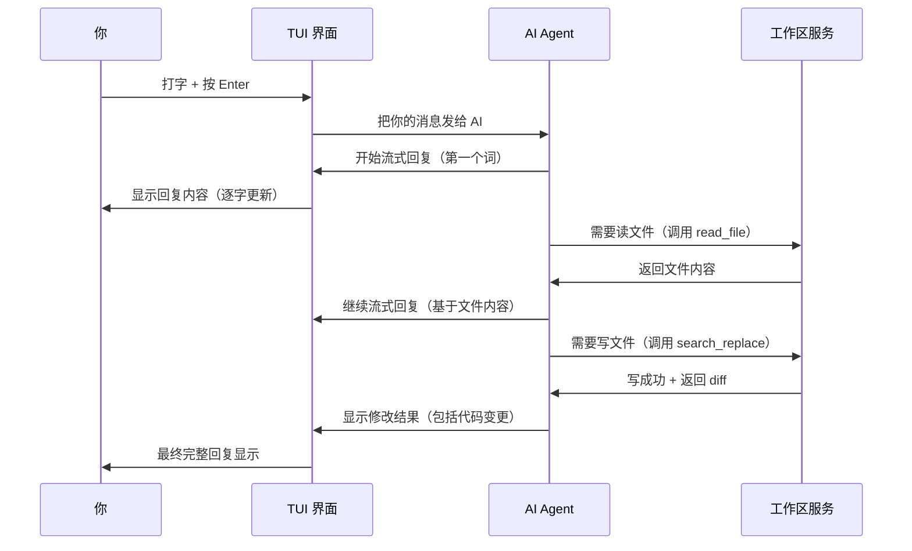

[← 返回首页](index.md)

# 快速上手：安装、运行、第一句对话

## 装好 `grok` 命令行工具

最省事的方式是直接装 SpaceXAI 发布的二进制包。打开你的终端，执行这一条命令：

```bash
curl -fsSL https://x.ai/cli/install.sh | bash
```

这条命令会自动判断你的操作系统（macOS / Linux / Windows Git Bash），下载最新版的 `grok` 二进制文件，并放到 `PATH` 里。装完之后验证一下：

```bash
grok --version
```

如果你是用 Windows 原生 PowerShell 的，改用这条：

```powershell
irm https://x.ai/cli/install.ps1 | iex
```

> 💡 如果你想装特定版本（比如 `0.1.42`），加上版本号：
> ```bash
> curl -fsSL https://x.ai/cli/install.sh | bash -s 0.1.42
> ```

安装脚本做的事，说白了就是三步骤：下载 → 解压 → 放到 `~/.grok/bin/` 里并把那个目录加到 `PATH`。而脚本本身来自仓库根目录的 [`README.md`](README.md)（注意这不是 Cargo 包，只是仓库的入口说明）。

---

## 构建源码（如果你更想自己编译）

先从仓库根目录的 [`rust-toolchain.toml`](rust-toolchain.toml) 了解 Rust 工具的版本——`rustup` 会在第一次编译时自动装好。不过在此之前，[DotSlash](https://dotslash-cli.com) 必须装好，因为仓库里 [`bin/protoc`](bin/protoc) 这种工具是通过它自动下载的：

```bash
cargo install dotslash
/usr/bin/env dotslash --help    # 确认能用
```

然后编译启动 TUI：

```bash
cargo run -p xai-grok-pager-bin
```

如果想编译一个 release 版（更快的启动和响应）：

```bash
cargo build -p xai-grok-pager-bin --release
# 产物在 target/release/xai-grok-pager
```

官方发布版的名字叫 `grok`，但 Cargo 产物叫 `xai-grok-pager`。

---

## 第一件事：登录

直接运行 `grok`：

```bash
grok
```

第一次启动时，它会自动在浏览器里打开一个登录页面让你登录 grok.com。登录成功后，你的凭证会保存在 `~/.grok/auth.json` 里，以后就不用再登录了。凭证过期时，它会自动刷新；如果实在刷新不了，它会再弹浏览器让你重新登录。

如果你在 CI/CD 环境或者纯命令行服务器上没有浏览器，可以用 API key：

```bash
export XAI_API_KEY="xai-你的key"
grok
```

所有认证方式（OAuth、OIDC、设备码流等等）的完整文档都在用户指南的 [`crates/codegen/xai-grok-pager/docs/user-guide/02-authentication.md`](crates/codegen/xai-grok-pager/docs/user-guide/02-authentication.md) 里。

---

## 第一句对话

认证通过后，你会看到一个全屏 TUI，屏幕上主要分两块：

- **Scrollback（对话区）**——占屏幕大部分，显示你发的消息、AI 的回复、调用的工具、编辑的文件等等。
- **Prompt（输入区）**——屏幕最底下一行，你在这里打字。

现在打一句话，比如：

```
用中文解释一下什么是 Rust 的 ownership
```

然后按 **`Enter`** 发送。几秒钟之内，Grok 就会开始流式输出回答，一行一行地出现在对话区。

如果想让它执行命令或者修改文件，直接在对话里说，比如：

```
在当前目录下创建一个 hello.py，打印 "Hello, Grok!"
```

Grok 会：
1. 先问你是否允许执行写文件操作（默认权限模式，按 `Ctrl+O` 可以切换到"永远允许"模式）
2. 创建文件并显示它的内容和差异
3. 然后可以告诉你怎么运行它

看一个简单互动流程：



> 上面这个时序图只是一个简化版本。如果你想深入理解每一个键按下之后的所有调用链，请翻阅《用户按下一个键，背后发生了什么》。

---

## 几个常用操作，秒上手

### 按 Tab 切换焦点
`Tab` 键在输入区和对话区之间切换。对话区获得焦点后，可以用方向键上下选择条目，按 `Left`/`Right` 折叠或展开（比如折叠 `thinking` 思考块）。

### 用 @ 引用文件
在输入框里打 `@`，会弹出一个模糊搜索文件选择器：

```
@src/main.rs              # 附加 src/main.rs 整个文件
@src/main.rs:10-50        # 只附加 10-50 行
@.github                  # 搜隐藏文件 / 文件夹（默认隐藏 dotfile，加 ! 前缀就能搜）
```

### 输入 / 执行斜杠命令
在输入框打 `/` 能看到可用命令列表。几个最实用的：

```
/model grok-build          # 切换成 grok-build 模型
/always-approve            # 切换"永远允许"模式
/new                       # 开始一个新会话
/compact                   # 压缩对话历史，节省 Token
```

### Ctrl+C 取消当前回合
如果 AI 跑偏了或者你不想等它回复完，按 `Ctrl+C` 马上停。

---

## 一些好用的启动参数

从 [`src/app/cli.rs`](src/app/cli.rs) 的 `PagerArgs` 结构体可以直接看到所有支持的参数，挑几个最常用的：

| 参数 | 作用 |
|------|------|
| `grok "你的问题"` | 直接带一句初始问题启动，省去打字 |
| `grok -p "一句话问题"` | 头对头模式——不进入 TUI，AI 回复打印到终端然后退出 |
| `grok --cwd ~/projects/my-app` | 指定工作目录（默认是当前目录） |
| `grok --yolo` | 永远允许 AI 执行命令和写文件，不再每次弹确认 |
| `grok -m grok-build` | 指定用 `grok-build` 模型（默认可能是更快的基础模型） |
| `grok --resume <session-id>` | 续接之前的某次会话 |
| `grok -c` | 续接最近的一次会话 |
| `grok --rules "Always use TypeScript"` | 附加系统提示词规则，让后续 AI 行为更符合你的偏好 |

比如你想直接让 AI 解释一段代码然后退出，可以：

```bash
grok -p "Explain the CLI parser in src/app/cli.rs" --output-format plain
```

如果你想要结构化的输出（比如给脚本用），加 `--output-format json`：

```bash
grok -p "List all top-level commands in the repo" --output-format json --yolo
```

输出会是一个包含 `text`、`stopReason`、`sessionId` 的 JSON 对象。

---

## 如果你有项目级别的偏好（AGENTS.md）

在每个项目根目录放一个 `AGENTS.md` 文件，Grok 每次启动时会读取它，把它当成项目特定的系统提示词。比如：

```
# 项目规则
- 后端使用 Rust 和 Actix-web
- 前端使用 React + TypeScript
- 测试必须用 pytest 写，覆盖率 > 80%
```

把这段规则放在项目的 `AGENTS.md` 里，之后 Grok 帮你写代码时就会遵循这些约定。

`AGENTS.md` 有优先级层级：`~/.grok/AGENTS.md`（全局） < `<repo-root>/AGENTS.md` < `<cwd>/AGENTS.md`（目录级，最高）。Grok 也读 `CLAUDE.md` 作为兼容。

---

## 下一步看什么

你已经能跑起来了。想更深入：

| 你想了解 | 看这一页 |
|----------|----------|
| 每个按键按下去发生了什么 | 《用户按下一个键，背后发生了什么》 |
| Grok 能调用哪些工具（读写文件、跑命令、查网页） | 《工具箱概览：AI 的「手和眼睛」》 |
| Markdown 怎么变成漂亮的 TUI 渲染 | 《终端渲染引擎：如何把 Markdown 变成赏心悦目的 TUI》 |
| 所有快捷键和斜杠命令 | 用户指南：`crates/codegen/xai-grok-pager/docs/user-guide/03-keyboard-shortcuts.md` |
| 配置文件和主题 | 用户指南：`crates/codegen/xai-grok-pager/docs/user-guide/05-configuration.md` |

如果你遇到登录问题，先确认 `~/.grok/auth.json` 存在且包含 `accessToken` 字段。还不行的话，试试 `grok logout` 后重新 `grok` 走一遍浏览器认证。
