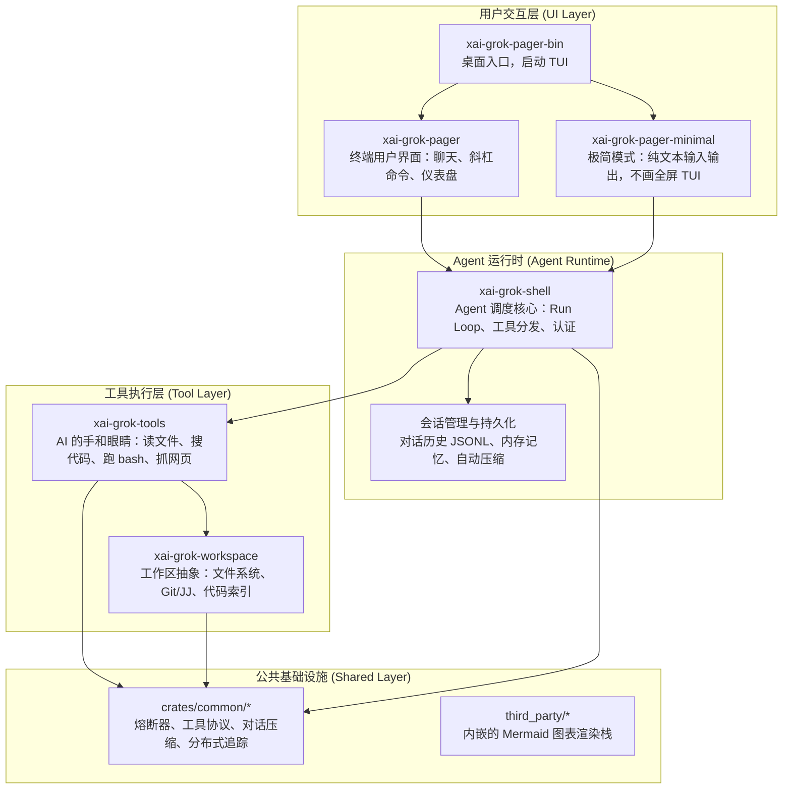
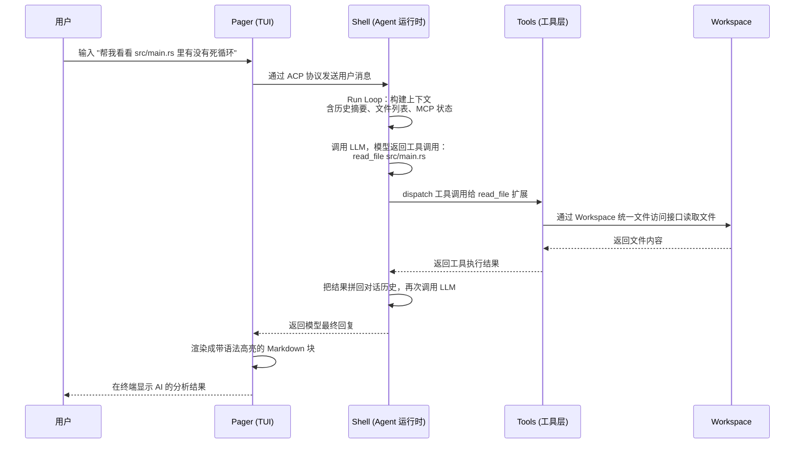

[← 返回首页](index.md)

# 代码仓库导览

当你第一次把这个仓库 clone 到本地，看到 `crates/` 下面冒出来七八十个目录，心里大概会咯噔一下。别慌——虽然 crate 数量多，但它们的分工相当规整，只要你认准三块核心积木，整个仓库的结构就一目了然。

## 一张图看清全局



这四层分工就像一间餐厅：

- **用户交互层是前台**——你看到的菜单、服务员递过来的账单、墙上的电视，全是 TUI 画出来的。
- **Agent 运行时是后厨调度台**——服务员把点菜单（你的问题）递过来，调度台决定先做哪个菜、需要哪些厨具、做完一道要不要回头再加工。
- **工具执行层是厨房里的锅碗瓢盆**——切菜刀（读文件）、搅拌机（搜代码）、燃气灶（跑 bash），每样工具都是 AI 能直接上手用的。
- **公共基础设施是整栋楼的供水供电**——熔断器防止某口锅烧干引发火灾，追踪系统记录每个订单从进店到出餐的全过程，对话压缩负责把最长的点餐记录挤成一条摘要。

下面按层逐个认门。

---

## 用户交互层：你看到的一切

这一层就一个主角：`xai-grok-pager`，它的入口文件在 `crates/codegen/xai-grok-pager/src/lib.rs`。

打开这个文件你会看到一整串 `pub mod` 声明，每个都对应 TUI 的一个子系统：

```rust
// crates/codegen/xai-grok-pager/src/lib.rs（节选）
pub mod acp;           // 跟后端 Agent 通信的协议层
pub mod app;           // 应用主调度器
pub mod input;         // 键盘、鼠标事件归一化
pub mod scrollback;    // 对话历史的"块"模型与渲染引擎
pub mod slash;         // 斜杠命令（/model、/rewind 等 50+ 个）
pub mod settings;      // 设置项定义与持久化
pub mod views;         // 弹窗、状态栏、进度条等 40+ 个 UI 组件
pub mod voice;         // 语音输入（按住说话→松手转文字）
```

另外还有两个"出口"包：

- **`xai-grok-pager-bin`**：纯壳子，只负责启动。它在 `Cargo.toml` 的 worksapce members 列表里排第 27 位，是 `cargo run -p xai-grok-pager-bin` 的目标。
- **`xai-grok-pager-minimal`**：给不喜欢全屏 TUI 的用户准备的极简模式，没有滚动回溯、没有面板，就是纯文本输入输出。它跟完整 TUI 共享同一套底层逻辑，通过 `src/minimal/` 下的两个缝（`minimal_hook` 和 `minimal_api`）接入。

> [详见《终端渲染流水线》](09-tui-rendering.md) 和 [《Minimal 模式：不画 TUI 也能聊》](14-minimal-mode.md)

---

## Agent 运行时：大脑和双手的协调者

这一层的核心是 `xai-grok-shell`（入口在 `crates/codegen/xai-grok-shell/src/lib.rs`）。

跟 pager 的细碎子系统不同，shell 的模块声明透着一股"调度台"的味道：

```rust
// crates/codegen/xai-grok-shell/src/lib.rs（节选）
pub mod agent;           // Agent 应用入口、IPC Server
pub mod auth;            // OIDC 登录、JWT 刷新、凭据存储
pub mod extensions;      // 20+ 个扩展：FS、Git、终端、搜索、MCP
pub mod leader;          // 多实例 Leader 选举
pub mod session;         // ACP 会话、Run Loop、压缩、回退
pub mod terminal;        // PTY 会话封装，让 AI 能真正执行 Shell 命令
```

它干的事情可以想象成一个中央厨房调度台：

1. 前台（Pager）把顾客订单（你的问题）放进一个排队队列。
2. 调度台从队列里取任务，构建上下文（包括历史摘要、文件变更、MCP 服务器状态），发给大厨（LLM）。
3. 大厨返回的不是菜，而是一张张"工具取用单"——比如"去 3 号冷柜取一份 `src/main.rs`"（读文件）、"用料理机打碎这些关键字"（搜索代码）。
4. 调度台把取用单分发给对应的厨具（Extension），执行完再把结果拼回对话里，继续下一轮。

这中间还穿插着定期"清台"（对话压缩，防止 token 爆掉）、"回退上一道菜"（rewind）和"今天一共做了多少桌的总结"（recap）。

> [详见《Agent 调度核心》](15-agent-runtime.md) 和 [《会话管理：从出生到归档》](06-session-lifecycle.md)

---

## 工具执行层：AI 的手和眼睛

这一层由两大支柱撑起来。

**第一根支柱：`xai-grok-tools`**（入口 `crates/codegen/xai-grok-tools/src/lib.rs`）

所有 AI 能调用的能力都通过统一的 `Tool` trait 接入——从读文件到搜代码，从跑 bash 到抓网页，甚至包括生成图片、执行定时任务。仓库背景档案里提到它有 214 个文件，说明工具的种类之多——不过这没什么好怕的，它们都注册在同一个注册中心（`src/registry/`）里，调用方不直接接触具体实现。

```rust
// 每个工具都要实现的接口（来自 crates/codegen/xai-grok-tools/src/types/tool.rs 的概念）
// Tool trait: name()、description()、input_schema()、invoke()
// 注册中心: src/registry/mod.rs 负责发现和管理所有工具
```

**第二根支柱：`xai-grok-workspace`**

Workspace 是所有文件操作的统一入口——本地磁盘、Git/JJ 感知、代码索引，甚至远程 ACP 挂载，都通过一个 trait 抽象。你可以把它想象成厨房的"中央储物系统"：不管食材是从本地冰箱拿的还是从远程冷库调来的，厨师只需要给个编号，储物系统就能递出来。

> [详见《工具箱：AI 的手和眼睛》](19-tool-system.md) 和 [《终端执行与权限控制》](20-terminal-tools.md)

---

## 公共基础设施：整栋楼的供水供电

`crates/common/` 下面有 10 个独立 crate，外加 `third_party/` 里的内嵌依赖。其中最重要几个：

| Crate | 一句话大白话 |
|---|---|
| `xai-circuit-breaker` | 熔断器——某个外部服务一直失败就别再打过去了，等它恢复再重试 |
| `xai-tool-protocol` + `xai-tool-runtime` + `xai-tool-types` | 工具 RPC 协议全家桶——定义工具之间怎么发消息、怎么注册、怎么调用 |
| `xai-grok-compaction` | 对话压缩引擎——聊太长了就把老历史总结成摘要，省 token |
| `xai-interjection-core` | 中断注入——在工具执行到一半时插入外部干预 |
| `xai-tracing` | 分布式追踪——记录一个请求从头到尾经过了哪些模块、各花了多长时间 |
| `mermaid-to-svg`（third_party） | Mermaid 图表渲染——把 Mermaid 文本画成 SVG，支持纯 Rust 引擎和 mmdc 两种后端 |

这些 crate 之间没有强耦合，就像工具箱里的螺丝刀、扳手、电钻各管各的——哪个模块需要就去拿哪个。

> [详见《对话压缩：给 LLM 的上下文瘦身》](17-compaction.md) 和 [《Mermaid 图表渲染》](12-mermaid-rendering.md)

---

## 一次完整调用：谁在什么时候调用谁

看完四层的静态分工，用一次请求把它们的协作串起来：



这条链路的核心思想是**职责分明**：Pager 只管"画什么"，Shell 只管"怎么调度"，Tools 只管"能干什么"，Workspace 只管"东西在哪取"。每层都不越界，但通过标准化协议（ACP、Tool trait、Workspace trait）严密咬合。

---

## 导航建议

现在你对仓库地图有了全局认识，下一步可以根据兴趣跳进具体页面：

- 想搞清楚一次对话怎么从头跑到尾 → [《一次完整对话的旅程》](05-one-full-turn.md)
- 想深入 TUI 怎么把 Markdown 画成屏幕上的彩色方块 → [《终端渲染流水线》](09-tui-rendering.md)
- 想了解 AI 怎么操作你的文件和终端 → [《工具箱：AI 的手和眼睛》](19-tool-system.md)
- 想看看 50+ 个斜杠命令怎么注册和匹配 → [《斜杠命令系统》](11-slash-command-system.md)

如果被某个缩写卡住了 → [《术语速查》](37-glossary.md)，一句一句说清楚。
