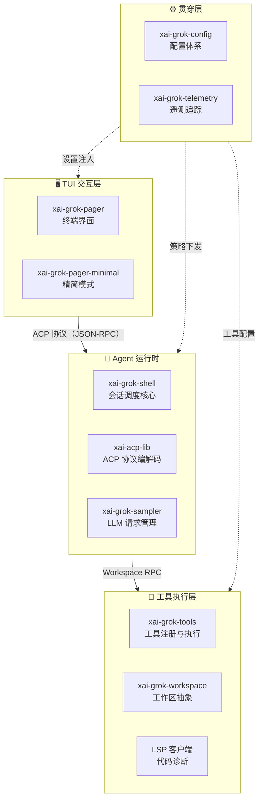
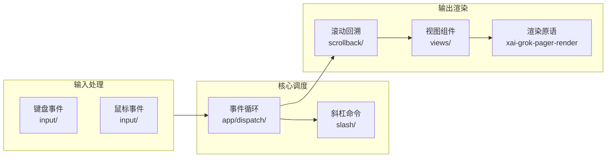
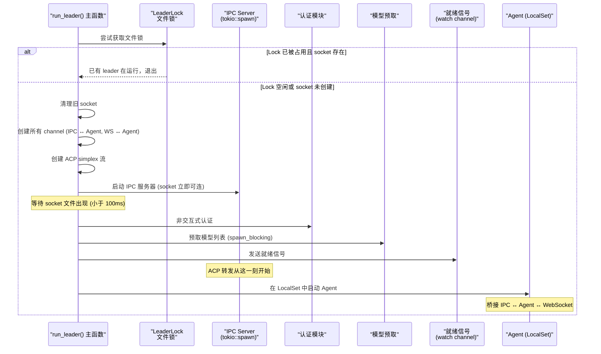
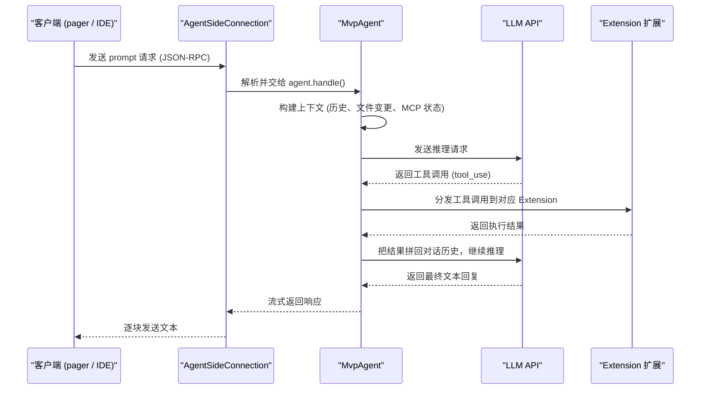
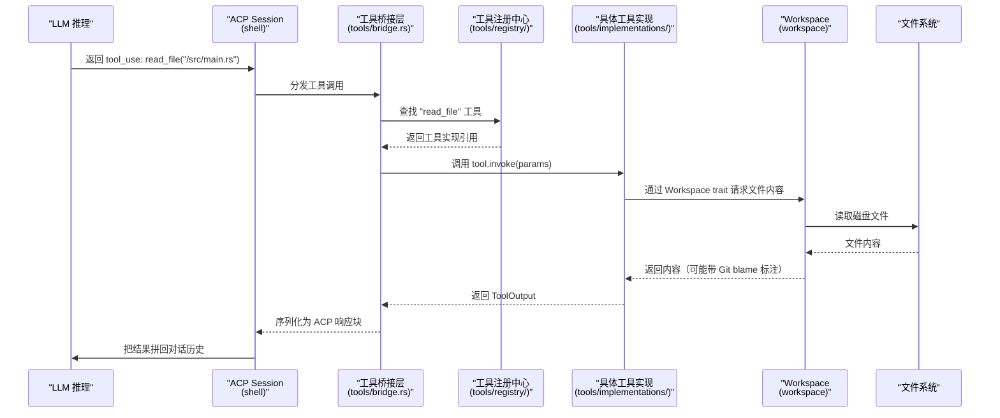

[← 返回首页](index.md)

# 整体架构：TUI → Agent → Workspace 三层协作

Grok Build 这套系统猛一看有一百多个 Rust crate，但剥掉壳之后，核心骨架其实就三层：**TUI 交互层**（xai-grok-pager）负责你在屏幕上看见和操作的所有东西；**Agent 运行时**（xai-grok-shell）负责理解你的意图、调度 AI 模型、管理对话；**工具执行层**（xai-grok-tools + xai-grok-workspace）负责真正去读文件、执行命令、搜代码。

三层之间通过两套协议串起来：ACP（Agent Client Protocol）负责 TUI 和 Agent 之间的事件传递，Workspace RPC 负责 Agent 和工具执行层之间的请求分发。再加上贯穿三层的配置与遥测体系，整个协作关系长这样：



别被这张图吓到。下面逐层拆开讲，看完你就知道每层到底在干什么、层与层之间怎么搭话。

## TUI 交互层：你的眼睛和手指

这一层只有一个核心 crate：`xai-grok-pager`，入口在 `crates/codegen/xai-grok-pager/src/lib.rs`。它的职责很纯粹——把我们不想管的终端细节全封装掉，然后给用户一个美观、可操作的聊天界面。

### 它的内部长什么样



从 `xai-grok-pager/src/lib.rs` 的模块声明能看出来，整个 pager 是一个精心分层的单体应用：

```rust
// crates/codegen/xai-grok-pager/src/lib.rs
pub mod acp;           // 与 Agent 通信的 ACP 客户端
pub mod app;           // 应用主循环和 dispatch 路由
pub mod slash;         // 斜杠命令系统（50+ 个 / 开头命令）
pub mod scrollback;    // 对话历史的"块"模型渲染引擎
pub mod views;         // 弹窗、状态栏、进度条等 40+ 个 UI 组件
pub mod input;         // 键盘鼠标事件规范化
pub mod settings;      // 设置项定义与持久化
pub mod notifications; // tmux 集成、终端标题更新
```

其中 `pub use xai_grok_pager_render::{...}` 那一段特别关键——它把字体渲染、主题着色、终端能力探测这些底层脏活全部甩给了 `xai-grok-pager-render` crate，pager 自己只管"在哪个位置画什么东西"的业务逻辑。

### TUI 怎么和 Agent 搭话：ACP 客户端

pager 的 `acp/` 目录装了一套 ACP 协议客户端。它负责和 `xai-grok-shell` 里的 Agent 建立连接，把用户的输入发过去，再把 Agent 的回复收回来。

ACP 协议基于 JSON-RPC，消息格式长这样（从 `xai-acp-lib` 的类型定义反推）：

- **请求**：`{"jsonrpc": "2.0", "id": "...", "method": "prompt", "params": {...}}`
- **响应**：`{"jsonrpc": "2.0", "id": "...", "result": {...}}`
- **通知**：`{"jsonrpc": "2.0", "method": "x.ai/config_changed", "params": {...}}`（无需 id）

这里不展开，[详见《Agent Client Protocol：与编辑器通信》](27-acp-protocol.md)

## Agent 运行时：整个系统的调度大脑

Agent 运行时是整个 Grok Build 最复杂的部分，核心在 `xai-grok-shell`，入口 `crates/codegen/xai-grok-shell/src/lib.rs` 和 `crates/codegen/xai-grok-shell/src/agent/app.rs`。

### 三种运行模式

从 `app.rs` 的三个公开入口函数可以看出，Agent 有三种启动方式：

| 入口函数 | 运行模式 | 适用场景 |
|---|---|---|
| `run_stdio_agent()` | stdio 模式 | IDE 插件通过管道连上 Agent |
| `run_headless()` | 无头模式 | 后台自动化，通过 WebSocket 中继和 grok.com 通信 |
| `run_leader()` | 领导者模式 | 管理多个客户端，负责 IPC 服务、中继连接、自动更新 |

每种模式的核心逻辑都一样——创建一个 `MvpAgent`，把它挂到 `AgentSideConnection` 上，然后启动事件循环。区别只在于**传输层**：stdio 走管道，headless 走 WebSocket 中继，leader 走 Unix domain socket 同时支持 IPC 和中继。

```rust
// crates/codegen/xai-grok-shell/src/agent/app.rs（核心骨架）
let mut agent = MvpAgent::new(gateway, &agent_config, auth_manager, prefetched_models)
    .unwrap_or_else(exit_on_config_error);
let (conn, handle_io) = acp::AgentSideConnection::new(agent, outgoing, incoming, |fut| {
    tokio::task::spawn_local(fut);
});
```

### Leader 模式的启动时序

Leader 是最复杂的模式，因为它要同时服务本地 IPC 客户端和远程 WebSocket 中继。`run_leader()` 函数（`app.rs` 里最长的一个函数，600+ 行）按八个阶段启动：



这个顺序经过精心设计：认证和模型预取可能很慢（要走网络），但 IPC socket 在第三步就绑定了，所以客户端可以立刻连上——只是会收到 `leader_starting` 错误，然后重试。这样用户体验不会卡在"正在连接服务器"的提示上。[详见《会话管理：从出生到归档》](06-session-lifecycle.md)

### Agent 内部怎么运转

Agent 创建之后，`AgentSideConnection` 接管了所有 I/O。它的内部循环长这样（从 `xai-acp-lib` 的使用方式反推）：



这个"prompt → LLM → tool_use → 执行 → 结果 → LLM → 回复"的循环就是 Agent 的一轮对话。工具的注册和分发在 [详见《工具箱：AI 的手和眼睛》](19-tool-system.md)，压缩策略在 [详见《对话压缩：给 LLM 的上下文瘦身》](17-compaction.md)。

### 配置热加载：文件监听 → ACP 注入

Agent 有一个精巧的机制来响应磁盘上的配置变化。`app.rs` 里的 `ConfigFileWatcher` 监听到文件变化后，不直接修改 Agent 状态，而是**把一条内部 JSON-RPC 消息注入 ACP 流**——和客户端发来的消息走同一个通道。这样所有状态变更天然串行化，不需要锁。

```rust
// crates/codegen/xai-grok-shell/src/agent/app.rs
fn internal_reload_request_line(id: &str, method: &str, params: serde_json::Value) -> String {
    let msg = serde_json::json!({
        "jsonrpc": "2.0",
        "id": id,
        "method": format!("_{method}"),  // _ 前缀是 ACP 扩展方法的标识
        "params": params,
    });
    format!("{}\n", msg)
}
```

这个方法生成的请求被注入 `acp_incoming_tx`，Agent 会像处理客户端请求一样处理它。`ConfigUpdate` 枚举（`app.rs` 后半段）列出了所有可热加载的配置类型：认证 token、MCP 服务器列表、模型列表、UI 主题，甚至是内存配置。

[详见《配置体系：三层优先级合并》](28-config-system.md)

## 工具执行层：AI 的手和眼睛

当 Agent 里的 LLM 决定"我要读文件"或"我要搜代码"时，它实际上是在调用工具执行层提供的接口。这一层由两个核心 crate 组成。

### 工具箱：统一的能力注册中心

`xai-grok-tools`（入口 `crates/codegen/xai-grok-tools/src/lib.rs`）把所有 AI 能调用的能力打包成统一的 `Tool` trait：

```rust
// crates/codegen/xai-grok-tools/src/lib.rs（核心模块）
pub mod bridge;           // 桥接层，协议转换和生命周期管理
pub mod registry;         // 工具注册中心，负责发现和路由
pub mod implementations;  // 具体工具实现（bash、文件读写、搜索等）
pub mod types;            // Tool trait、ToolIO、ToolMetadata 等核心类型
```

工具的分类通过 `tool_taxonomy` 模块管理，同一个功能（比如 bash 执行）可能有多个实现变体（grok_build 版、grok_build_concise 版、opencode 版），注册中心根据不同场景选择合适的实现。[详见《工具箱：AI 的手和眼睛》](19-tool-system.md)

### 工作区：文件系统的统一抽象

`xai-grok-workspace`（入口 `crates/codegen/xai-grok-workspace/src/lib.rs`）给工具层提供了一套统一的操作接口，把本地磁盘、Git/JJ 版本感知、代码索引、甚至是远程 ACP 挂载都抽象成一个 trait 面：

```rust
// crates/codegen/xai-grok-workspace/src/lib.rs（对外暴露的核心类型）
pub use file_system::*;        // 文件读写、目录遍历
pub use session::{
    file_state, git, jj        // VCS 状态追踪
};
pub use permission::*;         // 权限控制（哪些操作可以自动执行）
pub use workspace_ops::{WorkspaceOp, WorkspaceOps};  // 工作区操作统一接口
```

### 一次工具调用的完整链路

把工具执行层的各个模块串起来，一次"AI 要读文件"的请求怎么走的：



权限控制（`permission` 模块）在 `invoke` 之前拦截——如果用户设置了"rm 命令必须手动确认"，那么 AI 的 `bash("rm -rf /")` 调用会在工具执行之前被拦下来弹窗。[详见《终端执行与权限控制》](20-terminal-tools.md)

## 贯穿三层的基础设施

有两套系统贯穿 TUI、Agent、工具三层。

### 配置体系：三层优先级合并

`xai-grok-config` 负责加载和合并配置。配置有三个来源，按优先级从高到低：

1. macOS MDM 推送的托管配置（最高优先级，企业管理员强制下发）
2. IT 管理员签发的策略文件（团队级别）
3. 用户自己的 `grok.toml`（个人偏好）

`config/reloader.rs` 里的 `ConfigUpdate` 枚举通过文件监听触发热加载，变更通知以 `x.ai/config_changed` 这样的 ACP 通知形式广播给所有在线客户端。[详见《配置体系：三层优先级合并》](28-config-system.md)

### 遥测与可观测性

`xai-grok-telemetry` 是遥测的统一入口，封装了三套数据管道：

- **产品分析事件**：用户用了什么功能，走分析管道上报
- **性能追踪 span**：基于 fastrace + OpenTelemetry，给每个请求打上 trace context
- **Sentry 错误上报**：崩溃和异常自动收集

`xai-grok-shell/src/agent/app.rs` 里大量使用 `unified_log::info/warn`（来自 `xai-grok-telemetry::unified_log`），这些日志同时写本地 JSONL 文件和远程采集端。[详见《遥测与可观测性》](29-telemetry.md)

## 快速定位指南

读完这篇文章，现在打开仓库你应该能快速定位了：

- 想看界面怎么渲染的 → `crates/codegen/xai-grok-pager/src/scrollback/`
- 想看 Agent 怎么调度一轮对话 → `crates/codegen/xai-grok-shell/src/session/acp_session_impl/`
- 想看 AI 能调用哪些工具 → `crates/codegen/xai-grok-tools/src/implementations/`
- 想看文件读写怎么走 Workspace → `crates/codegen/xai-grok-workspace/src/file_system/`
- 想看配置怎么热加载 → `crates/codegen/xai-grok-shell/src/agent/app.rs` 搜 `ConfigUpdate`
- 想看 ACP 协议消息格式 → `crates/codegen/xai-acp-lib/src/message.rs`

整个系统虽然 crate 多，但数据流是清晰的三层单向流动：用户敲键盘 → TUI 封装成 ACP 消息 → Agent 调度 LLM 和工具 → 工具通过 Workspace 操作文件系统 → 结果原路返回。理清这条线，剩下的都是细节。
