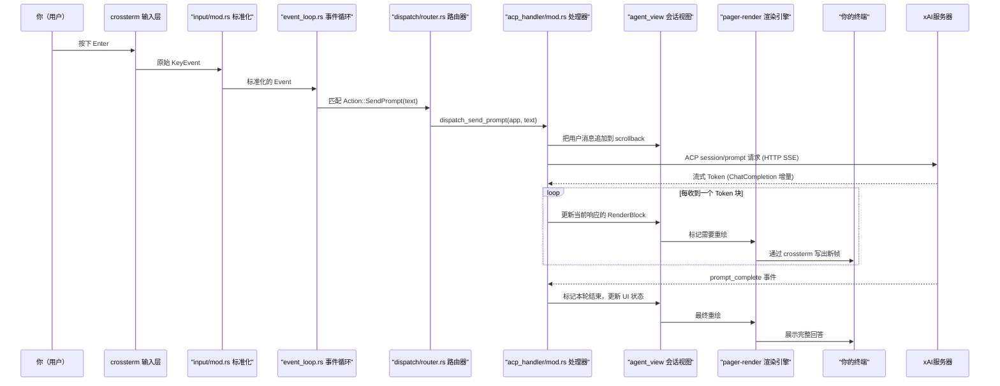
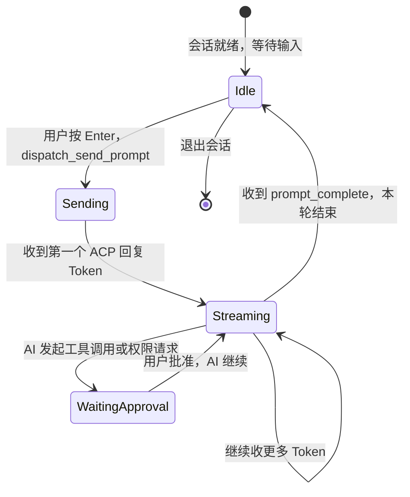

[← 返回首页](index.md)

# 用户按下一个键，背后发生了什么

从你在终端里按下 Enter 发送问题，到屏幕上看到 Grok 的回答，中间经过了一条精心设计的事件处理流水线。这一页带你完整走一遍这条调用链。

## 整体流程速览

整条链路可以拆成 6 个阶段：

1. **输入标准化**：crossterm 监听键盘事件，`input/mod.rs` 把它转成统一的 `Event`
2. **事件循环派发**：`event_loop.rs` 的 `tokio::select!` 捞到事件，传给路由器
3. **路由器分发**：`dispatch/router.rs` 根据 `Action` 类型调用对应的处理器函数
4. **ACP 处理与 AI 通信**：`acp_handler` 把用户的提问封装成 ACP 消息，通过 HTTP SSE 发到 xAI 服务器，收流式回复
5. **流式渲染**：`agent_view` 把收到的每个 Token 片段增量更新到 `scrollback` 历史里，同时触发重绘
6. **显示输出**：`pager-render` 的渲染流水线把 Markdown/代码/图表转成终端字符，画到屏幕上

下面是这条链路的全局时序图：



## 第一步：输入标准化——你按的键变成事件

入口在 `src/input/mod.rs`（路径：`crates/codegen/xai-grok-pager/src/input/mod.rs`）。crossterm 的 `Event` 有 20 多种变体，但 TUI 里只需要关心按键、鼠标、粘贴这几种。这个文件把：

- `KeyEvent` 里的 `KeyCode`（比如 `Enter`、`Backspace`、`Char('a')`）和 `KeyModifiers` 组合成更高级的语义
- 鼠标点击/滚轮事件转成滚动命令
- 粘贴内容从 `Paste` 事件里提取

标准化后的结果通过一个 `tokio::sync::mpsc::UnboundedReceiver` 通道送给事件循环。读者线程（reader thread）单独跑在一个 `std::thread` 里，把 crossterm 读到的 `Event` 逐个塞进通道。

```rust
// input/mod.rs 简化示意
pub fn read_key() -> Option<Event> {
    match crossterm::event::read() {
        Ok(Event::Key(k)) => Some(normalize_key(k)),
        Ok(Event::Paste(data)) => Some(Event::Paste(data)),
        _ => None,
    }
}
```

## 第二步：事件循环——`tokio::select!` 的轮盘赌

核心在 `crates/codegen/xai-grok-pager/src/app/event_loop.rs`。这个文件里有一个 `RunResult` 主循环，用 `tokio::select!` 同时监听多个来源：

1. **输入通道**：收到 `Event` 就调用路由器
2. **ACP 通道**：AI 回复的流式数据
3. **后台任务**：`JoinSet` 里的异步任务完成通知
4. **动画时钟**：`Instant` 驱动的定时重绘

```rust
// event_loop.rs 简化示意：核心的 select 结构
loop {
    tokio::select! {
        event = input_rx.recv() => {
            // 把 crossterm Event 转成 Action，派发给路由器
            if let Some(action) = input_to_action(terminal, event) {
                let effects = dispatch::router::dispatch(action, &mut app);
                execute_effects(effects, &mut app, terminal);
            }
        }
        acp_msg = acp_channel.recv() => {
            // 处理 AI 服务器的流式回复
            acp_handler::handle(acp_msg, &mut app);
        }
        task_result = join_set.join_next() => {
            // 后台任务（比如网络请求）完成
            handle_task_result(task_result, &mut app);
        }
        _ = sleep_until(next_anim_tick) => {
            // 动画帧（比如进度条闪烁）
            handle_anim_tick(&mut app);
        }
    }
}
```

这个循环是单线程的——所有状态修改都在这里串行执行，避免了并发安全问题。`AppView` 是唯一的可变状态持有者，路由器通过 `&mut AppView` 修改它。

## 第三步：路由器分发——Action 找到它的 Handler

路由器在 `crates/codegen/xai-grok-pager/src/app/dispatch/router.rs`。它的核心是一个巨大的 `match`：每个 `Action` 变体对应一个 `dispatch_*` 函数。

当你按下 Enter 时，`input_to_action` 会把按键转成 `Action::SendPrompt(text)`。路由器会这样匹配：

```rust
// dispatch/router.rs 简化
pub(crate) fn dispatch(action: Action, app: &mut AppView) -> Vec<Effect> {
    let effects = match action {
        // ... 几百行 match 分支 ...
        Action::SendPrompt(text) => dispatch_send_prompt(app, text),
        Action::SubmitFollowUp(text) => dispatch_send_prompt_inner(app, text, false, true, true),
        // ... 更多分支 ...
    };
    // 所有 dispatch_* 函数返回一个 Vec<Effect>
    // Effect 表示需要异步执行的操作（网络请求、写文件等）
    effects
}
```

注意这个函数返回 `Vec<Effect>` 而不是直接执行异步操作。Effect 是一个枚举，比如：

```rust
pub(crate) enum Effect {
    Quit,
    SendPrompt { session_id, text, images },
    SendBashCommand { command },
    OpenUrl(String),
    // ... 几十种效果
}
```

事件循环拿到 `Vec<Effect>` 后，在 `execute_effects` 里逐个执行——需要发网络的用 `tokio::spawn` 异步跑，需要改状态的直接调 `AppView` 方法。

## 第四步：ACP 处理——跟 AI 服务器聊天的桥梁

ACP 的全称是 Agent Client Protocol。这是 Grok 定义的一套消息协议，用来在客户端（你电脑上的 TUI）和服务器（xAI 的 Grok 模型）之间通信。

核心处理在 `crates/codegen/xai-grok-pager/src/app/acp_handler/mod.rs`。`handle` 函数接收来自服务器的 `AcpClientMessage`，路由到对应的 agent（一个 agent 就是一个会话 tab）。

```
ACP 消息示例：
- SessionNotification {  session_id, update }  →  流式回复的一个片段
- SessionNotification {  session_id, update: ToolCallUpdate }  →  AI 想执行一个工具
- SessionNotification {  session_id, update: PermissionRequest }  →  AI 需要用户批准
```

`dispatch_send_prompt` 这个函数（在 `router.rs` 里调用的）会做三件事：

1. **本地更新**：把用户输入的文本追加到当前 agent 的 `scrollback` 历史里，显示为“你说的一句话”
2. **发 ACP 消息**：通过 `acp_send`（来自 `xai_acp_lib`）向服务器发送 `session/prompt` 请求
3. **返回 Effect**：告诉事件循环“我已经发了请求，请监听 ACP 通道等回复”

```rust
// dispatch_send_prompt 简化示意（在 prompt.rs 或 router.rs 里）
pub(crate) fn dispatch_send_prompt(app: &mut AppView, text: String) -> Vec<Effect> {
    let session_id = app.active_session_id().unwrap();
    // 在 scrollback 里显示用户消息
    app.active_agent_mut().session.append_user_message(&text);
    // 告诉服务器：我发了一句新的话
    vec![Effect::SendPrompt {
        session_id,
        text,
        images: vec![], // 终端里暂时不支持发图片
    }]
}
```

## 第五步：流式渲染——边收边画

收到第一个 ACP 回复（一个 `ChatCompletion` 增量块）时，`acp_handler::handle` 会调用 `agent_view` 的方法来增量更新 `scrollback` 里的 `RenderBlock`。

RenderBlock 是一个包含文本、代码、表格等内容的节点，在 `crates/codegen/xai-grok-pager/src/scrollback/block.rs` 里定义。每个收到的 Token 片段要么追加到当前 block 后面（继续吐字），要么创建新 block（比如遇到代码块标记）。

```rust
// acp_handler 里的简化逻辑
let block = agent.scrollback.current_block_mut();
block.push_text(tokens); // 追加新收到的文本
// 标记需要重绘
app.needs_redraw = true;
```

`needs_redraw` 标志位被事件循环的下一次迭代检查到，然后调用 `agent_view.draw()` → 进入 `pager-render` 流水线。

## 第六步：显示输出——`pager-render` 的三阶段流水线

渲染全在 `crates/codegen/xai-grok-pager-render` crate 里。详细机制可以看《终端渲染引擎：如何把 Markdown 变成赏心悦目的 TUI》，这里只简单说三个阶段：

1. **内容解析**：`xai-grok-markdown` 把 Markdown 原文解析成语法树
2. **排版与着色**：`highlight.rs` 高亮代码块，`wrapping.rs` 计算折行，`render_mermaid.rs` 把 Mermaid 图表转成 ASCII
3. **最终绘制**：`terminal/mod.rs` 用 `ratatui` 把所有行和挂件（滚动条、状态栏、输入框）拼成完整帧，通过 `crossterm` 输出到终端

整个过程中，渲染引擎会做增量计算——只重绘发生变化的部分，而不是每次都全量重绘。这是通过 `AppView.draw()` 里维护的两个缓冲区（前后帧对比）实现的，只有变了颜色的字符才重新输出。

## 关键状态图：Agent 会话的完整生命周期

从用户按 Enter 到 AI 说完话，Agent 经历了这些状态：



注意 `WaitingApproval` 状态——这是 Grok 的一个特色：当 AI 想执行危险操作（比如删除文件）时，会暂停等待用户确认，而不是直接执行。

## 路径总结：你按键后触发的所有文件

这是一条完整的文件调用链，按顺序列出来：

| 步骤 | 文件路径 | 干什么 |
|------|---------|--------|
| 1 | `crates/codegen/xai-grok-pager/src/input/mod.rs` | 标准化 crossterm 键盘事件 |
| 2 | `crates/codegen/xai-grok-pager/src/app/event_loop.rs` | 事件循环主循环，`tokio::select!` |
| 3 | `crates/codegen/xai-grok-pager/src/app/dispatch/router.rs` | 匹配 `Action::SendPrompt` |
| 4 | `crates/codegen/xai-grok-pager/src/app/dispatch/prompt.rs` | `dispatch_send_prompt` 函数 |
| 5 | `crates/codegen/xai-grok-pager/src/app/acp_handler/mod.rs` | 处理 ACP 流式回复 |
| 6 | `crates/codegen/xai-grok-pager/src/scrollback/block.rs` | 增量更新 RenderBlock |
| 7 | `crates/codegen/xai-grok-pager-render/src/render/mod.rs` | 触发渲染流水线 |
| 8 | `crates/codegen/xai-grok-pager-render/src/terminal/mod.rs` | 通过 crossterm 输出到终端 |

整条链路的精华在于**事件驱动的单线程架构**——所有状态修改都在 event_loop 的 `tokio::select!` 里完成，网络 IO 走异步通道，不会阻塞 UI 响应。你按下键的那一刻，这个精心设计的机器就开始了它的工作。
