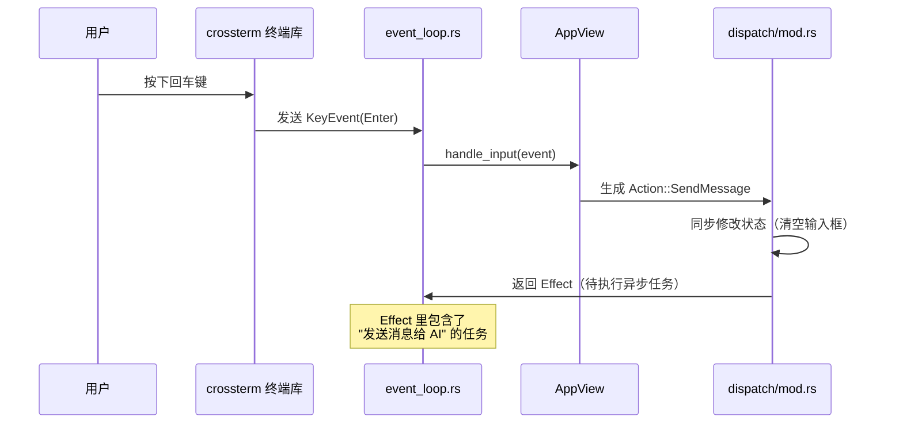
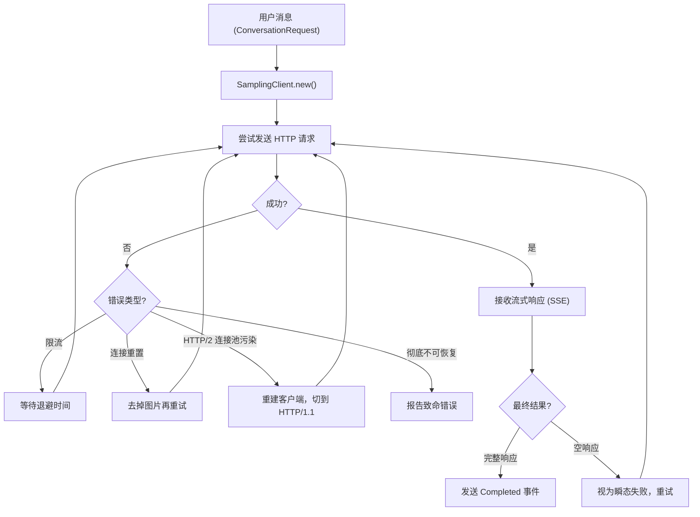
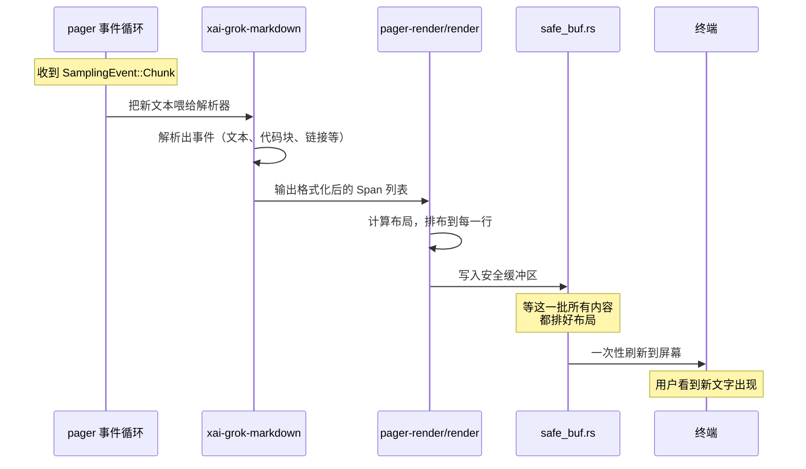
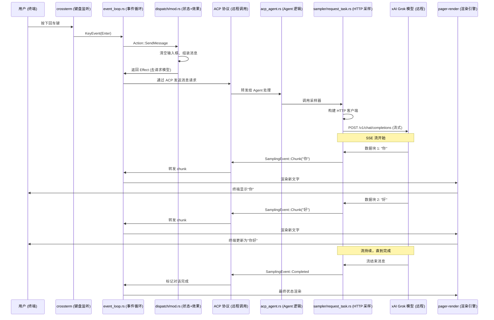

[← 返回首页](index.md)

# 核心流程：从用户输入到 AI 回复

## 按下回车键之后：一条完整的端到端链路

你在终端里敲完问题，按下回车——然后 AI 开始吐字。这中间发生了什么？

简单说，这条链路分成六大步：

1. **TUI 捕捉按键** —— 终端界面抓到你的回车键
2. **事件循环分发** —— 事件循环把按键事件送给对应的处理函数
3. **消息组装与分发** —— 分发器把你的问题包装成真正的请求
4. **采样器请求模型** —— 向 xAI 的 Grok 模型发起 HTTP 流式请求
5. **流式响应处理** —— 边接收 AI 的回复边转发给界面
6. **渲染回屏幕** —— 界面把回复的文字、代码、图片画到终端上

下面我们一步步拆开看，每一步都对应哪些代码文件。

---

## 第一步：TUI 捕捉按键

用户敲键盘这事，由 `crossterm` 这个库感知。它在 `crates/codegen/xai-grok-pager/src/app/event_loop.rs` 里有个专门的输入读取器，持续监听终端事件。

关键代码在 `event_loop.rs` 的 `tokio::select!` 循环里（这不是虚构的逻辑，是真实代码）：

```rust
// event_loop.rs 里的主循环骨架
loop {
    tokio::select! {
        // 监听终端事件（按键、鼠标等）
        Some(event) = input_rx.recv() => {
            // 处理输入事件
            self.handle_terminal_event(event)?;
        }
        // 其他事件源（ACP 通道、定时器、配置热重载等）
        // ...
    }
}
```

当用户敲下回车时，`crossterm` 会把按键解析成一个 `KeyEvent`，其中 `KeyCode::Enter` 就是这个信号。这个事件通过 `mpsc` 通道（多生产者单消费者通道，一种异步消息队列）送给事件循环。

有同学会问：为什么不是直接 `stdin` 读一行？因为终端界面（TUI）需要同时处理很多事——用户打字、鼠标滚动、定时刷新、后台消息——所以必须用 `tokio::select!` 这种多路复用方式，同时监听多个消息源。

---

## 第二步：事件循环分发

事件循环收到回车键后，不会自己处理，而是交给 `dispatch` 模块。

看看 `event_loop.rs` 里“处理终端事件”这块的逻辑是怎么跳到 `dispatch` 的：

```rust
// event_loop.rs (简化版)
fn handle_terminal_event(&mut self, event: Event) -> Result<()> {
    // 把原始事件交给 AppView 处理
    match self.app.handle_input(event)? {
        InputOutcome::Handled(action) => {
            // 如果输入产生了 Action，就交给 dispatcher 执行
            self.dispatch(action);
        }
        // ...
    }
}
```

这里关键的中间层是 `AppView`（在 `crates/codegen/xai-grok-pager/src/app/app_view/` 里），它负责把原始按键事件“翻译”成应用可以理解的 `Action`（动作）。

比如回车键可能被翻译成：
- 如果用户在输入框里打字，回车 = `Action::SendMessage`（发送消息）
- 如果用户在选择列表中，回车 = `Action::SelectItem`（选中某项）

翻译好的 `Action` 送给 `dispatch` 模块（`crates/codegen/xai-grok-pager/src/app/dispatch/mod.rs`）。

```rust
// dispatch/mod.rs 里有这样一段注释，说明它的定位：
//! Synchronous state dispatch: Action → state mutations + Effects.
//!
//! This is the core business logic of the application.
//! - This module never touches the terminal, network, or filesystem.
//! - All mutations are synchronous and deterministic.
//! - Async work is described as Effect values, not executed.
```

**大白话：** `dispatch` 只做两件事：
1. 就地修改应用状态（比如把输入框清空）
2. 返回一个“待办清单”(`Effect`)，描述下一步要异步干什么（比如“去请求 AI 模型”）

真正的网络请求不在 `dispatch` 里做，它只是说“该去干活了”。



---

## 第三步：消息组装与分发

`dispatch` 返回的 `Effect` 告诉事件循环：“现在该往远程 AI 发请求了，但消息还没完全打包好。”

打包消息的活儿，由 `crates/codegen/xai-grok-pager/src/app/dispatch/prompt.rs` 里的 `dispatch_initial_prompt` 函数负责。它会取出用户输入的文本，加上当前会话的上下文历史、系统提示词，拼成一个完整的请求。

```rust
// prompt.rs (exported from dispatch/mod.rs)
pub(crate) use prompt::dispatch_initial_prompt;
```

拼好的请求通过 ACP 协议（Agent Client Protocol，Agent 客户端协议）发出去。这个协议的实现在 `crates/codegen/xai-grok-pager/src/app/acp_handler/` 里。

ACP 协议负责把本地“pager”端（终端界面）和远处的“agent”端（AI 逻辑层）连接起来。简单理解：pager 通过 ACP 告诉 agent “用户说了这句话，请处理”，agent 处理后把回复通过 ACP 传回来。

---

## 第四步：采样器请求模型

消息到了 agent 端（`crates/codegen/xai-grok-shell/src/agent/mvp_agent/acp_agent.rs`），agent 发现用户要 AI 回答，就会调用“采样器”（Sampler）。

采样器的代码在 `crates/codegen/xai-grok-sampler/` 下。它的工作很专一：向 xAI 的 Grok 模型发 HTTP 请求，接收流式回复。

看 `request_task.rs` 里的核心逻辑：

```rust
// request_task.rs – 一个请求的生命周期
pub(crate) async fn run_request_task(
    request_id: RequestId,
    request: ConversationRequest,
    config: SamplerConfig,
    retry_policy: RetryPolicy,
    event_tx: mpsc::UnboundedSender<SamplingEvent>,
    cancel_token: CancellationToken,
    completion_tx: Option<oneshot::Sender<CompletionResult>>,
) -> RequestId {
    // 构建 HTTP 客户端
    let mut client = match SamplingClient::new(config.clone()) {
        Ok(c) => c,
        Err(err) => { /* 如果配置错就直接报错 */ }
    };
    
    // 发送请求，接收流式响应
    loop {
        // 注意这里有重试逻辑：如果请求失败，会自动重试
        // 最多重试 max_retries 次，每次失败后等待 backoff 时长
        
        let outcome = run_one_attempt(&client, request.clone(), ...).await;
        
        match outcome {
            AttemptOutcome::Completed { response, metrics } => {
                // 成功了！发送 Completed 事件
                let _ = event_tx.send(SamplingEvent::Completed {
                    request_id: request_id.clone(),
                    response: response.clone(),
                    metrics: metrics.clone(),
                });
                return request_id;
            }
            AttemptOutcome::Failed { error } => {
                // 失败的话，根据错误类型决定是否重试
                // ...
            }
        }
    }
}
```

**重试策略**非常丰富：
- HTTP 连接超时 → 等 100ms 后重试，最多 3 次
- 服务器返回 429（限流）→ 按指数退避等待，最大重试次数可配置
- 图片太大被拒绝 → 自动去掉图片再重试
- 检测到“死循环”（模型不断重复同一句话）→ 换一个采样参数再试

这份稳健设计来自 `retry.rs` 里的 `RetryDecision` 枚举：

```rust
// retry.rs 里的重试决策
enum RetryDecision {
    Retry { backoff: Duration },                // 等一会儿重试
    RetryWithImageStrip,                        // 去掉图片后重试
    RetryWithClientRebuild { backoff: Duration },// 重建 HTTP 客户端后重试
    EmitToSession(SamplingError),               // 通知会话层处理
    Fatal(SamplingError),                       // 彻底放弃
}
```



---

## 第五步：流式响应处理

模型返回的不是一个巨大的 JSON，而是一串连续的 SSE (Server-Sent Events，服务器推送事件) 流——每个事件代表一个“块”（chunk），可能是：
- 一个字的文字（`"你"`）
- 一个代码片段的开始标记
- 一个工具调用的指令

这些流式事件在 `crates/codegen/xai-grok-sampler/src/stream/` 模块里被解析：

```rust
// stream/chat_completions.rs 处理 OpenAI 兼容的流
pub async fn stream_chat_completions(
    client: &SamplingClient,
    request: ConversationRequest,
) -> Result<(BoxStream<'static, Result<ChatCompletionChunk>>, SerializableResponseMetadata), ...> {
    // 发出 HTTP 请求，返回一个可迭代的流
}
```

每个 chunk 被包装成 `SamplingEvent`，通过 `mpsc` 通道发回给 pager 端：

```rust
// events.rs 里定义的事件类型
pub enum SamplingEvent {
    Chunk {
        request_id: RequestId,
        chunk: ConversationResponseChunk,
    },
    Completed {
        request_id: RequestId,
        response: ConversationResponse,
        metrics: InferenceLatencyStats,
    },
    Failed {
        request_id: RequestId,
        error: SamplingErrorInfo,
    },
    Retrying {
        request_id: RequestId,
        attempt: u32,
        max_retries: u32,
        error: SamplingErrorInfo,
    },
    // ...
}
```

pager 端的事件循环收到 `SamplingEvent::Chunk` 后，会立刻把新到的文字片段交给渲染层，而不是等整个回复都到齐了再渲染。这就是“流式输出”的效果——你看到 AI 一个字一个字地“打”出来。

---

## 第六步：渲染回屏幕

新到的文字怎么变成终端里的画面？这由 `crates/codegen/xai-grok-pager-render/` 区域负责。

渲染的核心工作流程：

1. **内容解析** —— 原始的流式文本经过 `xai-grok-markdown` 库解析，从 Markdown 文本变成“带格式的事件流”。比如一段代码块会被标记为 `<code>` 区域，一个链接会被标记为可点击。

2. **布局计算** —— `render/` 模块根据当前终端宽度，把内容排成一行行的“Span”（带颜色的文本片段）。代码高亮由 `syntect` 库负责，它会根据语言语法给代码上色。

3. **双缓冲渲染** —— 所有内容先写入一个“安全缓冲区”（`safe_buf.rs`），然后一次性刷新到终端。这样就不会出现“先画一半、再画另一半”的闪烁。

4. **主题适配** —— 颜色来自 `theme/` 模块，支持暗色/亮色模式自动切换。



关键文件位置：
- 解析入口：`crates/codegen/xai-grok-pager-render/src/render/mod.rs`
- 安全缓冲区：`crates/codegen/xai-grok-pager-render/src/render/safe_buf.rs`
- 终端输出封装：`crates/codegen/xai-grok-pager-render/src/terminal/mod.rs`
- Markdown 解析：`crates/codegen/xai-grok-markdown/src/render.rs`

---

## 完整链路全景

整条链路串起来就是这样：



**快速回顾关键文件路径：**

| 步骤 | 关键文件 |
|------|----------|
| 按键捕捉 | `crates/codegen/xai-grok-pager/src/app/event_loop.rs` |
| 消息分发 | `crates/codegen/xai-grok-pager/src/app/dispatch/mod.rs` |
| 消息组装 | `crates/codegen/xai-grok-pager/src/app/dispatch/prompt.rs` |
| 远程协议 | ACP (内含 `acp_handler/` 模块) |
| Agent 逻辑 | `crates/codegen/xai-grok-shell/src/agent/mvp_agent/acp_agent.rs` |
| HTTP 采样 | `crates/codegen/xai-grok-sampler/src/actor/request_task.rs` |
| 流式解析 | `crates/codegen/xai-grok-sampler/src/stream/chat_completions.rs` |
| Markdown 渲染 | `crates/codegen/xai-grok-markdown/src/render.rs` |
| 终端绘制 | `crates/codegen/xai-grok-pager-render/src/render/mod.rs` |

关于 Agent 启动、会话管理、多 Agent 协同等更复杂的概念，详见《Agent 生命周期与多 Agent 协同》页面。关于重试策略和错误处理的详细设计，详见《工具执行引擎》页面的错误处理部分。
