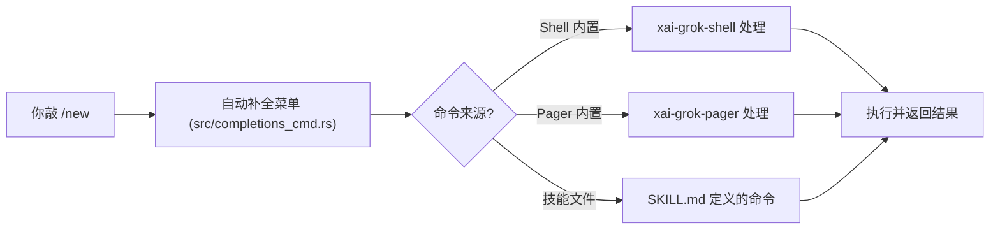

[← 返回首页](index.md)

# 用户命令与功能参考

Grok Build 的所有功能都可以通过**斜杠命令**、**快捷键**和 **CLI 参数**来调用。这一页把它们按主题分组整理成速查表，每条命令配一句大白话，告诉你什么时候用。

## 斜杠命令总览

在输入框里敲 `/` 就会弹出自动补全菜单，模糊搜索直接帮你找到想用的命令。命令分两种来源：

- **Shell 内置命令**——由后台 agent 引擎 `xai-grok-shell` 处理
- **Pager 内置命令**——由前端 TUI 界面 `xai-grok-pager` 处理

这两种都会出现在自动补全菜单里。你安装的 `SKILL.md` 技能（详见《钩子、MCP 协议与沙箱》）也会以斜杠命令形式出现。

斜杠流程概览：



### 会话管理（Session Management）

| 命令 | 作用 | 一句话说明 |
|------|------|------------|
| `/new` | 开始一个新对话，清空当前会话 | 相当于"翻篇重来"。别名：`/clear`。定义在 `src/app/cli.rs` |
| `/resume` | 打开会话选择器，加载之前保存的对话 | 接着上次没干完的活继续干 |
| `/compact [context]` | 压缩对话历史，省出上下文窗口空间 | 当对话太长时，把聊天记录压缩一下，腾出位置给新内容。可选参数指定保留什么 |
| `/context` | 显示上下文窗口使用情况和会话统计 | 看一眼"脑子还有多少空间"，分系统提示词、消息、推理开销等类别 |
| `/session-info` | 显示当前会话的详细信息（模型、轮次、上下文用量） | 查一下"这轮对话用了哪个模型、说了几句话" |
| `/fork` | 从当前位置分裂出一个新会话，保留历史 | 像"git branch"，从当前对话这里分叉出一个新分支，各自继续聊 |
| `/rewind` | 回退到之前的某轮对话，丢弃后面的内容 | 回到之前某个节点，从头来过 |
| `/copy [N]` | 把最近一条回复复制到剪贴板，加数字表示复制第 N 条 | 把 AI 说的那句话存到剪贴板，方便粘到别处 |
| `/export` | 把当前对话导出到文件或剪贴板 | 把整篇聊天记录存下来 |
| `/quit` | 退出应用 | 不干了。别名：`/exit` |
| `/home` | 退出当前会话，回到欢迎页面 | 回到起点。别名：`/welcome` |
| `/rename <title>` | 重命名当前会话 | 给这个对话取个容易找的名字。别名：`/title` |

### 模型与模式（Model and Mode）

| 命令 | 作用 | 一句话说明 |
|------|------|------------|
| `/model <name>` | 切换使用的 AI 模型 | 换一个大脑。支持模型 ID 或显示名（不区分大小写），也支持推理模型加 effort 等级。别名：`/m` |
| `/effort <level>` | 设置当前模型的推理努力等级 | 让模型多动点脑子或少动点。可选值：`low`、`medium`、`high`、`xhigh` |
| `/always-approve` | 开关：跳过所有权限确认提示 | 完全信任 AI，让它放手干。再输一次关掉 |
| `/auto` | 开关：让分类器自动批准安全操作 | AI 自己判断"这事安全不安全"，危险操作可能还会问你。和 `/always-approve` 互斥 |
| `/multiline` | 切换多行输入模式 | 想换行写长文本时用。别名：`/ml` |
| `/history` | 打开提示词历史搜索（模糊搜索本会话的输入） | 找找自己之前说过什么。空输入时按 `↑` 直接调出上一条 |
| `/compact-mode` | 切换紧凑显示模式（减少间距，更密） | 屏幕上塞更多内容，少点空白 |
| `/vim-mode` | 切换 Vim 风格的滚屏键绑定 | 习惯 Vim 操作的人用的。设置会存到 `config.toml` 的 `[ui].vim_mode` |
| `/minimal` | 切换到实验性的精简渲染模式 | 一个更简约的显示方案。和 `/fullscreen` 互切 |
| `/fullscreen` | 切换回全屏 TUI 模式 | 标准的全屏界面。别名：`/full` |
| `/plan [description]` | 进入计划模式 | 让 AI 先做个方案再动手 |
| `/view-plan` | 查看已保存的计划预览 | 看看 AI 做的方案长什么样。别名：`/show-plan`、`/plan-view` |

### 记忆系统（Memory）

这组命令需要 `--experimental-memory` 参数或设置 `GROK_MEMORY=1` 环境变量才能用（`/remember` 除外，它永远可用）。详见《通用基础设施》。

| 命令 | 作用 | 一句话说明 |
|------|------|------------|
| `/memory` | 浏览、查看和管理已保存的记忆 | 看看 AI 记住了什么，可以开或关。别名：`/mem` |
| `/flush` | 立刻把当前会话的重要知识存入记忆 | 赶在对话被压缩之前，把重要的内容存进去 |
| `/dream` | 运行记忆整理，把会话日志合并成有组织的主题 | 让 AI 自己整理记忆，像做梦一样把零散对话归类 |
| `/remember <note>` | 立刻保存一条笔记到记忆，不等自动摘要 | 想记的东西直接记下来，比如"这个项目的部署用 eu-west 集群" |

### 扩展与插件（Hooks and Plugins）

下面四个命令其实打开的是同一个"扩展管理"弹窗，只是切换到不同标签页。详见《钩子、MCP 协议与沙箱》。

| 命令 | 作用 | 一句话说明 |
|------|------|------------|
| `/hooks` | 打开扩展管理弹窗（挂钩子标签页） | 管理各种代码钩子——加、删、开关 |
| `/plugins` | 打开扩展管理弹窗（插件标签页） | 管理插件——装新插件、开关、设置信任 |
| `/marketplace` | 打开扩展管理弹窗（市场标签页） | 浏览和安装插件市场里的插件 |
| `/skills` | 打开扩展管理弹窗（技能标签页） | 查看已安装的技能 |

### 媒体生成（Media Generation）

| 命令 | 作用 | 一句话说明 |
|------|------|------------|
| `/imagine <description>` | 根据文字描述生成图片 | 画张图：/imagine 夕阳下的海面 |
| `/imagine-video <description>` | 根据文字或图片描述生成视频 | 做个动画：/imagine-video 钢琴猫 |

### 定时任务（Scheduling）

| 命令 | 作用 | 一句话说明 |
|------|------|------------|
| `/loop [interval] <prompt>` | 按固定时间间隔重复执行某条指令 | 设置一个自动任务，比如每 30 分钟检查一次部署状态 |

时间间隔格式：`30m`（30分钟）, `1 hour`（1小时）, `every 2 days`（每2天）。最小60秒，任务7天后自动过期。

### 其它命令（Other）

| 命令 | 作用 | 一句话说明 |
|------|------|------------|
| `/goal <objective>` | 设置和管理自主目标 | 给 AI 定个目标，它会跨轮次持续工作直到完成 |
| `/theme` | 切换 TUI 颜色主题 | 换个皮肤。别名：`/t` |
| `/feedback [message]` | 报告问题或发送反馈 | 说"这不对劲"或提建议 |
| `/btw <message>` | 给 AI 发送一条旁白，不打断当前任务 | 相当于"对了，顺带提一下"，不会中断正干的事 |
| `/mcps` | 打开 MCP 服务器管理弹窗 | 管理 MCP（模型上下文协议）服务器 |
| `/terminal-setup` | 显示终端检测信息和设置指南 | 看看你的终端支不支持真彩色、剪贴板等，还有修复建议。别名：`/terminal-check`、`/terminal-info` |
| `/release-notes` | 查看当前版本的发布说明 | 看看这次更新了什么。别名：`/changelog` |
| `/docs` | 在终端里浏览使用指南，或打开在线文档 | 查帮助文档。`/docs web` 打开在线版，`/docs <标题>` 打开指定指南。别名：`/howto`、`/guides` |
| `/import-claude` | 从 Claude 导入设置（权限、环境变量、MCP 服务器等） | 如果你之前用 Claude，一键把配置搬过来 |

### 智能体与角色（Agents and Personas）

| 命令 | 作用 | 一句话说明 |
|------|------|------------|
| `/config-agents` | 管理智能体定义（查看、设置默认、切换） | 设置用哪个 AI 助手干活。别名：`/agents` |
| `/personas` | 管理角色（创建、编辑、删除） | 让子智能体扮演某个角色，比如"专家模式" |

### 账户与计费（Account and Billing）

| 命令 | 作用 | 一句话说明 |
|------|------|------------|
| `/login` | 登录或重新认证 | 登个账号 |
| `/logout` | 登出并回到登录界面 | 退出账号 |
| `/usage` | 查看信用使用情况或管理计费 | 看看花了多少钱 |
| `/privacy` | 查看或切换隐私和数据保留状态 | 管理隐私设置 |

### 配置与界面（Configuration and UI）

| 命令 | 作用 | 一句话说明 |
|------|------|------------|
| `/settings` | 打开设置弹窗，交互式修改配置 | 改各种设置。别名：`/config`、`/preferences`、`/prefs` |
| `/timestamps` | 开关消息时间戳显示 | 每条消息要不要显示时间 |

### 记忆管理的 CLI 子命令

除了斜杠命令，`grok memory` 和 `grok mcp` 还有独立的 CLI 子命令。定义分别在 `src/memory_cmd.rs` 和 `src/mcp_cmd.rs`：

**`grok memory clear`** —— 清除记忆文件

```
grok memory clear              # 清除工作区记忆
grok memory clear --global     # 清除全局 MEMORY.md
grok memory clear --all        # 全清
grok memory clear -y           # 跳过确认
```

**`grok mcp`** —— 管理 MCP 服务器

```
grok mcp list                          # 列出已配置的 MCP 服务器
grok mcp add <name> -- <command>       # 通过命令启动的本地 MCP 服务器
grok mcp add --transport http <name> <url>  # HTTP 远程 MCP 服务器
grok mcp add -e KEY=value <name> -- <command>  # 带环境变量的本地 MCP 服务器
grok mcp remove <name>                 # 删除一个 MCP 服务器
grok mcp doctor                        # 诊断 MCP 配置和连接
```

这些子命令的详细用法在 `src/mcp_cmd.rs` 里，每个都有完整的 `--help` 文档，`--json` 参数可以输出机器可读格式。

### 插件管理 CLI 子命令

插件管理有一套完整的 CLI 命令，定义在 `src/plugin_cmd.rs`：

```
grok plugin list                          # 列出已安装插件
grok plugin list --json                   # 机器可读格式输出
grok plugin list --json --available       # 同时显示市场可用插件
grok plugin install user/repo --trust     # 从 GitHub 安装插件
grok plugin install ./local-plugin        # 从本地目录安装
grok plugin uninstall <name> --confirm    # 卸载插件
grok plugin update                        # 更新所有插件
grok plugin enable <name>                 # 启用插件
grok plugin disable <name>                # 禁用插件
grok plugin details <name>                # 查看插件组件清单
grok plugin validate <path>               # 验证插件清单
grok plugin tag --push <path>             # 从清单版本创建 git 标签并推送
grok plugin marketplace list              # 列出市场源
grok plugin marketplace add <url>         # 添加市场源
grok plugin marketplace remove <url>      # 删除市场源
```

## 快捷键

在 TUI pager 中（`xai-grok-pager`），以下快捷键随时可用：

| 快捷键 | 作用 |
|--------|------|
| `Tab` / `Shift+Tab` | 在自动补全菜单中切换选项 |
| `Enter` | 选择自动补全项 / 发送消息（单行模式）|
| `Shift+Enter` / `Alt+Enter` | 多行模式下发送消息 |
| `↑` / `↓`（空输入时） | 打开提示词历史快速检索 |
| `Esc` | 关闭弹窗 / 取消操作 |
| `Ctrl+O` | 快速切换权限模式 |

更多快捷键定义在 `src/app/cli.rs` 和 `src/views/` 目录下的各个视图组件中。

## CLI 参数

`grok` 命令本身也支持一些参数：

| 参数 | 作用 |
|------|------|
| `--minimal` | 以精简模式启动（本次会话有效）|
| `--fullscreen` | 以全屏模式启动（本次会话有效）|
| `--experimental-memory` | 启用实验性记忆功能 |
| `grok completions <shell>` | 生成指定 shell 的自动补全脚本 |

补全脚本生成逻辑在 `src/completions_cmd.rs`，会对 zsh 进行一次特殊的修复（因为 clap 对可选位置参数的生成有 bug）。

## 技能作为斜杠命令

如果你安装了有 `user-invocable: true` 标记的技能（通过 SKILL.md 文件），它会自动成为斜杠命令。比如装了 `commit` 技能：

```
/commit fix typo in README
```

如果多个技能同名，可以用限定形式：

```
/local:commit      # 项目范围技能
/user:commit       # 用户范围技能
```

内置命令优先级高于技能。如果你把技能命名为 `compact`，敲 `/compact` 走的是内置命令，`/local:compact` 才走技能。
