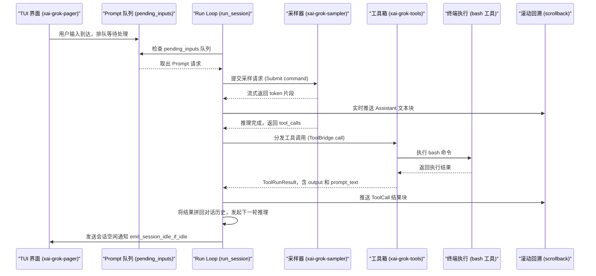
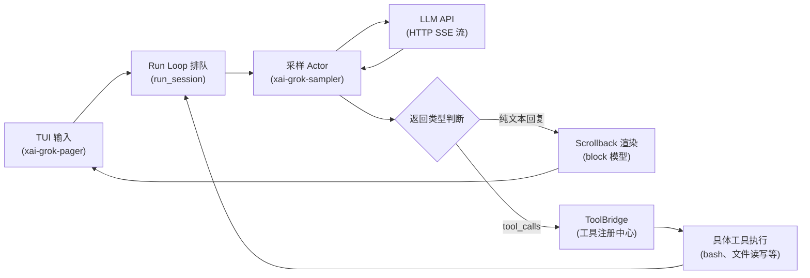

[← 返回首页](index.md)

# 一次完整对话的旅程

你在终端里敲了行命令，回车，然后等了几秒，屏幕上就冒出 AI 的回复。看上去很简单，对吧？但这段文字从你指尖出发，到最终渲染成带颜色、可滚动、能复制的终端方块，中间其实绕了一大圈。

咱们沿着数据流，从头到尾走一遍。

## 两步走：排队入队，然后启动

整个流程分两大段：**先排队**，**再执行**。哪怕你连敲三行问题，系统也不会乱——它用队列把它们串起来，一个一个处理。



### 排队：你敲的字先入队

你在 TUI 里敲完回车，`xai-grok-pager` 不会直接把它塞给 AI。它把这段文本包装成一个 `SessionCommand::Prompt` 消息，发到 `SessionActor` 的信箱里。

`run_session()` 是这个演员的主循环，定义在 `crates/codegen/xai-grok-shell/src/session/acp_session_impl/run_loop.rs`。它在一个 `tokio::select!` 里同时等着好几件事：新命令、定时器、模型切换通知、后台任务完成。收到 `Prompt` 命令后，它调用 `session.queue_input(...)`，把这轮对话放进 `state.pending_inputs` 这个双端队列里。

```rust
// 来自 run_loop.rs — Prompt 命令处理
SessionCommand::Prompt { prompt_id, prompt_blocks, prompt_mode, ... } => {
    session.ensure_prefix_ready().await;
    // ... 一堆参数准备 ...
    let cancel_for_send_now = session.queue_input(
        prompt_blocks, prompt_id, prompt_mode, ...
    ).await;
    if cancel_for_send_now {
        session.cancel_turn_for_send_now(&mut replay_buffer).await;
    }
    // 启动任务（如果当前没有正在跑的）
    SessionActor::maybe_start_running_task(session.clone(), completion_tx.clone()).await;
}
```

`maybe_start_running_task` 会检查队列里有没有待处理的输入、当前是不是空闲状态。如果条件满足，就正式开启一轮对话。

### 启动：从队列头取一个出来跑

一轮对话（turn）的"真正干活"是由 `completion_tx` 这个通道驱动的。`run_session` 在初始化时创建了这个通道：

```rust
let (completion_tx, mut completion_rx) =
    mpsc::unbounded_channel::<(String, PromptTurnResult)>();
```

当一轮推理完成、结果通过 `completion_rx` 到达时，主循环做三件事：处理本轮结果、清掉已完成的监控通知、再检查队列里还有没有下一轮等着跑。

## 第一轮：把问题发给 LLM

现在队列头取出了一个 Prompt，系统要真去调用 AI 了。这个活儿交给 `xai-grok-sampler`。

### Actor 模型：一个请求一个演员

采样器用 Actor 模型（一种并发模式：每个 Actor 有自己的状态，通过消息跟外界通信，内部串行处理，天然不用加锁）。`SamplerActor` 在 `crates/codegen/xai-grok-sampler/src/actor/mod.rs` 里定义，通过 `mpsc` 通道接收命令。

```rust
// 来自 sampler actor/mod.rs — 接收 Submit 命令
SamplerCommand::Submit {
    request_id, request, config, completion_tx,
} => {
    let cancel_token = CancellationToken::new();
    let active = ActiveRequest { cancel_token: cancel_token.clone() };
    self.state.register(request_id.clone(), active);
    // 每个请求 spawn 一个独立 task，互不阻塞
    self.tasks.spawn(request_task::run_request_task(
        request_id, *request, effective_config,
        retry_policy, event_tx, cancel_token, completion_tx,
    ));
}
```

注意 `self.tasks.spawn(...)`——每个采样请求都有自己的 `tokio::task`，不会因为某个请求在等 HTTP 响应就堵住其他请求。多个请求可以同时飞。

`request_task` 发 HTTP 流式请求到 xAI 的 API，然后解析 SSE（Server-Sent Events，服务端推送事件）流。返回的 token 一个接一个地通过 `completion_tx` 通道传回 `SessionActor`。

### 实时渲染：字还没打完就开始画

那边还在等 API 返回，这边 TUI 没闲着。收到的每个 token 片段都进入 scrollback（滚动回溯）系统——`crates/codegen/xai-grok-pager/src/scrollback/mod.rs` 定义了整个块的模型。

streaming 模式下，Assistant 的回复是一个 `AgentMessageBlock`。每来几个新 token，这个块就被更新，TUI 重新计算它的高度和位置，然后画到屏幕上。你看到文字一个字一个字往外蹦，就是这么来的。

## LLM 返回了：要么说话，要么动手

API 终于返回了一个完整响应。但 AI 不一定会直接给你文字——它可能返回 `tool_calls`，意思是"我要用工具"。

### 情况 1：只是文字回复

如果 response 的 `finish_reason` 是 `stop`，说明 AI 把话说完了。`run_session` 收到 `completion_rx` 里的结果后，调 `session.handle_completion(prompt_id, result)`，然后 `session.handle_turn_end(turn_succeeded)`。

`handle_turn_end` 会触发一系列收尾工作：
- 更新 turn 计数器
- 检查是否需要触发对话压缩（[详见《对话压缩：给 LLM 的上下文瘦身》](17-compaction.md)）
- 调用 `emit_session_idle_if_idle()` 通知 TUI"这轮完了，你可以把光标还回来了"

### 情况 2：AI 要调用工具

如果 `finish_reason` 是 `tool_calls`，那就热闹了。LLM 不只是"动嘴"，它要"动手"了。返回的 `tool_calls` 列表里每一项都是一个函数名加参数。

工具调用的分发是通过 `ToolBridge`——`crates/codegen/xai-grok-tools/src/bridge.rs` 里定义的统一入口。

```rust
// 来自 tools bridge.rs — 工具调用入口
pub async fn call(
    &self,
    client_function_name: &str,
    client_params: serde_json::Value,
    tool_call_id: &str,
) -> Result<ToolRunResult, xai_tool_runtime::ToolError> {
    self.registry
        .call(client_function_name, client_params, tool_call_id, None)
        .await
}
```

`ToolBridge` 自己不干活，它是个接线员——把调用转给内部的 `FinalizedToolset`（本质是一个工具注册中心，[详见《工具箱：AI 的手和眼睛》](19-tool-system.md)），由真正注册在里面的工具去执行。

### 举个栗子：AI 要跑 bash 命令

假设 AI 返回了 `tool_name: "run_terminal_cmd"`，参数是 `{"command": "ls -la"}`。

1. `ToolBridge.call("run_terminal_cmd", ...)` 被调用
2. 内部找到注册的终端工具，它的 `run()` 方法被触发
3. 终端工具把你的命令写入 PTY（伪终端，一个模拟真实终端的虚拟设备），然后捕获输出
4. 命令执行结果包装成 `ToolRunResult`，包含两块：
   - `output`：干净的 JSON 输出，用来做 ACP 通知和 hunk 追踪
   - `prompt_text`：加上系统提醒文字后的版本，准备塞回给 LLM

关于终端执行的安全检查和权限控制，[详见《终端执行与权限控制》](20-terminal-tools.md)。

### 结果喂回 LLM，可能再来一轮

工具执行完了，`ToolRunResult.prompt_text` 被拼进对话历史，作为新一轮的 `tool` 角色消息。然后 `maybe_start_running_task` 再次被调用——如果队列里还有东西、或者这一轮还没完（还有 tool_calls 需要处理），Cycle 就继续。

这就是 Agent 的 Run Loop 核心：**"问 LLM → LLM 要工具 → 执行工具 → 结果塞回去 → 再问 LLM"**，一直循环到 LLM 不再要工具为止。关于 Run Loop 的完整内部机制，[详见《Agent 调度核心》](15-agent-runtime.md)。

## 屏幕上怎么就出现了带颜色、能滚动的文字？

不管 AI 是直接回复文字，还是先跑了一堆工具再回复，最终它总要给用户看点什么。这些内容不是直接 `println!` 出来的——它们要走一遍 TUI 的渲染流水线。

### 块模型：对话的最小显示单元

scrollback 系统把对话拆成一个个"块"（block）。从 `crates/codegen/xai-grok-pager/src/scrollback/mod.rs` 的模块导出可以看到这些块类型：

```rust
pub use blocks::{
    AgentMessageBlock,   // AI 的文字回复——蓝色气泡
    SystemMessageBlock,  // 系统提示——灰色提示条
    ThinkingBlock,       // AI 的思考过程（CoT）——可折叠区域
    ToolCallBlock,       // 工具调用的入参和出参——代码块加状态图标
    UserPromptBlock,     // 你输入的问题——绿色气泡
};
```

每个块都有自己的渲染逻辑。比如 `ToolCallBlock` 会渲染成带边框的卡片，里面有工具名称、参数、执行结果；`ThinkingBlock` 默认折叠，你按回车才展开。

### 从 Markdown 到终端色块

AI 返回的是 Markdown 文本。要画到终端上，得经过好几道加工：

1. **解析**：Markdown 被拆成标题、代码块、列表、粗体等 token
2. **换行计算**：按当前终端宽度算每个段落该折行到第几列
3. **语法高亮**：代码块丢给 `edit_highlight_worker` 子进程上色
4. **布局计算**：`layout.rs` 和 `state.rs` 算出每个块在虚拟画布上的位置和高度
5. **视口裁剪**：只画当前滚动位置能看到的那部分
6. **ANSI 转义序列输出**：最终变成一串 `\x1b[32m` 这样的终端控制码

渲染流水线的完整细节，[详见《终端渲染流水线》](09-tui-rendering.md)。块类型的详细设计和每种块的渲染规则，[详见《滚动回溯引擎》](10-scrollback-system.md)。

## 这轮结束，等下一轮

一轮对话跑完了。`run_session` 主循环回到 `tokio::select!` 的起点，继续等着下一次 `cmd_rx.recv()`、下一个 `chat_state_event_rx.recv()`、或者下一个定时器触发。

如果你连敲了两个问题，第一个问题还在跑的时候，第二个已经乖乖躺在 `pending_inputs` 队列里了。第一个完结后，`maybe_start_running_task` 检查队列非空，自动取出第二个，开启新的一轮。

如果这时候没有新输入，会话也不会闲着什么也不干——后台可能有记忆刷新（`idle_flush_sleep`）、Dream 检查（`dream_check_sleep`）在悄悄运行。关于记忆系统怎么在后台整理你的对话历史，[详见《记忆系统：AI 的长期小本本》](31-memory-system.md)。

## 一次完整旅程的总结

从 TUI 输入到屏幕显示，数据经过了这些关键站点：



* **TUI 输入**：`xai-grok-pager` 捕获键盘事件，组装成 `SessionCommand::Prompt`
* **Run Loop**：`run_session()` 里 `tokio::select!` 等着命令、完成、定时器三类事件
* **采样**：`SamplerActor` 为每个请求 spawn 独立 task，HTTP 流式请求 xAI API，SSE 解析逐个 token
* **工具分发**：`ToolBridge.call()` 统一入口，`FinalizedToolset` 负责路由到真正干活的工具实现
* **滚动回溯渲染**：Markdown → 折行计算 → 语法高亮 → 块布局 → ANSI 转义序列 → 屏幕

整个过程中，每个模块只关心自己的事：采样器不知道 TUI 长什么样，TUI 不知道 HTTP 请求怎么发，工具不知道这轮对话的前因后果。它们通过 mpsc 通道和 Arc 共享状态松耦合地协作，就像流水线上的工人——前一个把零件放传送带上，后一个拿起来接着加工，谁也不需要知道整个工厂的全貌。
