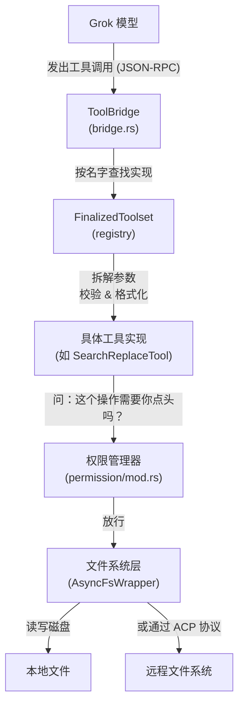
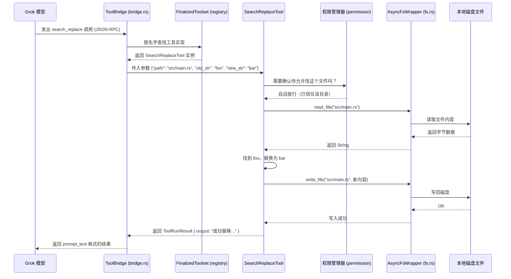
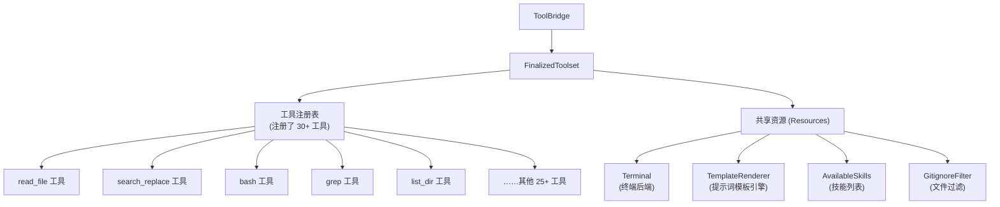

[← 返回首页](index.md)

# 工具执行引擎（模型如何操作文件系统）

## 一句话说清楚

当你在终端里对 Grok 说"把这个文件第 15 行的 `foo` 改成 `bar`"时，模型并不会直接拿螺丝刀拧硬盘——它会发出一个**工具调用**（比如 `search_replace`），然后经过一套流水线：查注册表 → 拆参数 → 要许可（如果需要）→ 实际读写文件 → 把结果返回给模型。整个过程就像你在公司里要走一个工单系统：填单 → 审批 → 执行 → 归档。

## 整个流程长什么样

从模型嘴里说出"改文件"到文件真的被改好，中间经过 6 个环节：



## 拆开来看每一步

### 第一步：模型发出调用 —— `ToolBridge`

所有工具调用的入口在 `crates/codegen/xai-grok-tools/src/bridge.rs`。`ToolBridge` 相当于一个调度台，它持有一个 `FinalizedToolset`（就是一个装满了工具的盒子），当模型说"我要用 `search_replace`"时，它调用：

```rust
// bridge.rs 第 124 行附近
pub async fn call(
    &self,
    client_function_name: &str,     // 比如 "search_replace"
    client_params: serde_json::Value, // 比如 {"path": "src/main.rs", ...}
    tool_call_id: &str,
) -> Result<ToolRunResult, xai_tool_runtime::ToolError> {
    self.registry
        .call(client_function_name, client_params, tool_call_id, None)
        .await
}
```

这里 `client_function_name` 是模型认识的名字（比如 `search_replace`），`client_params` 是传进来的参数（一个 JSON 对象），`tool_call_id` 是这次调用的唯一 ID（用来串起后续的进度通知和结果）。

### 第二步：路由查找 —— `FinalizedToolset`

`FinalizedToolset` 就像一个**目录册**，它记录着每个工具名字对应的具体实现。每个工具在注册时都会告诉注册表自己的名字、接收什么参数、返回什么结果。

注册的入口在 `crates/codegen/xai-grok-tools/src/implementations/grok_build/mod.rs`：

```rust
// 第 17-20 行附近
/// The [`register_all()`] function is the single entry-point for wiring up
/// the standard toolset. It inserts shared resources (`Terminal`,
/// `AvailableSkills`, `BashParams`) and registers every built-in tool.
```

真正去查路由的逻辑在 `crates/common/xai-tool-runtime/src/dispatch.rs`。这里定义了一个 `ToolDispatch` trait（说白了就是：任何能处理工具调用的模块都得遵循这个接口）：

```rust
// dispatch.rs 第 55 行附近
#[async_trait]
pub trait ToolDispatch: Send + Sync {
    /// Streaming dispatch. The returned stream MUST end with exactly one
    /// `Terminal` item per the [`ToolStream`] invariant.
    async fn call(
        &self,
        tool_id: ToolId,
        args: Value,
        ctx: ToolCallContext,
    ) -> ToolStream<TypedToolOutput>;
}
```

注意 `ToolId`——这个类型在 `crates/common/xai-tool-protocol/src/lib.rs` 里定义，它是工具的唯一标识，不仅仅是字符串名字，还包括命名空间等元信息。

### 第三步：拆参数 + 执行 —— 具体工具（以 `SearchReplaceTool` 为例）

路由到了具体的工具后，工具把自己的 JSON 参数解析成 Rust 结构体，然后开始干活。拿最常用的 `search_replace` 来说，它会：

1. 把模型传的 `old_str` 和 `new_str` 拿出来
2. 在指定的文件里找精确匹配
3. 如果找到了唯一一处，直接替换
4. 如果找到多处或没找到，报错让模型重新精确描述

所有文件操作工具都在 `crates/codegen/xai-grok-tools/src/implementations/grok_build/` 下，每个工具一个文件夹：

- `read_file` —— 读文件内容
- `search_replace` —— 搜索替换
- `bash` —— 跑 shell 命令
- `grep` —— 搜索文件内容
- `list_dir` —— 列出目录

### 第四步：权限审批 —— `permission` 模块

这一步是关键。不是所有文件操作都能直接执行——Grok Build 会先问"这个操作你允许吗？"。

代码在 `crates/codegen/xai-grok-workspace/src/permission/mod.rs`。它有一套**策略引擎**，会判断：

- 这个文件在工作区内还是工作区外？
- 这个命令是安全的（比如 `ls`）还是危险的（比如 `rm -rf`）？
- 用户之前有没有说过"以后这个文件夹里的操作不用问我了"？

```rust
// permission/mod.rs 第 23 行附近
pub use manager::{
    PermissionHandle, default_always_allow_scope, spawn_permission_manager,
    spawn_permission_manager_with_hub,
};
pub use policy::CompiledPolicy;
pub use prompter::{
    ALLOW_EDITS_SESSION_OPTION_ID, AcpPrompter, BashCommandPermission, BashCommandSelectedTerms,
    ...
};
```

`CompiledPolicy` 就是那个"规则书"——它告诉系统：这个文件能碰吗？这个目录能写吗？

如果操作需要用户批准，Grok Build 会在终端里弹个窗（或者发个 ACP 通知）问你的意思。你可以选择"这次允许"、"永远允许在这个目录下"、"拒绝这次"。

### 第五步：真正的文件 I/O —— `AsyncFileSystem`

审批通过后，工具调用文件系统层。这一层在 `crates/codegen/xai-grok-workspace/src/file_system/fs.rs`。

这里定义了一个 `AsyncFileSystem` trait（所有文件系统实现都得遵守的接口）：

```rust
// fs.rs 第 18 行附近
#[async_trait::async_trait]
pub trait AsyncFileSystem: Send + Sync {
    fn root(&self) -> &Path;
    async fn exists(&self, path: &Path) -> Result<bool, FsError>;
    async fn read_file(&self, path: &Path) -> Result<Vec<u8>, FsError>;
    async fn write_file(&self, path: &Path, data: &[u8]) -> Result<(), FsError>;
    async fn delete_file(&self, path: &Path) -> Result<(), FsError>;
}
```

然后有一个 `AsyncFsWrapper` 包装了一下，让调用方不用操心路径转换——你可以传相对路径，它自动拼上工作区根目录转成绝对路径：

```rust
// fs.rs 第 76 行附近
pub async fn read_to_string<P: ToAbsPath>(&self, path: P) -> Result<String, FsError> {
    let bytes = self.inner.read_file(&path.to_abs_path(self.root())).await?;
    bytes_to_string(bytes)
}
```

这里有个巧妙点：`AsyncFileSystem` 的实现可以有两种：
- **本地模式**：直接读写磁盘文件
- **远程模式**：通过 ACP 协议读写远程机器上的文件

Grok Build 启动时会根据配置决定用哪种。对用户来说完全无感——同一套 `read_file` API，底层实现可以完全不同。

### 第六步：结果返回

文件操作完，结果顺着来路返回去：工具实现把输出格式化成 `ToolRunResult` → `ToolBridge` 包装成 `ToolBridgeResult` → 最终变成模型能看懂的一段文本（比如"成功替换了第 15 行的 `foo` 为 `bar`"）。

## 一次完整的文件修改全过程（时序图）



## 整个工具注册表的组织形式

工具们并不是随意散落各处的——它们都注册到一个统一的 `ToolRegistry` 里，这个注册表被 `ToolBridge` 持有。注册的过程在初始化时完成，大致结构如下：



共享资源（`Resources`）值得一提——它是个全局容器，工具之间可以通过它共享状态。比如 `GitignoreFilter` 存着当前项目该忽略哪些路径，这样 `read_file` 工具就不会去读 `.git` 目录下的文件。

## 代码里还有哪些细节值得提

1. **取消安全**：如果用户按了 Ctrl+C 取消了正在跑的 `bash` 命令，`ToolBridge` 把 `terminal` 字段单独存着（不从注册表里取），这样取消时不需要等注册表的锁释放，避免死锁。见 `bridge.rs` 第 53-57 行的注释。

2. **流式结果**：`ToolDispatch` 接口返回的是 `ToolStream<TypedToolOutput>`——一个流。这意味着工具可以一边跑一边吐进度（比如下载文件时告诉你"已下载 30%"），最后才给最终结果。

3. **远程工具支持**：除了本地工具，还有 MCP 协议注册的远程工具。注册时调用 `register_mcp_tools()`（`bridge.rs` 第 103 行附近），名字带命名空间前缀，路由时会优先匹配本地工具。

4. **权限的热状态**：`PermissionState` 维护着用户"永远允许"的决策缓存，同一个目录第二次操作就不需要你点头了。细节看 `crates/codegen/xai-grok-workspace/src/permission/state.rs`。

更多关于工作区管理（Hub、文件系统、会话）的细节，详见《工作区管理（Hub、文件系统、权限、会话）》页。
