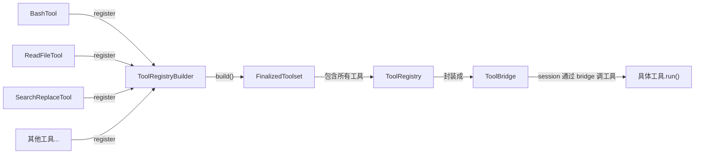
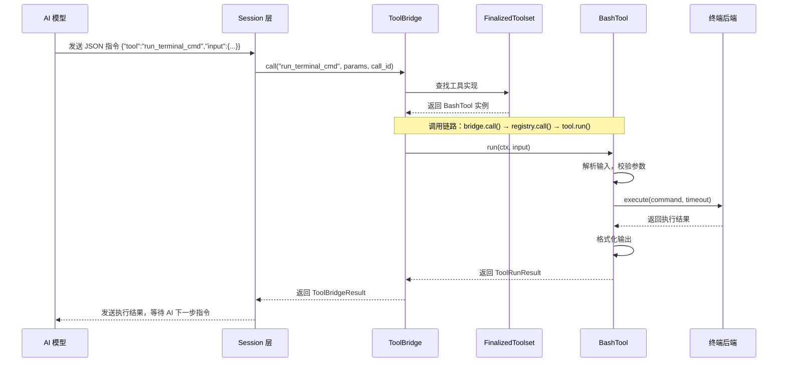

[← 返回首页](index.md)

# 工具箱概览：AI 的「手和眼睛」

## 一句话说清楚

`xai-grok-tools` 这个 crate 就是 Grok Build 的「工具箱」——里面的每个工具都像 AI 的「手」和「眼睛」，让 AI 真的能帮你干活而不是光动嘴。想读文件？有 `ReadFileTool`。想跑命令？有 `BashTool`。想改代码？有 `SearchReplaceTool`。想知道当前目录有什么？有 `ListDirTool`。

工具的定义在 `crates/codegen/xai-grok-tools/src/implementations/` 下面，按功能分目录放。每个工具就是一个实现了特定 trait 的结构体，注册进全局注册表后，AI 发个 JSON 指令就能调用它。

## 工具的分类：工具箱里的五个抽屉

看看 `crates/codegen/xai-grok-tools/src/implementations/mod.rs` 就知道了，工具按用途分了好几类：

```rust
// 这是 imports 的一部分，展示了有哪些工具
pub use grok_build::{
    AskUserQuestionTool, BashTool, EnterPlanModeTool, ExitPlanModeTool, GrepTool, KillTaskTool,
    ListDirTool, ReadFileTool, SearchReplaceTool, TaskOutputTool, TaskTool, TodoWriteTool,
    WaitTasksTool, WebFetchTool, WebSearchTool,
};
```

这些工具可以分成五大类：

| 类别 | 代表工具 | 干什么用 |
|------|---------|---------|
| 文件操作 | `ReadFileTool`, `ListDirTool` | 读文件、列目录 |
| 代码编辑 | `SearchReplaceTool`, `TodoWriteTool` | 改代码、写 TODO |
| 命令执行 | `BashTool`, `KillTaskTool` | 跑命令、杀进程 |
| 搜索查询 | `GrepTool`, `SearchTool`, `WebSearchTool` | 搜代码、搜网页 |
| 任务管理 | `TaskTool`, `TaskOutputTool`, `WaitTasksTool` | 管后台任务 |

另外还有专门给其他工具（比如 OpenCode）用的兼容版工具，在 `opencode` 目录下：

```rust
pub use opencode::{
    OpenCodeBashTool, OpenCodeEditTool, OpenCodeGlobTool, OpenCodeGrepTool, 
    OpenCodeReadTool, OpenCodeSkillTool, OpenCodeTodoWriteTool, OpenCodeWriteTool,
};
```

## 一个工具长什么样：拿 BashTool 举例

打开 `crates/codegen/xai-grok-tools/src/implementations/grok_build/bash/mod.rs`，看看 Bash 工具的结构。

### 输入格式

AI 调用工具时发来的 JSON 要符合 `BashToolInput` 的定义：

```rust
#[derive(Debug, Clone, Serialize, Deserialize, JsonSchema)]
pub struct BashToolInput {
    pub command: String,          // 要跑的命令
    pub timeout: Option<u64>,     // 超时时间（毫秒）
    pub description: String,      // 为啥要跑这个命令
    pub is_background: bool,      // 是否后台运行
}
```

### 输出格式

执行完返回的 JSON 有两种可能：

```rust
#[derive(Debug, Clone, serde::Serialize, serde::Deserialize, schemars::JsonSchema)]
#[serde(tag = "type")]
pub enum BashToolOutput {
    Foreground(BashOutput),              // 前台执行的结果
    Background(BackgroundTaskStarted),   // 后台任务启动的凭据
}
```

### 参数配置

每个工具还可以有可选的参数配置，存在 `Resources` 里。看 `BashParams`：

```rust
#[derive(Debug, Clone, serde::Serialize, serde::Deserialize)]
pub struct BashParams {
    pub timeout_secs: Option<f64>,           // 默认超时
    pub max_timeout_secs: Option<f64>,       // 最大超时限制
    pub output_byte_limit: Option<usize>,    // 输出字节限制
    pub cmd_prefix: Option<String>,           // 命令前缀
    pub enabled_background: bool,             // 是否允许后台
    pub auto_background_on_timeout: bool,     // 超时后是否自动后台
    // ... 还有别的字段
}
```

这个参数通过 `Params<BashParams>` 这个资源注入到工具里，方便不同场景（比如生产环境 vs 测试）用不同的配置。

## 注册中心：所有工具的「黄页」

所有工具都注册在一个叫 `FinalizedToolset` 的注册表里。这个注册表由 `ToolRegistryBuilder` 构建，最终被 `ToolBridge` 包装后暴露给上层。

看 `crates/codegen/xai-grok-tools/src/bridge.rs` 里的 `ToolBridge`：

```rust
pub struct ToolBridge {
    registry: Arc<FinalizedToolset>,   // 注册表，里面是所有注册好的工具
    terminal: Option<Arc<dyn TerminalBackend>>,  // 终端后端（跑命令用）
}
```

注册过程是这样的：



## AI 调用工具的完整流程

当 AI 想跑一个命令时，整个调用链是这样的：



## 工具里的「资源」系统

每个工具执行时需要的依赖（比如工作目录、文件系统、终端）是通过 `Resources` 注入的。这就像一个「工具背包」，执行工具前别人把需要的东西都塞进背包里。

以 `SearchReplaceTool` 为例，看 `crates/codegen/xai-grok-tools/src/implementations/grok_build/search_replace/mod.rs` 里的注释：

```rust
//! ## Resources
//! - `Cwd` — working directory for path resolution (required)
//! - `FileSystem` — read/write file content (required)
//! - `NotificationHandle` — emit `FileWritten` notifications (optional, noop fallback)
//! - `ToolCallId` — notification correlation (optional, defaults empty)
//! - `TemplateRenderer` — resolve client-facing tool/param names in error messages (optional)
```

工具执行时从 Resources 里取出需要的东西：

```rust
async fn run_search_replace(input, ctx, resources) -> Result<...> {
    let (cwd, fs, notification_handle);
    {
        let res = resources.lock().await;
        cwd = res.require::<Cwd>()?.0.clone();
        fs = res.require::<FileSystem>()?.0.clone();
        notification_handle = res.require::<NotificationHandle>()?.0.clone();
    }
    // 然后用 cwd 解析路径，用 fs 读写文件...
}
```

## 小结

`xai-grok-tools` 的设计思路很清晰：

1. **统一接口**：所有工具都遵循相同的输入输出格式，新增工具不需要改调用框架
2. **依赖注入**：工具需要的资源通过 `Resources` 传入，方便测试和切换实现
3. **参数可配置**：每个工具都可以通过 `Params` 调整行为，适应不同场景
4. **桥接模式**：`ToolBridge` 封装了注册表，让上层不用关心工具的内部实现

关于这些工具怎么在会话里发挥作用，详见《Agent 生命周期：小助手是怎么诞生的》。关于工具执行结果怎么渲染成终端里漂亮的输出，详见《终端渲染引擎：如何把 Markdown 变成赏心悦目的 TUI》。
