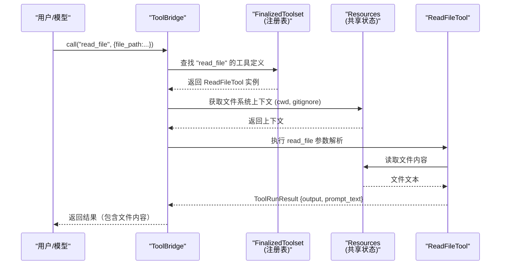
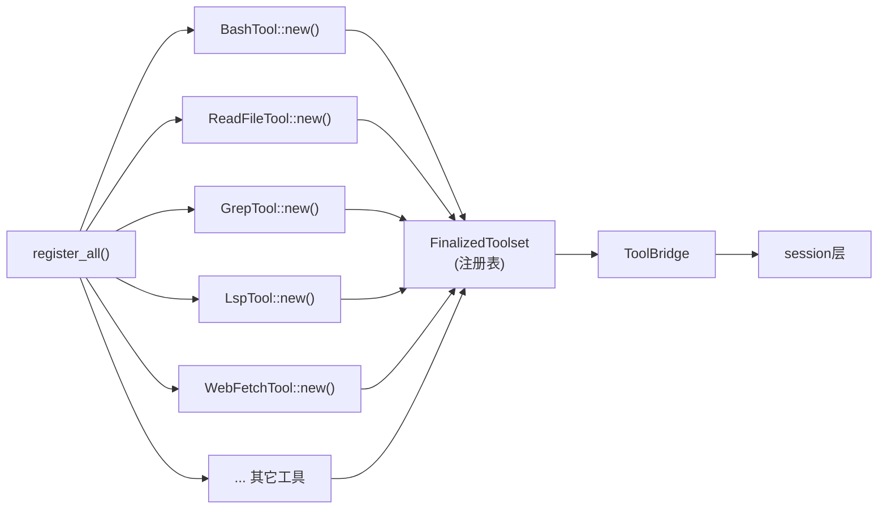

[← 返回首页](index.md)

# 工具系统：AI 的"工具箱"

## 工具系统长什么样？

Grok 写代码时，不能只靠"想"——它得真的能读文件、执行命令、搜代码、抓网页。这些能力叫做**工具（Tool）**。你可以把每个工具想象成一个"专家"：

- **Bash 专家**——执行终端命令，替你编译、测试、跑脚本
- **ReadFile 专家**——打开文件，把内容完整读出来
- **Grep 专家**——在代码库里搜关键词
- **WebFetch 专家**——抓取网页内容
- **LSP 专家**——通过语言服务器分析代码，找定义、跳转、引用

整个工具系统就是这些专家的**注册中心 + 调度中心**。你（或者模型）只需要说一句"帮我查一下这个函数的定义"，调度器就会自动找到对的专家，把活儿派过去，再把结果返回来。

## 专家们从哪里来？

所有内置工具在 `crates/codegen/xai-grok-tools/src/implementations/grok_build/mod.rs` 的一行 `register_all()` 函数里统一注册。打开这个文件，你会看到一行行 `pub use`，每个导出一个具体的工具类型：

```rust
// 摘自 crates/codegen/xai-grok-tools/src/implementations/grok_build/mod.rs
pub use bash::BashTool;
pub use read_file::ReadFileTool;
pub use grep::GrepTool;
pub use web_fetch::WebFetchTool;
pub use lsp::LspTool;  // 语言服务器协议工具
// ... 还有二十多个类似导出
```

这些工具的类型都实现了同一个 trait（接口）叫 `NewTool`，它要求每个工具必须告诉系统三件事：

1. **它叫什么名字**（给模型用的函数名，比如 `read_file`、`bash`）
2. **它接受什么参数**（JSON Schema 格式，模型按照这个格式发请求）
3. **怎么执行它**（一个 async 函数，接收参数、返回结果）

代码里长这样（摘自 `crates/codegen/xai-grok-tools/src/bridge.rs` 里的 `register_mcp_tools` 方法）：

```rust
// 注册一个 MCP 工具的示例方式（本质和内置工具一样）
pub async fn register_mcp_tools<T>(
    &self,
    mcp_name: String,          // 工具名称，比如 "read_file"
    tool: T,                   // 实现了 NewTool trait 的实例
    input_schema: Option<serde_json::Value>, // JSON Schema 描述参数
) -> Result<(), xai_tool_runtime::ToolError>
```

## 一次工具调用的完整旅程

用户说"帮我看一下 `main.rs` 的前 50 行"，背后发生了什么？看这张时序图：



### 第一步：收到调用请求

`ToolBridge` 是系统的**入口**。用户（模型）发来一个 JSON 请求：
```json
{
  "name": "read_file",
  "arguments": {"file_path": "src/main.rs", "limit": 50}
}
```

`ToolBridge` 在 `crates/codegen/xai-grok-tools/src/bridge.rs` 里的 `call()` 方法接过这个请求：

```rust
// 摘自 bridge.rs
pub async fn call(
    &self,
    client_function_name: &str,   // "read_file"
    client_params: serde_json::Value,  // {file_path, limit}
    tool_call_id: &str,           // 整个会话里的唯一 ID，用于跟踪
) -> Result<ToolRunResult, xai_tool_runtime::ToolError> {
    self.registry
        .call(client_function_name, client_params, tool_call_id, None)
        .await
}
```

### 第二步：注册表查找工具

`FinalizedToolset` 是真正的**注册表**，里面存着所有工具的名称到实现实例的映射。Bridge 用工具名称查到这个映射，找到对应的 `ReadFileTool` 实例。

### 第三步：准备共享资源

工具执行时需要的"上下文"——比如当前工作目录、gitignore 过滤规则——都存放在 `Resources` 里。`Resources` 是一个类型安全的键值存储（`Arc<Mutex<HashMap<TypeId, Box<dyn Any>>>>`），工具可以从里面取到：

- `Terminal`：终端后端，用来执行 bash 命令
- `GitignoreFilter`：哪些文件被 git 忽略了，不能读
- `DisplayCwd`：给模型显示的当前目录（和真实路径可能不同，比如分叉会话）
- `AvailableSkills`：发现的 skill（详见《聊天状态与智能体生命周期》）

### 第四步：工具执行

`ReadFileTool` 读文件时，会先检查 gitignore（防止读到不该读的文件），再按字节读取，最后按行截断到 `limit` 行。执行完的结果打包成 `ToolRunResult`：

```rust
// 摘自 bridge.rs 的结构体
pub struct ToolRunResult {
    pub output: ToolOutput,      // 干净的工具输出（用于序列化）
    pub prompt_text: String,     // 带系统提示的文本（发给模型）
}
```

### 第五步：结果返回

`output` 走 ACP 通知通道（详见《Pager 终端 UI 与端到端测试》），`prompt_text` 拼进模型的下一次 prompt。

## 工具注册表是怎么搭建的？

下图展示了从工具定义到最终可调用的完整流程：



`register_all()` 函数（`crates/codegen/xai-grok-tools/src/implementations/grok_build/mod.rs` 里 `register_all` 的实现在模块路径下的 `storage.rs` 中）做几件事：

1. 创建 `ToolRegistryBuilder`（空的注册表构造器）
2. 对每个工具，用 `.register_tool(name, tool_instance)` 注册
3. 调用 `builder.finalize(config, ctx)` 生成不可变的 `FinalizedToolset`
4. 用 `FinalizedToolset` 包裹成 `ToolBridge`，交给 session 层使用

**关键点**：工具是在**系统启动时**一次性注册完的，运行期间不会再增加或减少（除非通过 MCP 插件系统动态注册/卸载——详见《钩子、MCP 协议与沙箱》）。

## 特殊工具：LSP（语言服务器协议）

LSP 工具比较特殊，不像 `read_file` 那样一次调用就完事。它需要**启动后台进程**（比如 `rust-analyzer`、`typescript-language-server`），然后通过 socket 通信做多次查询。

`LspManager` 在 `crates/codegen/xai-grok-tools/src/implementations/lsp/manager.rs` 里，核心逻辑：

1. **启动**：根据文件后缀（`.rs` → `rust-analyzer`，`.ts` → `typescript-language-server`）启动对应 LSP 服务器
2. **维护**：每个 LSP 服务器对应一个 `LspClient`，保持长连接
3. **诊断收集**：修改文件后，LSP 服务器的诊断会异步返回，通过 `drain_lsp_diagnostics` 等待并聚合
4. **查询**：`goto_definition`、`find_references`、`hover` 等操作调用 LSP 协议的标准请求

```rust
// 摘自 manager.rs 的 socket_for_file 方法
// 自动打开文件（如果 LSP 还没追踪到这个文件）
pub async fn socket_for_file(&mut self, path: &Path) -> Option<async_lsp::ServerSocket> {
    let (server_name, lang_id) = super::config::resolve_server(&self.servers, path)?;
    let needs_open = self.clients.get(&server_name)
        .and_then(|c| file_uri(path).ok().map(|uri| !c.open_documents.contains_key(&uri.to_string())))
        .unwrap_or(false);
    if needs_open
        && let Ok(content) = tokio::fs::read_to_string(path).await
        && let Some(client) = self.clients.get_mut(&server_name)
    {
        client.notify_file_change(path, &content, &lang_id);
    }
    self.clients.get(&server_name).map(|c| c.socket.clone())
}
```

## 变体工具：Hashline（带行哈希锚点的工具集）

`crates/codegen/xai-grok-tools/src/implementations/grok_build_hashline/` 提供了另一种文件操作方式：**行哈希（hashline）**。

普通 `read_file` 按行号索引，但行号容易因为文件修改而错位。Hashline 工具给每行内容算一个哈希，用哈希作为锚点。这样即使文件做过插入/删除，工具也能通过哈希识别出"上一版里第 30 行的内容，现在跑到了第 35 行"。

这个模块包含 `hashline_read`、`hashline_edit`、`hashline_grep` 三个工具，底层共用一套 `AnchorScheme` 算法（`anchor.rs` 里定义的）。

## 输出大小限制

工具返回的内容不能太大，否则会撑爆模型上下文。在 `crates/codegen/xai-grok-tools/src/lib.rs` 里有两个默认常量：

```rust
// 工具结果默认 40KB（≈10000 tokens）
pub const DEFAULT_TOOL_OUTPUT_BYTES: usize = 40_000;

// bash 输出默认 20000 字符（≈5000 tokens）
pub const DEFAULT_TOOL_OUTPUT_CHARS: usize = 20_000;
```

如果工具输出超过这些限制，系统会截断并追加一个"输出已被截断"提示。MCP 工具则用环境变量 `MCP_MAX_OUTPUT_BYTES` 控制（`util/mcp_truncate.rs` 里实现，默认也是 40KB）。

## 工具分类一览

| 工具名称 | 模块路径 | 它干嘛用的 |
|---------|---------|-----------|
| `read_file` | `implementations/grok_build/read_file` | 读文件内容，支持行数限制 |
| `bash` | `implementations/grok_build/bash` | 执行终端命令，返回输出 |
| `grep` | `implementations/grok_build/grep` | 在项目文件里搜文本 |
| `list_dir` | `implementations/grok_build/list_dir` | 列出目录内容 |
| `search_replace` | `implementations/grok_build/search_replace` | 搜索并替换文件中的文本 |
| `web_fetch` | `implementations/grok_build/web_fetch` | 抓取网页内容 |
| `web_search` | `implementations/grok_build/web_search` | 执行网页搜索 |
| `lsp` | `implementations/lsp` | 语言服务器：跳转定义、查引用 |
| `task` | `implementations/grok_build/task` | 启动后台任务 |
| `task_output` | `implementations/grok_build/task_output` | 获取后台任务输出 |
| `scheduler_create` | `implementations/grok_build/scheduler/create` | 创建定时任务 |
| `scheduler_list` | `implementations/grok_build/scheduler/list` | 列出所有定时任务 |
| `scheduler_delete` | `implementations/grok_build/scheduler/delete` | 删除一个定时任务 |
| `hashline_read` | `implementations/grok_build_hashline/read_file` | 用行哈希锚点读文件 |
| `hashline_edit` | `implementations/grok_build_hashline/edit` | 用行哈希锚点编辑文件 |
| `hashline_grep` | `implementations/grok_build_hashline/grep` | 用行哈希锚点搜文本 |
| `image_gen` | `implementations/grok_build/image_gen` | 生成图片 |
| `image_edit` | `implementations/grok_build/image_edit` | 编辑图片 |
| `video_gen` | `implementations/grok_build/video_gen` | 生成视频 |
| `enter_plan_mode` | `implementations/grok_build/enter_plan_mode` | 进入计划模式（AI 先出方案再动手） |
| `exit_plan_mode` | `implementations/grok_build/exit_plan_mode` | 退出计划模式 |
| `update_goal` | `implementations/grok_build/update_goal` | 更新当前目标（给模型用） |
| `ask_user_question` | `implementations/grok_build/ask_user_question` | 向用户提问（需要用户回答后继续） |

> 🔍 **提示**：`register_all()` 函数在 `implementations/grok_build/storage.rs` 里（路径不是 `mod.rs` 里直接写的），它负责把上面所有工具实例化成 `NewTool` 对象并注册到 `ToolRegistryBuilder`。

## 怎么临时禁用或添加工具？

`ToolBridge` 提供了运行时修改工具列表的方法（在 `bridge.rs` 里）：

- **`register_mcp_tools(name, tool, schema)`**：动态注册一个新工具（MCP 插件用）
- **`unregister_tools_by_prefix(prefix)`**：批量删除前缀匹配的工具
- **`unregister_tool_by_name(name)`**：精确删除一个工具

这些方法主要给**会话 fork**和**插件系统**使用（详见《钩子、MCP 协议与沙箱》）。

---

工具系统是 Grok 和真实世界之间的**桥梁**。它没有自己的业务逻辑，只是忠实地把模型的意图翻译成文件读、写、执行命令等具体操作，再把结果干干净净地带回来。你不需要理解每个工具的内部实现，只要记住：**所有工具都在 `xai-grok-tools` crate 里，通过 `register_all()` 注册，通过 `ToolBridge` 调度。**
