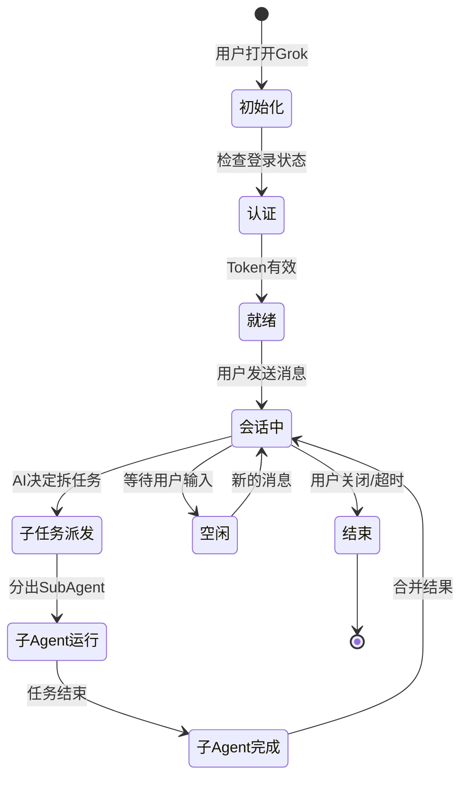
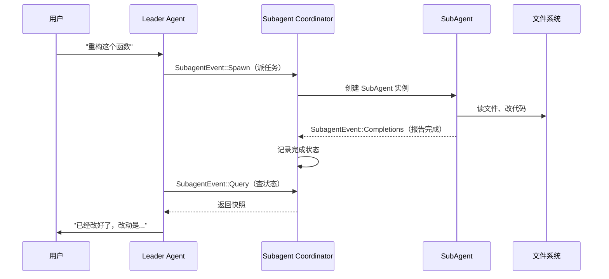
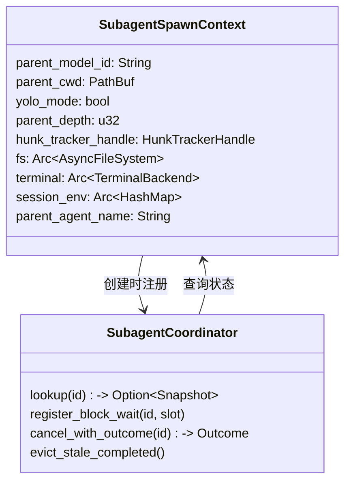
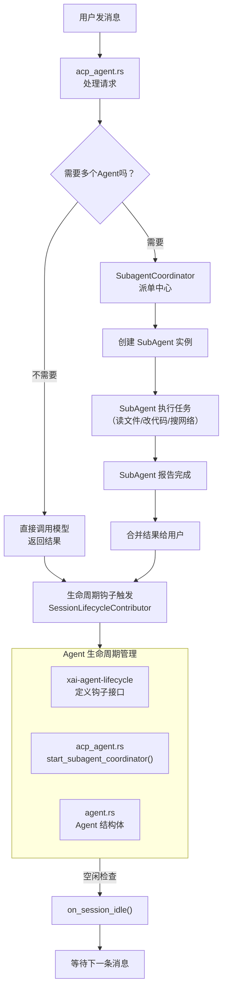

[← 返回首页](index.md)

# Agent 生命周期与多 Agent 协同（最难的概念）

## 用"搬家团队"来理解整个故事

想象一下，你请了一家公司帮你搬家。这个公司有一个**总指挥**（Leader Agent），他的工作就是听你说需求，然后把任务拆成小块分给不同的**工人**（SubAgent）。

总指挥不是一个人干所有活。你告诉他"帮我把书房的电脑拆了再装到新家"，他不会自己去拧螺丝，而是：
1. 派一个工人去拆电脑（`SubAgent` 去读文件/改代码）
2. 另一个工人去打包书籍（另一个 `SubAgent` 去搜代码/查文档）
3. 等他们干完了，再汇总结果告诉你

这就是 Grok Build 里 Agent 的工作方式——它不是简单的"你问一句我答一句"，而是有一个完整的**生命周期管理**和**多 Agent 协同**机制。

## Agent 的"出生、干活、退休"全过程

每个 Agent 的生命周期分几个阶段，由 `xai-agent-lifecycle` 这个包（`crates/codegen/xai-agent-lifecycle/src/lib.rs`）定义。



**关键文件**：`xai-agent-lifecycle/src/local/contributors/session_lifecycle.rs` 里定义了一个 `on_session_idle` 钩子——当会话进入空闲状态时触发。这个文件里还有 `SessionLifecycleContributor` trait，规定了"会话开始"、"会话空闲"、"会话结束"这些点的行为。

```rust
// 来自 xai-agent-lifecycle/src/local/contributors/session_lifecycle.rs
/// Fired when the session settles idle (no running turn or queued work)
async fn on_session_idle(&self, _input: &SessionIdleInput) {}
```

## 从代码看 Agent 的初始化（Initialize）

Agent 的"出生"发生在 `acp_agent.rs` 的 `initialize()` 方法里（`crates/codegen/xai-grok-shell/src/agent/mvp_agent/acp_agent.rs`）。这里干了三件大事：

1. **启动子Agent协调器**——调用 `self.start_subagent_coordinator()`，为后面派发任务做准备
2. **清理旧数据**——清理过期的 worktree 和会话文件
3. **做认证**——检查用户有没有登录、Token 有没有过期

```rust
// 从 acp_agent.rs 摘录
async fn initialize(&self, arguments: acp::InitializeRequest) -> Result<...> {
    // 1. 启动子Agent协调器
    self.start_subagent_coordinator();
    
    // 2. 清理过期的工作区
    tokio::task::spawn_blocking(|| {
        crate::session::worktree_pool::cleanup_stale_pool_worktrees(None);
    });
    
    // 3. 检查认证状态
    if !self.tier_allowed.get() && let Some(auth) = self.auth_manager.current() {
        self.enforce_grok_code_access(&auth).await;
    }
    
    // 返回初始化响应，告诉客户端：我准备好了
    Ok(acp::InitializeResponse::new(acp::ProtocolVersion::V1)...)
}
```

## 子Agent协调器（Subagent Coordinator）——总指挥的派单系统

`subagent_coordinator.rs`（`crates/codegen/xai-grok-shell/src/agent/mvp_agent/subagent_coordinator.rs`）是这个系统的核心。它像一个"派单中心"，接收各种事件，分发给对应的处理逻辑。

想象一下搬家公司的对讲机——工人们通过它报告"我装好了"、"我需要更多工具"，总指挥通过它派新任务。代码里的 `SubagentEvent` 枚举就是这组"对讲机消息"：



### 派单中心的事件类型

从 `subagent_coordinator.rs` 里能看到完整的消息枚举：

| 事件类型 | 干啥的 | 对应生活场景 |
|---------|--------|------------|
| `Spawn` | 创建新的 SubAgent | 总指挥派工人去干活 |
| `Query` | 查询 SubAgent 状态 | 总指挥问"装好了没" |
| `Cancel` | 取消一个 SubAgent | 用户说"别装了，改主意了" |
| `ListActive` | 列出所有正在干活的 | 清点一下现在几个人在干活 |
| `Completions` | 获取完成的任务 | 工人交工 |
| `ValidateType` | 检查某种 Agent 类型是否可用 | 确认某个工种有没有人能干 |

```rust
// 从 subagent_coordinator.rs 摘录
match event {
    SubagentEvent::Spawn(boxed) => {
        // 派一个工人出去干活
        let request = *boxed;
        tokio::task::spawn_local(async move {
            let this = agent_ref.get();
            let mut ctx = this.build_subagent_spawn_context(&parent_sid);
            crate::agent::subagent::handle_subagent_request(request, ctx, ...).await;
        });
    }
    SubagentEvent::Query(query) => {
        // 查询工人干得怎么样了
        // 支持阻塞等待（等工人干完再回复）
        let should_block = block && snapshot.as_ref().is_some_and(is_running);
        // 循环检查，最多等 timeout_ms 毫秒
    }
}
```

## Agent 的"本体"长什么样

`xai-grok-agent` 包的 `agent.rs`（`crates/codegen/xai-grok-agent/src/agent.rs`）定义了 `Agent` 结构体——它是所有 Agent 的"身份证+工具箱"。

```rust
// 来自 xai-grok-agent/src/agent.rs
pub struct Agent {
    definition: AgentDefinition,      // 你是谁、能干啥（来自 *.md 文件）
    system_prompt: String,            // 系统提示词（AI 的"角色设定"）
    tool_bridge: Arc<ToolBridge>,     // 工具箱（能调用哪些函数）
    compaction_policy: CompactionPolicy, // 什么时候压缩对话历史
    reminder_policy: ReminderPolicy,  // 多久给 AI 一次"别忘了你是干啥的"提醒
    hosted_tools: Vec<HostedTool>,    // 服务器提供的工具（如网络搜索）
    // ... 还有其他字段
}
```

注意这个 `Agent` 是**不可变的**（immutable）——建造好之后就不改了。如果需要改什么设置，通过 `ToolBridge` 的内部锁来操作。

## Agent 的建造过程（Builder 模式）

Agent 不是凭空产生的，而是通过 `AgentBuilder`（`crates/codegen/xai-grok-agent/src/builder.rs`）一步步搭起来的。它从 `.grok/agents/*.md` 文件里读定义，或者通过代码直接构造。

```rust
// 来自 xai-grok-agent/src/builder.rs
// 方式1: 从定义文件
let def = AgentDefinition::from_file("agents/code-reviewer.md")?;
let agent = AgentBuilder::new(cwd, None, notification_handle)
    .from_definition(def)
    .build().await?;

// 方式2: 程序化构造
let agent = AgentBuilder::new(cwd, None, notification_handle)
    .with_name("my-agent")
    .with_description("A custom agent")
    .with_tools(vec!["read_file".into(), "grep".into()])
    .build().await?;
```

建造过程中，Build 会解析 YAML 头部的配置（`promptMode` 是 `extend` 还是 `full`、`tools` 白名单/黑名单、`permissionMode` 等），然后组合系统提示词、筛选可用的工具，最后产出 Agent 对象。

## 子Agent 的任务上下文（Spawn Context）

当一个 SubAgent 被创建时，它需要知道自己"爹"的一些信息——比如当前工作目录、用啥模型、可不可以运行命令。这些信息通过 `SubagentSpawnContext` 传递。



在 `subagent_coordinator.rs` 里，`build_subagent_spawn_context()` 方法从父会话（`parent session`）中提取这些信息：

```rust
pub(super) fn build_subagent_spawn_context(
    &self, parent_session_id: &str,
) -> crate::agent::subagent::SubagentSpawnContext {
    let parent_sid = acp::SessionId::new(parent_session_id);
    // 从 sessions 表里拿到父会话的 handle
    let sessions = self.sessions.borrow();
    let ps = sessions.get(&parent_sid);
    // 提取各种配置
    let parent_model_id = ps.map(|h| h.model_id.clone())
        .unwrap_or_else(|| self.models_manager.current_model_id());
    let parent_cwd = ps.map(|h| std::path::PathBuf::from(&h.info.cwd))
        .unwrap_or_default();
    // ... 还有 fs, terminal, session_env 等
}
```

## 任务的等待与超时（BlockWait 机制）

有时候父 Agent 需要"等子 Agent 干完了再继续"——这就用到 `BlockWaitSlot` 机制。父 Agent 说"我等你，但最多等 30 秒"，然后进入一个循环每 200 毫秒检查一次状态。

```rust
// 来自 subagent_coordinator.rs
let should_block = block && snapshot.as_ref().is_some_and(is_running);
if should_block {
    let timeout_ms = timeout_ms.unwrap_or(30_000);  // 默认等30秒
    let deadline = tokio::time::Instant::now() + Duration::from_millis(timeout_ms);
    loop {
        tokio::time::sleep(Duration::from_millis(200)).await;
        // 检查有没有人取消了、超时了、或者干完了
        let still_running = snap.as_ref().is_some_and(is_running);
        if !still_running || tokio::time::Instant::now() >= deadline {
            // 干完了或者超时了，退出循环
            return;
        }
    }
}
```

这就像总指挥站在工人旁边等着——他每 0.2 秒问一次"好了没"，最多等 30 秒。如果工人 30 秒还没干完，他就不等了，先跟用户说"还需要点时间"。

## 生命周期钩子（Lifecycle Hooks）

除了核心的生命周期，Grok Build 还提供了一套**钩子系统**（`xai-agent-lifecycle`），允许在不同阶段插入自定义行为。

最主要的两个 trait：
- **`SessionLifecycleContributor`**：在会话开始、会话空闲、会话结束时触发
- **`TurnLifecycleContributor`**：在每次对话轮次开始/结束/出错时触发

这些钩子被设计成"只读输入 + 注入能力"的模式——钩子收到的是数据（事件输入），它如果想做什么事，必须通过构建时注入的能力（比如发 HTTP 请求、跑命令）。详见《扩展机制：MCP 服务器、钩子、插件》。

## 把所有概念串起来



## 总结一下关键知识点

| 概念 | 解释 | 代码位置 |
|------|------|---------|
| **Leader Agent** | 总指挥，接收用户请求，拆任务 | `acp_agent.rs` |
| **SubAgent** | 工人，执行具体任务（读文件、改代码） | `subagent_coordinator.rs` |
| **SubagentCoordinator** | 派单中心，管理 SubAgent 的创建、查询、取消 | `subagent_coordinator.rs` |
| **Agent 结构体** | Agent 的身份证 + 工具箱 | `xai-grok-agent/src/agent.rs` |
| **AgentBuilder** | 从定义或代码构造 Agent | `xai-grok-agent/src/builder.rs` |
| **生命周期钩子** | 在会话/轮次的不同阶段触发回调 | `xai-agent-lifecycle/src/lib.rs` |
| **BlockWait** | 父 Agent 等待子 Agent 完成的超时机制 | `subagent_coordinator.rs` |
| **Spawn Context** | 子 Agent 的"出生配置"（cwd、模型、权限等） | `subagent_coordinator.rs` |

最后提一句，这个"搬家团队"的所有沟通都基于 ACP 协议（Agent Communication Protocol），关于协议细节和其他基础概念，详见《整体架构》和《核心流程：从用户输入到 AI 回复》。
