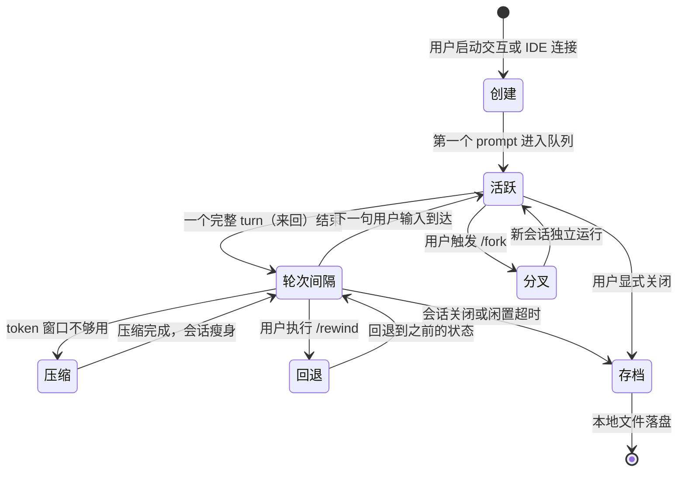
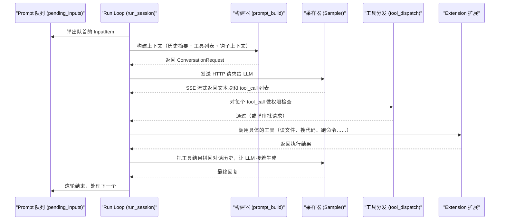

[← 返回首页](index.md)

# 会话管理：从出生到归档

想一下你正在跟一个 AI 结对编程。你问了它一个问题，它回了一段代码，你又让它改了下，你可能对刚才的结果不满意，于是回退了两步重新问。最后，你关掉终端去开会了。

在整个过程中，那个"对话的状态"一直在变——从无到有，从活跃到归档。在今天这个代码库里，维护这股状态的模块叫**会话（Session）**。会话就像一个活着的记事本，记住了你说的每一句话、AI 做的每一个操作（读文件、跑命令、搜代码），并且在你需要的时候能带你穿越回过去的任意时间点。

## 会话的一生：一个比喻

把会话想象成你在一家高级日料店里用餐：

- **出生（创建）**：你走进店里，主厨递给你一套专属餐具、一张空白的菜单卡。这就好比你打开 Grok Build 的一瞬间，系统为你生成一个独一无二的 `session_id`，在磁盘上开辟一个专属目录（`crates/codegen/xai-grok-shell/src/session/acp_session.rs` 里创建的 `SessionActor` 就干这个）。

- **活跃（对话中）**：你每点一道菜（说一句话），主厨就记在菜单卡上，然后去后厨做（AI 调用工具、请求 LLM），做好了端上来（返回回复）。每道菜都按顺序编号（`prompt_index`），绝不会弄混。

- **喘口气（轮次间隔）**：菜上完了，主厨在等你的下一道菜。这时候他可以趁机把用过的碗筷收收（压缩 `compaction`）、回忆一下这顿饭的亮点（回顾 `recap`）、检查后厨有没有新食材（MCP 初始化），甚至你嫌上一道菜不好吃，他还能把食材复原（回退 `rewind`）。

- **分支（分叉）**：你叫来朋友拼桌，让朋友拿你的菜单卡复印件继续点菜，各自吃着不同的菜式，但互不影响。这就是 Fork（分叉），`crates/codegen/xai-grok-shell/src/session/storage/mod.rs` 里的 `CopySessionOptions` 记录着分叉时哪些数据该保留、哪些该丢弃。

- **收摊（存档）**：你吃完买单走人，服务员把菜单卡收进文件夹归档，后厨的状态（改了哪些文件、产生了什么错误）也一并存好。下次你再来，只要报上菜号（`session_id`），主厨能原样把那顿饭的历史恢复出来。

这个故事就是下面这张图：



这整个生命周期都是靠 `SessionActor` 一脚踢的。它在文件 `crates/codegen/xai-grok-shell/src/session/acp_session.rs` 里，是一个巨大的结构体，里面包含了对话历史、认证信息、权限策略、工具集、MCP 状态、Goal 跟踪等等。为了理解它，我们先从那几个最关键的生命阶段开始。

## 出生：一个会话是怎么来的？

你在终端里按下回车、或者 IDE 插件连上 Grok Build 时，系统会调用 `spawn_session_actor`。这个函数位于 `crates/codegen/xai-grok-shell/src/session/acp_session_impl/spawn.rs`，它会：

1. **分配一个唯一的 SessionId** —— 像 `550e8400-e29b-41d4-a716-446655440000` 这种 UUID。
2. **在磁盘上开辟会话目录** —— `~/.grok/sessions/{session_id}/` 下面会陆续长出这些文件：
   - `chat_history.jsonl` —— 对话历史的完整备份
   - `updates.jsonl` —— 所有事件的顺序日志（工具调用、消息块、回退标记等）
   - `plan_state.json` —— 任务计划的状态
   - `rewind_points/` —— 文件快照，用来支持回退
   - `compaction/` —— 压缩存档
3. **构建 Agent（工具桥 + 系统提示词 + 策略）** —— `SessionActor.agent` 是一个 `RefCell<Agent>`，里面包含了这个 AI 助手能用的所有工具（读文件、跑命令、搜索代码等）和它要遵守的规则（比如"安全优先"）。
4. **设定初始模式** —— 从配置或 ACP 的 `session/set_mode` 请求中获得的 `PromptMode`（普通模式、计划模式、目标模式……）。

在 `crates/codegen/xai-grok-shell/src/session/acp_session.rs` 里，`SessionActor` 结构体中有一行很显眼：

```rust
pub(crate) current_prompt_mode: Arc<parking_lot::Mutex<PromptMode>>,
```

这行就是在出生瞬间被赋值的，决定了这个会话默认用哪种方式跟用户互动。

## 活跃：一轮对话到底发生了什么？

每当你发一句话，这轮对话就被包装成一个 `InputItem`：

```rust
// crates/codegen/xai-grok-shell/src/session/acp_session.rs
pub(crate) struct InputItem {
    pub(crate) prompt_id: String,                               // 这轮的 ID
    pub(crate) prompt_blocks: Vec<ContentBlock>,                // 你说的话（多语块支持）
    pub(crate) prompt_mode: PromptMode,                         // 当前模式
    pub(crate) origin: super::PromptOrigin,                     // 来源：用户 还是 自动唤醒
    pub(crate) respond_to: oneshot::Sender<PromptTurnResult>,   // 完成后回复的通道
    // ... 省略一堆其它字段
}
```

这个 `InputItem` 会被塞进 `State.pending_inputs` 这个队列里排队。等上一个 turn 搞完，`run_loop` 就会取出队列头部的 `InputItem` 开干。具体来说，`run_loop` 是一个异步循环，不断在做这些事情：



这个过程中，每一个关键步骤都能在 `acp_session_impl/` 下面的子模块里找到对应的代码：
- `prompt_build.rs` 负责拼装发送给 LLM 的请求体
- `sampler_turn.rs` 负责跟 `xai-grok-sampler` 交互
- `tool_dispatch.rs` 负责把 LLM 要求的工具调用分发到正确的 Extension
- `turn.rs` 负责管理一整轮对话的开始、结束状态

而且，在活跃期间，`State.rewindable` 会被设置为 `true`。这意味着用户随时可以从 TUI 的斜杠命令里打一个 `/rewind`，回到这轮对话之前的状态（详见《Agent 调度核心》15-agent-runtime.md）。

## 喘口气：轮次间隔时的"家务活"

每次一个 turn 结束、下一个用户的 `InputItem` 还没到的时候，`SessionActor` 的 `select!` 循环会进入一个"空闲等待"分支。这时候系统并不会躺着不动，它会趁这段时间偷偷做好几件"家务活"。下面是这些家务活的清单和它们对应的代码位置：

| 家务活 | 代码位置 | 触发条件 |
|--------|----------|----------|
| **通知排空**（把积压的后台通知推给客户端） | `acp_session_impl/notification_drain.rs` 的 `maybe_drain_notifications()` | `is_session_idle_for_injection() == true` |
| **自动回顾**（生成当前进度的摘要） | `acp_session_impl/recap.rs` 的 `handle_recap()` | 经过一定轮数，且超过 3 分钟空闲 |
| **慵懒检查**（AI 很久没对项目做实质性更改了吗？） | `acp_session_impl/laziness_classifier.rs` 的 `maybe_fire_laziness_check()` | 当 `is_session_idle_for_injection() == true` |
| **定期 Dream**（整理长期记忆） | `acp_session_impl/memory_dream.rs` | 每隔一段固定时间 |

这些家务活都依赖同一个判断函数，来自 `acp_session.rs`：

```rust
// crates/codegen/xai-grok-shell/src/session/acp_session.rs
pub(crate) fn is_session_idle_for_injection(state: &State) -> bool {
    state.running_task.is_none()          // 没有正在跑的 turn
        && state.pending_inputs.is_empty() // 没有排队的用户输入
        && !state.notifications_suppressed // 通知没有被取消操作抑制
}
```

只有这三条件全满足，系统才允许自己"开小差"去做这些后台任务。

## 分支：Fork 是怎么一回事？

你也许有过这种体验：AI 给出了一个方向，你觉得还行，但想试试另一个解法，又不想丢掉当前已经有的上下文。这时候就用到了 Fork。

在 Grok Build 里，Fork 的本质是"把当前会话的目录内容拷贝一份到新的会话 ID 下面，同时继承聊天历史、工具状态、文件快照和配置"。

从 TUI 触发这个动作，最终会走到 `crates/codegen/xai-grok-pager/src/app/dispatch/session/fork.rs`（Dispatch → 会话管理 → Fork）。这个分发器会发出指令，驱导 `SessionActor` 调用 `crates/codegen/xai-grok-shell/src/session/storage/mod.rs` 里的 `copy_session_data`：

```rust
// crates/codegen/xai-grok-shell/src/session/storage/mod.rs
pub struct CopySessionOptions {
    pub parent_session_id: Option<String>,    // 新会话的"老爹"是谁
    pub new_model_id: Option<String>,         // 想换个模型？
    pub target_prompt_index: Option<usize>,   // 只拷贝到第 N 轮为止
    pub skip_cwd_transform: bool,             // 是否跳过路径重写
    pub fork_filter: bool,                    // 是否筛掉合成信息
    pub strip_reasoning: bool,               // 是否丢掉上一个模型的思考过程
    pub copy_compaction_segments: bool,      // 要不要搬运大型压缩存档
    // ... 还有很多
}
```

Fork 之后，新旧两个会话就像两个完全独立的宇宙，一切都自然分裂。新会话继续往下聊，旧会话依然可以随时切回去。

## 回退：时间倒流怎么做？

你大概率用过 Ctrl+Z 撤销。但在 AI 结对编程里，这种回退更复杂——因为它涉及两个维度的状态：

1. **对话状态**（聊天历史）——把 `chat_history` 往后剪裁到第 N 轮之前。
2. **文件系统状态**——把 AI 在第 N 轮之后改动的文件还原到改之前的样子。

这两个维度是通过 `RewindMode` 枚举来控制的，代码在 `crates/codegen/xai-grok-shell/src/session/acp_session_impl/rewind.rs` 里的 `handle_rewind` 方法：

```rust
// crates/codegen/xai-grok-shell/src/session/acp_session_impl/rewind.rs
pub(super) async fn handle_rewind(
    &self,
    request: RewindRequest,
) -> anyhow::Result<RewindResponse> {
    let wants_file_revert = matches!(mode, RewindMode::All | RewindMode::FilesOnly);
    let wants_conversation_rewind = matches!(mode, RewindMode::All | RewindMode::ConversationOnly);
    // ...
}
```

回退分两步走：
1. **预览阶段**（`force=false`）：真正动手之前，系统先"演习"一遍，检查哪些文件可能跟你手动的修改有冲突。如果有冲突，它会返回一个按钮让你确认是否强行覆盖。
2. **执行阶段**（`force=true`）：真正开始切文件、剪历史。

文件回退依赖文件状态追踪器 `FileStateTracker`（`crates/codegen/xai-grok-shell/src/session/acp_session.rs` 里的 `file_state_tracker`），它在每次工具调用后会拍下文件的内容快照。回退的时候，系统直接把所有受影响的文件替换成第 N 轮之前的快照。

而对话回退则复杂一些——它还要考虑"跨压缩回退"。如果目标轮次要跳到压缩之前，系统必须从 `updates.jsonl` 重放整个时间线，而不仅仅是裁剪内存里的历史数组。这段逻辑就在 `rewind.rs` 的 `needs_compaction_replay` 检查里：

```rust
// crates/codegen/xai-grok-shell/src/session/acp_session_impl/rewind.rs
async fn needs_compaction_replay(&self) -> bool {
    let last = self.chat_state_handle.snapshot().await
        .and_then(|s| s.last_compaction_prompt_index);
    match last {
        Some(compaction_at) => true,  // 只要有压缩发生过，就得重放
        None => false,
    }
}
```

回退之后，系统还会往 `updates.jsonl` 里追加一条 `RewindMarker`，用来标记"从这个位置开始是一个新的时间线分支"。以后重放日志的时候，旧的时间线就会被自动剔除。这条标记的处理逻辑在 `crates/codegen/xai-grok-shell/src/session/storage/mod.rs` 的 `filter_rewind_lines` 函数里：

```rust
// crates/codegen/xai-grok-shell/src/session/storage/mod.rs
pub(crate) fn filter_rewind_lines<'a>(lines: Vec<&'a str>) -> Vec<&'a str> {
    // ... 逐行扫描 updates.jsonl
    // 遇到 RewindMarker，就把后面的行扔掉，直到对应的 prompt 位置
}
```

## 压缩：给上下文减肥

当你跟 AI 聊了好几百轮，LLM 的上下文窗口（context window）就快撑破了。压缩系统的作用，就是把"从第 1 轮到第 50 轮的详细对话"浓缩成一段简短的摘要，然后从聊天历史里把原文删掉，只保留摘要。

压缩的工作流是：
1. `chat_state_handle`（`crates/codegen/xai-grok-shell/src/session/acp_session.rs` 里的 `ChatStateHandle`）一直监控 token 数量。
2. 当 token 数接近压缩阈值（由 `CompactionConfig` 里的 `compaction_at_tokens` 决定），触发自动压缩。
3. 系统把最古老的对话段落发给一个专门的压缩模型，得到一个摘要。
4. 用摘要替换掉原来的长篇内容。

压缩前后，`last_compaction_prompt_index` 会被更新。这就是上一步"跨压缩回退"里用到的那把钥匙。压缩的详细运作在《对话压缩：给 LLM 的上下文瘦身》(17-compaction.md) 里单独讲。

## 收摊：会话的持久化与复活

关掉 Grok Build 的时候，会话并不会凭空消失。等你重新打开、或者把 `session_id` 扔给 IDE 插件重新连接，`SessionActor` 的 `load_session` 路径就会把上次的对话精确地恢复出来：

```rust
// crates/codegen/xai-grok-shell/src/session/storage/mod.rs
pub async fn load_session(&self, info: &Info) -> io::Result<PersistedData>;
```

`PersistedData` 里包含了整个会话的快照：
- 对话历史的 JSONL
- 所有事件（`updates.jsonl`）
- 计划状态（`plan_state.json`）
- 文件快照的索引
- Goal 模式的状态
- 信号状态（`Signals` 文件，用来跟踪用户满意度等）

如果你是重新连接到正在运行的 `SessionActor`（比如停了 TUI 但 Agent 进程还活着），`prepare_replay_lines`（同样在 `storage/mod.rs`）会根据客户端提供的 `cursor` 参数，只把"自你掉线以来新产生的事件"发给你，避免全量历史重复推送。

## 生命周期管理：来自 TUI 的入口

以上所有的逻辑，最终都是由 TUI 层的 Dispatcher 驱动的。在 `crates/codegen/xai-grok-pager/src/app/dispatch/mod.rs` 里定义了一个中央路由函数 `dispatch`，它把用户或系统发出的 `Action` 映射到具体的处理逻辑：

```rust
// crates/codegen/xai-grok-pager/src/app/dispatch/mod.rs
mod session;               // 会话生命周期（加载、分叉、模态弹窗）
mod rewind;                // 回退
mod turn;                  // 轮次结束
mod prompt;                // 初始提示
// 等等……
```

比如，用户在 TUI 里输入 `/rewind 3 --force`，这个斜杠命令经历 `scrollback/slash/` 的匹配系统后，最终发出一系列 `Action`，再由 `dispatch` 模块里的 `rewind.rs` 调用 `SessionActor` 的方法，完成时间倒流。

## 小结

会话的生命周期可以用这段伪代码概括：

```
创建一个专属目录 → 不断写事件日志 → 不断更新聊天历史 →
（空闲时）压缩、回顾、排空通知 →
（用户要求时）回退、分叉 →
（关闭时）全量落盘
```

它由一个巨大的 `SessionActor` 在幕后一手操办。跟它深度交互的几个子系统分别在：
- [《Agent 调度核心》](15-agent-runtime.md) —— 一轮对话的具体流程
- [《对话压缩：给 LLM 的上下文瘦身》](17-compaction.md) —— 自动压缩的头尾
- [《上下文窗口管理：token 的精打细算》](08-chat-state-context.md) —— 谁在数 token、什么时候报警
- [《Leader 选举：多实例协作》](32-leader-election.md) —— 多实例下谁有权写数据
- [《斜杠命令系统》](11-slash-command-system.md) —— 用户怎么触发回退和分叉
