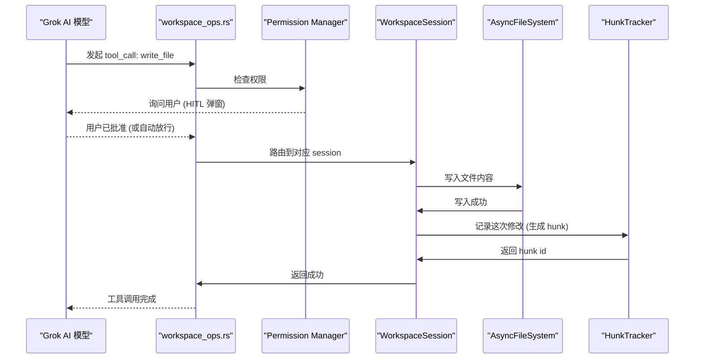

[← 返回首页](index.md)

# 工作区与文件系统

## 一句话：Grok 怎么“看到”你的代码？

想象一下，你让一个新同事去你电脑上改代码。他得先知道你的项目文件夹在哪、哪些文件能看、哪些权限需要你点头、以及怎么用 Git 来回退。Grok 的“工作区系统”就是这个同事的“大脑和双手”——它管理着一个虚拟文件系统、一套权限引擎、Git 集成，以及 checkpoint（检查点）机制，让 AI 能安全地操作你的代码。

整个系统围绕 `crates/codegen/xai-grok-workspace` 这个 crate 构建。入口在 `src/lib.rs`，它把所有模块（文件系统、Git、权限、Hub 通信等）粘在一起。

---

## 核心架构：一个三层的“委托模型”

Grok 的工作区不是直接读写你硬盘上的文件。它经过了三层委托，像极了公司里的层层审批：

```
flowchart TD
    A["Grok AI 模型"] -->|发起工具调用| B["workspace_ops.rs<br/>(操作路由层)"]
    B --> C{"Local 还是 Proxy?"}
    C -->|"Local (本地模式)"| D["WorkspaceHandle<br/>(本地会话调度)"]
    C -->|"Proxy (远程模式)"| E["Hub WebSocket<br/>(通过 Hub 转发)"]
    D --> F["WorkspaceSession<br/>(每个会话有自己的状态)"]
    F --> G["AsyncFsWrapper<br/>(虚拟文件系统)"]
    F --> H["session::git<br/>(Git 操作)"]
    F --> I["HunkTracker<br/>(变更追踪)"]
    F --> J["Permission Manager<br/>(权限审批)"]
    E --> K["远程 Workspace Server"]
```

`src/workspace_ops.rs` 里定义了两种模式：`Local` 和 `Proxy`。Local 模式下，工具调用直接通过 `WorkspaceHandle` 调度到本地的 `WorkspaceSession`；Proxy 模式下，一切通过 Hub WebSocket 转发到远程的工作区服务器。一个很贴心的设计是：每个 RPC 方法都有对应的请求结构体，实现了 `WorkspaceRpc` trait，这样你改一个字段，编译器两边都能检查到——保证你不会发错请求格式。

---

## 虚拟文件系统：真文件 vs 远程文件

Grok 不直接调用 `std::fs::read`。它用了一个 trait 抽象——`AsyncFileSystem`，定义在 `src/file_system/fs.rs`：

```rust
// 这是文件系统的“接口”，任何后端都要实现它
#[async_trait]
pub trait AsyncFileSystem: Send + Sync {
    fn root(&self) -> &Path;
    async fn exists(&self, path: &Path) -> Result<bool, FsError>;
    async fn read_file(&self, path: &Path) -> Result<Vec<u8>, FsError>;
    async fn write_file(&self, path: &Path, data: &[u8]) -> Result<(), FsError>;
    async fn delete_file(&self, path: &Path) -> Result<(), FsError>;
}
```

这就像你给公司配了统一的“公文处理流程”：不管是本地文件、远程文件还是沙箱文件，都走同一套接口。`AsyncFsWrapper` 是一个更友好的包装，它接受各种路径类型（`AbsPathBuf`、`RelPathBuf`、`&Path`），自动用文件系统的 `root()` 来解析相对路径。

在本地模式下，`LocalFs` 就是直接读写磁盘；在远程模式下，走的是一套 ACP 协议 RPC。两者对调用者透明——你只要说“读这个文件”，它自己知道怎么拿到。

---

## 权限引擎：AI 想做的事情，得先问你一声

Grok 不会偷偷改你的代码。每次 AI 想执行一个“敏感”操作（比如写文件、跑命令），都会经过 `crates/codegen/xai-grok-workspace/src/permission/` 下的权限引擎。

这个引擎在 `src/permission/mod.rs` 里暴露了核心模块：

```
flowchart LR
    A["AI 发起工具调用"] --> B["Permission Manager<br/>(权限管理器)"]
    B --> C{"什么模式?"}
    C -->|"AutoMode<br/>(一键放行)"| D["自动分类器<br/>(判断是否是安全操作)"]
    C -->|"HITL<br/>(人在回路)"| E["弹窗提醒用户<br/>(通过 Hub 发通知)"]
    D -->|"安全操作"| F["直接放行"]
    D -->|"不安全操作"| E
    E --> G{"用户同意?"}
    G -->|"是"| F
    G -->|"否"| H["拒绝并返回错误"]
```

`src/permission/manager.rs` 里的 `PermissionHandle` 是总开关。`yolo_mode`（全部放行模式）可以在会话级别开启，但默认是关闭的——AI 要写文件，得等你点“允许”。

还有一套“自动分类器”（`src/permission/auto_mode.rs`），它用一个小模型判断这个操作是不是“安全的”（比如读代码、搜索文件），如果是就直接放行，不用每次都问你。这就是为啥你用 Grok 看代码时很流畅，但让它改文件时偶尔会停一下等你确认。

---

## Git 集成：版本控制的“遥控器”

AI 帮你在 Git 仓库里干活，可不是直接调 `git` 命令的。Grok 通过 `src/session/git.rs` 封装了一套异步 Git 操作，所有功能都走 `WorkspaceOp` trait，统一由 `workspace_ops.rs` 路由。

看看 `GitCheckoutCommitReq` 是怎么实现的，在 `src/workspace_ops.rs` 里：

```rust
#[async_trait]
impl WorkspaceOp for GitCheckoutCommitReq {
    async fn execute(
        &self,
        _ws: &WorkspaceHandle,
        _session_id: Option<&str>,
    ) -> WorkspaceResult<Self::Response> {
        // 先看是不是已经在目标 commit 上
        if let Some(current) = crate::session::git::get_current_commit(git_root).await
            && current == *head_commit
        {
            return Ok(CheckoutCommitResponse {
                checked_out: true, stashed: false, fetched: false, error: None,
            });
        }
        // 如果有改动，先 stash
        let mut stashed = false;
        if self.stash_if_dirty {
            // 检查有没有未提交的改动……
        }
        // 尝试 checkout，如果本地没有就 fetch 再试
        // 失败的话还记得把 stash pop 回来
    }
}
```

这个实现很贴心：如果目标 commit 已经 checkout 了就直接返回；如果工作区有未提交改动，可以自动 stash 再切；如果本地没有这个 commit，还能自动 fetch 远程仓库。万一失败了，它会把 stash pop 回来，不会让你丢代码。

其他 Git 操作也类似：`GitCommitReq`、`GitStageReq`、`GitDiffReq`、`GitBranchesReq`……每个都是独立的 `WorkspaceOp` 实现，按需路由。一个关键的细节是 `git_op_cwd` 函数——它根据调用方提供的 `git_root` 决定在哪个目录执行 Git 命令，这样可以支持多个仓库会话共存。

---

## Checkpoint（检查点）：像游戏存档一样回退

Grok 每一轮对话结束时，都会拍一张“快照”，记录当前的文件状态。这样如果 AI 搞砸了，你可以回退到对话的某个节点。

这个机制由 `src/session/checkpoint.rs` 和 `src/session/checkpoint_store.rs` 实现。每个 WorkspaceSession 都维护着：

- `hunk_checkpoints`：内存中的每轮变更 delta（增删改的记录），按 `prompt_index`（提示索引）分组。
- `git_checkpoints`：Git 领域的检查点（HEAD 和 staged 集合）。
- `checkpoint_store`：磁盘上的持久化镜像，即使进程重启也能恢复。

回退操作通过 `RewindToReq` 实现：它会找到对应轮次的 checkpoint，反向应用所有变更，把文件系统恢复到那个时刻的状态。这就像游戏里的“读档”——不过 Grok 读的是你的代码文件。

---

## 会话与会话隔离：每个聊天窗口一个独立沙箱

每个 Grok 对话窗口绑定一个 `WorkspaceSession`，定义在 `src/session/mod.rs` 里：

```rust
pub struct WorkspaceSession {
    pub(crate) session_id: String,          // 唯一标识
    pub(crate) cwd: PathBuf,               // 当前工作目录
    pub(crate) session_env: Arc<HashMap<String, String>>, // 环境变量
    pub(crate) capability_mode: CapabilityMode,  // 能力模式
    pub(crate) depth: u32,                  // 嵌套深度
    pub(crate) fork_budget: u32,            // 分支预算
    pub(crate) hunk_tracker: HunkTrackerHandle,  // 变更追踪
    pub(crate) async_fs: AsyncFsWrapper,    // 虚拟文件系统
    // ……还有更多字段
}
```

每个会话都有独立的 `cwd`、环境变量、`HunkTracker`（追踪哪些行被改过）、`mcp_state`（MCP 协议状态）、`yolo_mode`（一键放行开关）。一个会话里的 AI 操作不会影响另一个会话——你可以在一个窗口里让 Grok 改项目 A，另一个窗口里改项目 B，互不干扰。

`HubHandle`（在 `src/hub.rs` 里）管理多个会话的 WebSocket 连接。它像一个“接线员”，把不同会话的请求路由到对应的 `WorkspaceSession`。会话是通过 `session.bind` 消息动态创建的，不是启动时就建好所有会话。

---

## 一张完整的时序图：AI 写文件的全过程

看看 Grok 帮你写一个文件时，背后发生了什么：



每一步都可能出错：权限被拒、文件被锁、磁盘空间不足——但每个 `WorkspaceOp` 的实现都有完善的错误处理，返回 `WorkspaceError`，不会让 AI 卡死。

---

## 关键文件速查表

| 文件 | 作用 | 一句话说明 |
|---|---|---|
| `crates/codegen/xai-grok-workspace/src/lib.rs` | 工作区 crate 入口 | 把所有模块粘在一起，暴露公共 API |
| `src/workspace_ops.rs` | 操作路由层 | 决定每个工具调用是本地执行还是通过 Hub 转发 |
| `src/file_system/fs.rs` | 虚拟文件系统接口 | 定义读写文件的统一协议，支持本地/远程/沙箱 |
| `src/permission/mod.rs` | 权限引擎主模块 | 自动放行或弹窗询问用户，控制 AI 能做什么 |
| `src/session/mod.rs` | 会话管理 | 每个对话窗口一个隔离沙箱，独立状态 |
| `src/session/git.rs` | Git 操作封装 | 异步 Git 命令，支持自动 stash/fetch/checkout |
| `src/session/checkpoint.rs` | 检查点机制 | 每轮对话拍快照，支持回退到任意节点 |
| `src/hub.rs` | Hub 连接管理 | 维护与远程服务器的 WebSocket 连接，路由多个会话 |

---

## 跟其他页面的关系

- 工具怎么注册和调用？详见《工具系统：AI 的"工具箱"》
- 聊天状态和 Agent 怎么管理对话？详见《聊天状态与智能体生命周期》
- MCP 协议和沙箱怎么隔离危险操作？详见《钩子、MCP 协议与沙箱》
- 快速工作树怎么 clone 出副本？详见《快速工作树与代码图》

工作区系统是 Grok 的“基础设施层”——它不直接跟用户聊天，但支撑了所有跟文件、代码、版本控制相关的操作。没有它，Grok 就是个只能聊天的哑巴；有了它，Grok 才能帮你真正干活。
