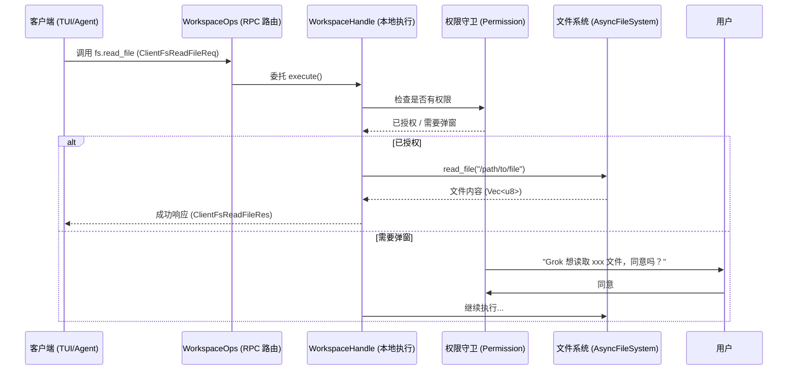
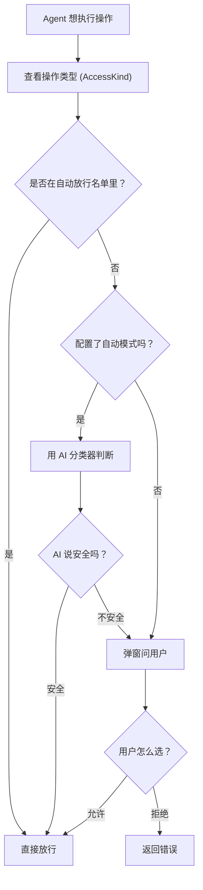
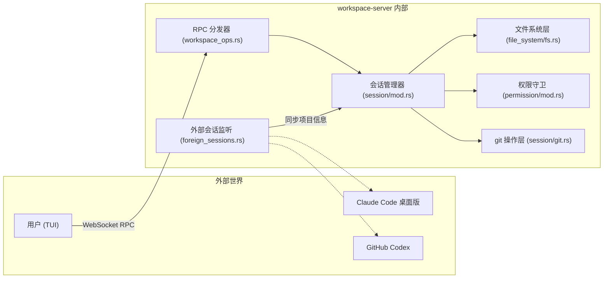

[← 返回首页](index.md)

# 工作区服务器：跟本地代码打交道的管家

## 先讲个故事：想象你雇了一个私人助理

你（用户）坐在咖啡馆里，给助理（Grok）发微信说：“帮我看看项目根目录的 `Cargo.toml`，顺便查一下 git 状态。”

助理不能直接冲进你家翻抽屉——太危险了。所以他得先联系你家的大管家（**workspace-server**）。管家认识你家所有东西：文件放在哪个柜子（文件系统）、有没有装修记录（git 历史）、哪些抽屉上锁了（权限守卫）、以及隔壁老王（Claude Code 桌面版）最近借走了什么。

管家收到助理的请求后，会做三件事：
1. **检查权限**——先看看你之前有没有授权过这种操作。如果没授权，他会弹个窗问你：“助理要看 `Cargo.toml`，同意吗？”
2. **执行操作**——你点头了，他就去对应抽屉里拿文件、跑 `git status`。
3. **返回结果**——把文件内容和 git 状态打包好，通过 WebSocket 送回助理。

整个过程里，助理从来不需要直接碰你的硬盘——全凭管家转手。这就是 **xai-grok-workspace** 干的事。

## workspace-server 是个什么进程

`crates/codegen/xai-grok-workspace/src/lib.rs` 是整个 crate 的入口。它导出了一堆模块：

```rust
// lib.rs 的核心模块
pub mod file_system;    // 文件系统抽象层
pub mod session;        // 会话管理（git、hunk追踪）
pub mod permission;     // 权限守卫
pub mod hub;            // WebSocket 连接管理器
pub mod foreign_sessions; // 监视其他 AI 工具
pub mod workspace_ops;  // 所有 RPC 操作的定义和实现
```

workspace-server 是一个长期运行的守护进程。它通过 WebSocket 连接到中心 Hub（`xai-computer-hub`），对外提供 RPC 服务。其他进程（比如 TUI 里的 Agent 运行时）通过 `WorkspaceOps` 这个接口来调用它——`crates/codegen/xai-grok-workspace/src/workspace_ops.rs` 里定义了所有可调用的操作，比如：

```rust
// workspace_ops.rs 的 RPC 操作枚举（简化版）
pub use xai_grok_workspace_types::rpc::fs::{
    ClientFsReadFileReq,    // 读文件
    ClientFsListReq,        // 列出目录
};
pub use xai_grok_workspace_types::rpc::git::{
    GitStatusReq,           // 查看 git 状态
    GitDiffReq,             // 查看差异
    GitCommitReq,           // 提交
};
```

每个操作都对应一个请求结构体，实现了 `WorkspaceRpc` trait。这个 trait 定义了 `METHOD` 常量（比如 `"fs.read_file"`）和 `Response` 类型。这样当代码添加一个新字段时，编译器能检查到两边不匹配——`workspace_ops.rs` 注释里写的“type safety”就是这个意思。

## 整体架构：一个请求怎么跑通



注意这张图里有个关键设计：`WorkspaceOps` 有两种模式（`workspace_ops.rs` 第一段注释）：

- **Local 模式**——所有操作直接通过 `WorkspaceHandle` 在本地进程内执行。这是 TUI 模式下使用的。
- **Proxy 模式**——所有操作序列化后通过 WebSocket 发给远程的 workspace-server 执行。这是远端 VSCode 或桌面客户端使用的。

```rust
// workspace_ops.rs 里的核心 trait
#[async_trait]
pub trait WorkspaceOp: WorkspaceRpc + DeserializeOwned + Send + Sync {
    /// 在本地模式下执行操作
    async fn execute(
        &self,
        ws: &WorkspaceHandle,
        session_id: Option<&str>,
    ) -> WorkspaceResult<Self::Response>;
}
```

每个具体的操作（比如读文件、git diff）都实现了这个 `execute` 方法。以读文件为例：

```rust
// 实际代码在 workspace_ops.rs 里，但读文件操作的 exec 类似：
// （简化逻辑，真实实现会先权限检查再调用文件系统）
async fn execute(&self, ws: &WorkspaceHandle, _session: Option<&str>) -> ... {
    let fs = ws.file_system();  // 获取文件系统句柄
    let data = fs.read_file(&self.path).await?;
    Ok(ClientFsReadFileRes { data })
}
```

## 文件系统：管家手里的万能钥匙

`crates/codegen/xai-grok-workspace/src/file_system/fs.rs` 定义了一个核心 trait：`AsyncFileSystem`。它就是个“读、写、删”三件套的抽象接口：

```rust
#[async_trait]
pub trait AsyncFileSystem: Send + Sync {
    fn root(&self) -> &Path;                         // 此文件系统的根目录
    async fn exists(&self, path: &Path) -> Result<bool, FsError>;
    async fn read_file(&self, path: &Path) -> Result<Vec<u8>, FsError>;
    async fn write_file(&self, path: &Path, data: &[u8]) -> Result<(), FsError>;
    async fn delete_file(&self, path: &Path) -> Result<(), FsError>;
}
```

为什么要有这个抽象？因为 Grok 可能运行在不同“环境”里：
- **LocalFs**——直接操作本地磁盘（最常用的）
- **ACL (Access Control List) 文件系统**——加了远程权限控制的版本，比如企业服务器上的文件
- **内存文件系统**——用于测试

`AsyncFsWrapper`（同一个 `.rs` 文件）是一个方便的包装器，它自动帮你把相对路径解析成绝对路径：

```rust
// fs.rs 里的 AsyncFsWrapper
pub struct AsyncFsWrapper {
    inner: Arc<dyn AsyncFileSystem>,
}

impl AsyncFsWrapper {
    pub async fn read_to_string<P: ToAbsPath>(&self, path: P) -> Result<String, FsError> {
        let bytes = self.inner.read_file(&path.to_abs_path(self.root())).await?;
        bytes_to_string(bytes)
    }
}
```

这样在代码里可以写 `fs.read_to_string(Path::new("relative/path"))`，它会自动拼接 root 目录变成绝对路径。

## 权限守卫：管家不让你拿的东西你就拿不到

`crates/codegen/xai-grok-workspace/src/permission/mod.rs` 是 Grok 的安全看门狗。每次 Agent 想干“危险事”（读写文件、执行命令、修改 git）之前，都要先过他这关。

权限判断的流程是这样的：



关键的设计点在 `permission/auto_mode.rs` 里：它有个 `HeuristicPermissionClassifier`（启发式权限分类器），能根据操作特征（比如读一个已知的项目配置文件 vs 写系统目录）快速判断。还有 `LlmPermissionClassifier`（大模型权限分类器），对更复杂的情况让 AI 自己判断。

```rust
// permission/mod.rs 导出的关键类型
pub use types::{AccessKind, ClientType, Decision, PermissionCommand, PermissionEvent};
```

每个权限请求都有一个 `PermissionCommand`，包含操作的全上下文：哪个客户端、要做什么、涉及哪些文件。然后 `PermissionManager` 根据这些信息决定是弹窗、直接允许、还是拒绝。

## git 操作：管家帮你管装修队

Grok 可以像你一样操作 git：查看状态、提交、推送、切换分支、stash……这些全在 `crates/codegen/xai-grok-workspace/src/session/git.rs` 里实现（模块由 `session/mod.rs` 导出）。

`workspace_ops.rs` 里实现了一长串 git 对应的 RPC 操作，比如：

```rust
// workspace_ops.rs 里 git 操作的一个例子
#[async_trait]
impl WorkspaceOp for GitStatusExtReq {
    async fn execute(&self, ws: &WorkspaceHandle, _session_id: Option<&str>) -> WorkspaceResult<Self::Response> {
        let cwd = git_op_cwd(ws, &self.git_root)?;  // 确定操作目录
        let data = crate::session::git::status(
            &cwd,
            self.include_untracked,
            self.include_stats,
            self.ignore_submodules,
            self.include_patches,
        ).await?;
        Ok(GitStatusExtResponse::structured(data))
    }
}
```

这里有个很贴心的设计：`git_op_cwd` 函数——`workspace_ops.rs` 第 95 行。它优先使用请求里显式指定的 `git_root`（比如用户指定了工作区目录），否则才回退到 workspace 的默认根目录。这样不同窗口不同项目时不会互相干扰。

还有 `GitCheckoutCommitReq` 的实现（`workspace_ops.rs` 第 244 行）展示了完整的“安全切换”逻辑：先检查当前 HEAD 是不是目标 commit，是就直接跳过；不是的话，如果工作区有未保存内容，自动 stash；如果 checkout 失败（比如远程分支没拉过），先 fetch 再重试——重试还失败，就把 stash 的内容 pop 回来。每一步都有错误恢复。

## 会话管理：管家怎么记住每个顾客

管家可能同时服务好几个“顾客”——多个 Grok 窗口、不同编辑器实例。每个顾客有自己的会话（`WorkspaceSession`）。

`crates/codegen/xai-grok-workspace/src/session/mod.rs` 定义了 `WorkspaceSession` 结构体：

```rust
pub struct WorkspaceSession {
    pub(crate) session_id: String,           // 会话唯一 ID
    pub(crate) cwd: PathBuf,                 // 当前工作目录
    pub(crate) hunk_tracker: HunkTrackerHandle, // 追踪文件改动
    pub(crate) file_state_tracker: Arc<FileStateTracker>, // 文件状态
    pub(crate) git_checkpoints: GitCheckpointStore, // git 检查点
    pub(crate) checkpoint_store: CheckpointStore,   // 持久化检查点
    // ...更多字段
}
```

每个会话拥有：
- **独立的文件系统上下文**——`cwd` 和 `async_fs`
- **独立的 git 状态**——可以回滚到之前的任何检查点
- **独立的改动追踪**——`hunk_tracker` 记录 Agent 生成然后被用户采纳/拒绝的代码块

## 监视其他 AI 工具：管家还知道隔壁在干啥

`crates/codegen/xai-grok-workspace/src/foreign_sessions.rs` 这个模块做了一件很有意思的事：**监视你电脑上运行的其他 AI 编程工具**（比如 Claude Code 桌面版、GitHub Codex），发现它们打开的项目，然后把信息同步到 Grok 里。

工作原理（从 `foreign_sessions` 模块注释推测）：
1. 轮询检查其他工具留下的临时文件/日志，看看它们在哪个项目里工作
2. 把发现的结果作为“外部会话”注册到 workspace 里
3. 当你切换到 Grok 时，Grok 知道你在另一个工具里正在改什么

这意味着你可以在 Claude Code 里改了一个文件，切回 Grok 继续——Grok 已经知道你打开了哪个项目。

## 完整的调用链路图



## 配置指南：怎么启动 workspace-server

如果你要手动启动或调试 workspace-server，可以直接从 `WorkspaceConfig`（定义在 `crates/codegen/xai-grok-workspace/src/config.rs`）入手。

一个典型的启动流程（参考 `lib.rs` 的 `connect_local_workspace` 函数）：

```bash
# 设置 GROK_HOME（工作区根目录）
export GROK_HOME=$HOME/.grok-build

# 启动 workspace-server（简化命令）
grok workspace start

# 如果你要自定义 hub 地址（远程模式）
grok workspace start --hub-url ws://localhost:8484
```

至于怎么跟 Grok 聊天、怎么问第一个问题，详见《快速上手：安装、运行、第一句对话》。

## 总结

| 模块 | 文件路径 | 一句话干的事 |
|------|---------|------------|
| 文件系统抽象 | `file_system/fs.rs` | 定义读写删三件套接口，支持本地/远程/内存三种后端 |
| RPC 操作 | `workspace_ops.rs` | 所有可调用的操作（读文件、git diff、提交等） |
| 权限管理 | `permission/mod.rs` | 每次危险操作前检查，弹窗或自动放行 |
| 会话管理 | `session/mod.rs` | 每个窗口/实例独立的上下文，包含文件改动和 git 状态 |
| git 操作 | `session/git.rs` | git status/diff/commit/checkout 等实现 |
| 外部会话 | `foreign_sessions.rs` | 监视 Claude Code 等工具打开的项目 |
| WebSocket Hub | `hub.rs` | 连接到中心服务器，提供远程 RPC 能力 |
