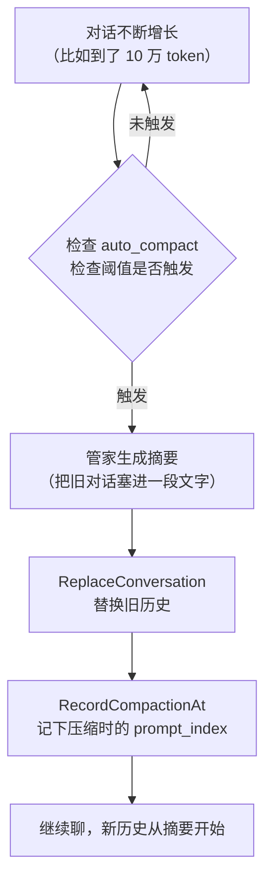
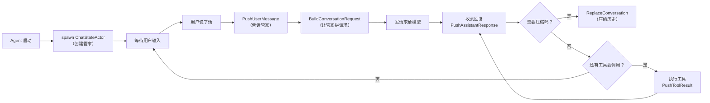

[← 返回首页](index.md)

# 聊天状态与智能体生命周期

## 一个小工人的故事：ChatStateActor 就是你的管家

想象一下，你（用户）在办公室里跟一个叫 Grok 的实习生（AI 智能体）一起干活。你每说一句话、每改一个文件，都需要有人记下来——谁说了什么、做到了哪一步、用了多少 token（你可以把它理解成“说话的力气”）。

这个记东西的人，就是 **ChatStateActor**（你看它的文件 `crates/codegen/xai-chat-state/src/actor/mod.rs`）。它不是真正的 AI，它是个**小工人**，专门负责管所有聊天记录、用量统计、回退操作等等，而且它**只在一个专门的 tokio 任务里**（tokio 是 Rust 里跑多任务的库）干活，其他人想改数据都得跟它打报告。

这个小工人有几个特点：

- **它独占所有数据**。数据都在它自己肚子里，别人不能直接翻，只能通过发命令（command）来问或改。
- **它一次只干一件事**。所有命令排队进来，它一件一件处理，绝不打架。这避免了多线程改同一个变量出 bug。
- **它能快照（snapshot）**。随时可以把当前状态拍个照存下来，以后可以“回退”到这一刻。
- **它会在对话变长时压缩记忆**。就像你记笔记记太多会翻前面的页，它会定期把旧内容压缩成摘要，省 token。

```
sequenceDiagram
    participant User as "用户（你）"
    participant PagerUI as "终端界面 (Pager)"
    participant EventLoop as "事件循环"
    participant Agent as "Agent (智能体)"
    participant CSA as "ChatStateActor (管家)"
    participant Model as "AI 模型"

    User->>PagerUI: 敲键盘说"帮我改个bug"
    PagerUI->>EventLoop: 投递按键事件
    EventLoop->>Agent: 路由到智能体
    Agent->>CSA: PushUserMessage (把用户消息记下来)
    CSA-->>Agent: 好了，记下了
    Agent->>CSA: BuildConversationRequest (拼请求)
    CSA-->>Agent: 给你完整的请求数据
    Agent->>Model: 发送推理请求
    Model-->>Agent: 流式返回回复
    Agent->>CSA: PushAssistantResponse (记下回复)
    Agent->>CSA: RecordTokenUsage (记下用了多少 token)
    Agent->>CSA: Flush (写盘)
```

## 小工人肚子里有什么？

小工人有个**内部状态结构体**，就在 `crates/codegen/xai-chat-state/src/actor/state.rs` 里，叫 `ChatState`。它肚子里装着这些家当：

| 字段 | 是什么 | 大白话 |
|------|--------|--------|
| `conversation` | `Vec<ConversationItem>` | 整个对话历史，一条接一条 |
| `sampling_config` | `SamplingConfig` | 当前用哪个模型、上下文窗口多大 |
| `prompt_index` | `usize` | 用户问了几轮了，从 0 开始数 |
| `total_tokens` | `u64` | 截止到现在一共用了多少 token |
| `agent_edited_paths` | `BTreeSet<String>` | 这个会话里改过哪些文件 |
| `turn_capture` | `Option<TurnCaptureState>` | 当前这一轮的消息范围，方便后面拿出来 |
| `credentials` | `Credentials` | 用户登录凭据（比如 API Key） |
| `prompt_usage` / `session_usage` | `UsageLedger` | 这一轮 / 整个会话花了多少钱 |

所有字段都是小工人自己独占的，外人想碰都得走命令通道。

## 命令系统：别人怎么跟小工人说话

小工人不开门迎客，它只通过一个**命令通道（mpsc 通道）**接收消息。所有命令定义在 `crates/codegen/xai-chat-state/src/commands.rs` 里。

命令分两大类：

### 写操作（Mutation）：告诉小工人“记下来”
这些是“发了就不管了”的。比如：

- `PushUserMessage` —— 用户说了一句话，记进去
- `PushAssistantResponse` —— 模型的回复到了，记进去
- `PushToolResult` —— 工具执行结果回来了，记进去
- `RecordTokenUsage` —— 这一轮花了多少 token，记下来
- `ReplaceConversation` —— 替换整个对话历史（比如压缩后）
- `BeginTurnCapture` —— 开始记录这一轮的消息范围

```rust
// 来自 commands.rs 的真实代码
ChatStateCommand::PushUserMessage { item: ConversationItem },

ChatStateCommand::RecordTokenUsage { total_tokens: u64 },

ChatStateCommand::ReplaceConversation {
    items: Vec<ConversationItem>,
    is_compaction: bool,
},
```

### 读操作（Query）：问小工人“现在咋样了”
这些是“问一句，等答案”的，通过 `oneshot` 通道（一次性的发-收通道）回复：

- `GetConversation` —— 把整个对话历史抄一份给我
- `GetTotalTokens` —— 当前用了多少 token 了？
- `Snapshot` —— 给我拍个快照，我以后可能要回退
- `HasDanglingToolCalls` —— 有没有悬空的工具调用？（工具调了但结果没回来）
- `CheckAutoCompactNeeded` —— 对话是不是太长了，该压缩了？

```rust
// 来自 commands.rs 的真实代码
ChatStateCommand::GetTotalTokens {
    reply: oneshot::Sender<u64>,
},

ChatStateCommand::Snapshot {
    reply: oneshot::Sender<ChatStateSnapshot>,
},
```

小工人收到命令后，在 `handle_command` 方法里逐个处理，就在 `crates/codegen/xai-chat-state/src/actor/mod.rs` 的 88-220 行附近。

## 记忆压缩：对话太长时的省 token 术

聊得久了，小工人肚子里装的东西会越来越多。每次跟 AI 模型交互都带着整段历史，太费 token 了（token 花钱啊）。

这时候就需要**压缩（compaction）**。小工人会把旧的对话内容提炼成一段摘要，然后替换掉原来的长长历史。



这个压缩逻辑主要依赖 `xai_grok_compaction` 这个 crate，而小工人负责调用。你可以在 `commands.rs` 里看到 `ReplaceConversation` 命令的 `is_compaction` 字段——为 true 就表示这是一次压缩操作。

压缩后的旧内容会被写到磁盘上，通常放在 `compaction/` 目录下（相关代码在 `compaction_transcript.rs`），每个压缩段会生成一个 `.md` 文件，里面包含了摘要、统计信息和精简后的对话。

## 回退（Rewind）：你可以让时间倒流

你有没有过这种经历：跟 AI 聊着聊着，它走偏了，你想回到某一轮之前重新来过？

小工人支持这个，靠的是**快照（snapshot）**。你可以在任何时候让小工人拍个快照：

```rust
ChatStateCommand::Snapshot {
    reply: oneshot::Sender<ChatStateSnapshot>,
}
```

然后把快照保存起来。想回退时，发一个 `RestoreSnapshot` 命令，小工人就把整个状态恢复成快照时的样子：

```rust
ChatStateCommand::RestoreSnapshot(Box<ChatStateSnapshot>),
```

或者更精确一点，你可以指定“回退到第几轮”：

```rust
ChatStateCommand::TruncateToPromptIndex {
    target_prompt_index: usize,
    reply: oneshot::Sender<()>,
},
```

这会把第 `target_prompt_index` 轮之后的所有消息都砍掉，就像没发生过一样。

## 生命周期：Agent 怎么跟小工人配合

小工人不是单打独斗的。它跟 **Agent**（主动干活的智能体）是一对搭档。

典型的对话流程是这样的：

1. **初始化**：Agent 启动时，创建一个 `ChatStateActor`，传入初始的系统消息和模型配置。
2. **用户输入到达**：Agent 收到用户消息后，发给小工人 `PushUserMessage`。
3. **构建请求**：Agent 让小工人 `BuildConversationRequest`，小工人会把整个对话历史拼成一份请求（还会检查有没有悬空的工具调用，如果有就自动修复）。
4. **发请求**：Agent 把请求发给 AI 模型。
5. **收集回复**：模型流式返回时，Agent 每收到一段就发给小工人 `PushAssistantResponse`。
6. **工具调用**：如果回复里有工具调用（比如“帮我读文件”），Agent 执行工具，然后把结果通过 `PushToolResult` 告诉小工人。
7. **结束一轮**：Agent 可以发 `Flush` 让持久化写盘，或者发 `RecordTokenUsage` 记下开销。
8. **下一轮**：回到第一步。

如果途中发现对话太长，Agent 会调用小工人的 `CheckAutoCompactNeeded`，然后让小工人执行压缩。



## 持久化：小工人的账本写在哪？

小工人肚子里存着的数据不是纯内存的，它有一个持久化接口 `ChatPersistence`（在 `crates/codegen/xai-chat-state/src/persistence.rs` 里）。每轮结束或者有必要时，Agent 会发 `Flush` 命令，让小工人把当前状态写到磁盘。

这样即使程序崩溃了，重新启动时也能从磁盘恢复对话。

## 常见问题：新手容易踩的坑

### 1. “为什么我改了对话历史，模型还是记着旧的东西？”

因为小工人只负责**记录**，不负责**清洗**。如果你用 `ReplaceConversation` 替换了历史，但没重新构建请求，Agent 可能还是用旧缓存。正确的流程是：先替换，再 `BuildConversationRequest`，最后重新发请求。详见《采样引擎与遥测系统》页面。

### 2. “悬空的工具调用是什么？”

有时候模型会要求调用一个工具，但工具还没执行完程序就崩溃了。重启后，`chat_history.jsonl` 里会有一条“Assistant”消息带了 `tool_calls`，但没有对应的 `ToolResult`。小工人启动时（`ChatState::new` 里）会自动检测并修复这种情况，用 `DanglingToolCallReason::UserCancelled` 标记。相关代码在 `crates/codegen/xai-chat-state/src/actor/state.rs` 的 `ChatState::new` 方法里。

### 3. “压缩后为什么我的回复不见了？”

压缩只是把**旧的**历史浓缩成一段摘要，**最新的**一轮完整保留。如果你发现某条回复丢了，可能是回退（rewind）操作导致的——它直接砍掉了后面的所有内容。检查 `TruncateToPromptIndex` 是不是用错了索引。
