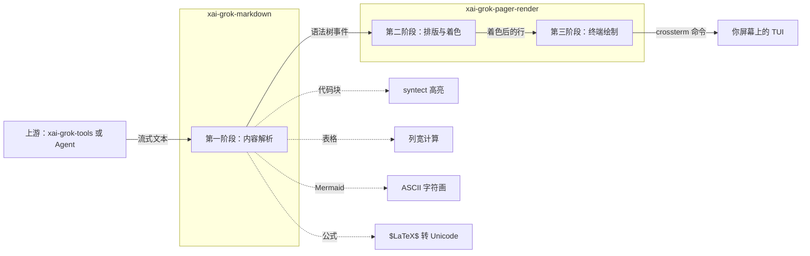
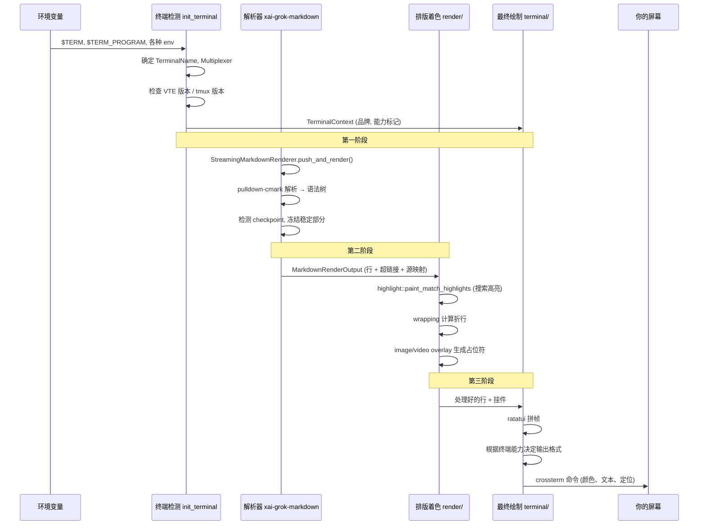
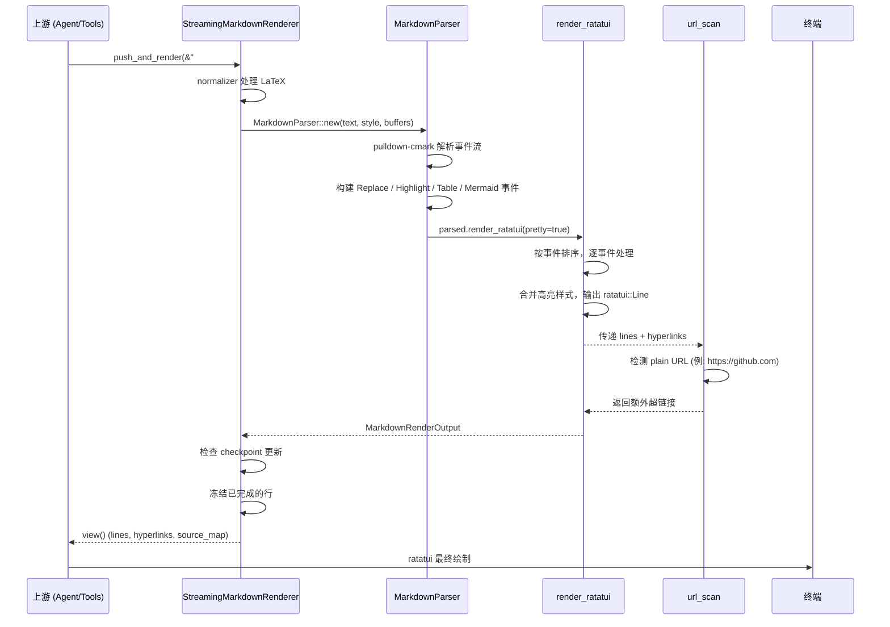

[← 返回首页](index.md)

# 终端渲染引擎：如何把 Markdown 变成赏心悦目的 TUI

当你在 terminal 里问 Grok 一个问题，它噼里啪啦地回复你一大段话，带代码高亮、表格、甚至 Mermaid 图表——这一切是怎么在简陋的字符终端里实现的？

答案全在 **xai-grok-pager-render**（显示器驱动）和 **xai-grok-markdown**（排版引擎）这两个 crate 里。它们像一家印刷厂的三条流水线：第一道把 Markdown 原文切分成段落、代码块、表格等零件；第二道给每个零件上色、排版、折行；第三道把所有零件拼成完整的帧，最后通过 crossterm 发到你屏幕上。

## 三阶段渲染流水线

整个渲染过程分为三个清晰的阶段：



### 第一阶段：内容解析（xai-grok-markdown）

`StreamingMarkdownRenderer`（`crates/codegen/xai-grok-markdown/src/streaming.rs`，第82行）是整个引擎的入口。它接收 LLM 流式返回的文本片段，积攒到内部 buffer 里，然后交给 `pulldown-cmark` 解析器拆成事件。

关键设计：它不重新渲染整个文档，而是只重绘“尾巴”。每次收到新数据后，它会检测 **checkpoint**（稳定块边界），把检查点之前的内容冻结起来，只重绘后面的新部分。这就是代码里 `frozen` 字段的使命——记录已冻结的行数和源字节数。

```rust
// crates/codegen/xai-grok-markdown/src/streaming.rs 第 89-95 行
pub(crate) struct FrozenState {
    /// 已冻结的行数
    pub(crate) lines_len: usize,
    /// 已冻结的源字符数
    pub(crate) source_bytes: usize,
    /// 下一个链接 ID（仅当 checkpoint 推进冻结边界时才递增）
    pub(crate) next_link_id: u32,
}
```

解析阶段还做了两件微妙的事：

1. **LaTeX 归一化**：在 `crates/codegen/xai-grok-markdown/src/lib.rs` 第 107 行，`normalize_latex_delimiters` 把 `\(...\)`、`\[...\]`、`\begin{equation}` 统一转成 `$`/`$$` 形式，这样后面的数学处理器只需处理一种格式。

2. **链接检测**：`url_scan` 模块（`crates/codegen/xai-grok-markdown/src/url_scan.rs`）在渲染完成后扫描 plain URL，给它们加上可点击的超链接信息。

解析完成后，`render_markdown_ratatui_with_link_id`（`crates/codegen/xai-grok-markdown/src/lib.rs` 第 130 行）把解析结果转换成 ratatui 的 `Line` 向量。

### 第二阶段：排版与着色（xai-grok-pager-render）

解析出来的行进入 `xai-grok-pager-render/src/render/` 下的各个子模块，逐个处理：

| 子模块 | 文件路径 | 干什么 |
|--------|----------|--------|
| `highlight.rs` | `crates/codegen/xai-grok-pager-render/src/render/highlight.rs` | 搜索高亮：把匹配用户搜索词的行反过来显示（`REVERSED` 属性） |
| `wrapping.rs` | 同目录下 | 计算每行在指定宽度下怎么折行 |
| `image_overlay/` | `crates/codegen/xai-grok-pager-render/src/render/image_overlay.rs` | 把图片 URL 转成终端占位符或 Kitty 协议内嵌图 |
| `video_overlay/` | `crates/codegen/xai-grok-pager-render/src/render/video_overlay.rs` | 类似，为视频 URL 生成占位符 |
| `renderable.rs` | `crates/codegen/xai-grok-pager-render/src/render/renderable.rs` | 定义 `Renderable` trait，所有可渲染元素的共同接口 |

#### 搜索高亮的秘密

`paint_match_highlights` 函数（`crates/codegen/xai-grok-pager-render/src/render/highlight.rs` 第 32 行）是个典型的后处理：等一行画完了，再用正则匹配文本中所有搜索词的位置，把对应的 buffer cell 反转。

注意它的处理逻辑特别考虑了折行的情况——如果一行被折成多行（`single_row = false`），它用 `byte_range_to_row_cols` 把正则匹配拆到每一折行上：

```rust
// crates/codegen/xai-grok-pager-render/src/render/highlight.rs 第 75-86 行
for m in re.find_iter(text) {
    for seg in byte_range_to_row_cols(text, &ranges, m.start()..m.end()) {
        if seg.row < skip as usize { continue; }
        let y = row_y + (seg.row - skip as usize) as u16;
        if y >= viewport_bottom { break; }
        for col in seg.col_start..seg.col_end {
            let x = area.x + prefix_w + col as u16;
            if x < area.x + area.width {
                invert_cell(&mut buf[(x, y)]);
            }
        }
    }
}
```

### 第三阶段：终端绘制（xai-grok-pager-render）

所有处理好的行和一排“挂件”（滚动条、状态栏、输入框）最后在 `src/terminal/mod.rs` 里拼成完整帧。

但这个模块做的最关键的事，其实在更早的阶段——**终端检测**。`TerminalContext` 结构体（`crates/codegen/xai-grok-pager-render/src/terminal/mod.rs` 第 185 行）收集了关于你终端的所有情报：

- 你是哪种终端？（`TerminalName` 枚举：VS Code、Apple Terminal、Kitty、Windows Terminal……一共 20+ 种）
- 你用了 tmux 吗？是哪个版本？
- 终端支持 Kitty 键盘协议吗？支持 OSC 8 超链接吗？支持内嵌图片吗？

这个信息太重要了，因为不同终端的能力天差地别。比如 `kitty_skip_reason` 方法（第 340 行）决定是否启用 Kitty 键盘增强——如果检测到是 VS Code 的 xterm.js，就跳过（xterm.js 会在 Shift+Enter 时发错误的字节码）。



## 终端适配：为什么同一个东西在不同终端里长得不一样

这是最容易被忽略但极其重要的部分。`src/terminal/mod.rs` 的核心价值就是帮你回答“我现在是什么环境”，然后根据环境做出不同决策。

### 键盘协议适配

Kitty 键盘协议（KKP）能让终端区分 `Shift+Enter` 和 `Enter`、`Ctrl+.` 和 `.`。但不是所有终端都支持，直接尝试可能让某些终端崩掉。

```rust
// crates/codegen/xai-grok-pager-render/src/terminal/mod.rs 第 247 行
pub fn kitty_skip_reason(&self) -> Option<&'static str> {
    if matches!(self.brand, TerminalName::VsCode | TerminalName::Cursor | TerminalName::Windsurf | TerminalName::Zed) {
        return Some("vscode");
    }
    if self.brand == TerminalName::AppleTerminal {
        return Some("apple_terminal");
    }
    // ... 还有好几条分支
    None // ← 没有理由跳过，可以安全启用
}
```

`shift_enter_unavailable`（第 348 行）则根据这个判断，决定 UI 里提示用户用 `Alt+Enter` 还是 `Shift+Enter` 来插入新行——在不同终端里最佳实践完全不同。

### 内嵌图片适配

有些终端（Kitty、iTerm2）可以通过图形协议在终端里显示图片，而 tmux 会截断这些 escape sequence。`graphics_protocol_skip_reason`（第 382 行）遇到 tmux 就直接返回 `Some("tmux")`，这样上游就知道改用文字占位符。

## Markdown 渲染的完整时序

把前面所有的串起来，一次典型的 Markdown 渲染是这样跌跌撞撞地完成的：



## 最容易翻车的坑

**terminal/mod.rs 是整个 crate 里 bug 最多的地方。** 它的 `kitty_skip_reason` 和 `shift_enter_unavailable` 两个方法，每个返回不同环境下的不同结论，组合起来有几十种可能状态。测试文件 `crates/codegen/xai-grok-pager-render/src/terminal/test.rs` 专门写了几百行矩阵测试，确保每种 env 组合下 brand 检测正确。

**另一个坑：VTE 版本号。** VTE 终端（GNOME Terminal、Tilix 等）直到 0.82.0 才支持 Kitty 键盘协议，所以必须通过 `VTE_VERSION` env 变量解析出版本号，小于 8200 就当老终端处理。但很多 VTE 终端不设这个变量，`Vte` 检测到了但版本号 `None`——保险起见也当老终端。这就是 `shift_enter_unavailable` 里那个 `None => true` 分支的由来（第 366 行）。
