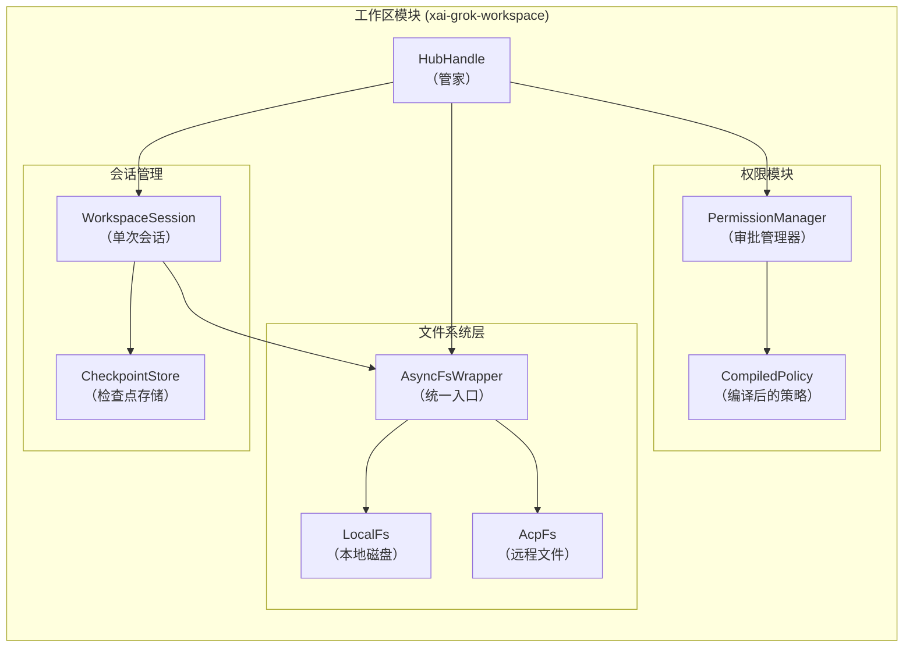
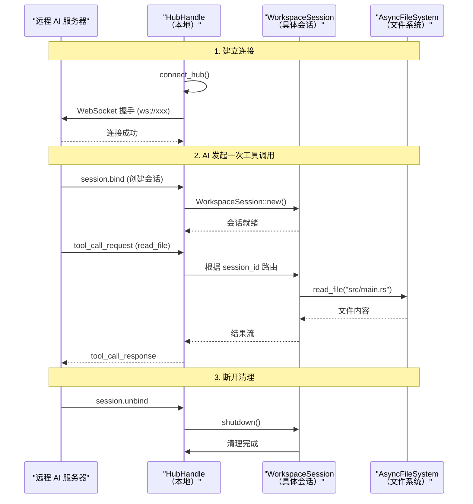
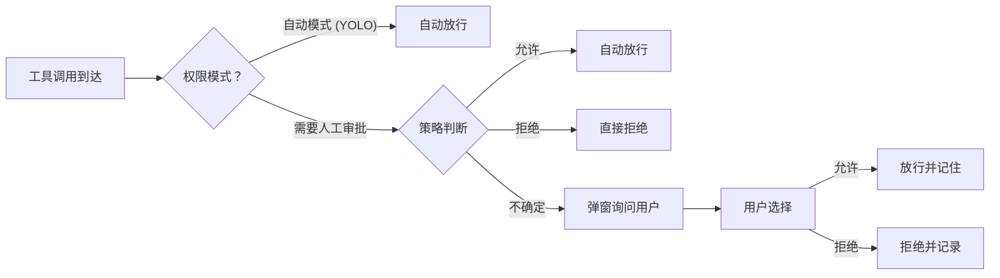
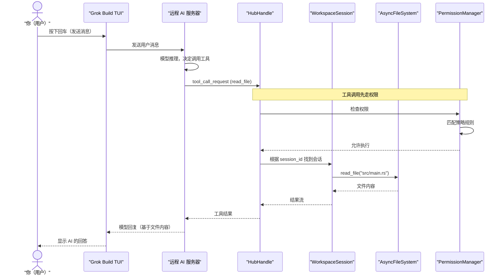

[← 返回首页](index.md)

# 工作区管理（Hub、文件系统、权限、会话）

## 一句话讲清楚：这个模块是干什么的

Grok Build 要在你的项目文件夹里干活——读代码、改文件、跑命令、查 Git 历史——这些事情不可能是 AI 自己瞎搞的，它需要一个“本地工地”来管理这一切。

**`xai-grok-workspace` 就是这个工地**。它负责：
- 启动时找到你的项目根目录（发现 `.git`、`.grok` 配置、插件等）
- 把文件操作统一成一套接口（不管文件是在本机磁盘上，还是通过远程协议来的）
- 决定每个操作要不要问一下你（权限审批）
- 跟踪每次对话的文件改动，支持“回滚到之前的状态”

核心文件都在 `crates/codegen/xai-grok-workspace/src/` 下。

## 架构总览：三个关键概念 + 一个管家

整个模块围绕三个概念展开：

**1. Hub（管家）** — 负责与外部的 AI 服务器建立 WebSocket 连接，把本地的工作区工具“挂载”到远程。所有工具调用（读文件、写文件、跑命令）都经过 Hub 路由到具体的工作区会话。

**2. File System（文件系统抽象层）** — 把“读文件”这件事统一成 `AsyncFileSystem` trait，本地磁盘、远程 ACP 协议、客户端指定的文件都实现同一个接口，上层代码不用关心文件到底在哪。

**3. Permission（权限审批）** — 每个工具调用之前，先检查策略：这个操作需要你确认吗？是自动放行还是弹窗问你？

这三块都挂在一个 **`HubHandle`** 上，`HubHandle` 内部跑了七八个后台任务，各司其职。



## Hub——跟远程 AI 服务器打交道的入口

代码位置：`src/hub.rs`

Hub 做的事情说白了就是：**把本地的工作区能力（读文件、写文件、跑命令）通过网络暴露给远程的 AI 模型**。这个过程需要：

1. 建立一个 WebSocket 连接（地址来自 `HubConfig` 里的 `url` 字段，一般是 `ws://` 或 `wss://`）
2. 用 `ToolServer` 把自己的工具（bash、read_file 等）注册到服务器上
3. 监听服务器的 `session.bind` 通知——当 AI 请求开始一个新会话时，这里动态创建一个 `WorkspaceSession`
4. 处理每个工具调用、发送通知、汇报状态



核心数据结构是 `HubHandle`，它内部维护着一堆后台任务（`src/hub.rs` 第 87-120 行）：

```rust
// 这是 HubHandle 上挂着的所有后台任务
pub(crate) struct HubHandle {
    pub(crate) server: ToolServer,           // 工具服务器
    pub(crate) pool: Arc<HubConnectionPool>, // 连接池
    server_task: Option<JoinHandle<()>>,     // 工具服务器运行循环
    notification_task: Option<JoinHandle<()>>, // 通知监听
    event_publisher_task: Option<JoinHandle<()>>, // 工作区事件上报
    activity_feed_task: Option<JoinHandle<()>>,  // 活跃度追踪
    status_publisher_task: Option<JoinHandle<()>>, // 状态心跳
    session_bind_task: Option<JoinHandle<()>>, // 会话绑定监听
    // ... 还有几个
}
```

每个任务对应一个职责，比如 `session_bind_task` 监听远程的 `session.bind` 请求，动态创建会话；`status_publisher_task` 定时发送心跳让服务器知道你还活着。

## 文件系统——统一读写接口

代码位置：`src/file_system/fs.rs`

文件系统层把一个核心问题解决了：**代码可以来自不同地方，但上层代码不想关心这个差异**。

- 本地开发：文件就在磁盘上 → `LocalFs`
- 通过 ACP 协议从远端来（比如你在另一个机器上写代码）：→ `AcpFs`
- 客户端直接发过来的文件内容：→ `ClientProvidedFs`

它们都实现同一个 trait `AsyncFileSystem`：

```rust
#[async_trait::async_trait]
pub trait AsyncFileSystem: Send + Sync {
    fn root(&self) -> &Path;
    async fn exists(&self, path: &Path) -> Result<bool, FsError>;
    async fn read_file(&self, path: &Path) -> Result<Vec<u8>, FsError>;
    async fn write_file(&self, path: &Path, data: &[u8]) -> Result<(), FsError>;
    async fn delete_file(&self, path: &Path) -> Result<(), FsError>;
}
```

上面还包了一层 `AsyncFsWrapper`（`src/file_system/fs.rs` 第 81 行），它自动把各种路径类型（绝对路径、相对路径）转成绝对路径再调用底层实现。比如 `LocalFs::new(cwd)` 创建时指定根目录，之后的相对路径都按根目录来算。

## 权限审批——每次操作都要决定“能不能”

代码位置：`src/permission/mod.rs`

这个模块解决的是：**AI 说“帮我改了 `config.json`”，系统怎么知道该不该直接改？**

权限系统的工作流程：

1. 收到工具调用（比如 `write_file`）
2. 检查当前会话的“模式”（YOLO 模式直接放行、普通模式问用户）
3. 根据操作类型（读文件、写文件、跑命令）和具体参数（写哪个文件、跑什么命令）做决策
4. 决策结果可以是：自动放行、拒绝、弹窗问用户



关键类型在 `src/permission/types.rs`：

```rust
pub enum Decision {
    Allow,      // 放行
    Deny,       // 拒绝
    Prompt,     // 问用户
}
```

实际判断逻辑由 `CompiledPolicy`（编译后的策略规则）和 `PermissionManager`（审批管理器）协作完成。策略规则可以来自多个地方：项目里的 `.grok/config.toml`、管理设置的 JSON 文件、Claude 的设置文件等。具体见 `src/permission/policy.rs` 和 `src/permission/resolution.rs`。

## 会话管理——一次对话的全部状态

代码位置：`src/session/mod.rs`

每个 `WorkspaceSession` 对应 AI 的一次对话会话。它的核心结构是 `src/session/mod.rs` 第 78 行的 `WorkspaceSession`：

```rust
pub struct WorkspaceSession {
    pub(crate) session_id: String,        // 会话 ID
    pub(crate) cwd: PathBuf,              // 当前工作目录
    pub(crate) session_env: Arc<HashMap<String, String>>, // 环境变量
    pub(crate) hunk_tracker: HunkTrackerHandle, // 文件修改追踪
    pub(crate) file_state_tracker: Arc<FileStateTracker>, // 文件状态追踪
    pub(crate) git_checkpoints: GitCheckpointStore, // Git 检查点
    pub(crate) checkpoint_store: CheckpointStore, // 持久化检查点
    pub(crate) async_fs: AsyncFsWrapper,          // 文件系统（每个会话有自己的 CWD）
    // ... 还有十几个字段
}
```

每个会话有自己的：
- **工作目录**（不同会话可以操作不同目录）
- **工具集**（不同的会话可以有不同的能力，比如子代理会话能力受限）
- **文件状态追踪**（`FileStateTracker` 跟踪哪些文件被读写过）
- **检查点系统**（支持回滚到之前的任意步骤，详细见 `src/session/checkpoint_store.rs`）
- **Git/JJ 集成**（每次操作前后的快照，方便回滚）

会话的创建和销毁由 Hub 的 `session_bind_task` 控制。当远程服务器发来 `session.bind` 通知时，本地创建 `WorkspaceSession`；当会话结束（unbind 或断开连接），对应的会话被清理。

## 发现系统——启动时扫描项目

代码位置：`src/discovery.rs`

工作区启动时要做一次“项目体检”，发现以下东西：

1. **技能（Skills）** — 项目里自带的 `.grok/skills/` 目录下的技能文件（SKILL.md），这些文件告诉 AI 这个项目有什么特殊能力
2. **项目指令（AGENTS.md）** — 类似 `.grok/rules/` 或 `AGENTS.md` 这种项目级别的规则文件
3. **插件（Plugins）** — `.grok/plugins/` 下的第三方插件
4. **项目配置** — `.grok/config.toml` 里的自定义设置
5. **权限规则** — 各种来源合并后的权限配置

每一项发现都有对应的函数，比如 `discover_skills`、`discover_agents_md`、`discover_plugins`、`load_project_config`、`load_permissions`。这些函数在 `src/discovery.rs` 里都可以找到。

## 完整链路：从用户按回车到 AI 操作文件



这个过程中，权限审批是最关键的一环——它决定了 AI 能不能动你的代码。关于权限策略的详细配置，见《工具执行引擎（模型如何操作文件系统）》页面。

## 关键文件速查表

| 文件路径 | 做什么 |
|---------|--------|
| `src/hub.rs` | Hub 连接管理，WebSocket 通信，后台任务调度 |
| `src/discovery.rs` | 启动时扫描项目：技能、插件、配置、权限 |
| `src/file_system/fs.rs` | 文件系统抽象 trait 和统一入口 AsyncFsWrapper |
| `src/permission/mod.rs` | 权限审批模块的入口，暴露所有核心类型和函数 |
| `src/permission/policy.rs` | 编译后的权限策略规则 |
| `src/permission/types.rs` | 权限相关的类型定义：Decision、AccessKind 等 |
| `src/session/mod.rs` | 会话的核心结构 WorkspaceSession |
| `src/session/git.rs` | Git 检查点管理，支持回滚 |
| `src/session/checkpoint_store.rs` | 持久化检查点存储，会话复原用 |
| `src/session/file_state.rs` | 文件状态追踪，记录哪些文件被读写过 |
