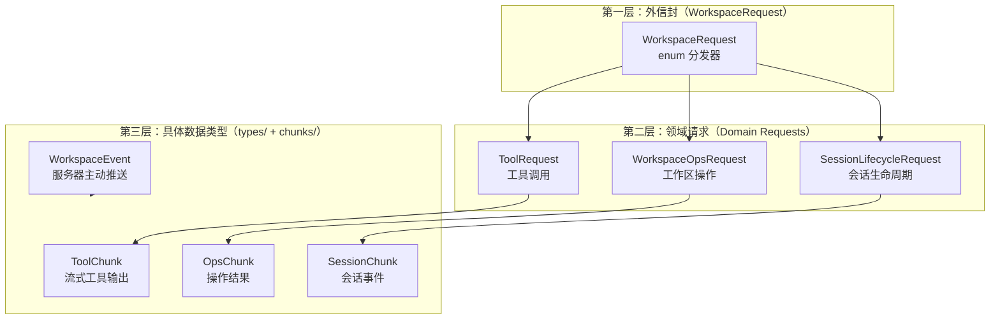
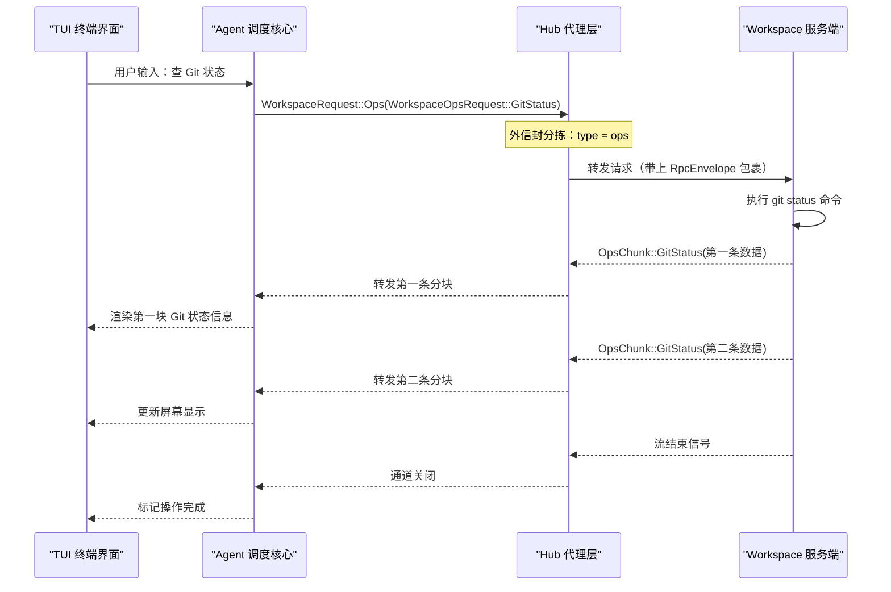

[← 返回首页](index.md)

# 工作区通信协议：RPC 类型字典

打个比方：你和朋友通过写信聊天。信封上写着“这是谁寄的”、“要寄给谁”、“信的类型是什么”，信纸里面才是具体内容——比如“明天几点见面？”或者“那份文件帮我改一下”。

Grok Build 的客户端（你终端里的 TUI）和服务端（后台的 Workspace 进程）之间也是这么通信的。`xai-grok-workspace-types` 这个 crate 就是整个系统的“邮政总局标准”——它严格规定了每封信的信封长什么样、信纸上有哪些固定字段、每种消息怎么打包。它不干具体活儿，只负责定义“传什么形状的数据”，是整个分布式架构的类型基石。

---

## 一封信的三层结构：信封、信纸、分页

先拉一张图看清这些概念的关系：



每一层干什么，我们一层层看。

### 第一层：外信封——这条消息到底归谁管？

从客户端发出去的第一层包裹叫 `WorkspaceRequest`（在 `crates/codegen/xai-grok-workspace-types/src/requests/mod.rs` 里定义）：

```rust
// 外信封：用枚举区分三大领域
#[serde(tag = "type", content = "data", rename_all = "snake_case")]
pub enum WorkspaceRequest {
    Tool(ToolRequest),       // "嘿，帮我调个工具"
    Ops(WorkspaceOpsRequest), // "嘿，帮我操作一下工作区"
    Session(SessionLifecycleRequest), // "嘿，帮我管管会话"
}
```

它就是个快递分拣员——看一眼信封上的 `type` 字段，就知道这封信该扔进“工具调用”、“工作区操作”还是“会话管理”这三个通道之一。`serde(tag = "type")` 这条注解的意思是：序列化成 JSON 时，会自动生成一个 `"type": "tool"` 这样的字段，这样接收方不用拆开信纸就知道里面是什么。

### 第二层：领域请求——具体要干啥

每个通道有自己的请求枚举。比如：

- **工具调用通道**（`ToolRequest`）：`Definitions`（列出所有可用工具）、实际工具调用等。具体定义在 `crates/codegen/xai-grok-workspace-types/src/requests/tool.rs`。
- **工作区操作通道**（`WorkspaceOpsRequest`）：`ListHunks`（列出代码改动块）、`GitStatus`（查 Git 状态）等。定义在 `crates/codegen/xai-grok-workspace-types/src/requests/ops.rs`。
- **会话生命周期通道**（`SessionLifecycleRequest`）：`Destroy`（干掉一个会话）、`Rewind`（回退对话历史）等。定义在 `crates/codegen/xai-grok-workspace-types/src/requests/session.rs`。

### RPC 信封：双向通信的官方包裹

除了请求本身，还有一个更底层的包裹结构叫 `RpcEnvelope`（在 `crates/codegen/xai-grok-workspace-types/src/rpc/envelope.rs` 里）。它就像是信封外面再套一个快递公司的标准文件袋，里面除了请求数据，还会带上会话 ID 等元信息。这个信封在 `crates/codegen/xai-grok-workspace-types/src/rpc/mod.rs` 里被统一导出：

```rust
pub use envelope::{RpcEnvelope, RpcError};
```

还有一个关键设计——每个 RPC 方法都通过 `WorkspaceRpc` trait 定义了自己的“身份证”：

```rust
pub trait WorkspaceRpc: Serialize {
    /// 这个方法在线上叫什么名字（比如 "workspace.git_status_ext"）
    const METHOD: &'static str;
    /// 这个方法返回什么形状的数据
    type Response: Serialize + DeserializeOwned + Send;
}
```

这玩意儿的好处是：客户端和服务端共享同一套类型，不会出现“我发了个 A，你却以为我发的是 B”这种乌龙。新增一个 RPC 方法时，只要实现这个 trait，编译器就会帮你检查请求和响应的类型是否匹配。

---

## 分块响应：一次请求，多口投喂

大语言模型生成回复的速度和你读它的速度不一样——它是逐 token 往外蹦的，不可能憋着等全部生成完再一股脑发给你。所以 Grok Build 的响应不是一锤子买卖，而是**流式的分块（chunk）**。

服务器处理完你的请求后，会像食堂打饭阿姨一样，一勺一勺往外送数据。每一勺就是一个 chunk。不同类型的请求吐出不同类型的 chunk，在 `crates/codegen/xai-grok-workspace-types/src/chunks/mod.rs` 里统一管理：

```rust
// 三种领域的流式响应类型
pub use ops::OpsChunk;       // 工作区操作的响应块
pub use session::SessionChunk; // 会话生命周期的响应块
pub use tool::{ToolChunk, ToolResponse}; // 工具调用的响应块
```

举个例子，你让 AI 帮你搜索代码（这属于 `WorkspaceOpsRequest::Ripgrep` 请求），服务器不会等扫完整个仓库才一股脑返回结果——它会搜到一个文件就扔过来一个 `OpsChunk::RipgrepHit`，最后再扔一个 `OpsChunk::RipgrepDone` 说“搜完了”。这种流式设计让你能实时看到搜索进度，不用干等。

每种 chunk 都有一个静态的身份牌——`ChunkKind` 枚举。它的作用很简单：万一客户端在“工具通道”上收到了一个“工作区操作通道”才该有的 chunk，立刻就能发现不对劲，抛出 `ProtocolMismatch` 错误。代码里大量测试保证了这个枚举的每个变体都是唯一且可序列化的：

```rust
#[derive(Debug, Clone, Copy, PartialEq, Eq, Hash, Serialize, Deserialize)]
pub enum ChunkKind {
    // ToolChunk 的变体
    ToolOutput,       // 工具的输出内容
    ToolProgress,     // 工具的执行进度
    ToolFinal,        // 工具执行完毕的最终结果
    NeedPermission,   // 需要用户批准才能继续
    NeedUserAnswer,   // 需要用户回答一个问题
    // OpsChunk 的变体
    GitStatus,        // Git 状态信息
    Hunks,            // 代码改动块
    RipgrepHit,       // 代码搜索命中一条结果
    RipgrepDone,      // 代码搜索全部完成
    // SessionChunk 的变体
    SessionId,        // 回传会话 ID
    RewindResult,     // 回退操作的结果
    // ... 还有许多
}
```

所有 chunk 变体的完整清单都在 `ChunkKind::all()` 方法里，代码甚至用了三层编译时检查（`as_str()`、`assert_exhaustive_match`、`chunk_kind_all_is_complete`）来保证：**任何一个新变体加了之后，如果忘了在所有地方同步更新，编译器直接报错**。这是典型的 Rust 风格——把约束写进类型系统，不留漏网之鱼。

---

## 服务器主动推送：不是你问我，而是我通知你

前面说的请求-响应模式，都是客户端主动问、服务器被动答。但有一种情况反过来：**服务器想主动告诉客户端“出了点事”。**

比如你正在终端里敲代码，后台的 Workspace 进程检测到你改了某个文件，它想告诉 TUI 界面刷新一下文件列表。这种事没办法靠请求-响应完成——因为客户端根本没发请求。

这就是 `WorkspaceEvent` 的用武之地。它定义在 `crates/codegen/xai-grok-workspace-types/src/events/mod.rs`：

```rust
//! Pub/sub event types and topic-filter sets.
//! Only the wire types live here; the broadcast channel
//! and EventStream wrapper are runtime concerns.
```

简单理解：服务器就像一个广播电台，不停地往外发射事件信号。客户端可以选择“订阅”某些频道（topic），只接收自己关心的事件。具体的频道和事件结构定义在 `crates/codegen/xai-grok-workspace-types/src/events/workspace.rs` 里，比如什么时候有新文件变化、什么时候有 `lag` 延迟通知（`crates/codegen/xai-grok-workspace-types/src/events/lag.rs`）。

在 `crates/codegen/xai-grok-workspace-types/src/rpc/mod.rs` 中，所有“不要钱自己往外蹦”的通道都有专门的 Tool ID：

```rust
// 服务器主动推事件用的通道标识
pub const WORKSPACE_EVENTS_TOOL_ID: &str = "workspace_events";

// 工具调用的通知转发通道
pub const WORKSPACE_TOOL_NOTIFICATIONS_TOOL_ID: &str = "workspace_tool_notifications";

// 客户端扩展通知通道（比如搜索进度状态更新）
pub const WORKSPACE_CLIENT_EXT_NOTIFICATIONS_TOOL_ID: &str = "workspace_client_ext_notifications";
```

---

## 一次完整的交互：从请求到流式响应

把前面的所有概念串起来，来看一次真实的通信过程。假设用户在终端里输入了一条让 AI 查 Git 状态的指令：



注意这里的关键：响应不是一次性返回的，而是流式分块。TUI 可以一边收数据一边更新屏幕，用户不用等到所有数据都就绪才能看到东西。这种模式在 AI 逐 token 输出回复时尤其重要——你看到的是一个字一个字往外蹦的过程，而不是干等半分钟后突然出现一大段文字。详见 [《一次完整对话的旅程》](05-one-full-turn.md)。

---

## 跨 crate 的共享数据类型

`xai-grok-workspace-types` 里还有一个 `types/` 目录，专门放那些被请求、分块、事件三方共用的数据结构。这些类型目前是“占位符”——代码注释里写得很清楚：

```rust
//! Supporting structs/enums referenced from requests, chunks, and events.
//!
//! Every type in this module is a **placeholder**: the canonical
//! implementations live in other crates today ...
```

大白话就是：这些结构体在其他 crate（比如 `xai-hunk-tracker`、`xai-grok-shell`）里有更完整的实现，但为了能让 `xai-grok-workspace-types` 自己独立编译、不依赖那些重量级 crate，这里定义了“缩水版”的字段，只保证它们能正确序列化/反序列化。

这些共享类型覆盖了哪些领域？从 `crates/codegen/xai-grok-workspace-types/src/types/mod.rs` 的导出清单能看清全貌：

| 类别 | 主要类型 | 一句话说明 |
|------|---------|-----------|
| 会话 | `AgentSessionInfo`、`RewindPoint`、`RewindResult` | 描述当前会话的状态、可以回退到哪个时间点 |
| Git 与文件 | `GitStatus`、`GitDiff`、`GitBranchInfo`、`ResolvedFile` | 代码仓库的状态快照和差异信息 |
| 工具 | `ToolDef`、`ToolCallResult`、`ToolOutputChunk` | 定义工具长什么样、执行结果怎么表示 |
| 权限 | `PermissionRequest`、`PermissionDecision` | AI 想执行危险操作时，怎么向用户申请批准 |
| 搜索 | `FuzzyMatch`、`ContentMatch`、`RipgrepStats` | 模糊搜索和精确搜索的结果结构 |
| 配置 | `ProjectConfig`、`PermissionPolicy`、`IsolationMode` | 项目的配置信息、安全沙箱策略 |
| 插件 | `PluginInfo`、`HookInfo` | 已安装插件和钩子的元信息 |

在 [《会话管理：从出生到归档》](06-session-lifecycle.md) 中你能看到 `SessionChunk` 的变体是怎么驱动会话状态流转的；在 [《工具箱：AI 的手和眼睛》](19-tool-system.md) 里你会见到 `ToolDef` 和 `ToolChunk` 是怎么被注册和调用的。

---

## 为什么这个 crate 是整个分布式架构的类型基石？

回到最开始的比喻：你和朋友写信，如果信封格式、信纸抬头、落款位置每次都乱来，信根本没法寄。`xai-grok-workspace-types` 干的就是强制统一这些格式。

1. **单一真相来源**：所有组件——客户端（TUI）、Agent 调度器、Workspace 服务端——都引用这同一个 crate 的类型定义。不会出现“A 模块认为 `GitStatus` 有三个字段，B 模块认为是四个”这种分裂。
2. **零依赖**：这个 crate 不依赖任何业务逻辑 crate，只依赖 `serde` 做序列化。这意味着它可以被任何需要知道通信格式的组件安全引用，不会引入循环依赖。
3. **编译时安全**：`WorkspaceRpc` trait、`ChunkKind` 的穷举 match、`ChunkKind::all()` 的三层编译检查——这些设计把“我忘更新某些地方了”这种人为错误变成了编译报错，在代码还没跑起来之前就拦住问题。
4. **清晰的分层边界**：`WorkspaceRequest`（外信封）→ 领域请求枚举 → 具体 chunk 类型，三层结构清晰，新加一条 RPC 方法时该修改哪个文件一目了然。
