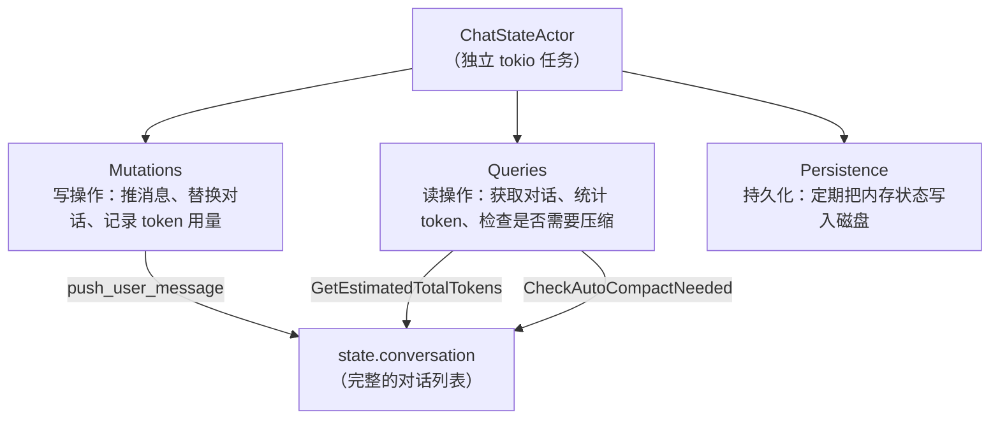
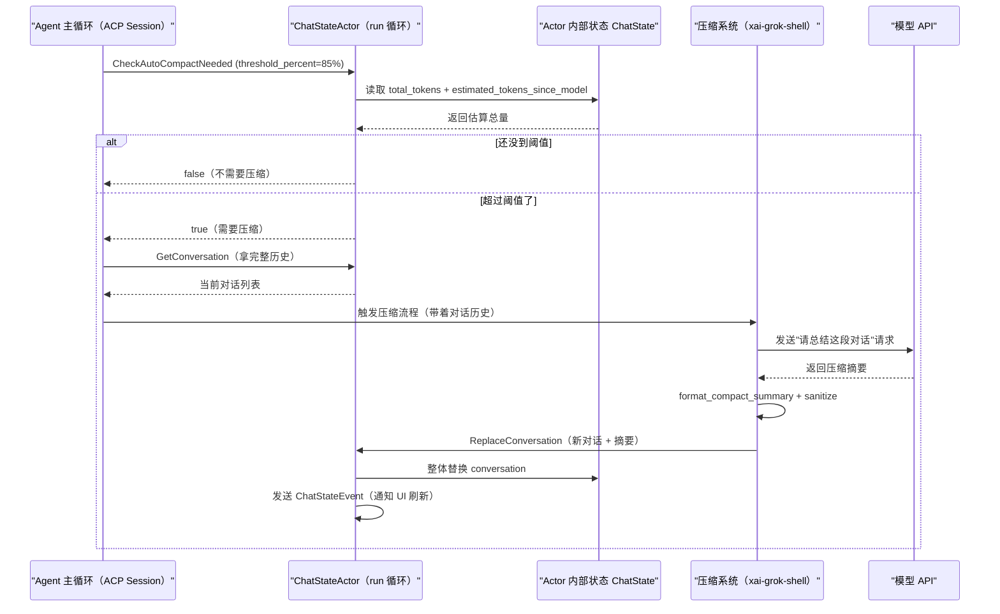

[← 返回首页](index.md)

# 上下文窗口管理：token 的精打细算

## 先讲个故事：书桌有多大？

想象你在一张小书桌上写论文。桌面上摊开的参考资料越多，你越容易前后对照，但如果堆得太满，胳膊肘都没地方放。更糟的是，每当你引用超过 30 页的资料，出版商就收你一笔巨款（API 按 token 计费）。这时候你就需要一个助手，帮你做三件事：

1. **清点**：桌上现在占了多少面积？每本翻开的书大约几页？
2. **决策**：还剩一只手能写字之前，要不要先把前面的整理掉？
3. **收纳**：把前几章已经写完的草稿叠起来，写个摘要标签贴在上面，只留当前在写的那一页摊开。

这个"书桌"就是 LLM 的上下文窗口（context window），"助手"就是 `ChatStateActor`。它不直接跟 LLM 对话——它住在自己的 tokio 任务里，专门管"现在上下文里都有哪些消息、它们的 token 消耗是多少"这笔账。压缩系统（即 Compaction，详见 [《对话压缩：给 LLM 的上下文瘦身》](17-compaction.md)）什么时候动手、动手后要把哪些内容塞回去，全听它给信号。

下面我们来看看 `ChatStateActor` 到底是怎么运转的。

## ChatStateActor：对话状态的"账房先生"

`ChatStateActor` 定义在 `crates/codegen/xai-chat-state/src/actor/mod.rs`。它是一个典型的 **Actor 模型**——有自己的私有状态，外部只能通过"命令通道"（`mpsc::UnboundedReceiver<ChatStateCommand>`）往里塞指令，Actor 在独立的 tokio 任务里一条一条顺序处理，不会有并发竞争的问题。

```rust
// crates/codegen/xai-chat-state/src/actor/mod.rs（精简版，约第 20-35 行）
pub struct ChatStateActor {
    // 内部状态：对话历史、token 计数、采样配置……
    state: ChatState,
    // 工具结果截断配置（太长的工具输出会被剪短，省 token）
    pruning_config: PruningConfig,
    // 持久化后端（负责存盘、冲盘）
    persistence: Box<dyn ChatPersistence>,
    // 接收外部命令的 channel
    cmd_rx: mpsc::UnboundedReceiver<ChatStateCommand>,
    // 往外发事件（比如"对话被替换了"）的 channel
    event_tx: mpsc::UnboundedSender<ChatStateEvent>,
    // 取消令牌，优雅关闭用
    cancellation_token: tokio_util::sync::CancellationToken,
}
```

你可以这样理解 `ChatStateActor` 的职责分工：



Actor 的主循环长这样——不断从命令通道接收消息，然后分发到对应的处理函数：

```rust
// crates/codegen/xai-chat-state/src/actor/mod.rs（约第 70-85 行）
async fn run(mut self) {
    loop {
        tokio::select! {
            biased;
            _ = self.cancellation_token.cancelled() => {
                debug!("ChatStateActor shutting down via cancellation");
                break;
            }
            cmd = self.cmd_rx.recv() => {
                let Some(cmd) = cmd else {
                    debug!("ChatStateActor shutting down: all handles dropped");
                    break;
                };
                self.handle_command(cmd);
            }
        }
    }
}
```

命令分两大类：**Mutations（写操作）** 和 **Queries（读操作）**。

## Mutations 写操作：修改对话状态的入口

所有改变对话的命令都经过 `ChatStateCommand` 枚举的 Mutations 分支。我们挑几个跟上下文管理最相关的来看：

| 命令 | 作用 | 一句话说明 |
|------|------|-----------|
| `PushUserMessage` | 把用户消息放进对话列表 | "用户说了一句话，存起来" |
| `PushAssistantResponse` | 放进 AI 的回复 | "模型给回复了，存起来" |
| `PushToolResult` | 放进工具执行结果 | "run_cmd 跑完了，结果记下来" |
| `RecordTokenUsage` | 记录模型返回的实际 token 用量 | "刚才那次 API 调用花了 4200 token" |
| `ReplaceConversation` | 整体替换对话历史 | "压缩完了，用摘要+新消息换掉旧的" |
| `RecordCompactionAt` | 标记"在第 N 轮对话时做了压缩" | "在提示词索引 15 处做了压缩，别忘了" |
| `TruncateToPromptIndex` | 回退到某个历史快照 | "用户说'回到第 3 轮之前的对话'" |

其中 `ReplaceConversation` 是最关键的一条。当压缩系统生成好摘要后，它会把整个对话列表替换成**系统消息 + 用户前缀 + 最后一条真实用户查询 + 压缩摘要 + 最近的 assistant/tool 对 + 系统提醒**，相当于把"书桌"上过时的草稿收走，只留一张摘要标签。新对话历史的拼装逻辑在 `crates/codegen/xai-chat-state/src/compaction_utils.rs` 的 `build_compacted_history` 函数里。

不过，压缩不是"想压就压"。它需要先判断"是不是该压了"。

## Queries 读操作：回答"还有多少 token 空间？"

Actor 的另一半职责是响应查询。跟上下文管理最相关的几条：

| 命令 | 返回什么 | 对压缩的意义 |
|------|---------|------------|
| `GetEstimatedTotalTokens` | 当前估计的 token 总量 | 这是"书桌占用率"，超过阈值就该压缩 |
| `CheckAutoCompactNeeded` | 是否需要自动压缩（boolean） | Agent 主循环每轮都问它"要不要现在压？" |
| `GetLastCompactionPromptIndex` | 上次压缩发生在第几轮提示词 | 防止短时间内反复压缩 |
| `GetConversation` | 当前完整对话历史的克隆 | 传给压缩模型让它读历史并写摘要 |
| `GetEstimatedMessagesTokens` | 直接对所有 `ConversationItem` 做 token 估算 | 底层函数，纯计算 |

Agent 主循环（详见 [《Agent 调度核心》](15-agent-runtime.md)）在处理每个任务前后都会调用 `CheckAutoCompactNeeded`。如果返回 `true`，Agent 就触发 [对话压缩](17-compaction.md)。

## token 是怎么估出来的？

`ChatStateActor` 并不调用分词器（那太慢了），它用的是一个**快速估算函数** `estimate_item_tokens`，定义在 `crates/codegen/xai-chat-state/src/actor/state.rs` 中（`compaction_utils.rs` 里也引用了它）：

```rust
// crates/codegen/xai-chat-state/src/compaction_utils.rs（约第 195 行）
/// Per-item token estimate via the trigger-side estimator, so fit's budget
/// matches what fired the compaction (counts images + encrypted reasoning).
fn estimate_item_tokens(item: &ConversationItem) -> u64 {
    crate::actor::state::estimate_item_tokens(item)
}
```

估算公式大致是：**文本长度 ÷ 4（英文环境下 1 token ≈ 4 字符）**，图片按尺寸单独计价，`reasoning`（模型的思考链）也单算。虽然不精确，但胜在零开销——Actor 不需要每次估算都跑趟 tokenizer。

## 那条关键的 query：GetEstimatedTotalTokens

Actor 内部维护了两个 token 计数来源：

1. `state.total_tokens`：模型 API 返回的**精确 token 用量**（通过 `RecordTokenUsage` 命令写入）。
2. `state.estimated_tokens_since_model`：自上次 API 调用之后**新消息的估算 token 数**（比如用户刚打了一句话，还没发给 API——这句话虽然没实际消耗 token，但它会占上下文窗口，所以得估算进去）。

```rust
// crates/codegen/xai-chat-state/src/actor/mod.rs（约第 155 行）
ChatStateCommand::GetEstimatedTotalTokens { reply } => {
    let _ = reply.send(
        self.state.total_tokens + self.state.estimated_tokens_since_model
    );
}
```

所以"当前上下文占了多少 token"是 `真实用量 + 新消息估算`，比纯估算靠谱得多。当这个值超过 `threshold_percent`（如 85% 的窗口上限）时，`CheckAutoCompactNeeded` 就会抬红旗。

## CompactionStateContext：压缩前的快照

触发压缩后，Actor 需要给压缩系统一份"当前状态快照"。这份快照不是直接把整个对话切一半扔掉——它得更聪明地保留**最近这轮正在做的事**（比如正在执行的工具调用链），同时把旧的压掉。这个数据结构就是 `CompactionStateContext`，定义在 `crates/codegen/xai-chat-state/src/compaction_utils.rs`：

```rust
// crates/codegen/xai-chat-state/src/compaction_utils.rs（约第 440 行）
pub struct CompactionStateContext {
    /// 自上次真实用户消息以来的 assistant + 占位 tool 结果
    pub recent_messages: Vec<ConversationItem>,
    /// 最后一条真实用户查询（跳过系统注入的"请继续"提示）
    pub last_user_query: Option<String>,
    /// 本会话中 Agent 编辑过的文件列表
    pub agent_edited_paths: Vec<String>,
    /// 正在运行的 background task
    pub running_tasks: Vec<BackgroundTaskSummary>,
    /// 还在跑的子 Agent
    pub running_subagents: Vec<RunningSubagentSummary>,
    /// 当前连接的 MCP 服务器
    pub connected_mcp_servers: Vec<CompactionServerSummary>,
    /// Todo 列表
    pub todos: Vec<TodoSummary>,
}
```

其中最精巧的设计是 **`extract_messages_since_last_real_user`**。普通做法是按"最后一个 User 消息"切分，但系统有时会往对话里插入**合成用户消息**（如 `system_reminder` 或自动续写的 "Continue the conversation..."）。这些不是用户打的——它们不应该切断工具调用链（否则 Assistant 的 tool_use 和对应的 ToolResult 会被劈成两半，API 直接报 400）。

```rust
// crates/codegen/xai-chat-state/src/compaction_utils.rs（约第 380 行）
pub fn extract_messages_since_last_real_user(
    conversation: &[ConversationItem],
) -> Vec<ConversationItem> {
    let boundary_idx = conversation.iter().rposition(is_real_user_turn);
    let start = match boundary_idx {
        Some(idx) => idx + 1,
        None => 0,
    };
    conversation[start..]
        .iter()
        .filter_map(|item| match item {
            ConversationItem::Assistant(a) => Some(ConversationItem::Assistant(a.clone())),
            ConversationItem::ToolResult(t) => Some(ConversationItem::ToolResult(ToolResultItem {
                tool_call_id: t.tool_call_id.clone(),
                content: std::sync::Arc::<str>::from("Tool call omitted..."),
                images: Vec::new(),
            })),
            _ => None,
        })
        .collect()
}
```

它用 `rposition(is_real_user_turn)` 找到**最后一个真实用户消息**的位置，然后只取它之后的内容。合成用户消息（`synthetic_reason` 不为 `None` 的）被跳过，不产生切分点。

## 压缩后：清理与修复

压缩模型生成的摘要返回后要经过两道清洗：

1. **`format_compact_summary`**（`compaction_utils.rs`）：去除 `<analysis>...</analysis>` 草稿、提取 `<summary>...</summary>` 正文、中和模型误输出的控制标签（如 `<analysis>` 被改用零宽空格塞成 `<\u{200b}analysis>`）。
2. **`sanitize_compacted_history`**：压缩后组装的新对话历史必须满足 "每个 ToolResult 前面都有对应的 Assistant.tool_calls"——否则 API 直接 400。

```rust
// crates/codegen/xai-chat-state/src/compaction_utils.rs（约第 720 行）
pub fn sanitize_compacted_history(items: Vec<ConversationItem>) -> SanitizeResult {
    let mut seen_ids: std::collections::HashSet<String> = std::collections::HashSet::new();
    let mut stripped_tool_call_ids = Vec::new();
    let sanitized = items
        .into_iter()
        .filter(|item| match item {
            ConversationItem::Assistant(a) => {
                for tc in &a.tool_calls {
                    seen_ids.insert(tc.id.as_ref().to_owned());
                }
                true
            }
            ConversationItem::ToolResult(tr) => {
                if seen_ids.contains(&tr.tool_call_id) {
                    true
                } else {
                    stripped_tool_call_ids.push(tr.tool_call_id.clone());
                    false
                }
            }
            _ => true,
        })
        .collect();
    SanitizeResult {
        items: sanitized,
        stripped_tool_call_ids,
    }
}
```

## 一次触发压缩的完整时序

把上面这些串起来，看看从"token 快满了"到"上下文被替换"的全过程：



## 总结：ChatStateActor 的分内事

`ChatStateActor` 是对话状态的唯一拥有者。它不参与 LLM 交互，不画 TUI，不跑压缩——它只干三件事：

1. **管账**：每笔 token 用量（真实的、估算的）都由它记账。
2. **站岗**：Agent 主循环每轮问它"要压了吗？"，它对比窗口上限给出判断。
3. **伺候压缩**：压缩系统需要对话快照时它给快照，压缩结束后它收下新历史替换旧账。

因为它是单线程 Actor，没有锁竞争，没有并发 bug。它就像一个沉稳的图书管理员：随时知道书架上有多少本书、每本大约多厚、什么时候该清一拨旧书腾地方，而你只需要跟它说"拿书"或"放书"。
