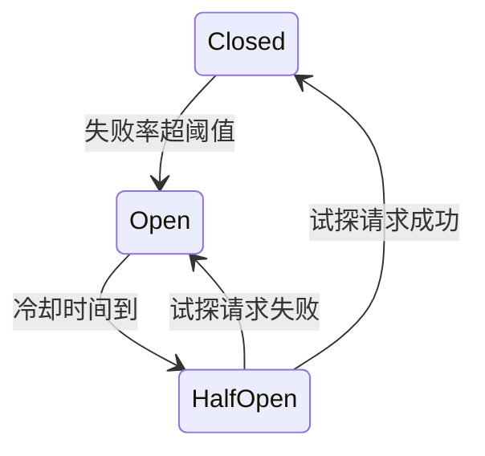
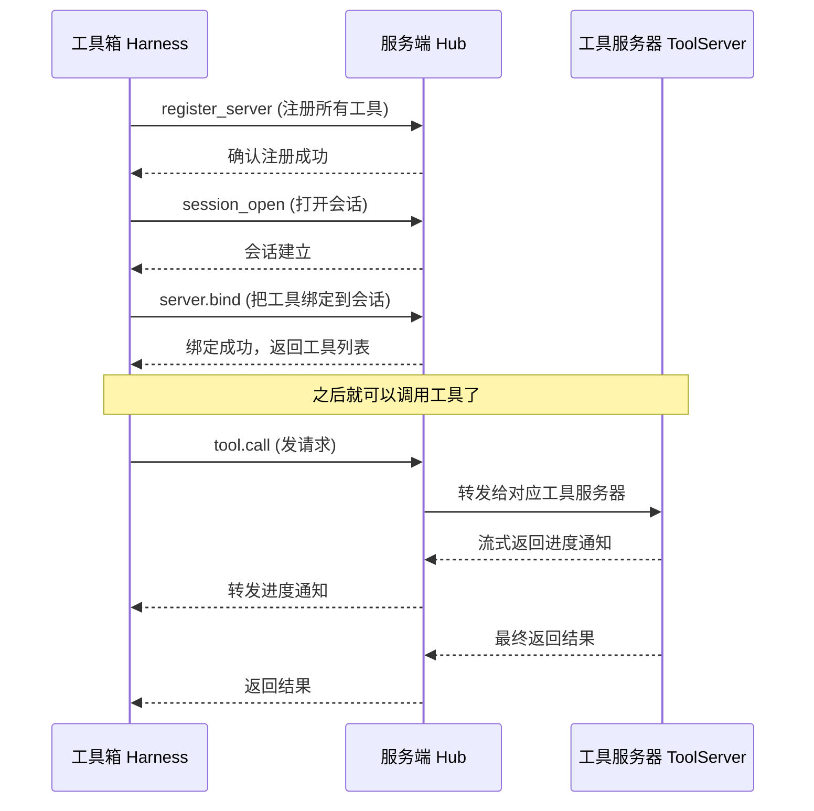
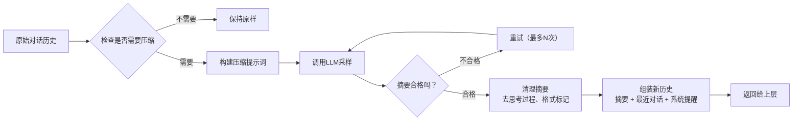
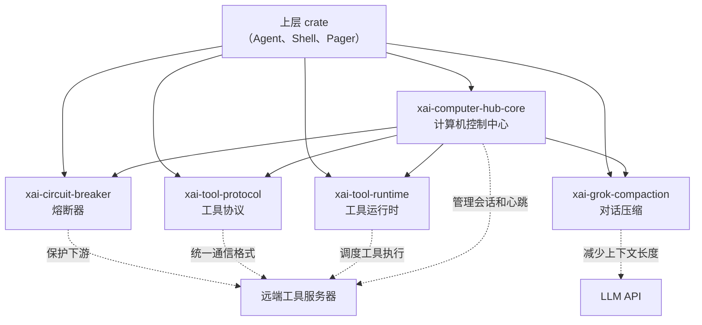

[← 返回首页](index.md)

# 公共基础设施：熔断器、工具协议、压缩、追踪

crates/common 这底下四个大件儿，是整个 Grok Build 的地基。上层那些花里胡哨的 Agent、渲染引擎、工作区服务器，全都趴在这四个东西上面干活。

熔断器就像个带自动复位功能的电闸——下游服务一旦堵了（比如调用失败率太高），它主动断开，不让更多的请求怼进去，给下游喘口气的机会。过一段时间再悄悄试一下，好了就合上，没好继续断。

工具协议是所有工具通信的“快递标准”——AI 要调用一个工具（比如读文件、跑命令），消息怎么打包、走哪条路、怎么回结果，都按这个协议来。说白了就是：大家都说同一种“方言”，谁也不用猜对方的意思。

压缩就是省钱的法宝——AI 聊了半天，上下文越长花的钱越多。压缩模块用 LLM 自己把之前的对话“浓缩”成几句话，扔回上下文里，既保留关键信息又省 Token。

追踪是埋在各个角落的监控探针——每次工具调用、每次状态切换都记下来，方便事后查问题、算性能。

## 熔断器：带自动复位功能的电闸

先看熔断器，这东西在 `crates/common/xai-circuit-breaker/src/breaker.rs` 里。它的状态机特别简单，就三种状态：



### 三种状态说明

- **Closed（闭合）**：正常工作，请求随便通过。内部维护一个滑动窗口，统计最近一笔请求里失败的比例。
- **Open（断开）**：拒绝所有请求。每次拒绝都返回一个 `BreakerOpen` 错误，告诉调用方“等等再试”。
- **HalfOpen（半开）**：允许少量试探请求通过，如果成功了就恢复闭合，失败了继续断开。

### 代码怎么跑的

核心是 `check()` 和 `record()` 两个方法：

```rust
// 来自 crates/common/xai-circuit-breaker/src/breaker.rs
pub fn check(&self) -> Result<(), BreakerOpen> {
    if !self.inner.config.enabled {
        return Ok(());  // 熔断器没开，无脑放行
    }
    match self.state() {
        BreakerState::Closed => Ok(()),           // 闭合：放行
        BreakerState::Open => self.check_open(),  // 断开：看冷却时间到没到
        BreakerState::HalfOpen => self.try_half_open_probe(),  // 半开：抢一个试探名额
    }
}
```

`record()` 里干了三件事：往滑动窗口里塞一条记录、看失败率是不是超标了（超标就 `trip()` 掰到断开状态）、通知观察者。

看它怎么判断“该不该断开”的：

```rust
// 来自 crates/common/xai-circuit-breaker/src/breaker.rs
let should_trip = {
    let mut window = self.lock_window();
    window.push(is_failure, now);
    window.evict(self.inner.config.window_duration, now);
    window.sample_count() >= self.inner.config.min_samples
        && window.error_rate() >= self.inner.config.error_rate_threshold
};
```

翻译成大白话：滑动窗口里的样本够数了，而且失败率超过阈值了，那就掰到 Open。`min_samples` 的意思是“至少得有这么多样本才判断”，防止刚启动时三五个样本就触发熔断。

### 试探机制的细节

`try_half_open_probe()` 里有个特别巧妙的处理：用原子计数器限制同时试探的请求数量。如果所有试探槽都被占用了，它不会傻等，而是看看有没有“失联”的试探（比如发起请求的协程挂了，没来得及 `record()`），如果有就把它抢过来用：

```rust
// 来自 crates/common/xai-circuit-breaker/src/breaker.rs
let lease_millis = self.inner.config.open_duration.as_millis() as u64;
let claimed = self.inner.probe_claimed_at_millis.load(Ordering::Acquire);
if now.saturating_sub(claimed) >= lease_millis
    && self.inner.probe_claimed_at_millis
        .compare_exchange(claimed, now, Ordering::AcqRel, Ordering::Acquire)
        .is_ok()
{
    // 抢到一个“失联”的试探槽
    self.observer().on_probe_admission(true);
    return Ok(());
}
```

## 工具协议：统一的快递标准

`xai-tool-protocol` 和 `xai-tool-runtime` 这两个 crate 定义了 AI 和工具之间怎么对话。

### 协议长啥样

所有通信都基于 JSON-RPC 格式（就是发一个 JSON 对象，里面有 `method`、`params`、`id` 这些字段）。下面是 AI 调一个工具时发的请求：

```rust
// 来自 crates/common/xai-tool-protocol/src/frames.rs
#[derive(Debug, Clone, PartialEq, Serialize, Deserialize)]
pub struct ToolCallParams {
    pub tool_call_id: ToolCallId,
    pub tool_id: ToolId,
    pub arguments: serde_json::Value,
    #[serde(default, skip_serializing_if = "Option::is_none")]
    pub deadline_ms: Option<u64>,
    // ...
}
```

工具执行完返回：

```rust
// 来自 crates/common/xai-tool-protocol/src/frames.rs
#[derive(Debug, Clone, PartialEq, Serialize, Deserialize)]
pub struct ToolCallResult {
    pub tool_call_id: ToolCallId,
    pub output: ToolOutputWire,
    #[serde(default, skip_serializing_if = "Vec::is_empty")]
    pub follow_ups: Vec<serde_json::Value>,
    #[serde(default, skip_serializing_if = "Vec::is_empty")]
    pub reminders: Vec<serde_json::Value>,
    // ...
}
```

### 三种消息类型

| 类型 | 例子 | 说明 |
|------|------|------|
| 请求（Request） | `tool.call` | 有 id，必须回复 |
| 响应（Response） | `tool_call_result` | 回给请求的 |
| 通知（Notification） | `tool_call_progress` | 没 id，单向告知，不用回 |

### 谁调用谁的关系

看这张时序图就清楚了——刚连接时先注册工具和会话，然后才能调用：



### 设备端的 Dispatch 接口

`xai-tool-runtime` 里的 `ToolDispatch` trait 定义了工具怎么被调用的骨架：

```rust
// 来自 crates/common/xai-tool-runtime/src/dispatch.rs
#[async_trait]
pub trait ToolDispatch: Send + Sync {
    /// 流式调用，可以一边执行一边返回进度
    async fn call(
        &self,
        tool_id: ToolId,
        args: Value,
        ctx: ToolCallContext,
    ) -> ToolStream<TypedToolOutput>;

    /// 只拿最终结果，不要进度（省事版本）
    async fn call_terminal(
        &self,
        tool_id: ToolId,
        args: Value,
        ctx: ToolCallContext,
    ) -> Result<TypedToolOutput, ToolError> {
        let mut stream = self.call(tool_id, args, ctx).await;
        while let Some(item) = stream.next().await {
            match item {
                ToolStreamItem::Progress(_) => continue,
                ToolStreamItem::Terminal(result) => return result,
            }
        }
        Err(ToolError::custom("stream_no_terminal", "流没有以 Terminal 结尾"))
    }
}
```

流式设计让工具可以一边执行一边吐结果——比如 AI 在跑一个耗时的代码检查，它可以先返回“正在扫描...”，然后再返回最终的文件列表。

## 压缩：用 AI 给 AI 的聊天减肥

对话久了上下文太长，每轮都要花更多 Token（也就是更多钱）。`xai-grok-compaction` crate 干的事就是：把之前的对话塞给另一个 LLM，让它浓缩成一小段摘要，替换掉原来的长篇大论。

### 压缩的全程

看 `crates/common/xai-grok-compaction/src/code_compaction/compact.rs` 里的注释：

```text
build prompt → sample (retry + classify) → clean → assemble
```

翻译成白话就是：

1. 构建提示词（告诉 LLM：“请把下面的对话浓缩成一段”）
2. 采样（让 LLM 干活）——如果出错了或摘要太短就重试
3. 清理（把 LLM 输出的思考过程、格式标记去掉）
4. 组装回历史记录（把摘要塞回上下文的正确位置）

### 完整的数据流



### 具体代码实现

`apply_full_replace_compaction` 是入口函数，它调两层：先采样获取摘要，再组装历史。下面是采样部分：

```rust
// 来自 crates/common/xai-grok-compaction/src/code_compaction/compact.rs
pub async fn sample_full_replace_summary<T, S, O>(
    sampler: &S,
    llm_turns: &[T],
    user_context: Option<&str>,
    config: &FullReplaceConfig,
    observer: &O,
) -> Result<FullReplaceSummary, FullReplaceError>
where
    T: Send + Sync,
    S: CompactionSampler<Item = T> + ?Sized,
    O: FullReplaceObserver + ?Sized,
{
    if llm_turns.is_empty() {
        return Err(FullReplaceError::NothingToCompact);  // 没有可压缩的内容
    }
    
    let prompt = CompactionPrompt {
        system: String::new(),
        user: build_summary_prompt(user_context),  // 构建“请总结对话”的提示
    };
    let timeout = Duration::from_secs(config.sampling_timeout_secs);
    
    match sample_summary_with_retries(
        sampler, llm_turns, &prompt,
        config.max_attempts,              // 最大重试次数
        Duration::from_secs(config.retry_delay_secs),
        timeout,
        observer,
    ).await {
        Ok(SampledSummary { summary, attempts }) => {
            observer.on_success(attempts, summary.chars().count(), started.elapsed());
            Ok(FullReplaceSummary { summary, attempts })
        }
        // 处理各种失败情况：空响应、确定性失败、上下文溢出
    }
}
```

测试代码里有个很可爱的 mock 采样器，模拟 LLM 返回各种情况：

```rust
// 来自 crates/common/xai-grok-compaction/src/code_compaction/compact.rs 的测试
/// 模拟采样器，按顺序返回预设的响应
struct MockSampler {
    responses: Mutex<Vec<Result<String, CompactionSampleError>>>,
    calls: Mutex<usize>,
}
```

测试验证了各种边界情况：空对话直接返回错误、第一次超时后重试成功、确定性错误不重试、摘要太短要重试直到够长……这些测试都在同一个文件底下的 `mod tests` 里。

## 追踪：埋在各处的监控探针

虽然 `crates/common/xai-computer-hub-core/src/resolver.rs` 没直接显示追踪代码（因为这部分分散在很多文件里），但整个工具体系里到处都有追踪的钩子。

看 `xai-tool-protocol/src/frames.rs` 里有一个字段：

```rust
/// W3C `traceparent` for distributed tracing.
#[serde(default, skip_serializing_if = "Option::is_none")]
pub trace_context: Option<String>,
```

每次工具调用都带上 `trace_context`（W3C 标准的分布式追踪标识），这样一次请求经过的所有服务——工具箱、Hub、工具服务器——都可以关联到同一个追踪链上。

追踪具体做了什么事？看三个“捐赠”参数结构体就能猜出来：

```rust
// 来自 crates/common/xai-tool-protocol/src/frames.rs
/// 追踪捐赠：工具服务器发给 Hub 的追踪数据
pub struct TracesDonateParams {
    pub otlp_request: String,  // Base64 编码的 OpenTelemetry 请求
}

/// 日志捐赠
pub struct LogsDonateParams {
    pub otlp_request: String,
}

/// 指标捐赠
pub struct MetricsDonateParams {
    pub otlp_request: String,
}
```

工具服务器把追踪数据打包好，通过 `traces.donate`、`logs.donate`、`metrics.donate` 这些通知发给 Hub，Hub 再转发到后端存储。这样运维人员就能看到每个工具调用的耗时、失败率、日志详情。

熔断器里也有追踪——它有个 `Observer` trait，状态变更、试探结果都会通知观察者：

```rust
// 来自 crates/common/xai-circuit-breaker/src/breaker.rs
pub fn with_observer(self, observer: Arc<dyn Observer>) -> Self {
    let _ = self.inner.observer.set(observer);
    self
}
```

每次 `on_state_change`、`on_outcome`、`on_probe_admission` 都会走一遍观察者，让运维系统知道熔断器在干什么。

## 这四个东西怎么协作

来个总览图：



这四个件的分工很简单：
- **熔断器**（`xai-circuit-breaker`）是门的保安，看到门口拥挤就关门限流
- **工具协议**（`xai-tool-protocol` + `xai-tool-runtime`）是快递员，确保每个包裹格式正确、寄对人
- **压缩**（`xai-grok-compaction`）是保洁阿姨，把堆满的对话垃圾清走
- **追踪**（散布在 `xai-computer-hub-core`、`xai-tool-protocol` 各处）是摄像头，记录每一个动作方便事后查证

这些基础设施怎么被上层使用的，详见《快速上手：安装、运行、第一句对话》和《用户按下一个键，背后发生了什么》两个页面——那里会展示一个完整的请求从发起到返回，一路上经历了这些基础设施的哪些环节。
