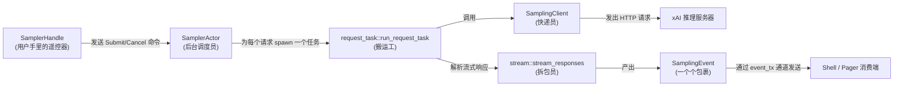
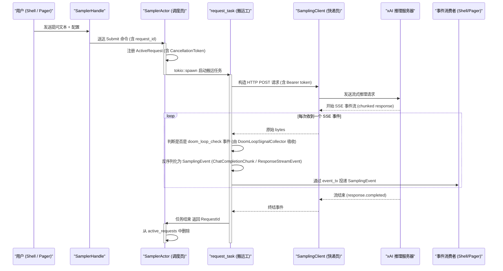
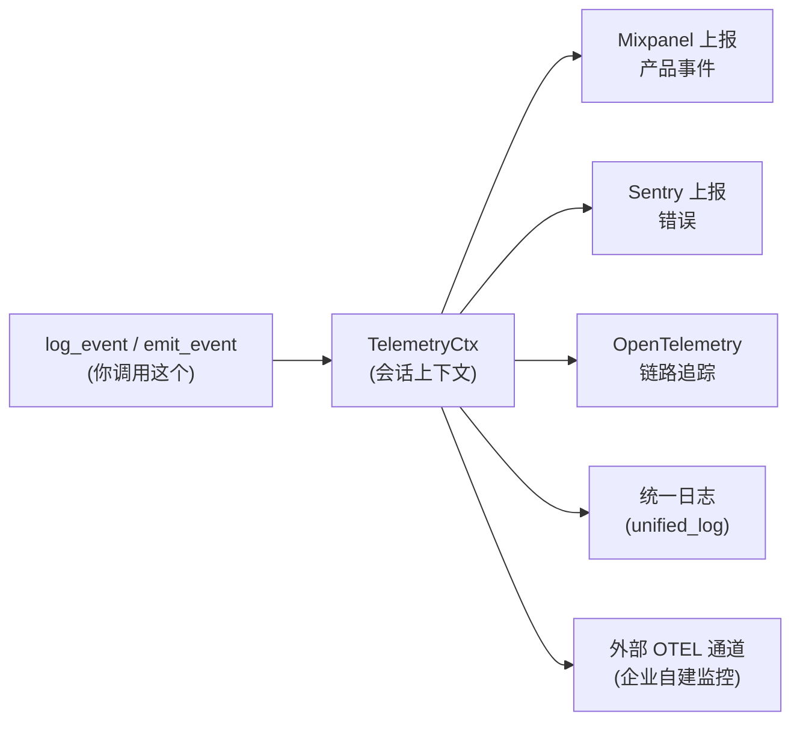
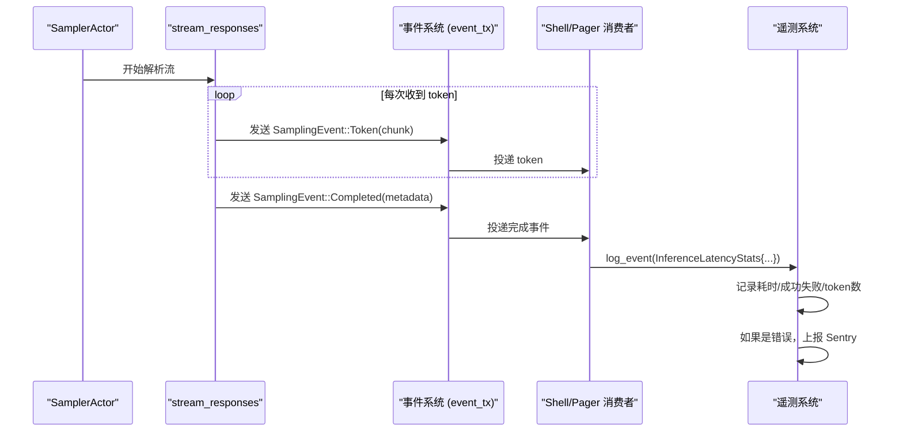

[← 返回首页](index.md)

# 采样引擎与遥测系统

## 一句话说清楚

**采样引擎**（Sampler）是 Grok 的"嘴巴和耳朵"——它负责把用户的提问包装成 HTTP 请求发给 xAI 的推理服务器，然后在服务器"一边想一边说"的时候，把流式返回的 token 一个接一个地接收回来，中间还要处理网络波动、服务器限流、自动重试这些事情。

**遥测系统**（Telemetry）是 Grok 的"黑匣子"——它记录你每次操作（按了什么键、调了什么命令、AI 回复花了多久）并上报到 Mixpanel / Sentry / OpenTelemetry，方便开发团队发现 bug 和性能瓶颈，同时也支持企业客户自己搭的监控系统。

两个系统配合的方式：采样引擎每完成一次推理请求，都会把这次请求的耗时、成功/失败状态、token 数量等指标丢给遥测系统去记录。

## 采样引擎的架构

采样引擎分三层，每层解决一件事：



整个流程见下面这张 **sequenceDiagram**，它讲了一个完整的故事：用户说"帮我写个排序函数"，Grok 怎么调 API 拿到结果。



### 三层 API 对应代码

文件 `crates/codegen/xai-grok-sampler/src/lib.rs` 里的注释写得很清楚：

- **Layer 1**: `client::SamplingClient` —— 原始 HTTP 请求，返回 `reqwest::Response` 的流。像个快递员，只管把包裹送到，不管里面是什么。
- **Layer 2**: `stream` —— 把原始 `bytes` 流解析成 `SamplingEvent`。比如从 SSE 的 `data: {"type":"response.output_text.delta","delta":"你好"}` 里提取出"你好"这两个字。像拆包员，把快递箱里的泡沫纸撕开，拿出真正的商品。
- **Layer 3**: `SamplerHandle` —— 最简单的 API，你只需要 `submit(request)` 和 `cancel(request_id)`。背后管理着并发请求数、自动重试、任务取消。像你在淘宝下单，不用关心物流怎么走。

## 核心概念逐个讲

### SamplerActor —— 单线程调度员

文件 `src/actor/mod.rs`（实际路径 `crates/codegen/xai-grok-sampler/src/actor/mod.rs`）里定义了 `SamplerActor`。它自己只跑一个 `tokio::spawn` 出来的异步任务，但可以 spawn 很多子任务（每个子任务处理一个推理请求），所以多个请求可以并发。

核心循环在 `run()` 方法里：

```rust
async fn run(mut self) {
    loop {
        tokio::select! {
            biased;
            // 优先处理已结束的子任务，这样 active_requests 不会过期
            Some(joined) = self.tasks.join_next(), if !self.tasks.is_empty() => {
                match joined {
                    Ok(request_id) => {
                        self.state.remove(&request_id);
                    }
                    Err(join_err) => {
                        tracing::warn!(error = %join_err, "request task panicked or was aborted");
                    }
                }
            }
            cmd = self.cmd_rx.recv() => {
                match cmd {
                    Some(cmd) => self.handle_command(cmd),
                    None => break, // 所有 handle 都 drop 了，退出
                }
            }
        }
    }
    // 退出前取消所有还在跑的任务
    for (_, active) in self.state.active_requests.drain() {
        active.cancel_token.cancel();
    }
    self.tasks.shutdown().await;
}
```

几点观察：
- `biased` 表示先处理任务完成事件，再处理新命令——防止僵尸任务。
- 退出前 drain 所有 `active_requests`，调用 `cancel_token.cancel()`，确保子任务不会泄漏。

### SamplerHandle —— 你的遥控器

文件 `src/handle/mod.rs`（实际路径需要查，但 lib.rs 里 re-export 了 `pub use handle::SamplerHandle`）。它通过 `mpsc::unbounded_channel` 向 Actor 发命令。当所有 handle 被 drop 时，channel 关闭，Actor 的 `cmd_rx.recv()` 返回 `None`，Actor 退出。

你只需要：
```rust
let handle = SamplerActor::spawn(config, retry_policy, event_tx);
handle.submit(request_id, request, config_override, completion_tx);
handle.cancel(request_id);
```

### 重试与退避

文件 `crates/codegen/xai-grok-sampler/src/retry.rs` 实现了重试逻辑。重试策略包括：

- **指数退避**：第一次失败等 1 秒，第二次等 2 秒，第三次等 4 秒……每次乘以 2，再加随机抖动（jitter）防止多个客户端同时重试造成"惊群效应"。
- **最大重试次数**：默认 3 次（`DEFAULT_MAX_RETRIES`），但会根据错误类型调整——401 授权错误不重试（重试也没用），429 限流错误可以多试几次。
- **`Retry-After` 头**：如果服务器返回了 `Retry-After`（比如 30 秒后重试），采样引擎会遵守这个时间，而不是用指数退避。代码在 `src/client.rs` 里的 `extract_retry_after` 函数。

### Doom Loop 检测 —— 防止 AI 死循环

文件 `src/doom_loop.rs` 实现了一个叫 `DoomLoopSignalCollector` 的东西。它解决的问题是：AI 偶尔会陷入"死循环"——一直重复同样的输出（比如一直说"然后然后然后然后……"）。服务器会在 SSE 流里插入 `response.doom_loop_check` 事件，里面包含 `triggers` 字段（比如 `tail_repetition:8@thinking` 表示思考过程中有 8 次重复）。

`DoomLoopSignalCollector` 的作用：
1. **吸收**（`absorb`）：在解析 SSE 事件时，把 `doom_loop_check` 事件拦截下来，不向下游传递（否则下游解析会失败）。
2. **判断**（`abort_triggers`）：如果检测到足够置信度的信号（比如重复太多次），就触发中止。
3. **解放**（`disarm_abort`）：在最后一次重试之前调用，告诉收集器"就算有信号也别中止了，这是最后一次尝试，无论结果如何都接受"。

```rust
// 关键方法
pub(crate) fn abort_triggers(&self) -> Option<Vec<String>> {
    let state = self.inner.lock().ok()?;
    if state.abort_disarmed {
        return None;
    }
    let confident = state.policy.confident_triggers(&state.signals);
    (!confident.is_empty()).then_some(confident)
}
```

通俗来说：AI 回答像一个人在打字，打着打着开始重复同一个词。服务器说"喂，他在重复！"，采样引擎收到这个信号，可以主动切断请求，换个方式重新问，而不是傻等直到超时。

### 流式响应解析

文件 `crates/codegen/xai-grok-sampler/src/stream.rs`（和 `src/client.rs` 里的 `deserialize_response_event`）负责把 HTTP 的 SSE（Server-Sent Events）流解析成 Rust 的结构体。

有一个特别的地方：xAI 的 `Responses API` 允许模型调用自定义 tool（比如 `x_search` 搜网页），这些 tool 类型是 `async_openai` 这个第三方库不认识的自定义类型。所以代码做了一个**容错解析**：

```rust
fn deserialize_response_event(data: &str) -> Result<rs::ResponseStreamEvent> {
    let mut event = match serde_json::from_str::<rs::ResponseStreamEvent>(data) {
        Ok(event) => event,
        Err(first_err) => {
            // 第一次解析失败：尝试删除不认识的 tool 条目不重试
            if let Ok(mut value) = serde_json::from_str::<serde_json::Value>(data) {
                if let Some(tools) = value
                    .pointer_mut("/response/tools")
                    .and_then(|v| v.as_array_mut())
                {
                    tools.retain(|t| serde_json::from_value::<rs::Tool>(t.clone()).is_ok());
                }
                if let Ok(mut event) = serde_json::from_value::<rs::ResponseStreamEvent>(value) {
                    apply_terminal_event_overrides(&mut event, data);
                    return Ok(event);
                }
            }
            // 还不行就报错
            return Err(SamplingError::Serialization(first_err));
        }
    };
    apply_terminal_event_overrides(&mut event, data);
    Ok(event)
}
```

### 上下文统计修正

文件 `src/client.rs` 里还有一个巧妙的地方：服务器返回的 `response.usage.total_tokens` 在多轮对话（比如 AI 调用搜网页工具再回答）时是不准确的——它累积了所有轮的 token。但 `response.usage.context_details` 只包含最后那轮的"实时上下文长度"。`apply_terminal_event_overrides` 函数会对比这两者，把 `total_tokens` 覆盖为 `context_details.input_tokens + context_details.output_tokens` 这个更准确的数字。

## 遥测系统怎么工作

文件 `crates/codegen/xai-grok-telemetry/src/lib.rs` 定义了整个遥测系统的入口。

### 三大组件



- **Mixpanel**：上报用户行为事件（比如"用户打开了插件页面"、"用户切换了模型"）。文件 `crates/codegen/xai-grok-telemetry/src/client.rs` 中的 `TelemetryClient` 负责。
- **Sentry**：上报未捕获的 panic 和严重错误。文件 `crates/codegen/xai-grok-telemetry/src/sentry.rs`。
- **OpenTelemetry**：上报调用链追踪（比如一次推理请求的完整路径，从接收到响应花了多少时间）。文件 `crates/codegen/xai-grok-telemetry/src/otel_layer.rs`。
- **外部 OTEL**：企业客户可以把 Grok CLI 指向自己的 OpenTelemetry Collector，接收一份"去敏感数据"的监控流。文件 `crates/codegen/xai-grok-telemetry/src/external/mod.rs`——注意它默认是关闭的（需要设置 `GROK_EXTERNAL_OTEL` 环境变量），而且和内部 OTEL 完全独立，不会污染全局注册表。

### 事件类型

文件 `crates/codegen/xai-grok-telemetry/src/events.rs` 里定义了所有事件结构体。每个结构体用 `telemetry_event!` 宏绑定事件名。比如：

```rust
#[derive(Serialize)]
pub struct LoginCompleted {
    pub method: String,    // "xai" 或 "api_key"
    pub mode: String,      // "device", "loopback", "api_key"
    pub duration_ms: u64,  // 登录耗时
    pub mid_session: bool, // 是否中途重新登录（比如 401 后触发）
}
telemetry_event!(LoginCompleted, "login_completed");
```

事件按主题分组：

| 分组 | 例子 |
|------|------|
| Auth | `LoginCompleted`, `LoginFailed`, `LoginAbandoned`, `ApiKeySaveResult` |
| 计划模式 | `PlanModeToggled` |
| 权限 | `PermissionPrompted`, `PermissionDecisionPayload` |
| 压缩 | `CompactionTriggered`, `CompactionCompleted`, `AutoCompactSuppressed` |
| 子代理 | `SubagentLaunched`, `SubagentCompleted` |
| 模型切换 | `ModelSwitched` |
| 插件 | `PluginUsed`, `PluginInstalled`, `PluginCtaInstalled` |
| 钩子 | `HookExecuted`, `HookGateOutcome` |
| 提示建议 | `PromptSuggestion` |
| 斜杠命令 | `SlashCommandUsed` |

发送事件的典型调用：
```rust
crate::session_ctx::log_event(LoginCompleted {
    method: "xai".to_string(),
    mode: "device".to_string(),
    duration_ms: 3200,
    mid_session: false,
});
```

`log_event` 会自动注入 `session_id` 和 `turn_number`，你不需要自己填。

### CompactionScope —— 保证成对事件

有时你需要记录一对"开始-结束"事件，但它们必须是一个完整的生命周期。`CompactionScope` 结构体帮你保证不会漏掉任何一个：

```rust
// 开始
let scope = CompactionScope::begin(
    CompactionTrigger::Auto,
    tokens_used,
    context_window,
    model_id,
    user_context_provided,
);

// ... 做压缩工作 ...

// 结束（scope 在这里被 drop，自动发送 CompactionCompleted）
scope.complete(tokens_after);
```

`begin` 会发送 `CompactionTriggered`，`complete` 会发送 `CompactionCompleted`，两者共用一个 `compaction_id`（UUID v4），方便在日志里关联。

### 外部 OTEL 集成（企业功能）

这段代码比较特殊：它允许企业客户搭建自己的 OpenTelemetry Collector，然后把 Grok 的输出导入进去。文件 `crates/codegen/xai-grok-telemetry/src/external/mod.rs` 强调：

- **默认关闭**：`GROK_EXTERNAL_OTEL` 环境变量不设置就不工作。
- **不依赖内部认证**：它只携带 `OTEL_EXPORTER_OTLP_HEADERS` 里的自定义头，绝不会带上 xAI 的认证密钥。
- **数据脱敏**：所有发送到外部的事件都经过 `redact` 模块（文件 `src/external/redact.rs`）做内容脱敏，不会泄露用户的代码或 chat 内容。
- **独立于 Mixpanel**：和 xAI 内部的遥测系统完全隔离——企业可以放心使用。

## 采样引擎与遥测系统的协作



注意：采样引擎只负责"把推理结果拿回来"和"给出性能指标"；具体怎么展示给用户（渲染 Markdown、追加到滚动缓冲区）由 Pager 或 Shell 自己去处理。详见《Markdown 流式渲染》和《Pager 终端 UI 与端到端测试》。
