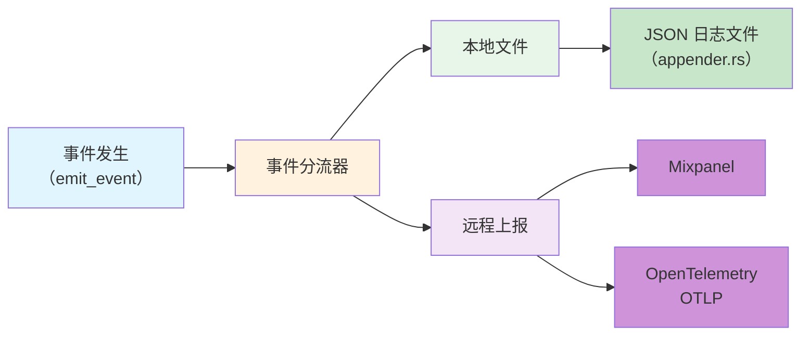
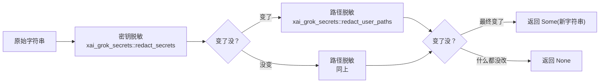
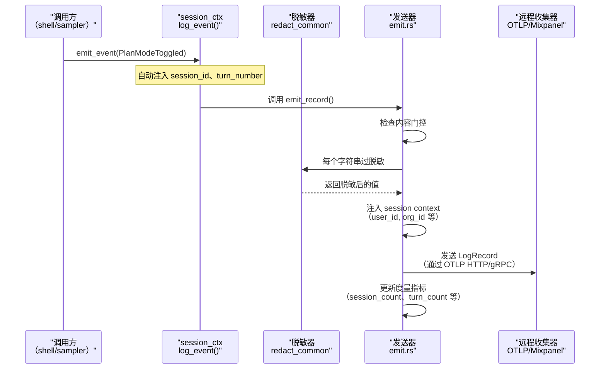

[← 返回首页](index.md)

# 遥测与可观测性：事件、脱敏、远程上报

## 一句话说清楚

Grok Build 的遥测模块就像一架飞机上的"黑匣子"——记录每次对话里发生了什么（用户说了什么、模型做了什么、调用了哪些工具）、把敏感信息（密码、API Key）替换成`***`，然后把干净的记录发给 Mixpanel、Sentry 和 OpenTelemetry 收集器，同时自己也留一份本地日志。

整个模块的核心在 `crates/codegen/xai-grok-telemetry/src/` 下，而记录本地事件（走文件）的"小号黑匣子"在 `crates/codegen/xai-file-utils/src/events/` 下。

## 核心概念：事件（Events）

### 事件是什么

在 Grok Build 里，每一次有价值的行为都会被包装成一个"事件结构体"（Event struct）。这些结构体都放在 `events.rs` 里（`crates/codegen/xai-grok-telemetry/src/events.rs`）。

比如用户切换了"计划模式"（Plan Mode），就会产生一个 `PlanModeToggled` 事件：

```rust
#[derive(Serialize)]
pub struct PlanModeToggled {
    pub enabled: bool,
    pub trigger: PlanModeTrigger,
    pub turn_in_flight: bool,
    pub was_previously_active: bool,
}
```

每个事件结构体都实现了 `TelemetryEvent` trait——这个 trait 告诉系统：该事件的名称是什么、要不要往外发。

```rust
pub trait TelemetryEvent: Serialize + Send + 'static {
    const NAME: &'static str;
    fn external_record(&self) -> Option<crate::external::schema::ExternalRecord> {
        None  // 默认不往外发
    }
}
```

绑定事件名称用宏 `telemetry_event!`：

```rust
telemetry_event!(PlanModeToggled, "plan_mode_toggled");
telemetry_event!(LoginCompleted, "login_completed", external = map_login_completed);
```

### 有多少种事件

看一眼 `events.rs` 里的结构体就知道——从登录、权限审批、工具调用、模型切换、插件安装，到压缩上下文、子代理生命周期，几乎每个用户交互点都有一个对应的事件。常见的几大类：

| 类别 | 事件举例 | 说明 |
|---|---|---|
| 认证 | `LoginCompleted`, `LoginFailed`, `LoginAbandoned` | 用户登录的成/败/放弃 |
| 权限 | `PermissionPrompted`, `PermissionDecisionPayload` | 是否允许模型操作文件/跑命令 |
| 工具调用 | `ToolUsage`（在外部 schema 里） | 模型调用了哪些工具，成没成功 |
| 子代理 | `SubagentLaunched`, `SubagentCompleted` | 子任务怎么启动、怎么结束 |
| 压缩 | `CompactionTriggered`, `CompactionCompleted` | 上下文窗口满了之后的自动压缩过程 |
| 插件 | `PluginAdded`, `PluginInstalled`, `PluginUsed` | 插件安装/使用情况 |

## 事件的两条去路：本地文件 & 远程上报

事件产生之后，并不是一股脑儿全发出去——它们会走两条路径：



**本地文件路径**：通过 `appender.rs` 把事件序列化成 JSON，追加写入本地日志文件，方便事后排查。

**远程上报路径**：走 `external/emit.rs`（`crates/codegen/xai-grok-telemetry/src/external/emit.rs`），核心处理逻辑是 `emit_record` 函数，它做三件事：
1. **内容门控**（Content Gates）——管理员可以配置哪些内容发出去、哪些不发。比如 `otel_log_user_prompts` 控制是否发送用户输入的提问内容。
2. **脱敏**——所有字符串必须过一遍脱敏器（下面详细讲）。
3. **发送**——转换成 OpenTelemetry 的 LogRecord，发给 OTLP 收集器；同时更新度量指标（Metrics）计数器。

## 脱敏：所有离开进程的字符串都要"过筛子"

这是遥测模块最重要的安全设计。所有字符串在离开本进程之前，必须经过 `redact_common.rs`（`crates/codegen/xai-grok-telemetry/src/redact_common.rs`）里的脱敏函数。

```rust
/// 先脱敏"密钥形状"，再脱敏"用户路径"
pub(crate) fn redact_owned(input: &str) -> Option<String> {
    let secrets = xai_grok_secrets::redact_secrets(input);
    match xai_grok_secrets::redact_user_paths(secrets.as_ref()) {
        Cow::Owned(paths) => Some(paths),
        Cow::Borrowed(_) => match secrets {
            Cow::Owned(s) => Some(s),
            Cow::Borrowed(_) => None,  // 什么都没改，返回 None
        },
    }
}
```

脱敏流程是一个两段式流水线：



哪些东西会被脱敏？
- **密钥形状**：类似 `sk-CANARYabcdefghij1234567890` 这样的 API Key 会被替换成 `***`。
- **用户路径**：`/home/username/projects/my-secret-project` 这样的本地路径会被脱敏。

另外，URL 也有专门处理——`url_origin` 函数会把 URL 砍成 `scheme://host[:port]`，去掉路径和查询参数，因为路径里可能带着用户信息：

```rust
pub(crate) fn url_origin(value: &str) -> Cow<'_, str> {
    if let Ok(url) = url::Url::parse(value)
        && let Some(host) = url.host_str()
    {
        let origin = match url.port() {
            Some(port) => format!("{}://{}:{}", url.scheme(), host, port),
            None => format!("{}://{}", url.scheme(), host),
        };
        return Cow::Owned(origin);
    }
    Cow::Borrowed(value)
}
```

## 远程上报的完整流程

一次事件从产生到到达远程收集器，走的是下面这条路径：



关键点在 `external/emit.rs` 的 `emit_record` 函数里（`crates/codegen/xai-grok-telemetry/src/external/emit.rs`，223-268 行）——它负责：应用内容门控、脱敏每个属性值、注入会话上下文、转换成 OTLP LogRecord 并发送，同时更新预创建的度量计数器。

## 本地事件文件：`xai-file-utils` 的黑匣子

除了走遥测模块，还有一个"本地版"事件系统，在 `crates/codegen/xai-file-utils/src/events/tracker.rs` 中。

这个 `EventTracker` 按"轮次"（turn）来组织事件——每一轮对话（用户提问 + AI 回答）对应一个 turn。`tracker.rs` 里维护了每个 turn 的状态：

- 当前有没有活跃的工具调用（`active_tool`）
- 这轮调用了多少次工具（`turn_tool_count`）
- 上一轮用户是否打断了（`prior_interrupt_category`）
- 上一轮有没有重定向（`prior_redirect_kind`）

```rust
pub struct EventTracker {
    writer: EventWriter,
    turn_ended_emitted: Cell<bool>,
    active_tool: RefCell<Option<(String, Instant)>>,
    turn_tool_count: Cell<u32>,
    prior_interrupt_category: Cell<Option<CancellationCategory>>,
    prior_redirect_kind: Cell<Option<RedirectKind>>,
    pending_interrupt_reminder: Cell<bool>,
}
```

这个 `EventTracker` 的记录会通过 `EventWriter` 序列化成 JSON、追加写入本地临时文件。等到一轮对话结束或文件足够大，就通过 `storage_client.rs` 压缩成 zstd 包，上传到 S3/GCS 云存储。

## 配置开关：管理员说了算

遥测系统不是所有场景都全量开启的。`config.rs`（`crates/codegen/xai-grok-telemetry/src/config.rs`）定义了三种模式：

| 模式 | 含义 |
|---|---|
| `Disabled` | 啥也不发（企业部署默认） |
| `SessionMetrics` | 只发会话级元数据（时长、轮次数量），不发用户内容 |
| `Enabled` | 全量发送，包括事件内容和 Mixpanel 追踪 |

企业管理员可以通过环境变量或配置文件精确控制：
- `GROK_TELEMETRY_EVENTS_URL`——事件发送端点
- `GROK_TELEMETRY_MIXPANEL_TOKEN`——Mixpanel token
- `otel_log_user_prompts`——是否发送用户输入的提示词
- `otel_log_tool_details`——是否发送工具调用的详细信息

## 和上下游怎么配合

遥测模块不是独立工作的。它依赖：
- `xai-grok-config`（`crates/codegen/xai-grok-config`）——读取遥测配置
- `xai-grok-secrets`——脱敏时用它的 `redact_secrets` 和 `redact_user_paths`
- `xai-grok-auth`（`crates/codegen/xai-grok-auth`）——获取用户身份信息（user_id、org_id）

而它服务的是：
- `xai-grok-shell`——用户在这个终端里操作，产生大部分事件
- `xai-grok-sampler`——模型的采样请求也产生活动事件
- `xai-chat-state`（详见《聊天状态管理与长期记忆》）——对话状态变更也需要上报

## 总结

Grok Build 的遥测体系可以用一句话概括：**"发生任何事 -> 脱敏 -> 本地记一笔 + 远程发一份"**。

整个代码层面，如果你要看事件定义去 `events.rs`，要看如何发送去 `external/emit.rs`，要看脱敏规则去 `redact_common.rs`，要看配置开关去 `config.rs`。这四个文件看完，整个遥测系统的设计你就懂了八成。
