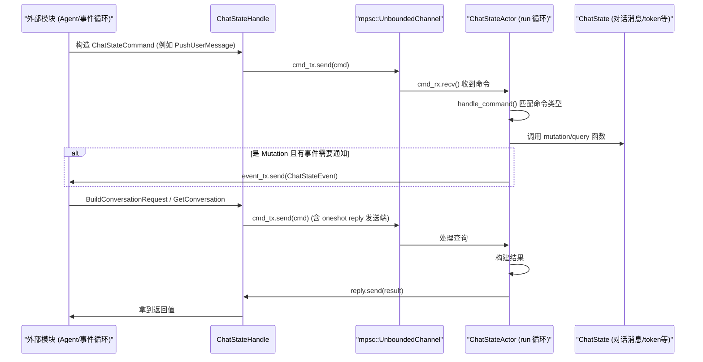
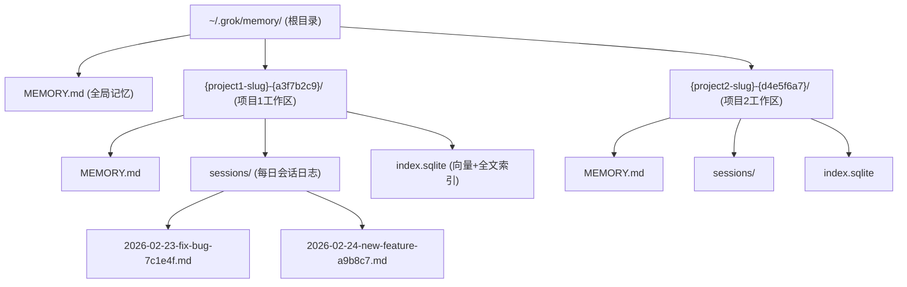
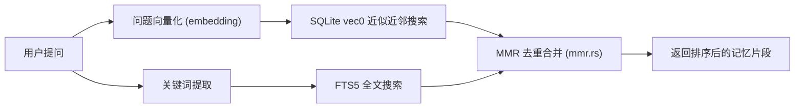
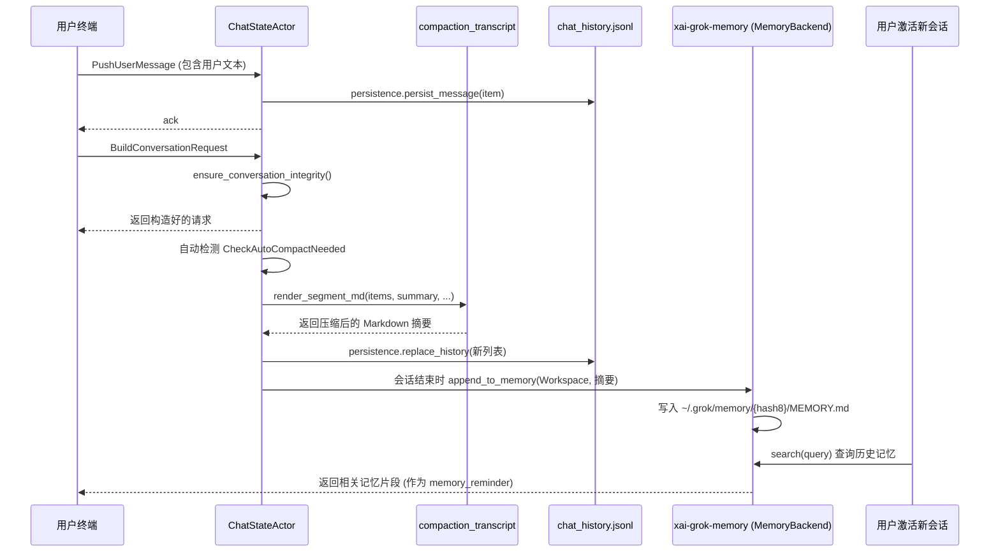

[← 返回首页](index.md)

# 聊天状态管理与长期记忆

## 先聊两句：为什么 Grok 需要"记住"和"压缩"

想象一下你和一个朋友聊天，聊了三个小时。到第四个小时，朋友说"还记得第一个小时你说的那个想法吗？"——你当然记得，因为你有**长期记忆**。但如果朋友手机坏了，只能显示最近的100条消息，前两个小时的内容就被扔掉了。这就是 Grok 面临的问题：它跟你的对话可能持续很久，每个文件修改、每次对话轮次都会生成大量消息。如果不做管理，两件事会出问题：

1. **上下文太长**：发给模型的请求会超过 token 限制，或者回答越来越慢、越来越贵。
2. **记忆丢失**：你上周跟 Grok 说过"这个项目的架构我打算用微服务"，这周它完全不记得了。

`xai-chat-state`（聊天状态管理）和 `xai-grok-memory`（长期记忆）就是解决这两个问题的两个模块。一个管"当前聊了多少、怎么压缩"，一个管"怎么把关键信息存到永久仓库，以后还能搜出来"。

这两个模块一个在主流程中实时运行（`xai-chat-state`），一个在后台悄悄干活（`xai-grok-memory`），但两者之间有协作：当聊天状态认为"对话太长需要压缩"时，它会调用压缩逻辑生成摘要，然后将摘要写入长期记忆模块。

## 聊天状态管理：一切都围着这个"Actor"转

聊天状态的入口是 `crates/codegen/xai-chat-state/src/actor/mod.rs` 里的 `ChatStateActor`。它采用了 **Actor 模型**（简单说就是：一个独立的工人，在单独的任务循环里接活儿、干活、回结果，从不被多个线程同时打扰）。所有对状态的修改和查询都必须通过给这个 Actor 发 `ChatStateCommand` 消息来完成。

```rust
// crates/codegen/xai-chat-state/src/actor/mod.rs (约第78行)
pub struct ChatStateActor {
    /// 内部状态——对话消息、token计数、配置等
    state: ChatState,
    /// 修剪配置（工具结果截断）
    pruning_config: PruningConfig,
    /// 持久化实现——Actor独占所有权，使用 &mut self 调用
    persistence: Box<dyn ChatPersistence>,
    /// 接收命令的通道
    cmd_rx: mpsc::UnboundedReceiver<ChatStateCommand>,
    /// 发送事件到主循环的通道
    event_tx: mpsc::UnboundedSender<ChatStateEvent>,
    /// 优雅关闭用的取消令牌
    cancellation_token: tokio_util::sync::CancellationToken,
}
```

### Actor 内部长什么样

Actor 的主循环在 `run()` 方法里，其实就是个 `tokio::select!`——要么等到取消信号，要么等到新命令，要么所有发送端都关闭了（所有 `ChatStateHandle` 都丢弃了）。

```rust
// crates/codegen/xai-chat-state/src/actor/mod.rs (约第120行)
async fn run(mut self) {
    loop {
        tokio::select! {
            biased;
            _ = self.cancellation_token.cancelled() => {
                debug!("ChatStateActor shutting down via cancellation");
                break;
            }
            cmd = self.cmd_rx.recv() => {
                let Some(cmd) = cmd else {
                    debug!("ChatStateActor shutting down: all handles dropped");
                    break;
                };
                self.handle_command(cmd);
            }
        }
    }
}
```

`handle_command` 根据命令类型分发到不同的处理函数。命令分为两大类：

- **Mutations（修改操作）**：比如 `PushUserMessage`、`PushAssistantResponse`、`ReplaceConversation`、`UpdateSamplingConfig`
- **Queries（只读查询）**：比如 `GetConversation`、`GetPromptIndex`、`GetLastTurnUsage`



### 序列化和持久化

聊天状态不能只活在内存里——用户每次按回车，消息都必须立刻写入磁盘的 `chat_history.jsonl` 文件。这件事由 `ChatPersistence` trait 抽象（定义在 `crates/codegen/xai-chat-state/src/persistence.rs`），Actor 通过 `self.persistence.persist_message(&item)` 写入。

```rust
// crates/codegen/xai-chat-state/src/persistence.rs (约第16行)
pub trait ChatPersistence: Send + 'static {
    /// 持久化单条消息（追加到 chat_history.jsonl）
    fn persist_message(&mut self, item: &ConversationItem);
    /// 替换整个聊天历史（压缩/回退时使用）
    fn replace_history(&mut self, items: &[ConversationItem]);
    /// 刷新缓冲区写入磁盘
    fn flush(&mut self);
}
```

持久化实现把每一条 `ConversationItem`（用户消息、AI 回复、工具调用结果等）序列化成 JSON 行，追加到文件末尾。当发生压缩（compaction）时，调用 `replace_history` 把整个文件重写一遍。

### 什么时候触发的压缩

对话太长时，Actor 会收到 `ReplaceConversation` 命令，传入的是压缩后的 `ConversationItem` 列表。压缩逻辑封装在 `crates/codegen/xai-chat-state/src/compaction_transcript.rs` 中，它会：

1. 将过时的多轮对话压缩成一段带统计信息的 Markdown 摘要（包括角色统计、工具调用统计、文件路径等）
2. 把压缩后的摘要作为一个 `CompactionSegment` 插入到对话的开头
3. 丢弃掉已经被压缩掉的那些原始对话消息

压缩细节分为四个等级（`CompactionDetail` 枚举）：

- `None`：只保留统计摘要，不保留任何原始对话
- `Minimal`：只保留工具调用的签名
- `Balanced`：保留截断后的工具调用参数和回复
- `Verbose`：保留完整对话内容（但受总大小限制，最多 512KB）

```rust
// crates/codegen/xai-chat-state/src/compaction_transcript.rs (约第60行)
#[derive(Clone, Copy, Debug, Default, PartialEq, Eq)]
pub enum CompactionDetail {
    /// 仅统计摘要，无原始对话
    None,
    /// 每轮只保留工具调用签名
    Minimal,
    /// 保留工具调用和截断后的回复
    Balanced,
    /// 完整保留（默认）
    #[default]
    Verbose,
}
```

## 长期记忆：从对话中提取精华并永久存储

如果说 `xai-chat-state` 管的是"当前会话不大不小刚刚好"，那 `xai-grok-memory` 管的是"把关键信息存到 ~/.grok/memory/ 里，下次打开还能用"。

### 记忆存储在哪儿

所有长期记忆都存储在 `~/.grok/memory/` 目录下，有两种作用域：

- **Global（全局）**：`~/.grok/memory/MEMORY.md` —— 跨项目共享的用户偏好、常用设置。
- **Workspace（项目）**：`~/.grok/memory/{project-slug}-{hash8}/MEMORY.md` —— 只跟当前项目相关的信息，比如项目的技术栈、架构选型。

此外每日会话日志存储在 `sessions/` 子目录下，`index.sqlite` 文件用于向量检索（详见后文）。



这段逻辑由 `crates/codegen/xai-grok-memory/src/storage.rs` 中的 `MemoryStorage` 结构体管理。

```rust
// crates/codegen/xai-grok-memory/src/storage.rs (约第29行)
pub struct MemoryStorage {
    /// ~/.grok/memory/
    global_dir: PathBuf,
    /// ~/.grok/memory/{project-slug}-{hash8}/
    workspace_dir: PathBuf,
    /// 原始工作区路径（用于日志/诊断）
    workspace_path: PathBuf,
    /// 如果工作区是临时目录（如 /tmp/...），写操作静默忽略
    ephemeral: bool,
}
```

### 记忆怎么写入：Append 模式

`MemoryStorage` 提供两种写入方式：

1. **`write_long_term`**：覆盖写入 `MEMORY.md` 文件——通常用于"记忆增强"（dream consolidation）后的结果。
2. **`append_to_memory`**：追加内容到 `MEMORY.md` 末尾——每次会话结束时写入当次的摘要。

```rust
// crates/codegen/xai-grok-memory/src/storage.rs (约第200行)
pub fn append_to_memory(&self, scope: MemoryScope, content: &str) -> std::io::Result<()> {
    if self.ephemeral && scope == MemoryScope::Workspace {
        tracing::debug!("MEMORY_EPHEMERAL_SKIP: workspace memory append skipped");
        return Ok(());
    }
    // ... 规范化内容、打开文件追加写入
}
```

### 记忆怎么读取：向量搜索 + 全文搜索

真正让记忆"好用"的是搜索能力——用户问"上次跟我说要重构那个数据库查询"，Grok 必须能从几十个记忆片段中找到相关的。

搜索流程分为两条线并行进行，最后合并结果：

1. **向量搜索**：用户问题被转换成向量，在 `index.sqlite` 的 vec0 虚拟表中用近似近邻算法（ANN）找最相似的记忆片段。
2. **全文搜索**：用户问题中的关键词通过 FTS5 全文索引直接匹配记忆文本内容。

两条结果经过 MMR（最大边际相关性）算法去重排序后返回给用户。MMR 的核心思想是：既跟查询相关，又跟已选结果不重复。



整个搜索流程的实现主要在 `crates/codegen/xai-grok-memory/src/search.rs` 中，索引结构在 `crates/codegen/xai-grok-memory/src/storage.rs` 的 `total_chunk_count` 方法可以快速查看当前索引了多少个片段。

### 记忆的文件层级分类

`MemoryStorage` 的 `classify_source` 方法可以判断一个文件路径属于什么类型：

```rust
// crates/codegen/xai-grok-memory/src/storage.rs (约第145行)
pub fn classify_source(&self, path: &Path) -> &'static str {
    if path.starts_with(&self.workspace_dir) {
        if path.file_name().is_some_and(|f| f == "MEMORY.md") {
            "workspace"
        } else {
            "session"
        }
    } else if path.starts_with(&self.global_dir) {
        "global"
    } else {
        "session"
    }
}
```

这种分类让搜索时可以根据用户当前的工作区有选择地召回——只召回本项目相关的记忆。

## 两个模块怎么配合

在实际的 Agent 生命周期中（详见《Agent 生命周期与多 Agent 协同》），这两个模块的协作流程如下：

1. 用户每次发送消息 → 通过 `ChatStateHandle` 发 `PushUserMessage` 命令 → Actor 记录到 `conversation` 向量列表，同时通过 `persistence.persist_message()` 写入 `chat_history.jsonl`。
2. 对话持续若干轮后，Actor 检查是否需要压缩（命令 `CheckAutoCompactNeeded`）→ 如果需要，触发 `ReplaceConversation` 压缩命令，压缩后的摘要写入文件。
3. 每个会话结束时，会话摘要通过 `append_to_memory` 追加写入项目/全局的 `MEMORY.md`。
4. 下次开启新的会话时，`MemoryBackend` 从 SQLite 索引中搜索相关记忆，将匹配的片段作为 `memory_reminder` 注入到系统提示中，供模型参考。



## 关键文件索引

| 文件路径 | 干什么用的 |
|---------|-----------|
| `crates/codegen/xai-chat-state/src/actor/mod.rs` | Actor 主循环和命令分发，所有聊天状态更改的入口 |
| `crates/codegen/xai-chat-state/src/actor/state.rs` | `ChatState` 结构体，保存对话消息、token 计数、配置 |
| `crates/codegen/xai-chat-state/src/actor/mutations.rs` | 状态修改函数的实现 |
| `crates/codegen/xai-chat-state/src/actor/queries.rs` | 只读查询函数的实现 |
| `crates/codegen/xai-chat-state/src/compaction_transcript.rs` | 对话压缩为 Markdown 摘要的逻辑，含四种压缩等级 |
| `crates/codegen/xai-chat-state/src/persistence.rs` | `ChatPersistence` trait 及 `MockChatPersistence` / `NullChatPersistence` |
| `crates/codegen/xai-chat-state/src/lib.rs` | 模块导出和公共类型 |
| `crates/codegen/xai-grok-memory/src/storage.rs` | `MemoryStorage`——文件级读写、目录管理、垃圾回收 |
| `crates/codegen/xai-grok-memory/src/search.rs` | 向量 + 全文搜索，MMR 去重合并 |
| `crates/codegen/xai-grok-memory/src/lib.rs` | 模块导出和 `MemoryBackend` trait |

---

**延伸阅读**：
- 想知道 Actor 怎么跟 Agent 主循环配合？看《Agent 生命周期与多 Agent 协同》。
- 想了解记忆中的向量索引是用什么数据库存的？长话短说：SQLite 扩展 `sqlite-vec` 提供了 vec0 虚拟表，支持近似近邻搜索。
- 被大段对话压缩逻辑绕晕了？`compaction_transcript.rs` 里的 `render_segment_md` 是核心函数，它接受对话片段、摘要文本、压缩等级，返回一段 Markdown。代码里全部带注释，直接读就可以。
