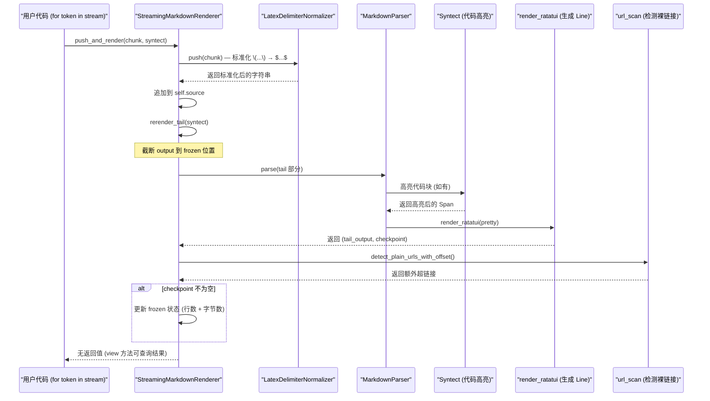

[← 返回首页](index.md)

# Markdown 流式渲染

## 一句话解释

Grok 的聊天窗口里那些花花绿绿的代码块、表格、链接、Mermaid 图，不是等 AI 把整段话说完了才一下子画出来的——它是**一边接收 AI 的回复，一边一句一句地、一段一段地渲染出来的**。就像你看一个画家画一幅画，他不是等全画完才给你看，而是每画几笔就让你看到进展。这个 crate `xai-grok-markdown` 干的就是这事儿。

## 为什么这比想象中难得多？

AI 聊天时，回复是一块一块（chunk）吐出来的。比如 AI 要输出一个带代码块的 Markdown 文档，前一个 chunk 可能只有 ```` ```python\nprint(`，后一个 chunk 才跟上 `"hello")\n``` `。如果你每收到一个 chunk 就把整个文档从头到尾重新渲染一遍，那么随着内容越来越多，每次渲染的时间会像雪球一样越滚越大——从 O(N) 变成 O(N²)。

**救命稻草**：大部分 Markdown 块（段落、代码块、表格）在某个位置之后就不会再变了。比如一个完整的代码块，它的头部和内容一旦确定，后面的 chunk 最多在它后面再加东西，不会回头修改它。利用这个特性，我们只渲染"还没定下来"的尾巴部分，前面的"冻住"不动。

## 流程图：一次完整的流式渲染

```mermaid
flowchart LR
    subgraph S["输入：AI chunk 流"]
        C1["chunk 1: '#'"]
        C2["chunk 2: ' 简介\\n'"]
        C3["chunk 3: '这是一个测试'"]
    end```python\\nprint(']"]
        C4["chunk 4: '\"hello\")\\n```'"]
    end

    subgraph T["StreamingMarkdownRenderer"]
        N["LaTeX 标准化<br/>(`LatexDelimiterNormalizer`)"]
        A["追加到 source buffer"]
        R["渲染尾巴 (rerender_tail)"]
        F["检测 Checkpoint<br/>冻住已稳定的行"]
    end

    subgraph O["输出：MarkdownRenderView"]
        V["lines + line_source_map<br/>+ hyperlinks + code_blocks"]
    end

    C1 --> N
    C2 --> N
    C3 --> N
    C4 --> N
    N --> A
    A --> R
    R -->|仅渲染<br/>frozen.source_bytes 之后的| F
    F -->|更新 frozen 状态| R
    F --> V
```

**关键文件**：`crates/codegen/xai-grok-markdown/src/streaming.rs` 中的 `StreamingMarkdownRenderer` 结构体就是干这个的。

## 时序图：一个 chunk 从进门到出门

下面是 `push_and_render()` 被调用时，内部各模块是怎么协作的：



**代码入口**：`crates/codegen/xai-grok-markdown/src/streaming.rs` 第 130 行附近的 `streaming::StreamingMarkdownRenderer`。

## 核心概念：Checkpoint（检查点）——什么算"稳定"？

Checkpoint 是 Markdown 中的一个"稳定边界"，在这个边界之后的内容无论如何变化，边界之前的行都不会再变了。`src/checkpoint.rs` 中的 `CheckpointKind` 枚举定义了哪些情况会产生检查点：

| Checkpoint 类型 | 标志性事件 | 例子 |
|---|---|---|
| `ParagraphEnd` | 连续两个换行 `\n\n` | 一个段落写完了，后面无论加什么，前面的段落都不会变 |
| `FencedCodeBlockEnd` | 代码块结束标记 ` ``` ` | 一个代码块关闭了，前面的代码行固化了 |
| `ThematicBreak` | 分隔线 `---` | 分隔线之前的内容稳定 |
| `TableEnd` | 表格最后一行结束 | 表格的行不会再增加或修改 |
| `MathBlockEnd` | `$$` LaTeX 块结束 | 数学公式块关闭 |

**大白话版**：就像你写作文，写完了一段，后面再写新段落，你肯定不会回头改前面那段。Checkpoint 就是在文档里标出"到这里，前面的已经定稿了"的位置。

## 核心数据结构：MarkdownRenderOutput

输出时，渲染器产出一个 `MarkdownRenderOutput` 结构体（`src/output.rs`），包含三个关键字段：

- `lines: Vec<Line<'static>>`——渲染后的终端行，每条包含带样式的 Span（颜色、加粗等）。
- `line_source_map: Vec<usize>`——每个终端行对应 source 中的字节偏移量。用户复制文本时，需要把屏幕上看到的一行对应回原始 Markdown 源码。
- `hyperlinks: Vec<HyperlinkTarget>`——检测到的可点击超链接（供终端 OSC 8 协议使用）。
- `code_blocks: Vec<CodeBlockSpan>`——代码块的范围（起始行、结束行、语言），用于 AI 的"复制代码"按钮等交互。

## 代码块高亮：Syntect 出场

当渲染器遇到一个闭合的代码块（比如 `` ```python ``` ``），它会调用 `Syntect`（`src/syntax.rs`）进行语法高亮。Syntect 是一个 Rust 的语法高亮库，解析 Sublime Text 的 `.sublime-syntax` 文件。Grok 使用了一个自定义主题文件（编译期通过 `include_bytes!("theme.tmTheme")` 嵌入二进制）。

```rust
// src/lib.rs 第 19-21 行
let syntect = Syntect::new(include_bytes!("theme.tmTheme"));
```

高亮结果以 `Vec<(SyntectStyle, String)>` 的格式返回——每个 `(样式, 文本)` 对表示一个带颜色的片段。渲染到终端时，`src/render.rs` 中的 `render_replace_ansi` 函数把它们转成 ANSI 转义序列。

**代码块的高亮是增量完成的**：对于还打开的代码块（还没见到结束 ```），使用 `OpenCodeHighlighter`（`src/open_code_highlighter.rs`）逐行累加高亮状态，避免每次重新解析整个未闭合的代码块。

## 数学公式：LaTeX 标准化

数学公式的渲染比较特殊。用户可能用不同语法写 LaTeX：`\(E=mc^2\)`、`$$E=mc^2$$`、`\begin{equation}...\end{equation}`。渲染器通过 `LatexDelimiterNormalizer`（`src/latex_delimiters.rs`）把它们统一标准化为 `$...$` 或 `$$...$$` 形式。

```rust
// src/lib.rs 第 73-79 行
let normalized = latex_delimiters::normalize_latex_delimiters(text);
```

标准化后的单行公式（`$...$`）在 pretty 模式下被转换为 Unicode 近似值（比如 `$E=mc^2$` 显示为 `E=mc²`）。多行公式（`$$...$$`）则用块状表格风格渲染，保留一个背景色区分。

**注意**：标准化是在**每个 chunk 进入时**流式进行的，`LatexDelimiterNormalizer` 会暂存可能跨 chunk 边界的半截语法（比如 chunk 以 `\(` 结尾，下一个 chunk 以 `E=...` 开头）。`finish()` 方法会刷新所有暂存内容。

## 表格渲染：窄屏适配

Markdown 表格是渲染中最麻烦的部分之一，因为终端宽度有限。`render_markdown_ratatui_with_buffers_width` 函数接受一个 `max_table_width` 参数：

```rust
// src/lib.rs 第 52-54 行
pub fn render_markdown_ratatui_with_buffers_width(
    text: &str, ms: MarkdownStyle, pretty: bool,
    buffers: &mut MarkdownBuffers, syntect: Option<&Syntect>,
    max_table_width: Option<usize>,
) -> (MarkdownRenderOutput, Option<Checkpoint>)
```

当表格太宽时，渲染器会按比例压缩各列宽度，并在单元格内容过长时显示省略号（用 `…` 截断）。这个过程在 `MarkdownParser.parse()` 内部处理（`src/parse.rs`），主要通过 `MarkdownStream` 的 `build_table` 方法实现。

## Mermaid 图：转为文本描述

Grok 的聊天窗口会展示 Mermaid 图，但不是直接渲染成图片——而是把 Mermaid 语法转换为一段描述性文本。这个转换在 `src/mermaid.rs` 中完成。比如：

```
graph TD
    A[开始] --> B[结束]
```

被转换为：

```
┌──────────┐     ┌──────────┐
│  开始    │ ──→ │  结束    │
└──────────┘     └──────────┘
```

**为什么不直接渲染成图？** 终端是文本环境，逐像素画图需要特殊的图形协议（如 Kitty 或 iTerm2 的内嵌图片），并非所有终端都支持。文本化的 Mermaid 图兼容性最好。

## 超链接检测：自动识别裸链接

渲染器还需要在 pretty 模式下检测"裸链接"——比如用户在聊天里输入了 `https://example.com`，渲染器应该把它变成可点击的超链接。这项工作在 `src/url_scan.rs` 中完成，通过正则表达式扫描已渲染的行，然后生成 `HyperlinkTarget` 加入输出。

```rust
// 来自 src/streaming.rs 第 272-281 行（流式渲染器调用 url_scan 的片段）
let tail_lines = &self.output.lines[frozen_lines..];
let (extra_links, post_scan_next_id) = crate::url_scan::detect_plain_urls_with_offset(
    tail_lines,
    frozen_lines,
    &self.output.hyperlinks,
    tail_next_link_id,
);
```

**为什么要在渲染后扫描而不是解析时检测？** 因为 Markdown 解析器只关心语法树，而裸链接（没有 `[]()` 包装的 URL）在语法树中就是普通文本。渲染后才能确定它在屏幕上的位置和颜色。

## 冻住的尾巴不会动

总结一下整个流程最简单的一句话：

> **Grok 把 AI 回复一块一块地接收，每收到一块，就只重新渲染"还没冻住"的那一小段尾巴。前面的段落在遇到 Checkpoint 后就不再动了。于是，无论聊天多长，每次渲染的时间都只跟当前 chunk 的大小有关，而不是跟总长度有关。**

详见 `crates/codegen/xai-grok-markdown/src/streaming.rs` 中的 `rerender_tail` 方法实现。
