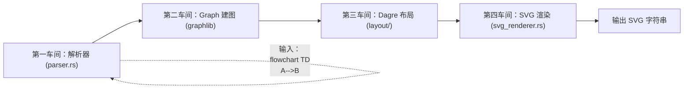
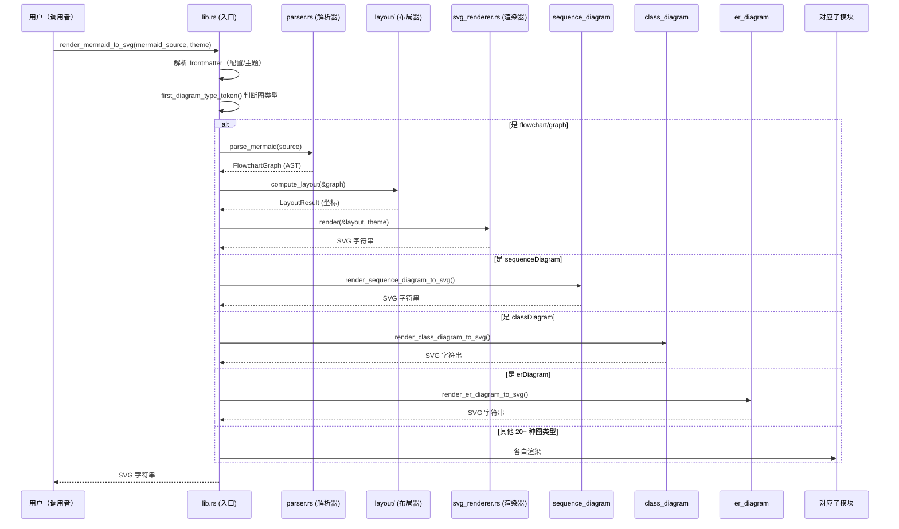
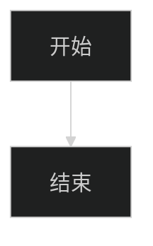

[← 返回首页](index.md)

# Mermaid 图表渲染：从源码到终端里的图形

## 一条流水线上四个车间

把 Mermaid 文本变成 SVG 图片，就像一家工厂里的流水线：

1. **第一车间：拆解工（解析器）**——读你写的 `graph TD A-->B` 这种文本，拆成"节点 A"、"节点 B"、"箭头边"这样的零件清单（抽象语法树 AST）。
2. **第二车间：搭骨架（Graph 建图）**——把零件清单搭成一个真正的图结构：谁跟谁连、谁在谁的子图里。
3. **第三车间：量尺寸（Dagre 布局）**——用算法算出每个节点放哪儿、边怎么拐弯，结果是每个元素的精确坐标。
4. **第四车间：画出来（SVG 渲染器）**——拿着坐标数据，逐段写出 SVG 标签字符串，最后拼接成一个完整的 `<svg>...</svg>` 字符串。



这个流程的入口在 `third_party/mermaid-to-svg/src/lib.rs` 里的 `render_mermaid_to_svg` 函数。它先看你要画什么类型的图（流程图？时序图？类图？ER 图？），然后分发给专门的子解析器。

## 第一车间：拆成零件（解析器）

解析器的核心在 `third_party/mermaid-to-svg/src/parser.rs`。它做的工作就跟小时候玩积木拆包一样——把一行行 Mermaid 文本拆成有意义的零件。

### 1. 先看这是什么图

`parser.rs` 的第一行逻辑：

```rust
// 文件: third_party/mermaid-to-svg/src/parser.rs
let first_token = first_line.split_whitespace().next().unwrap_or("");
if first_token != "graph" && first_token != "flowchart" && is_known_mermaid_type(first_token) {
    return Err(MermaidError::UnsupportedDiagramType(first_token.to_string()));
}
```

说白了就是：如果你是 `sequenceDiagram` 这种非流图类型，别进本解析器，滚去你的子解析器。支持的类型有二十多种：

```rust
// 文件: third_party/mermaid-to-svg/src/parser.rs
fn is_known_mermaid_type(token: &str) -> bool {
    matches!(
        token,
        "sequenceDiagram" | "classDiagram" | "stateDiagram" | ...
        "C4Context" | "C4Container" | "C4Component" | "C4Dynamic" | "C4Deployment"
        "sankey-beta" | "packet-beta" | "xychart-beta" | "radar-beta" | "block-beta"
        "quadrantChart"
    )
}
```

### 2. 一行一行啃

`Parser` 结构体带一个 `current_line` 指针，像读菜谱一样逐行扫描。

```rust
// 文件: third_party/mermaid-to-svg/src/parser.rs
struct Parser<'a> {
    lines: Vec<&'a str>,
    current_line: usize,
    next_subgraph_index: usize,
}
```

它怎么知道某行是节点还是边？靠 `line_contains_edge` 检查有没有 `-->`、`---`、`==>` 这些模式：

```rust
fn line_contains_edge(&self, line: &str) -> bool {
    self.find_edge_start(line).is_some()
}
```

找边标记的时候很小心——要跳过括号里的内容，免得把 `A[uses --> arrows]` 里的 `-->` 也当成边：

```rust
fn find_edge_start(&self, s: &str) -> Option<usize> {
    // 跳过引号和括号内部的模式，只有最外层括号之外的
    // -->、--、==>、-.-> 等才算
    for i in 0..bytes.len() {
        if in_quote { ... }
        match b {
            b'"' => in_quote = !in_quote,
            b'[' | b'(' | b'{' => depth += 1,
            b']' | b')' | b'}' => depth -= 1,
            _ if depth == 0 => {
                // 这里才检查边模式
                if PATTERNS.iter().any(|p| bytes[i..].starts_with(p.as_bytes())) {
                    return Some(i);
                }
            }
        }
    }
}
```

### 3. 节点形状怎么识别的？

`try_parse_node` 函数就像"看括号定形状"——根据括号的配对方式判断形状：

```rust
// 圆角矩形（括号）
if let Some(paren_start) = s.find('(') {
    return Some(Node { shape: NodeShape::RoundedRectangle, ... });
}
// 直角矩形（方括号）
if let Some(bracket_start) = s.find('[') {
    return Some(Node { shape: NodeShape::Rectangle, ... });
}
// 菱形（花括号）
if let Some(brace_start) = s.find('{') {
    return Some(Node { shape: NodeShape::Diamond, ... });
}
// 圆（双层括号）
if let Some(paren_paren_start) = s.find("((") {
    return Some(Node { shape: NodeShape::Circle, ... });
}
// 六边形（双层花括号）
if let Some(brace_brace_start) = s.find("{{") {
    return Some(Node { shape: NodeShape::Hexagon, ... });
}
```

### 4. 标签里的文字怎么处理？

`normalize_label` 函数干三件事：
- 去掉外层引号（`"你好"` → `你好`）
- 解码 HTML 实体（`&lt;` → `<`、`&amp;` → `&`）
- 把换行符转成真正的换行（`\\n` → `\n`）

```rust
fn normalize_label(label: &str) -> String {
    let label = strip_wrapping_quotes(label.trim());
    decode_html_entities(label)
        .replace("\\n", "\n")
        .replace("<br/>", "\n")
        // ... 其他换行变体
}
```

最终解析出来的结果是一个 `FlowchartGraph`：

```rust
pub struct FlowchartGraph {
    pub direction: GraphDirection,       // TD, LR, BT, RL
    pub statements: Vec<Statement>,     // 节点、边、子图、样式
}
```

## 第二车间：搭骨架（Graph 建图）

解析器产出的 `FlowchartGraph` 还不是计算机好理解的图结构。真正参与布局计算的，是 `graphlib_rust` 提供的 `Graph` 结构体。

这个过程在 `third_party/mermaid-to-svg/src/layout/` 里完成。`FlowchartGraph` 里的 `statements` 被转换成 `Graph` 的节点和边，同时维持子图层级关系。

这个 Graph 就是个"谁跟谁连着"的邻接表——每个节点知道自己通向谁、从谁来。

## 第三车间：量尺寸（Dagre 布局）

这是整套流水线里最数学的部分，在 `third_party/dagre_rust/src/layout/` 目录下。它分三步走：

### 第一步：排等级（Rank）

对于从上到下的流程图（TD），"排等级"就是确定每个节点在第几行。从 `A` 到 `B` 的箭头意味着 `B` 在 `A` 的下一行。

### 第二步：定顺序（Order）

同一行的节点怎么左右排列？算法让交叉的边尽量少——这跟"怎么安排会议室里的人座位才能让所有人都能面对面聊天"类似。

### 第三步：算坐标（Position）

每个节点有了行号和列号之后，算出精确的 `x`、`y` 坐标，以及边的贝塞尔曲线控制点。

布局结果是一个 `LayoutResult`：

```rust
// 文件: third_party/mermaid-to-svg/src/layout/ 的返回类型
pub struct LayoutResult {
    pub nodes: HashMap<String, LayoutNode>,  // 每个节点有 x, y, width, height
    pub edges: Vec<LayoutEdge>,              // 每条边有 points 路径点
    pub subgraphs: Vec<LayoutSubgraph>,      // 子图有 x, y, width, height
    pub width: f64,
    pub height: f64,
}
```

## 第四车间：画出来（SVG 渲染器）

有了布局结果，`svg_renderer.rs` 就像打印机一样逐元素输出 SVG。

### 开张写头

```rust
// 文件: third_party/mermaid-to-svg/src/svg_renderer.rs
fn write_header(&mut self) {
    self.output.push_str(&format!(
        r#"<svg width="{:.0}" height="{:.0}" viewBox="0 0 {:.0} {:.0}" 
             xmlns="http://www.w3.org/2000/svg" 
             style="background-color: {};">
         <rect x="0" y="0" width="{:.0}" height="{:.0}" 
               fill="{}" stroke="none"/>"#,
        self.width, self.height, self.width, self.height,
        self.theme.background, self.width, self.height, self.theme.background
    ));
}
```

### 定义箭头

```rust
fn write_defs(&mut self) {
    self.output.push_str(&format!(
        r#"<marker id="arrowhead" ...>
            <path d="M 0 0 L 10 5 L 0 10 z" fill="{}" .../>
          </marker>"#, self.theme.edge_color));
}
```

### 画节点——按形状分派

```rust
fn render_node(&mut self, node: &LayoutNode) {
    match node.shape {
        NodeShape::Rectangle => self.render_rectangle(node, 0.0),
        NodeShape::RoundedRectangle => self.render_rectangle(node, 5.0),
        NodeShape::Stadium => self.render_rectangle(node, node.height / 2.0),
        NodeShape::Diamond => self.render_diamond(node),
        NodeShape::Circle => self.render_circle(node),
        NodeShape::Hexagon => self.render_hexagon(node),
        NodeShape::Cylinder => self.render_cylinder(node),
        // ... 还有 StartState、EndState、ForkJoin 等
    }
}
```

比如矩形节点，真的就是写一个 `<rect>`：

```rust
fn render_rectangle(&mut self, node: &LayoutNode, rx: f64) {
    let x = node.x - node.width / 2.0;
    let y = node.y - node.height / 2.0;
    let fill = node.fill_color.as_ref().unwrap_or(&self.theme.node_fill);
    let stroke = node.stroke_color.as_ref().unwrap_or(&self.theme.node_stroke);

    self.output.push_str(&format!(
        r#"<rect x="{:.1}" y="{:.1}" width="{:.1}" height="{:.1}" 
                rx="{:.1}" fill="{}" stroke="{}" stroke-width="1"/>\n"#,
        x, y, node.width, node.height, rx, fill, stroke
    ));
    self.render_text(node.x, node.y, &node.label);
}
```

### 画边——计算拐弯

边要处理箭头偏移——箭头尖要刚好挨着节点边界，不能插进节点里：

```rust
const EDGE_ARROWHEAD_OFFSET: f64 = 4.0;
const EDGE_ARROWHEAD_OFFSET_THICK: f64 = 5.5;

// 渲染之前把最后的路径点往回缩，让箭头尖刚好在节点边缘
if has_arrow {
    Self::shorten_end_for_marker(&mut points, if is_thick { 
        EDGE_ARROWHEAD_OFFSET_THICK 
    } else { 
        EDGE_ARROWHEAD_OFFSET 
    });
}
```

## 流程图渲染的整体流水线



## 非流程图：各自为政

`render_mermaid_to_svg` 函数里有一个很长的 `if` 链：

```rust
if diagram_type == Some("erDiagram") {
    return er_diagram::render_er_diagram_to_svg(mermaid_source, theme);
}
if diagram_type == Some("classDiagram") {
    return class_diagram::render_class_diagram_to_svg(mermaid_source, theme);
}
if diagram_type == Some("sequenceDiagram") {
    return sequence_diagram::render_sequence_diagram_to_svg(mermaid_source, theme);
}
// ... 二十几种图，每种有自己的子模块
```

每种图都有自己独立的解析 → 布局 → 渲染流程。比如 `er_diagram.rs` 自己认识 `||--o{` 这种关系符号，`class_diagram.rs` 自己处理 `<|--` 继承箭头。

## 前端配置怎么传进来

Mermaid 支持在文本开头写 YAML 前端配置：



`lib.rs` 用 `parse_mermaid_frontmatter` 解析出配置，然后一路传递给布局器和渲染器：

```rust
let parsed_source = parse_mermaid_frontmatter(mermaid_source);
// ... 提取配置 ...
let layout_result = if is_flowchart {
    layout::compute_layout_with_config(&graph, &parsed_source.config)
} else {
    layout::compute_layout(&graph)
};
let svg = if is_flowchart {
    svg_renderer::render_with_config(&layout_result, theme, &parsed_source.config)
} else {
    svg_renderer::render(&layout_result, theme)
};
```

渲染器从配置里读取字体、字号和曲线类型，体现在 `SvgRenderOptions` 里：

```rust
impl SvgRenderOptions {
    fn from_render_config(config: &RenderConfig) -> Self {
        Self {
            font_family: config.font_family.clone().unwrap_or(default.font_family),
            font_size: config.font_size_px().unwrap_or(default.font_size),
            wrapping_width: config.flowchart.wrapping_width.map(f64::from)
                .unwrap_or(default.wrapping_width),
            edge_curve: config.flowchart.curve.as_deref()
                .map(EdgeCurve::from_mermaid_name)
                .unwrap_or(default.edge_curve),
        }
    }
}
```

`curve` 参数能控制边的弯曲方式——`linear` 出直线，`basis` 出光滑贝塞尔曲线。

## 在终端里怎么显示 SVG？

Grok 的终端渲染引擎（详见《终端渲染引擎：如何把 Markdown 变成赏心悦目的 TUI》）拿到这个 SVG 字符串后，会把它转成 ASCII 图形。大致流程是：SVG → 解析出文本标签和位置 → 用字符拼出方框和箭头 → 输出到终端。这里不做展开。

## 测试：确保不出错

`third_party/mermaid-to-svg/src/lib.rs` 末尾有一大堆测试用例。它们覆盖了各种边界情况：

- 标签带中文：`B -- 是 --> C` 这种边标签必须正确渲染为边标签，而不是被误解为节点名。
- HTML 实体：`shared_ptr&lt;Connection&gt;` 要先解码再转义，防止双重转义。
- 换行标签：`A["Source\nTarget"]` 要拆成两行 `<tspan>`。
- CJK 宽度：中文节点比同样长度的英文节点宽两倍，测试里明确检查 `cjk > ascii + 40.0`。

```rust
#[test]
fn test_open_edge_label_syntax_parses_as_labels_not_nodes() {
    let mermaid = "flowchart TD
    A[开始] --> B{是否登录?}
    B -- 是 --> C[进入主页]
    B -- 否 --> D[跳转登录页]";
    let svg = render_mermaid_to_svg(mermaid, None).expect("open-label flow renders");
    assert!(!svg.contains("B -- "), "no literal `B -- x` node");
    for label in ["是", "否"] {
        assert!(svg.contains(label), "edge label {label:?} missing");
    }
}
```

## 最后一点

整个 `third_party` 区域的 Mermaid 渲染栈，核心思想就是**解耦**：解析器不懂坐标、布局器不懂 SVG、渲染器不懂 Mermaid 语法。每个组件只做好自己的事，用中间数据结构（AST、Graph、LayoutResult）来串联。这样以后想换一种布局算法、或者增加新的图表类型，都很容易——写好你的解析器，注册到 `lib.rs` 的 if 链里就行。
