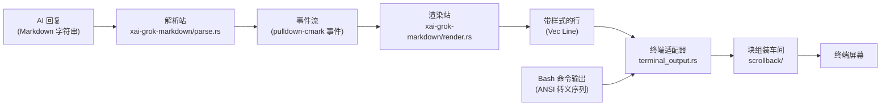
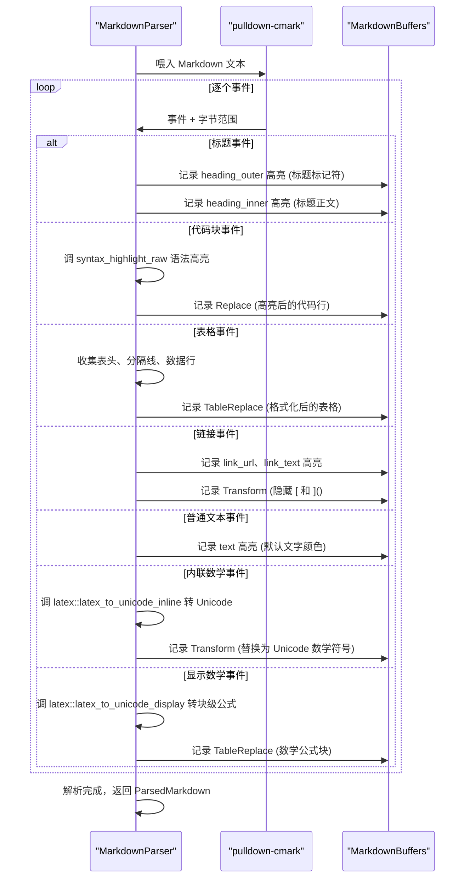
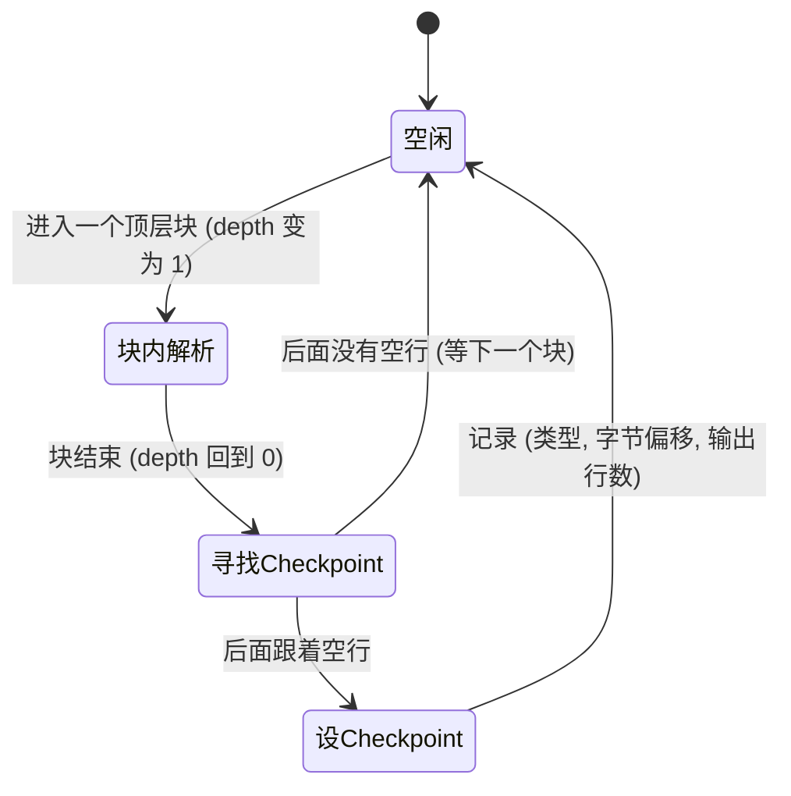
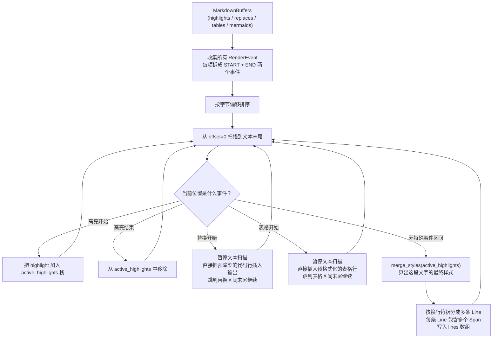
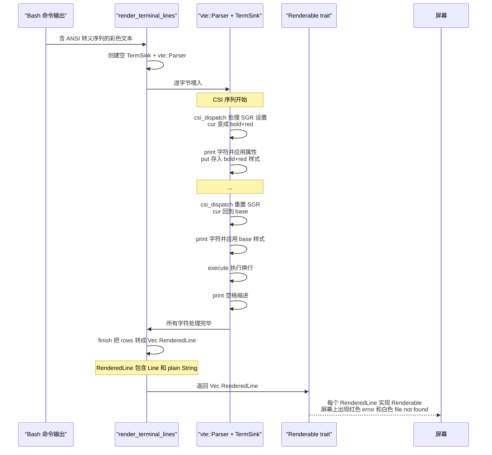
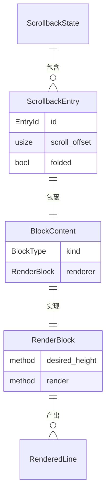
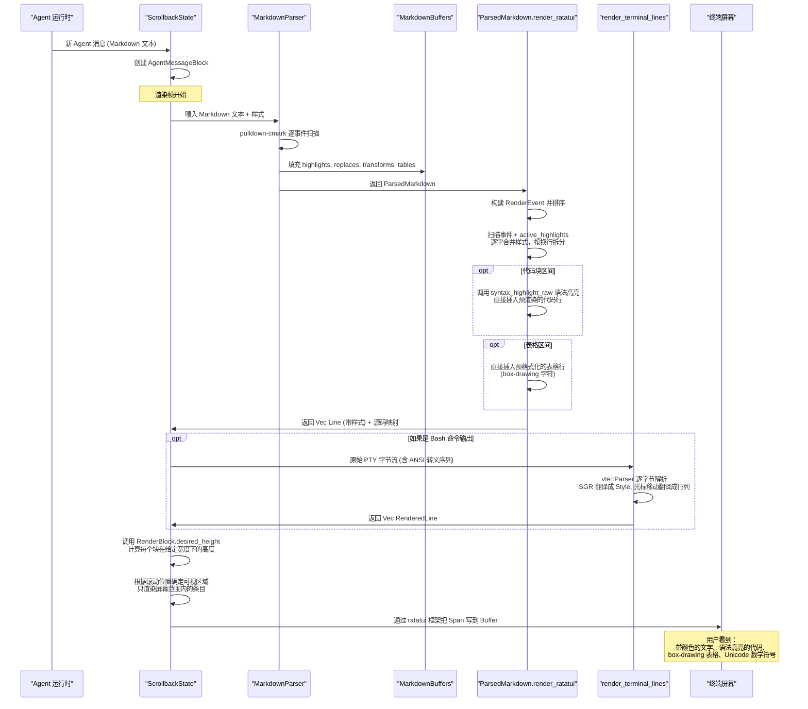

[← 返回首页](index.md)

# 终端渲染流水线

## 这条流水线在做什么？

每次 AI 回复一串 Markdown 文本，到你眼前的屏幕上出现带颜色、有滚动条、能选中复制的方块——中间要经过一堆加工站。这条流水线就像个工厂车间，原材料是一段字符串，成品是终端上能画出来的"块"（block）。

整条流水线跨了三个 crate，分四个大阶段：

1. **解析**（`xai-grok-markdown` 的 `src/parse.rs`）——把 Markdown 拆成事件流
2. **渲染**（`xai-grok-markdown` 的 `src/render.rs`）——把事件流转成带样式的行
3. **终端适配**（`xai-grok-pager-render` 的 `src/render/terminal_output.rs`）——处理 Bash 命令输出里的 ANSI 转义序列
4. **布局组装**（`xai-grok-pager` 的 `src/scrollback/`）——把渲染好的行拼成可管理的"块"，挂上滚动、选择、搜索

我们用一个总览图看清楚它们在流水线上的位置：



## 阶段一：解析——把 Markdown 拆成事件

### 解析器在干什么？

`src/parse.rs` 里的 `MarkdownParser` 是整个流程的入口。它做的事情很直白：拿着 `pulldown-cmark` 库，把 Markdown 文本从头到尾扫一遍，每遇到一个语法结构（标题、列表、代码块、表格、链接……）就生成一个"事件"（Event）。

但光有事件还不够——解析器同时在做"装饰"：每个事件触发了什么样式、哪个区间要被高亮、哪些字符要替换成更漂亮的符号（比如把 `- ` 变成 `•`），全都当场记录下来，填进一个叫 `MarkdownBuffers` （`src/buffers.rs`）的结构里。

### MarkdownBuffers——解析过程的"草稿本"

你可以把 `MarkdownBuffers` 想象成解析器手边的一个草稿本，一边读 Markdown 一边往上记东西。它记录什么呢？

- **highlights**：哪些字节范围涂什么颜色（比如标题用大号粗体、链接用蓝色下划线）
- **replaces**：代码块语法高亮的结果——把代码原文替换成带颜色的行
- **transforms**：字符替换表——告诉渲染器"在 `pretty` 模式下，把 `[` 这个字符删掉"（隐藏 Markdown 标记符号）
- **table_replaces**：表格格式化后的结果——用 box-drawing 字符画好的完整表格
- **mermaid_replaces**：Mermaid 图表的 ASCII 渲染结果
- **link_targets**：所有链接的 URL 和目标范围，给后面的超链接渲染用

### 核心解析循环



文件定位：`crates/codegen/xai-grok-markdown/src/parse.rs` 里的 `MarkdownParser::on_event()` 方法。

### 关键设计：checkpoint（检查点）

流式渲染（AI 一个字一个字往外蹦的场景）的难点在于：每次来了新文字，不能从头解析整个文本——那样 O(n²) 会卡死。解析器用 checkpoint 机制解决问题。

简单说：解析器每处理完一个顶层块（段落到哪、标题到哪、代码块到哪），记下这个位置。下次增量渲染时，从最后一个 checkpoint 之后继续，前面已经渲染好的行数也缓存起来。



这个逻辑在 `on_end()` 方法里（`src/parse.rs`），它在每个 `TagEnd::Paragraph`、`TagEnd::Heading`、`TagEnd::CodeBlock` 等标签结束后检查是否可以设 checkpoint。

## 阶段二：渲染——从事件流到带样式的行

### ParsedMarkdown 的双路径渲染

解析器产出的 `ParsedMarkdown` （`src/parse.rs` 末尾）有两个渲染出口：

- `render_ansi()` → 输出 ANSI 转义序列字符串（给纯文本终端用，比如 pipe 到文件）
- `render_ratatui()` → 输出 `Vec<Line<'static>>`（给 ratatui 框架画到终端上）

两条路径共享同一个核心算法——"事件合并与分派"，区别只是最后产出的格式不同。我们用 `render_ratatui` 说事，这是 UI 的主路径。

### 渲染核心：事件合并算法

`src/render.rs` 里的 `render_ratatui()` 方法不长，但逻辑密度高。它的核心思想是：

1. 把 `MarkdownBuffers` 里的四类区间（highlights、replaces、tables、mermaids）的起止位置收集成 **RenderEvent**
2. 按字节偏移排序，像拉链一样合并
3. 从前往后扫描：哪段文本遇到什么规则，就切成什么样式



文件定位：`crates/codegen/xai-grok-markdown/src/render.rs` 里 `render_ratatui()` 方法的 for 循环。

### 样式合并——谁说了算？

一个字节可能同时被多个高亮规则覆盖。比如 `**粗体 [链接](url)**`，中间的"链接"两个字同时被 bold 和 link_text 两个高亮区间罩着。

`merge_styles`（`src/style.rs`）做的事就是"后添加的样式覆盖先添加的"。因为解析器先推 `Strong` 的样式、后推 `Link` 的 inner 样式，所以链接颜色会覆盖粗体颜色——但如果链接样式本身没有 fg（前景色），那就保留粗体的颜色。

```rust
// 伪代码（实际函数在 src/style.rs）：
fn merge_styles(styles: impl Iterator<Item = Style>) -> Style {
    let mut result = Style::default();
    for s in styles {
        if let Some(fg) = s.get_fg_color() { result = result.fg(fg); }
        if let Some(bg) = s.get_bg_color() { result = result.bg(bg); }
        result = result.add_modifier(s.get_effects());
    }
    result
}
```

### Pretty 模式 vs Raw 模式

Markdown 渲染有两个模式，概念很简单：

- **Raw 模式**：原样显示 Markdown 标记符号。`**粗体**` 就这么显示。对应"不美化"的视图，比如你 Ctrl+R 回看原始回复。
- **Pretty 模式**：隐藏标记符号，用样式代替。`**粗体**` 里的 `**` 看不见，但"粗体"两个字真的变粗了。

区别在哪里实现？在解析阶段记录的 `transforms` 数组。比如链接文本 `[click me](url)`：

- 解析器在 `on_start(Tag::Link)` 里插入几个 transform：
  - 删除开头的 `[`
  - 把 `](` 替换成 ` (`
  - 保留 `url)` 
- Pretty 模式下，渲染器应用这些 transform，你看到的是 `click me (url)` 
- Raw 模式下，渲染器跳过非 `force` 的 transform，你看到的是 `[click me](url)`

### 代码块的特殊处理

代码块不走事件合并的主路径。解析器在遇到 `Tag::CodeBlock` 时直接调用 `syntax_highlight_raw()`——这是 `xai-grok-markdown` 里的语法高亮入口，底层用 `syntect` 引擎（支持 Sublime Text 的 `.tmTheme` 配色文件）。

高亮后的结果是一条条带样式的"行内片段"（`Vec<Vec<(SyntectStyle, String)>>`），存进 `Replace` 结构。渲染时，这个区间被整体替换，不参与文本拆分。

## 阶段三：终端适配——处理 ANSI 转义序列

### 不是所有内容都是 Markdown

AI 不仅能输出 Markdown，还能执行 Bash 命令。Bash 命令的输出经常包含 ANSI 转义序列——那些 `\x1b[31m`、`\x1b[1m` 之类的东西，用来控制颜色、光标移动、清屏。

进入 `crates/codegen/xai-grok-pager-render/src/render/terminal_output.rs`。

### 一个迷你 VTE（虚拟终端）模拟器

这个文件实现了一个精简到极致的 VT100/xterm 终端模拟器。"精简"的意思是：它不维护一个完整的二维字符网格（那样太占内存），而是维护一个"行列表 + 当前光标位置"，然后直接把 ANSI 指令翻译成样式。

核心结构 `TermSink`：

```rust
// 来自 terminal_output.rs
struct TermSink {
    base: Style,            // 默认样式
    cur: Style,             // 当前 SGR 状态（加粗/斜体/颜色等）
    rows: Vec<Vec<Cell>>,   // 所有行，每行是字符+样式的数组
    row: usize,             // 当前光标行
    col: usize,             // 当前光标列
}
```

它实现了 `vte::Perform` trait，处理三种操作：

- **print(c)**——在当前光标位置写一个字符
- **execute(byte)**——处理 `\n`（换行）、`\r`（回车）、`\t`（制表符）、退格
- **csi_dispatch(params, action)**——处理 CSI 序列（`\x1b[...`），包括 SGR 颜色、光标移动、清行/清屏

### ANSI 处理流程图



关键文件：`crates/codegen/xai-grok-pager-render/src/render/terminal_output.rs` 的 `render_terminal_lines()` 函数。

### 为什么不用完整的屏幕模拟器？

Grok 不需要支持 vi、tmux 之类全屏幕 TUI 的渲染——那些程序会发一堆光标定位、滚动区域、字符擦除指令，在整个屏幕上制造复杂布局。Grok 只需要渲染"一行行"的命令输出：GCC 的编译错误、Git 的 diff、`ls -l` 的列表。

所以 `TermSink` 不维护滚动区域、不实现光标保存/恢复（DECSC/DECRC）、不处理 OSC 序列（窗口标题、桌面通知）。这些指令被直接忽略，不会影响周围文字——相关测试在 `terminal_output.rs` 末尾：

```rust
#[test]
fn ignores_dec_private_modes_and_osc() {
    let raw = "\x1b[?25l\x1b]0;window title\x07hello\x1b[?1049h world\x1b[?25h";
    assert_eq!(plain(raw), "hello world");
}
```

### SGR 颜色映射与量化

ANSI SGR 支持的颜色类型不少：16 个基本色、216 色调色板（Indexed）、24-bit 真彩色。但终端不一定能显示这么多——有的终端只有 8 色、有的 256 色、有的 24-bit。

`color_support::quantize()` （`crates/codegen/xai-grok-pager-render/src/theme/color_support.rs`）负责把任何颜色降级到当前终端能力的子集：

```rust
// 来自 terminal_output.rs 的 apply_sgr 方法
30..=37 => self.cur.fg = Some(quantize(ansi16(code - 30))),
38 => {
    if let Some(c) = ext_color(&groups, &mut i) {
        self.cur.fg = Some(quantize(c));
    }
}
```

### Renderable——一切可渲染内容的统一接口

`terminal_output` 产出的 `RenderedLine` 最终要实现一个叫 `Renderable` 的 trait，它是整个 pager-render 的"普通话"——凡是能在终端上画出来的东西，都得会这手。

`src/render/renderable.rs`：

```rust
pub trait Renderable {
    fn render(&self, area: Rect, buf: &mut Buffer);
    fn desired_height(&self, width: u16) -> u16;
}
```

就这么两个方法：

- **render**：给你一个矩形区域和一块画布，你把自己画上去
- **desired_height**：给定宽度，你需要几行高度？（虚拟化滚动的关键——知道每块多高才能算总高度）

这个 trait 对象安全，能被放进 `Vec<Box<dyn Renderable>>` 这种异质集合。内置给它实现了一大堆类型：`&str`、`String`、`Line`、`Span`、`Arc<R>`、`Box<R>`、`Option<R>`……凡是能渲染的东西都实现了它，这样整个渲染栈都可以用同一个接口串联起来。

## 阶段四：布局组装——scrollback 系统

### 从"行"到"块"

Markdown 渲染器产出的是 `Vec<Line>`——一组排好序的、带样式的行。但这些行还只是一堆"颜料"，需要被组织成用户能导航的单位：

- 这段属于"AI 正在思考"（灰色斜体）
- 这段是"工具调用结果"（带边框的代码块）
- 这段是你的话（右对齐的蓝色气泡）

这就是 scrollback 系统（`crates/codegen/xai-grok-pager/src/scrollback/`）干的事。

### Scrollback 的数据模型



- **`ScrollbackState`**（`src/scrollback/state.rs`）：总管——维护一个 `Vec<ScrollbackEntry>`，外加滚动位置、选择状态、搜索索引。每次渲染帧来临时，它决定"哪些条目在可视区域"、"每个条目当前应该占多高"。
- **`ScrollbackEntry`**（`src/scrollback/entry.rs`）：一个对话块——可以是用户提问、AI 回复、工具调用、系统消息……它包装着一个 `BlockContent`，外加自己的显示状态（比如是否折叠、滚动偏移量）。
- **`BlockContent`**（`src/scrollback/block.rs`）：具体内容——`AgentMessageBlock`、`ThinkingBlock`、`ToolCallBlock`、`UserPromptBlock` 等，都实现了 `RenderBlock` trait。重点是这个 trait 和 pager-render 那边的 `Renderable` 是两套东西——`RenderBlock` 更偏"业务逻辑"，它知道自己是一个 AI 回复块，有特殊的折叠、展开、工具调用回显等交互。

更详细的块模型设计见 [《滚动回溯引擎》](10-scrollback-system.md)。

### 主题怎么层层传递

你可能注意到，从 `terminal_output` 到 `Renderable` 到 Markdown 渲染，颜色一直在传递。配色从一个地方统一管理：

`crates/codegen/xai-grok-pager-render/src/theme/cache.rs` 是一个**内存主题缓存**。它的设计意图：主题配置存在磁盘上（`~/.grok/config.toml`），但渲染每帧都要读——读磁盘太慢。

```rust
// 来自 theme/cache.rs
static CURRENT: AtomicU8 = AtomicU8::new(ThemeKind::GrokNight as u8);

pub fn current_kind() -> ThemeKind {
    if !LOADED.load(Ordering::Acquire) {
        // 第一次调用时从磁盘加载
        if let Some(kind) = load_from_disk() {
            CURRENT.store(kind as u8, Ordering::Relaxed);
        }
        LOADED.store(true, Ordering::Release);
    }
    theme_kind_from_u8(CURRENT.load(Ordering::Relaxed))
}
```

用原子变量（`AtomicU8`）存当前主题枚举的 discriminant——一个字节的读写，零开销、线程安全、无锁。

它还管理"自动模式"——`theme = "auto"` 时，监听系统深色/浅色模式切换事件，自动在 GrokNight 和 GrokDay 之间切换。详见 [《配置体系：三层优先级合并》](28-config-system.md)。

## 整条流水线的时序全景

最后，我们把四个阶段串成一张完整的时序图，看看从 AI 回复抵达，到用户看到屏幕上漂亮的代码块、彩色文本，这一路到底经历了什么：


