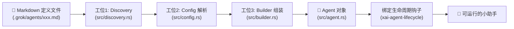
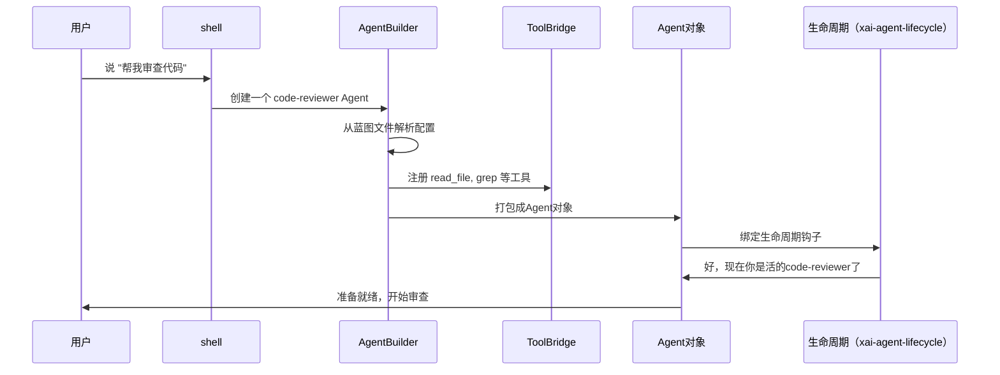
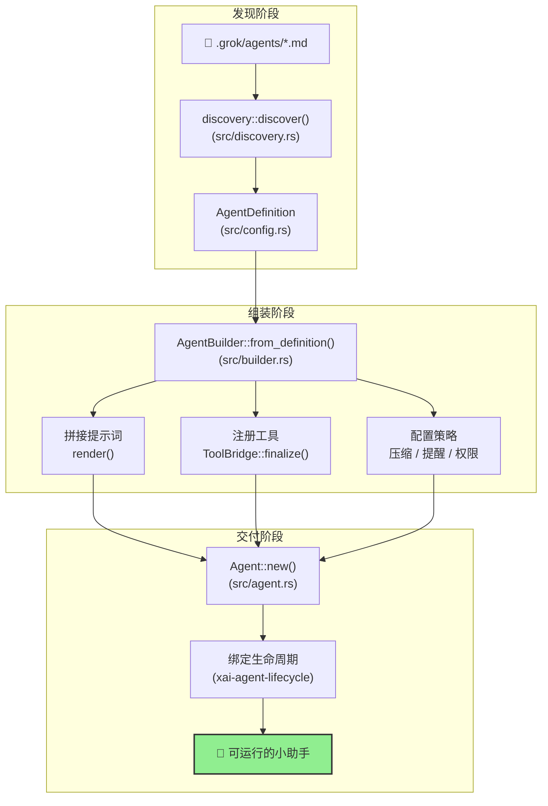

[← 返回首页](index.md)

# Agent 生命周期：小助手是怎么诞生的

## 想象一条"小助手组装流水线"

你走进一个智能机器人工厂。工厂里有一台台待组装的机器人——我们叫它们 **Agent**（小助手）。每个小助手从一张设计蓝图开始，经过几个工位，最终变成一个能干活、能聊天、能调用各种工具的小东西。

这个过程就是 **Agent 生命周期**。它发生在两个 crate 里：
- `crates/codegen/xai-grok-agent`：负责拆蓝图、拼提示词、绑工具
- `crates/codegen/xai-agent-lifecycle`：为每个小助手注入"生命周期钩子"——比如创建会话时该干嘛、每一轮对话该干嘛

整条流水线长这样：



下面我们一个工位一个工位地看。

---

## 工位1：发现文件——Discovery（`src/discovery.rs`）

小助手的蓝图是一个 Markdown 文件，放在项目的 `.grok/agents/` 目录下（或者兼容目录 `.claude/agents/`）。也可以放在用户的 `~/.grok/agents/` 里。

`discover()` 函数（`src/discovery.rs` 第 144 行）像个侦察兵：从当前目录往上搜，把所有 `.md` 文件都翻出来。

```rust
// src/discovery.rs （简化版）
pub fn discover(cwd: &Path) -> Vec<AgentDefinition> {
    let mut definitions = Vec::new();
    // 1. 从当前目录往上找 .grok/agents/ 和 .claude/agents/
    load_project_definitions(cwd, &mut definitions, &mut seen_names);
    // 2. 再到 ~/.grok/agents/ 和 ~/.claude/agents/ 找
    for (dir, scope) in user_agent_dirs(home, grok_home) {
        load_definitions_from_dir(&dir, scope, &mut definitions, &mut seen_names);
    }
    definitions
}
```

注意：同名文件有优先级规则——**项目级别的 > 内置的 > 用户级别的 > 捆绑的**。比如你项目里放了个 `explore.md`，它会覆盖系统自带的 `explore` 小助手。

---

## 工位2：解析蓝图——Config（`src/config.rs`）

每个 `.md` 文件头部有一段 **YAML 配置**（用三个短横线 `---` 包起来），定义了小助手的名字、描述、允许用什么工具、权限模式等。

比如一个典型的小助手蓝图长这样：

```yaml
---
name: code-reviewer
description: 专门做代码审查的小助手
tools:
  - read_file
  - grep
  - search_symbol
permission_mode: ask   # 每次操作都要问用户
prompt_mode: extend    # 追加到系统默认提示词后面
---
后面是 Markdown 正文，告诉 AI 怎么说话...
```

`config.rs` 里的 `AgentDefinition` 结构体（`src/config.rs`）就是蓝图的代码表示：

```rust
// src/config.rs（概念化，非精确代码）
pub struct AgentDefinition {
    pub name: String,
    pub description: String,
    pub tools: Vec<String>,          // 工具白名单
    pub disallowed_tools: Vec<String>, // 工具黑名单
    pub permission_mode: PermissionMode,  // ask / default / oneshot
    pub prompt_mode: PromptMode,     // full（完全替换）/ extend（追加）
    pub prompt_body: String,         // 正文
    pub system_prompt: Option<String>, // 可选的自定义系统提示词
    // ... 还有更多字段
}
```

这里有个有意思的东西：**preset**（预设工具集）。`register_toolset_preset()` 函数（`src/config.rs`）允许外部模块注册一个命名好的工具集合——比如 "grok-build" 预设就是一组写代码经常用的工具（文件读写、终端命令、搜索等）。小助手可以通过设置 `toolset: grok-build` 来引用它，不用一个一个列。

---

## 工位3：组装——Builder（`src/builder.rs`）

这是最复杂的工位。`AgentBuilder` 类（`src/builder.rs`）像个"积木拼装台"——你把名字、描述、工具列表、权限模式等拼在一起，它帮你拼成一个活的 `Agent` 对象。

Builder 做了这几件关键的事：

### 3.1 拼提示词（prompt assembly）

根据 `prompt_mode` 来决定：
- **`full`**：直接用蓝图正文当系统提示词
- **`extend`**：把正文追加到系统默认模板的屁股后面（默认行为）

拼完的提示词存在 `PromptContext` 里（`src/prompt/context.rs`），然后调用 `render()` 方法生成最终的字符串。

### 3.2 绑定工具

Builder 从蓝图的 `tools` 字段读取工具白名单，然后去 `ToolBridge`（`xai-grok-tools` crate）里注册这些工具。`ToolBridge` 就像个工具仓库——你告诉它"我要这几个工具"，它就会准备好。

```rust
// src/builder.rs（概念化）
pub async fn build(self) -> Result<Agent, AgentBuildError> {
    // 1. 确定提示词模式
    let prompt_mode = self.definition.as_ref()
        .map(|d| d.prompt_mode)
        .unwrap_or(PromptMode::Extend);

    // 2. 构造 PromptContext
    let mut context = PromptContext::new(/* ... */);

    // 3. 拼系统提示词
    let system_prompt = context.render(&tool_bridge).await?;

    // 4. 创建 Agent
    let agent = Agent::new(
        definition,
        context,
        system_prompt,
        Arc::new(tool_bridge),
        reminder_policy,
        compaction_policy,
        hosted_tools,
        backend_search_enabled,
    );

    Ok(agent)
}
```

### 3.3 配置策略

小助手还需要知道：
- **压缩策略（CompactionPolicy）**：上下文窗口快满时怎么压缩历史
- **提醒策略（ReminderPolicy）**：隔几轮对话提醒小助手"别忘了自己的职责"
- **权限模式（PermissionMode）**：每次操作都要问用户？还是直接执行？

这些都在 `build()` 方法里设好。

---

## 工位4：打包成 Agent 对象（`src/agent.rs`）

组装完的结果是一个 `Agent` 结构体（`src/agent.rs`）。它把上面所有东西打包成一个不可变、可传输的对象：

```rust
// src/agent.rs
pub struct Agent {
    definition: AgentDefinition,       // 原始蓝图
    prompt_context: PromptContext,     // 提示词上下文（含渲染后的提示词）
    system_prompt: String,            // 渲染好的系统提示词
    tool_bridge: Arc<ToolBridge>,     // 工具仓库（线程安全）
    reminder_policy: ReminderPolicy,  // 提醒策略
    compaction_policy: CompactionPolicy, // 压缩策略
    hosted_tools: Vec<HostedTool>,    // 后端托管的工具（如 web search）
    backend_search_enabled: bool,     // 是否启用后端搜索
}
```

这个 `Agent` 对象就可以被丢给别的模块（比如 shell）去运行了。

---

## 工位5：绑定生命周期钩子（`xai-agent-lifecycle`）

最后一步是注入"生命周期事件"。`xai-agent-lifecycle` crate 定义了一系列事件——比如"会话创建了"、"新的一轮对话开始了"、"用户输入了消息"等等。每个事件都可以绑定一个"贡献者"（contributor），贡献者知道在这个事件发生时该做什么。

**本地运行**（`src/local.rs`）和**远程发送**（`src/send.rs`）两种场景有不同的事件实现——比如本地运行时需要读文件系统，远程发送时则要序列化成网络包。



---

## 整条流水线长什么样



---

## 一些重要的细节

### 子代理（Subagent）支持

大 AI 可以派小 AI 去做具体任务。`src/discovery.rs` 里的 `all_subagents()` 函数（第 75 行）会收集所有可用的子代理——包括内置的（`general-purpose`、`explore`、`plan`）和用户自定义的。通过 `merge_subagents()` 函数处理优先级和去重后，得到一个完整的子代理列表。

### 插件支持

`src/discovery.rs` 里的 `all_subagents_with_plugins()`（第 220 行）还能从插件目录里加载小助手。插件里的小助手名字前面会加前缀，比如 `my-plugin:reviewer`，避免名字冲突。

### 编译时 vs 运行时

Builder 是在**每次会话**运行时调用的，不是编译时的。这意味着每次你打开一个新的对话，Grok 都会重新根据当前的配置文件和工具版本拼一个小助手出来。这也解释了为什么 `AgentBuilder` 有这么多 `with_*()` 方法——每个都可以在运行时调整。

---

## 相关页面

- [用户按下一个键，背后发生了什么]：看完小助手怎么诞生的，接着看它是怎么响应你的问题
- [工具箱概览：AI 的「手和眼睛」]：ToolBridge 里到底有什么工具
- [测试策略：怎么保证这个复杂的东西不出 bug]：Agent 生命周期的测试是怎么写的
