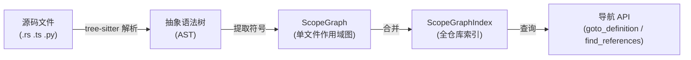
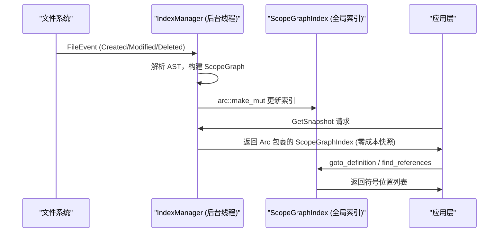
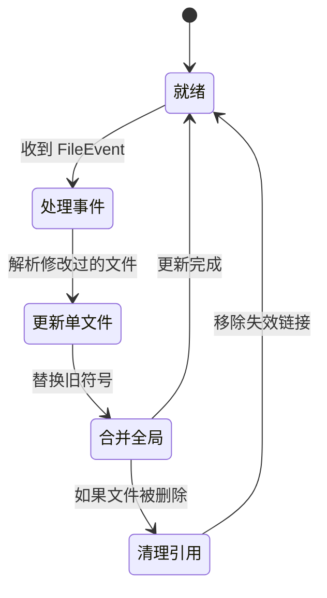

[← 返回首页](index.md)

# 代码索引与理解（Codebase Graph）

## 一句话说清楚

代码索引就是让 AI “看懂”你的代码库——它知道每个文件里有哪些函数、变量、类型，以及它们之间怎么互相调用。Grok Build 的 `xai-codebase-graph` crate 专门干这事，它把整个代码仓库变成一张“关系图”，AI 点一下“跳到定义”或者“查找引用”时，背后就是这张图在回答问题。

## 核心流程：从文件到关系图

整个过程分三步走，就像把一堆散落的乐高零件拼成一张说明书：



**关键文件**：`crates/codegen/xai-codebase-graph/src/scope_graph/graph.rs` 定义了单文件的 `ScopeGraph`，`src/index_manager.rs` 里的 `IndexManager` 负责把所有文件的结果合并成全局索引 `ScopeGraphIndex`。

### Step 1：用 tree-sitter 解析成 AST

tree-sitter 是一个解析器生成器，它能把每种语言的源码变成一棵“抽象语法树”（AST，说白了就是把代码的结构拆成树形节点——函数是一个节点，变量声明是另一个节点）。Grok Build 用 `LanguageRegistry`（定义在 `src/languages/` 下）注册了各种语言的 parser。

```rust
// 摘自 src/navigation.rs
let mut parser = tree_sitter::Parser::new();
parser.set_language(&lang_config.language())
    .map_err(|e| NavigationError::ParseError(format!("Failed to set language: {}", e)))?;
let tree = parser.parse(&content, None)
    .ok_or_else(|| NavigationError::ParseError("Failed to parse file".to_string()))?;
```

### Step 2：从 AST 提取符号，构建作用域图

AST 建好之后，`scope_graph_from_definitions_query` 函数（也在 `graph.rs` 里）会遍历 AST 节点，识别出两类东西：

- **定义（Definition）**：比如 `fn hello_world()` 里的 `hello_world`，或者 `const x = 42` 里的 `x`
- **引用（Reference）**：比如你在别处写了 `hello_world()`，这就是对上面那个定义的引用

这些定义和引用被组织成一张有向图（用了 `petgraph` 库），节点类型包括 `Def`、`Ref`、`Scope`、`Import`，边类型包括 `DefToScope`（定义属于哪个作用域）、`RefToDef`（引用指向哪个定义）。

```rust
// 摘自 src/scope_graph/graph.rs
pub fn insert_ref(&mut self, new: Reference, src: &[u8]) {
    // 从当前作用域逐层往上找，看有没有同名定义
    for scope in self.scope_stack(local_scope_idx) {
        for local_def in self.graph.edges_directed(scope, Direction::Incoming)
            .filter(|edge| *edge.weight() == EdgeKind::DefToScope)
            .map(|edge| edge.source())
        {
            if let NodeKind::Def(def) = &self.graph[local_def]
                && new.name(src) == def.name(src)
            {
                possible_defs.push(local_def);
            }
        }
    }
    // 找到定义后，加一条 RefToDef 边
    if !possible_defs.is_empty() {
        let new_ref = NodeKind::Ref(new);
        let ref_idx = self.graph.add_node(new_ref);
        for def_idx in possible_defs {
            self.graph.add_edge(ref_idx, def_idx, EdgeKind::RefToDef);
        }
    }
}
```

这段代码的逻辑用生活场景来说就是：你在一个房间里（作用域）喊了一声“张三”，系统先在这个房间找叫张三的人（定义），没找到就去客厅找，再去大门外找。找到了就在你和张三之间画一条线（链接）。

### Step 3：合并成全局索引

单文件的图建好之后，`IndexManager` 把它们合并成一个全局的 `ScopeGraphIndex`。`IndexManager` 运行在后台线程里，通过 channel 接收命令，这样就不需要 `Arc<Mutex>` 来保护索引了（详见 `src/index_manager.rs` 的架构注释）。



注意一个贴心设计：`IndexManager` 会跳过大于 5MB 的文件（`MAX_INDEXABLE_FILE_SIZE`），避免解析大型二进制文件时内存爆炸。

## 导航 API：怎么用这张图

`xai-codebase-graph` 暴露了两组 API，都在 `src/navigation.rs` 里。

### 基于位置的查询（Go-to-definition）

当你把光标放在代码的某个符号上，按“跳到定义”时，系统会做三件事：

1. 先用 `get_symbol_at_position` 找出光标处的符号名字（比如 `myObject`）
2. 然后调用 `goto_definition` 在全局索引里找这个符号的定义位置
3. 返回一个 `NavigationResult`，里面包含符号名和所有定义位置

```rust
// 摘自 src/navigation.rs
pub fn goto_definition(
    &self,
    file_path: &Path,
    row: usize,
    col: usize,
) -> Result<NavigationResult, NavigationError> {
    let symbol = self.get_symbol_at_position(file_path, row, col)?;
    let defs = self.index.find_definitions_smart(&symbol, 
        Some(file_path), Some(&self.registry));
    let locations: Vec<Location> = defs.into_iter()
        .map(|(path, line)| Location::new(path, line))
        .collect();
    Ok(NavigationResult { symbol, locations })
}
```

为什么不用 `get_symbol_at_position` 直接返回定义？因为有时候同一个名字会有多个定义（比如 overloading 或者不同模块的导出），`goto_definition` 会返回所有位置。

### 基于符号名称的查询（Find definitions / Find references）

有些场景下你不知道符号在哪个文件，只记得名字，这时可以用 `find_definitions` 或 `find_references`：

```rust
// 摘自 src/index_manager.rs（IndexCommand 枚举）
FindDefinitions {
    symbol: String,
    context_file: Option<PathBuf>,
    response_tx: tokio::sync::oneshot::Sender<Vec<SymbolLocation>>,
},
FindReferences {
    symbol: String,
    context_file: Option<PathBuf>,
    response_tx: tokio::sync::oneshot::Sender<Vec<SymbolLocation>>,
},
```

`context_file` 参数很有用——如果你正在看 `src/foo.ts`，搜索 `bar` 时，系统优先返回和 `foo.ts` 在同一个目录下的定义。

## 增量更新：改代码后图怎么同步

你不可能每次改一行代码就重建整个索引，那太慢了。Grok Build 用的是**事件驱动**的增量更新：



事件来源是外部监听的 `notify-debouncer-full`，它把文件系统变化（创建、修改、删除）聚合并去重后，通过 `FileEvent` 发给 `IndexManager`：

```rust
// 摘自 src/index_manager.rs
pub enum FileEventKind {
    Created,
    Modified,
    Removed,
    Renamed,
}
```

收到 `Renamed` 事件时，`IndexManager` 会把旧路径的符号全部移除，然后把新路径的文件加进来，相当于一次原子操作。

## 跟其它模块的关系

- **跟 Sampler（采样器）的关系**：当 AI 模型需要查看代码时，它会通过工具调用要求索引模块返回某个符号的定义或引用，详见《工具执行引擎》。
- **跟 Chat State（聊天状态）的关系**：代码索引的查询结果会被注入到对话上下文中，让 AI 能基于真实的代码结构回答问题。
- **跟 Workspace（工作区）的关系**：索引的根路径就是工作区的根路径，`IndexManager` 会按 `.gitignore` 规则跳过不需要的文件。

## 性能保障

整套索引系统针对大型仓库做了优化：

- **并行解析**：用 `rayon` 并行库同时解析多个文件（`IndexBuilder` 在 `src/manager/` 里实现）
- **快速哈希**：用 `ahash` 替代标准库的哈希，在大数据量下减少哈希碰撞
- **零拷贝快照**：`get_snapshot` 返回 `Arc<ScopeGraphIndex>`，没有写操作时完全不克隆数据
- **去重管理**：每个工作区只创建一个 `IndexManager`，通过 `ACTIVE_MANAGERS` 全局 map 确保

```rust
// 摘自 src/index_manager.rs
static ACTIVE_MANAGERS: Lazy<DashMap<PathBuf, Weak<IndexManagerHandle>>> = 
    Lazy::new(DashMap::new);
```

## 一句话总结

代码索引相当于给整个仓库建了一个《人物关系图谱》——每个函数、变量、类型都是一个角色，引用关系就是他们之间的台词关联。AI 读代码时，有这个图在手，就能像资深老鸟一样精准跳转、理解项目结构。
