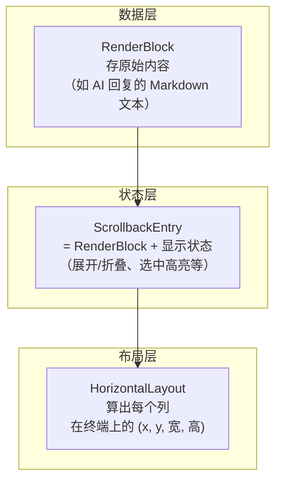
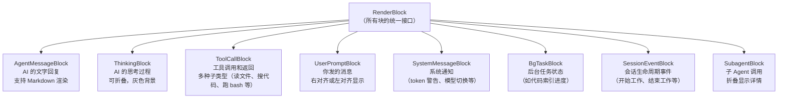
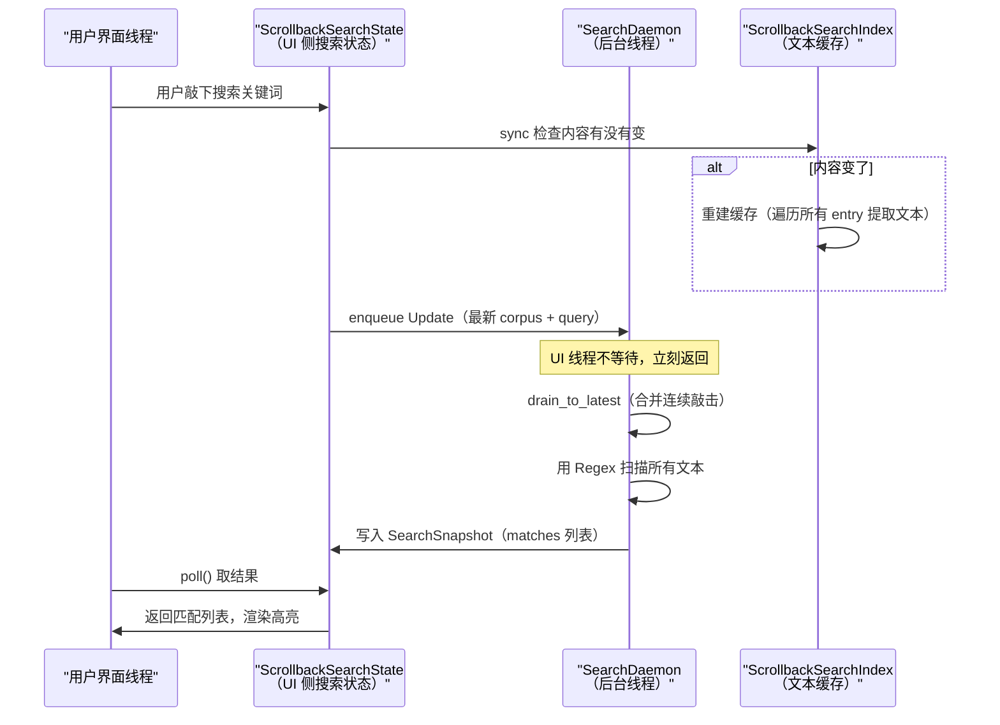
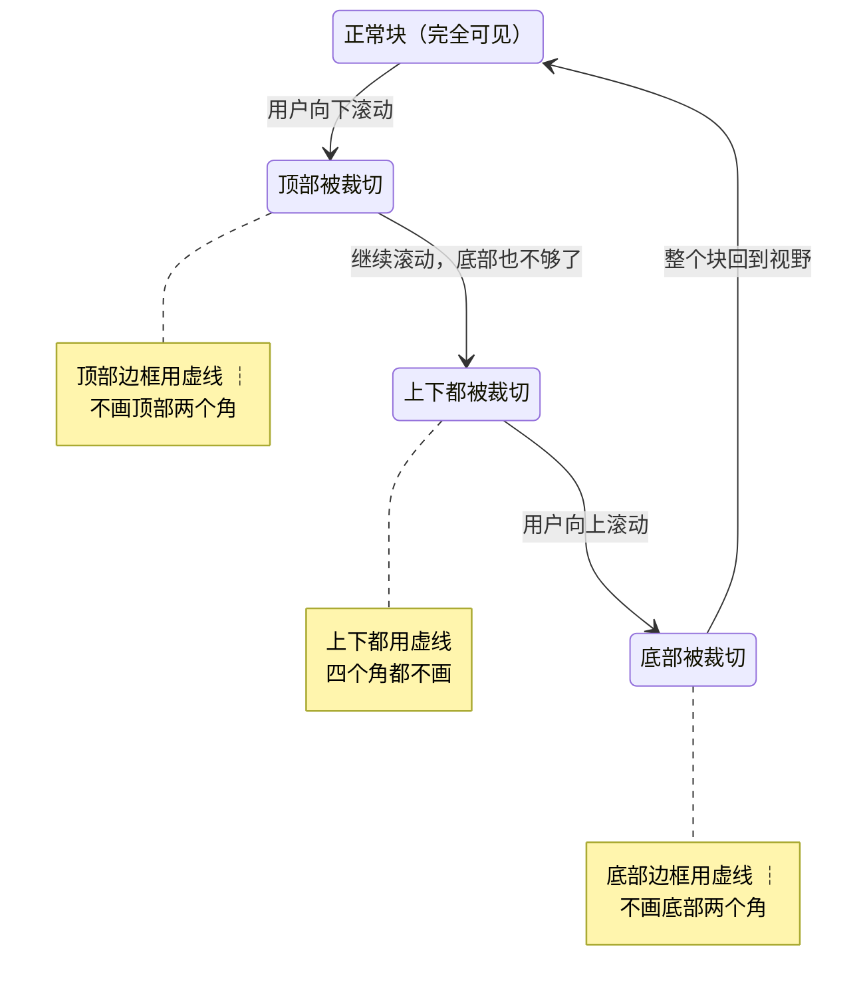

[← 返回首页](index.md)

# 滚动回溯引擎

滚动回溯（Scrollback）是整个 TUI 里你打交道最多的部分——所有聊天记录、AI 的回复、工具调用、系统的提示，全都在这里滚动显示。这一页讲清楚三个核心问题：对话历史怎么被"切块"存储、每个块怎么被画到终端上、搜索和文本选择是怎么实现的。

## 对话的"积木"：Block 模型

聊天记录不是一整坨文本——它是一个一个的"块"（Block）串起来的。你可以把整个滚动回溯想象成一根竹签上串的糖葫芦，每一颗山楂就是一块：

- **UserPromptBlock**：你输入的话
- **AgentMessageBlock**：AI 给你的文字回复
- **ThinkingBlock**：AI 在"脑子里"思考的过程（折叠起来的小框）
- **ToolCallBlock**：AI 调用了什么工具，干了什么事
- **SystemMessageBlock**：系统弹出的提示，比如"token 快用完了"

这些类型全定义在 `crates/codegen/xai-grok-pager/src/scrollback/blocks/mod.rs` 里，导入关系一目了然：

```rust
// 每种块类型是一个独立的子模块，各管各的渲染逻辑
mod agent;       // AI 的文本回复
mod thinking;    // 思考过程（可折叠）
mod tool;        // 工具调用和结果
mod user;        // 你发出的消息
mod system;      // 系统通知
mod bg_task;     // 后台任务通知
mod session_event; // 会话事件（如"开始工作"）
mod subagent;    // 子 Agent 的调用
// ...还有 context_info、credit_limit 等
```

一个块只存"内容本身"，不存它在屏幕上的位置。谁管位置呢？往下看。

## 从块到屏幕：Entry + Layout 两层映射

块要显示到终端上，需要经过两层包装：



### ScrollbackEntry：给块穿上"显示外衣"

看 `crates/codegen/xai-grok-pager/src/scrollback/entry.rs`：

```rust
pub use entry::{EntryId, ScrollbackEntry};
```

`ScrollbackEntry` 把一个 `RenderBlock` 包了一层，加了显示相关的元数据：这个块是不是折叠了、有没有被选中高亮、当前渲染到第几行。每个 entry 有个全局唯一的 `EntryId`，搜索系统就靠这个 ID 来定位"这个匹配在第几条消息里"。

### HorizontalLayout：给每个块划地盘

`crates/codegen/xai-grok-pager/src/scrollback/layout.rs` 定义了一个在终端上"切分地盘"的标准模板。每个 entry 在屏幕上占一块矩形，矩形内部又分成四列：

```rust
/// 注释来自源码，展示了每一列的含义
/// ```text
/// │A│PL│    Content    │PR│
/// │1│ 2│     flex      │ 1│
/// ```
///
/// A  = Accent line（左侧 1 字符宽的装饰线，不同块类型颜色不同）
/// PL = Left padding（左边距，默认 2 字符）
/// Content = 内容区（自适应宽度）
/// PR = Right padding（右边距，默认 1 字符）
```

画成图就是：

```text
终端一行 80 字符宽：
┌──┬──┬─────────────────────────────────────────┬─┐
│A │PL│          Content（内容区）               │PR│
│1 │ 2│            自适应宽度                     │1 │
└──┴──┴─────────────────────────────────────────┴─┘
```

`HorizontalLayout::new()` 用 ratatui 的 `Layout::horizontal` 按 `LayoutConfig` 里的 `block_pad_left` 和 `block_pad_right` 配置值自动算出各列坐标。这种固定的列结构保证所有块对齐一致，看起来整洁。

## 所有块类型的全家福

不同类型的块，渲染差异主要在"内容区"里画什么。这张图展示现有的主要块类型：



每种块都实现了自己专属的渲染函数。以 `AgentMessageBlock` 为例——AI 的回信是 Markdown，需要经过 Markdown 解析器（在 `xai-grok-markdown` crate 里，详见[《终端渲染流水线》](09-tui-rendering.md)）把 `**粗体**`、`代码块`、列表等语法标签变成终端能显示的彩色字符序列。`ThinkingBlock` 则简单得多：默认折叠成一行灰色小字，你按回车才展开。

工具调用的块（`ToolCallBlock`）最复杂——它下面还有子类型：
- `ReadToolCallBlock`：AI 读文件了
- `EditToolCallBlock`：AI 改文件了（附带 diff 高亮）
- `SearchToolCallBlock`：AI 搜代码了（带匹配行数统计）
- `ExecuteToolCallBlock`：AI 跑 bash 命令了
- 等等——全在 `crates/codegen/xai-grok-pager/src/scrollback/blocks/tool.rs` 一个文件里

## 搜索引擎：后台线程不卡 UI

在 500 轮的对话里搜一个关键词，如果同步扫描，每敲一个字 UI 都要卡顿——这是绝对不能忍的。所以搜索被拆成了"前台问、后台找、前台取结果"三拍子：



### 三个关键数据结构

**ScrollbackSearchIndex**（`crates/codegen/xai-grok-pager/src/scrollback/search.rs`）存的是每个 entry 的"可搜索文本"。对 Markdown 块，它取**渲染后的**纯文本（而不是原始 Markdown 源码），这样你搜"is really important"能在 `this is **really** important` 这段话里命中——因为渲染后星号没了，文本是连续的。

```rust
// 源码注释直接说明了这个设计选择
// Regression for "highlighted but no matches": the index searches the
// rendered text, so a phrase that spans markdown emphasis is found —
// matching what the on-screen highlight shows.
```

**ScrollbackSearchState** 是 UI 侧的搜索会话。它管理整个搜索生命周期——从"正在输入关键词"（composing 阶段）到"回车确认后上下浏览匹配"（browsing 阶段）。核心方法就四个：

| 方法 | 干啥的 | 一句话 |
|------|--------|--------|
| `update_query(query, state)` | 把新查询排队发给后台线程 | 每敲一个字就调一次，但绝不阻塞 |
| `poll()` | 从后台线程取最新的匹配结果 | 返回 true 时说明有新结果，该重绘了 |
| `next()` / `prev()` | 在已匹配列表里上下移动光标 | wrapping——到顶自动回底，到底自动回顶 |
| `accept()` | 冻结查询，进入浏览模式 | 此后 next/prev 只在已有结果里跳，不再重新搜索 |

**SearchDaemon** 是一个 Rust 原生线程，通过 `mpsc::channel` 接收 `SearchMsg`。它自带"合并"逻辑——如果你连续快速敲了五个字发了五条 Update 消息，`drain_to_latest()` 会把它们合并成一次扫描，只跑最后一个关键词。UI 线程永远不被搜索阻塞。

```rust
// 源码里的合并逻辑（drain_to_latest），核心思想：
// 一堆连续 Update 里，取最新的 corpus 和最新的 query，
// 合并成一次扫描。Stop 消息会终止整个循环。
fn drain_to_latest(first: SearchMsg, rx: &Receiver<SearchMsg>) -> DrainedUpdate {
    // ...遍历 channel 里所有待处理消息，取最后一次的有效 corpus 和 query
}
```

### 缓存更新策略：为性能精打细算

`sync()` 方法用了一个巧妙的小技巧——只在"内容真的变了"时才重建缓存。它不是每帧都跑（那会浪费 CPU），而是比较 `ScrollbackState` 的 `content_generation`（一个单调递增的版本号）。你在滚动、调整窗口大小时 generation 不会变，只有新增/删除/修改一条消息时才会变。

```rust
// 源码注释：sync 只在校验 content_generation 变化时才重建
// Re-derives every entry's source text wholesale, and content changes
// (e.g. streaming) bump the key often, so callers should sync on query
// change or search open — not every frame.
```

## 文本选择：终端里的"鼠标拖蓝"

在图形界面里选一段文字、拖蓝、Ctrl+C 复制——这是天经地义的事。但在终端里做这个要费劲得多。终端的文本是字符组成的二维网格，没有 DOM 树、没有 Selection API。Grok 自己实现了一套选中逻辑，在 `crates/codegen/xai-grok-pager/src/scrollback/text_selection.rs` 里。

### 选择框的渲染：纯 ASCII 画框

`SelectionBox`（`crates/codegen/xai-grok-pager/src/scrollback/selection.rs`）负责在选中的 entry 四周画一个框。框的四个角用 Unicode 的表格线字符：

```rust
mod border_chars {
    pub const TOP_LEFT: char = '┌';
    pub const TOP_RIGHT: char = '┐';
    pub const BOTTOM_LEFT: char = '└';
    pub const BOTTOM_RIGHT: char = '┘';
    pub const VERTICAL: char = '│';
    pub const VERTICAL_DASHED: char = '┆';  // 被裁切时用的虚线
}
```

画框的时候还要考虑"这个块是不是有一部分滚出屏幕了"——如果块的顶部被滚到屏幕上方去了，顶部两个角就不能画（画了会误导你，让你以为那就是块的头顶）；底部同理。这时用虚线 `┆` 代替实线 `│`，暗示"下面/上面还有内容，只是暂时看不见"。



### 选择框还能关入口——右上角的 ✗ 按钮

`SelectionBox` 还支持一个可选的关闭按钮（画在框的右上角）。鼠标移上去时按钮高亮，点击就取消选中。源码里把这个按钮的渲染逻辑做成了可配置的：

```rust
// 创建选择框时可以链式设置关闭按钮
SelectionBox::new(area, style)
    .with_closable(true, is_hovered)   // 启用关闭，传入是否 hover
    .with_close_label(Some("✗"))       // 默认标签是 ✗，可以自定义
```

## 渲染输出：一次渲染，多轮后处理

`SelectionBox` 比较特殊——它不是在自己那片区域里画，而是要跨组件边界画框。为了解决"渲染顺序"问题，scrollback 的渲染分两轮：

1. **主渲染**：把所有 entry 的内容画进 buffer
2. **后处理**：把选择框、滚动条、内联媒体、Mermaid 图表触控区画上去

这个两轮机制通过 `RenderOutput` 结构体传递：

```rust
pub struct RenderOutput {
    pub selection_box: Option<SelectionBox>,       // 主渲染后画选择框
    pub scroll_info: Option<ScrollInfo>,            // 给滚动条渲染用
    pub selected_entry_area: Option<Rect>,          // 给内联按钮定位用
    pub selection_model: ResolvedSelectionModel,    // 当前选中状态
    pub link_overlay: LinkOverlay,                  // OSC 8 超链接覆盖层
    pub inline_media: Vec<InlineMediaPlacement>,    // 内联图片渲染
    pub diagram_affordances: Vec<DiagramAffordancePlacement>, // Mermaid 图点击区
}
```

（关于 Markdown 渲染管线怎么把 AI 的回复变成终端上的彩色字符，详见[《终端渲染流水线》](09-tui-rendering.md)；关于 Mermaid 图的 SVG 渲染，详见[《Mermaid 图表渲染》](12-mermaid-rendering.md)）

## 与其他系统的关系

滚动回溯引擎是整个 TUI 界面的核心展示层，它上面连着用户的输入事件，下面接着 Agent 的输出流，左右还有几个重要系统给它喂数据：

- **Agent 运行时**（详见[《Agent调度核心》](15-agent-runtime.md)）：Agent 每输出一段文本或调用一个工具，就会在 ScrollbackState 里新增一个 block
- **对话压缩**（详见[《对话压缩》](17-compaction.md)）：当上下文太长被压缩时，旧的 block 会被替换成摘要块
- **终端渲染流水线**（详见[《终端渲染流水线》](09-tui-rendering.md)）：scrollback 渲染完后，输出交给更上层的 View 组合成完整的终端画面
- **搜索与文本选择**的完整交互流程，会在[《一次完整对话的旅程》](05-one-full-turn.md)中串联起来展示
