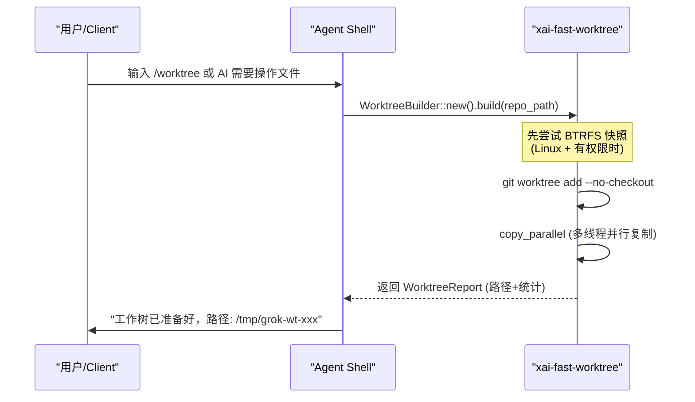
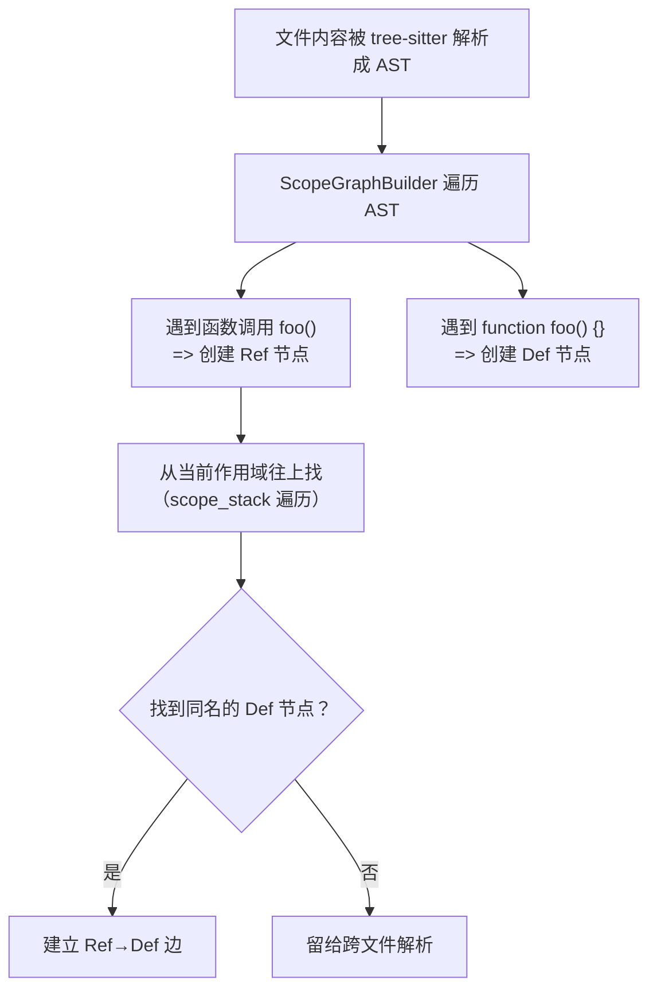
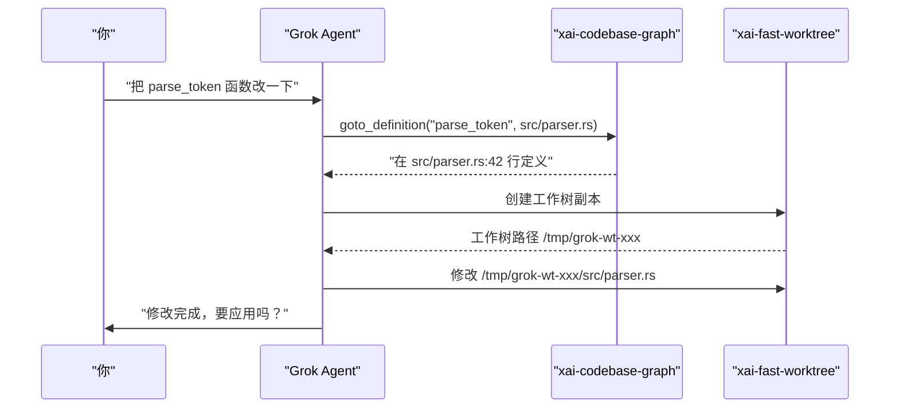

[← 返回首页](index.md)

# 快速工作树与代码图

## 一句话说清楚

Grok 想要读懂你的代码，它需要做两件事：
1. **建工作树** —— 把你 git 仓库里的代码“克隆”一份副本到独立目录，这样它能在里面翻文件、改代码，完全不影响原仓库。
2. **建代码图** —— 把每个文件的函数、类、变量之间谁定义、谁引用、谁继承的关系梳理成一张图，这样你问“这个函数在哪儿定义的？”它一秒就能回答。

这两种能力分别在 `crates/codegen/xai-fast-worktree/` 和 `crates/codegen/xai-codebase-graph/` 两个 crate 里实现。

## 快速工作树：像变魔术一样 clone 仓库

### 为什么需要“工作树”？

你正在写代码，Grok 想帮你改 `src/main.rs`。如果它直接改你正在编辑的文件，会跟你冲突。所以它需要一个 **独立的副本**，改坏了也不怕，随时能丢。

普通的 `git clone` 会把整个仓库历史全部下载下来，对于一个几万次 commit 的大项目，那得等半天。Grok 的做法是：**只 clone 文件内容（不含 git 历史），而且用多线程并行复制**，几秒钟就能搞定。

### 核心流程


`src/worktree/plan.rs` 里的 `WorktreePlan` 结构体描述了整个流程的配置：从哪里复制到哪里、用哪种模式、有多少个并行线程。

核心代码在 `src/copy/engine.rs` 的 `copy_parallel` 函数里——它是整个复制的引擎：

```rust
// 摘自 crates/codegen/xai-fast-worktree/src/copy/engine.rs
pub(crate) fn copy_parallel(
    source: &Path,
    dest: &Path,
    config: ParallelCopyConfig,
    cancellation_token: CancellationToken,
) -> Result<ParallelCopyResult> {
    // 确定并行数（macOS 上限 8，其他平台 32）
    let num_workers = if config.num_workers == 0 {
        num_cpus::get().min(MAX_PARALLEL_WORKERS)
    } else {
        config.num_workers.min(MAX_PARALLEL_WORKERS)
    };
    // ... 后面会创建多个 worker 线程，每个负责一部分文件的复制
}
```

这段代码做的事情很暴力但漂亮：它用 `WalkBuilder` 遍历源仓库的每个文件，根据文件路径的哈希值分到不同的 **shard（分片）**，然后多个线程同时开工复制。复制过程中还能被 `CancellationToken`（取消令牌）随时叫停。

### macOS 和 Linux 上的区别

- **macOS**：没有特殊优化，就是普通的多线程文件复制，最大 8 个 worker 防止文件描述符耗尽（macOS 默认每个进程只能打开 256 个文件）。
- **Linux**：支持 **BTRFS 快照**（O(1) 级别的克隆，瞬间完成）和 **OverlayFS**（只复制上层改动，底层文件共享）。这两者在 `src/btrfs.rs` 和 `src/overlay.rs` 里实现，由 `WorktreePlan.creation_mode` 决定走哪条路。

### 一次完整的工作树创建过程

下面这张时序图展示了一次典型的“给 Grok 创建一个工作树”的调用链：



## 代码图：给代码建一张“关系网”

### 为什么要建图？

假设你在 `src/parser.rs` 里看到一个叫 `parse_token` 的函数，你想知道：
- 这个函数在哪儿定义的？
- 还有哪些地方调用了它？
- 它继承自哪个 trait？

如果只靠字符串搜索，你得 grep 整个仓库，然后手动翻结果。**代码图（ScopeGraph）** 把这些关系提前算好存下来，你一问它就能精确回答。

它用的是 **tree-sitter**（一种语法解析器，能读懂每种编程语言的代码结构）来理解代码，而不是简单 grep。

### ScopeGraph 长什么样

每个文件被解析后，会产生一个独立的 `ScopeGraph`（作用域图），它是一张有向图：

- **节点**：要么是 Scope（作用域，如函数体、if 块）、Def（定义，如函数名、变量名）、Ref（引用，如调用函数的地方）、Import（导入语句）
- **边**：ScopeToScope（父子关系）、DefToScope（定义属于哪个作用域）、RefToDef（引用指向哪个定义）

`src/scope_graph/graph.rs` 里的 `ScopeGraph` 结构体就是这张图：

```rust
// 摘自 crates/codegen/xai-codebase-graph/src/scope_graph/graph.rs
pub struct ScopeGraph {
    /// 核心图结构（petgraph 库实现）
    pub(crate) graph: Graph<NodeKind, EdgeKind>,
    /// 根作用域的节点索引
    root_idx: NodeIndex,
    /// 语言标识
    lang: String,
}
```

### 遍历图的逻辑：从引用找到定义

当你想知道 `foo()` 是在哪儿定义的，代码会这样做：



`insert_ref` 方法实现的就是这个“往上找”的逻辑，见 `src/scope_graph/graph.rs`：

```rust
pub fn insert_ref(&mut self, new: Reference, src: &[u8]) {
    // 从当前作用域一直回退到根作用域
    for scope in self.scope_stack(local_scope_idx) {
        // 在每个作用域里找同名的定义
        for local_def in self.graph.edges_directed(scope, Direction::Incoming)
            .filter(|edge| *edge.weight() == EdgeKind::DefToScope)
            .map(|edge| edge.source())
        {
            if let NodeKind::Def(def) = &self.graph[local_def]
                && new.name(src) == def.name(src)
            {
                possible_defs.push(local_def); // 找到了！
            }
        }
    }
}
```

### IndexManager：一个“永不休息”的索引服务员

把所有文件都建好 ScopeGraph 之后，还需要把它们 **合并成一个全局索引**（`ScopeGraphIndex`），方便跨文件跳转。这个索引由 `IndexManager`（`src/index_manager.rs`）负责维护。

`IndexManager` 是一个 **actor 模型**（翻译：一个独立的后台服务员线程），通过 channel（消息队列）接收各种命令：

```rust
// 摘自 crates/codegen/xai-codebase-graph/src/index_manager.rs
pub enum IndexCommand {
    FileEvent(FileEvent),               // 文件被修改了，更新索引
    FileEventBatch(Vec<FileEvent>),     // 批量更新（更高效）
    Rebuild,                            // 从头重建全部索引
    GetSnapshot(oneshot::Sender<...>),  // 要当前的索引快照
    GotoDefinition { file_path, row, col, response_tx },  // 查定义
    GotoReferences { file_path, row, col, ... },          // 查找引用
    FindDefinitions { symbol, context_file, response_tx }, // 按名字查定义
    FindReferences { symbol, context_file, response_tx },  // 按名字查引用
    Shutdown,                           // 下班了
}
```

你问“这个函数在哪儿定义的？”时，实际上是在给 `IndexManager` 发一个 `GotoDefinition` 命令，它会在自己的线程里查索引，然后把结果通过 `response_tx`（响应通道）发回来。

### 增量更新：文件改了不用重建全部

当你编辑了一个文件后，`FSNotify`（文件系统监听）会收到通知，给 `IndexManager` 发一个 `FileEvent::modified("src/main.rs")`。`IndexManager` 只重新解析这一个文件，更新对应的 ScopeGraph，然后把旧的替换掉——**不需要重建整个索引**。

`src/index_manager.rs` 里的代码：

```rust
// File event 被发送后，IndexManager 的处理线程会：
// 1. 读取被改动的文件
// 2. 重新用 tree-sitter 解析它
// 3. 生成新的 ScopeGraph
// 4. 替换旧图中对应文件的部分
```

### 缓存：第二次打开快 10 倍

索引计算完会被序列化（`save_index`）到你电脑的缓存目录里。下次你打开同一个仓库，它直接读缓存（`load_index`），不需要重新解析所有文件。详见 `src/manager.rs` 的 `load_index` 和 `save_index` 函数。

## 两个能力怎么配合？

当 Grok 要帮你改代码时：



你看到的是 Grok 回答了一句“已修改”，但背后是快速工作树提供了安全的修改环境，代码图帮它准确定位到了要改的地方。

## 配置文件与入口

| 文件路径 | 作用 | 一句话说明 |
|---------|------|-----------|
| `crates/codegen/xai-fast-worktree/src/lib.rs` | 快速工作树的公共 API 入口 | 暴露 `WorktreeBuilder`、`copy_parallel` 等核心函数 |
| `crates/codegen/xai-fast-worktree/src/copy/engine.rs` | 并行文件复制引擎 | 多线程 CoW 复制，是创建工作树的核心 |
| `crates/codegen/xai-fast-worktree/src/worktree/plan.rs` | 工作树创建计划 | 决定用什么模式、多少线程来创建 |
| `crates/codegen/xai-codebase-graph/src/lib.rs` | 代码图系统的公共 API | 暴露 `IndexManager`、`Navigator`、`ScopeGraph` |
| `crates/codegen/xai-codebase-graph/src/scope_graph/graph.rs` | ScopeGraph 的数据结构与算法 | 存了一张图并实现“往上找定义”的跳转逻辑 |
| `crates/codegen/xai-codebase-graph/src/index_manager.rs` | 后台索引管理线程 | 接收文件事件，增量更新索引，提供查询接口 |

## 补充说明

- 代码图只支持常见语言（通过 `LanguageRegistry` 注册），详见 `src/languages/` 目录。
- 如果仓库超大（上万文件），第一次建索引可能要几秒到十几秒，但增量更新很快。
- 如果你想了解工作树创建完成后的“战场清理”和垃圾回收，看 `src/api.rs` 里的 `cleanup_worktrees_in` 函数。
- 代码图索引的大小控制：超过 5 MB 的文件会被跳过（`MAX_INDEXABLE_FILE_SIZE` 常量），防止树-sitter 吃爆内存。
