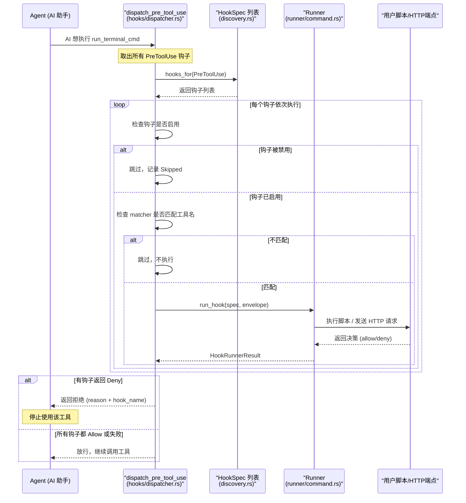
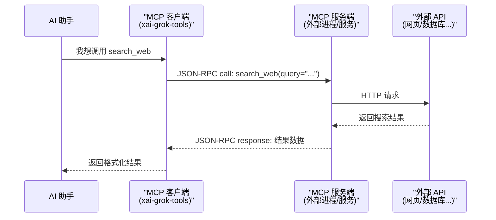
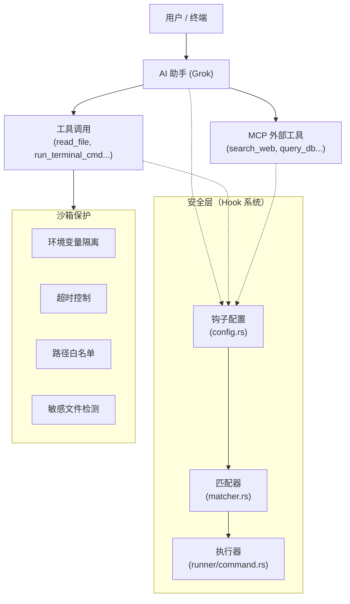

[← 返回首页](index.md)

# 钩子、MCP 协议与沙箱

## 先讲个故事：安检、外部服务商和隔离室

想象你是一个大公司的首席运营官（Grok 扮演的角色）。你的办公室（终端）里摆满了各种工具——文件柜、电话、打印机、白板。你可以随时用它们干活。

但是，公司有一些规定：

1. **安检（Hooks）**：每次你拿起一个工具之前，门外的保安（Hook）会检查一下：“你要拿计算器干嘛？写报表？行，放行。你要拿订书机去砸窗户？不行，拦住。” 而且这个保安还是个连锁店——你可以自己雇几个保安，挂在你家门口。保安可以是你自己写的脚本，也可以是一个远程的 HTTP 服务（比如公司总部的安全中心）。

2. **外部服务商接入（MCP）**：有时候你需要的工具自己办公室没有。比如你想叫个外卖，你得跟外部的外卖平台通信。MCP（Model Context Protocol）就是那个标准的外卖电话协议：你说“我要一份宫保鸡丁”，对方知道你要什么，也知道怎么把结果给你送回来。它让 Grok 能调用外面的工具（比如搜索网页、查数据库等），而且调用方式非常标准化。

3. **隔离室（Sandbox）**：有些命令太危险——比如直接 `rm -rf /`。你不能让 Grok 在真实机器上跑这种命令。所以有了沙箱：Grok 在一个隔离的环境里执行命令，就算命令炸了，也炸不到外面的系统。沙箱就是个“如果出事，反正不是我的机器”的保护壳。

这三个东西共同解决了同一个问题：**我怎么让 AI 助手既能干活，又不会干坏事？**

---

## 触发拦截机制：Hooks（钩子）

Hooks 的核心文件都在 `crates/codegen/xai-grok-hooks/src/` 下。它允许你在 AI 的行为链中插入自定义的“拦截点”，就像火车站安检，每道口子都能拦人。

### 支持哪些事件类型？

所有支持的事件定义在 `crates/codegen/xai-grok-hooks/src/event.rs` 中。看看 `discovery.rs` 里注册的所有事件：

```
session_start       → 会话开始时
user_prompt_submit  → 用户提交了提示词
pre_tool_use        → AI 准备使用工具（可以拦截）
post_tool_use       → AI 刚用完工具
post_tool_use_failure → AI 用工具失败了
permission_denied   → 权限被拒绝
stop / stop_failure → AI 生成停止
notification        → 通知事件
subagent_start/stop/end → 子代理启动/停止/结束
pre_compact         → 聊天压缩前
post_compact        → 聊天压缩后
session_end         → 会话结束
```

其中 `pre_tool_use` 是**唯一可以拦截（blocking）**的事件——也就是保安可以在 AI 拿起工具前说“不行”。

### 调度流程：从安检到放行

看下面这张图，它展示了 Grok 要调用一个工具时，hooks 系统是怎么工作的：



关键代码在 `crates/codegen/xai-grok-hooks/src/dispatcher.rs` 的 `dispatch_pre_tool_use` 函数里。重要的设计原则是 **fail-open（失败时放行）**：如果某个钩子执行超时、崩溃、找不到命令，系统不会一刀切地拒绝工具调用，而是记录下来然后继续——因为 Grok 运行在受保护环境里，故意触发失败绕过安全钩子的风险不大。之前是 fail-closed 的策略，导致很多无辜的工具调用因为钩子出问题而被拦截。看源码里的注释：

```rust
// 在 dispatcher.rs 第 30-39 行
// Hook failures (timeouts, crashes, command-not-found, ...) are **fail-open**:
// the failure is logged and surfaced in the per-hook results for the UI scrollback,
// but the tool call continues as if the hook had allowed it.
```

### 如何配置一个钩子？

Hooks 配置文件是 JSON 格式。加载逻辑在 `crates/codegen/xai-grok-hooks/src/config.rs`。看一个完整例子：

```json
{
  "hooks": {
    "PreToolUse": [
      {
        "matcher": "Bash",
        "hooks": [
          {
            "type": "command",
            "command": "/usr/local/bin/safety-check.sh",
            "timeout": 5,
            "env": {
              "MY_SECRET": "abc123"
            }
          },
          {
            "type": "http",
            "url": "http://localhost:8080/decide",
            "timeout": 3,
            "env": {
              "API_KEY": "your-key"
            }
          }
        ]
      }
    ]
  }
}
```

配置文件可以放在：
- **全局目录**（比如 `~/.grok/hooks/`）
- **项目目录**（比如项目根目录下的 `.grok/hooks/`）
- **兼容格式**：`~/.claude/settings.json` 里的 `hooks` 字段也会被解析

加载顺序在 `crates/codegen/xai-grok-hooks/src/discovery.rs` 的 `load_hooks_from_sources` 里：全局先加载，项目后加载，同名钩子不会重复执行。

### 钩子的返回值

钩子脚本（或 HTTP 端点）需要返回一个 JSON 来表示决策：

```json
{"decision": "allow"}
```
或者
```json
{"decision": "deny", "reason": "这个命令太危险了"}
```

如果返回 `deny`，Grok 会停用当前工具，并在聊天记录里显示拒绝原因。

### 钩子的安全性

看 `crates/codegen/xai-grok-hooks/src/config.rs` 第 310-330 行：**用户无法覆写保留环境变量**（`GROK_HOOK_EVENT`、`GROK_SESSION_ID` 等）。这些变量是在运行时由系统注入的，哪怕用户在配置里写了 `"env": { "GROK_HOOK_EVENT": "fake" }`，也会被静默剥离。这是为了防止钩子被欺骗。

---

## 接入外部工具：MCP 协议

MCP（Model Context Protocol）是一个标准化协议，让 AI 助手能调用外部的 API 服务。在 Grok 的代码里，MCP 扮演“万能适配器”的角色。

### MCP 做了什么？

没有 MCP 时，Grok 只能调用自己内置的工具（读文件、写文件、执行命令等）。有了 MCP，Grok 可以：

- 搜索网页（调用外部搜索引擎）
- 查数据库（调用外部 SQL 服务）
- 查 Jira 工单（调用外部项目管理 API）
- 几乎任何有 HTTP API 的东西

MCP 的实现分散在多个 crate 里，核心是 `crates/codegen/xai-grok-tools` 目录下的 MCP 客户端代码。它负责：
1. 启动一个子进程（或连接已有服务），用 JSON-RPC 2.0 协议通信
2. 向服务端询问“你支持哪些工具？”（`list_tools`）
3. 把服务端暴露的工具注册到 Grok 的工具列表里
4. 当 AI 决定调用某个外部工具时，把参数转成 JSON-RPC 请求发给服务端
5. 把服务端的响应拿回来给 AI 用



这种设计的好处是，**你不用改 Grok 的代码**就能新增外部能力——写一个 MCP 服务端（可以是任何语言写的），配置好，Grok 就能用了。

---

## 安全隔离：沙箱（Sandbox）

沙箱的核心是：**绝对不能在用户的真实机器上直接跑危险命令**。Grok 的沙箱策略体现在两个层面：

### 1. 权限引擎

很多操作需要用户显式批准。你看 `crates/codegen/xai-grok-pager/src/` 里的交互，当 AI 要执行一个潜在危险命令（比如 `sudo rm -rf /var/log`）时，它会弹出一个确认框，只有你点了“允许”才会执行。

这个机制不完全在 hooks 目录下实现，而是集成在工具系统的各个模块里（详见《工具系统：AI 的"工具箱"》）。但是 hooks 系统提供了一个额外的“脚本化权限引擎”：你可以写一个自定义的 `PreToolUse` 钩子，对任何命令做更细致的权限判断。

### 2. 命令执行沙箱

当 Grok 真的执行命令时，它在启动前做了一系列安全检查：

- **环境变量隔离**：用户自定义的 `env` 永远不会覆盖系统保留的环境变量（前面讲过了）
- **超时保护**：每个钩子和命令执行都有超时（默认 5 秒），超时后会被强制终止
- **路径白名单**：命令路径必须是白名单里的，或者用户显式允许
- **危险命令检测**：`rm -rf /` 这种命令会被拦截，即使没有配置钩子

这些逻辑主要实现在 `crates/codegen/xai-grok-shell/src/agent/mvp_agent/acp_agent.rs` 和 `crates/codegen/xai-grok-tools` 的各个工具模块中。

### 3. 文件系统沙箱

Grok 不能直接操作整个文件系统，必须通过一个虚拟文件系统（VFS）层，这层做文件读写时会检查：
- 文件是否在工作区内（`workspace_root`）
- 用户是否对该文件有读写权限
- 是不是敏感文件（如 `.ssh/id_rsa`）

详见《工作区与文件系统》。

---

## 总结：三者的关系

一张图总结这页的内容：



**一句话：钩子让你能自定义“什么可以干”，MCP 让你能“干什么都可以”，沙箱让你“怎么干都不会搞坏机器”。** 三者配合，Grok 才能在命令行里安全地帮你干活。
