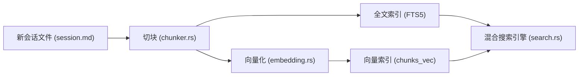
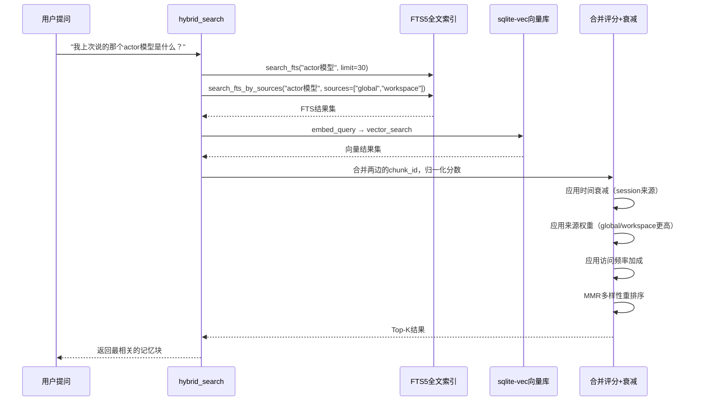
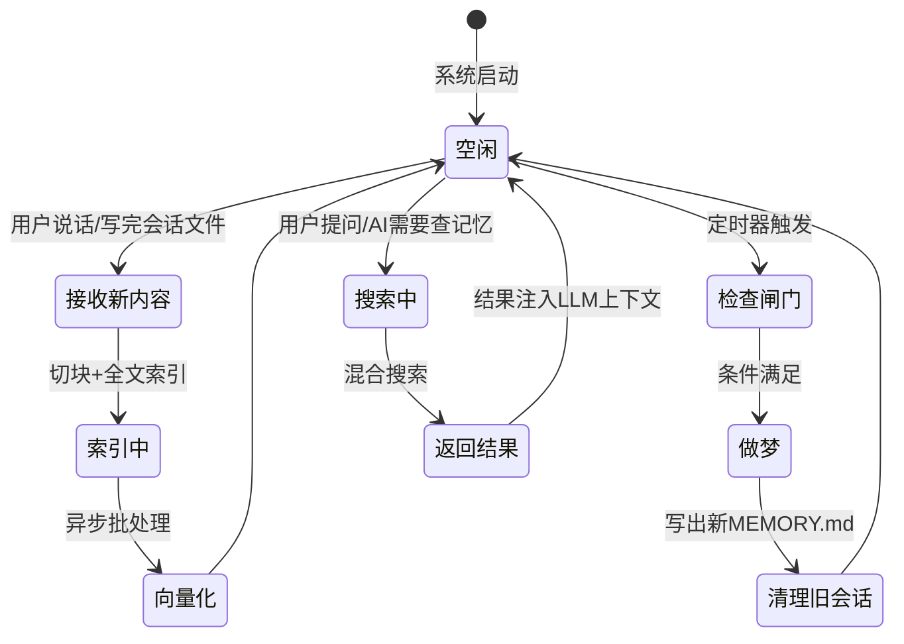

[← 返回首页](index.md)

# 长期记忆与压缩：AI 怎么记住你之前的话

## 为什么需要长期记忆？

假设你正跟 Grok 聊一个 Rust 项目，聊了半小时。你告诉它：“我这边的核心模块是 `event_loop.rs`，用的是 actor 模型。” 然后你关掉终端去吃午饭。两小时后回来，你跟它说：“继续刚才那个话题。” — 如果 Grok 完全不记得你之前说过什么，它又得从零开始问，那多尴尬。

长期记忆系统就是来解决这个问题的。它让 AI 能记住“几小时甚至几天前”的对话内容，而且不会把每次聊天的全部原文都存着（那样太费钱）。它靠三件法宝：

1. **切块 + 索引** — 把聊天记录切成小段，分别做全文索引和向量索引
2. **混合搜索** — 找东西的时候同时用关键词和语义相似度，保证找得准
3. **“做梦”压缩** — 定期把零碎的聊天记录合并成精炼的摘要，删掉废话

整个系统的核心在 `crates/codegen/xai-grok-memory` 这个 crate 里。它的入口点在 `src/lib.rs`，里面定义了 `MemoryStorage` 和 `MemoryIndex` 两个大管家。

## 数据是怎么存起来的？

在 `src/lib.rs` 的开头注释里有这么一段示例（这其实就是真实的文件目录结构）：

```
~/.grok/memory/
  ├── MEMORY.md                         # 全局知识（比如你常用的操作系统、shell）
  └── {workspace_hash}/                 # 当前项目的专属目录
      ├── MEMORY.md                     # 项目级别的知识
      └── sessions/
          └── YYYY-MM-DD-{slug}-{sid8}.md  # 每次聊天的记录
```

- **全局 MEMORY.md**：存你的偏好，比如“我用 zsh，默认编辑器是 nvim”。这个文件不轻易改。
- **工作区 MEMORY.md**：存当前项目的独有信息，比如“这个项目用 actix-web，数据库是 Postgres”。
- **sessions/*.md**：每次聊天的完整记录。这些文件经常变，也是做梦压缩的主要对象。

`MemoryStorage` 结构体（定义在 `src/storage.rs`）就负责管理这些文件。它提供了 `write_long_term` 和 `write_session` 方法来写记忆文件和聊天记录。

## 从聊天记录到向量索引：三步走

新写入的 session 文件不会直接被搜索到。它要过三关：



### 第一步：切块

`src/chunker.rs` 里的 `chunk_markdown` 函数负责把 Markdown 内容切成合理的块。切块的逻辑是：

1. 按 `##` 标题分节 — 每个标题下的内容是一块
2. 如果一节太长（超过 `max_chunk_chars`），按段落（`\n\n`）继续分
3. 如果段落还太长，按行分
4. 每个子块会带上它所属的父标题作为上下文

来看一段真实代码（摘自 `src/chunker.rs`）：

```rust
pub fn chunk_markdown(content: &str, config: &MemoryIndexConfig) -> Vec<Chunk> {
    if content.is_empty() {
        return vec![];
    }
    let max_chars = config.max_chunk_chars;
    let lines: Vec<&str> = content.lines().collect();
    // 如果整个内容都不够一块，直接返回
    if content.len() <= max_chars {
        return vec![Chunk {
            text: content.to_string(),
            start_line: 0,
            end_line: lines.len(),
        }];
    }
    // 按 ## 标题切分
    let sections = split_by_headers(&lines);
    let mut chunks = Vec::new();
    for section in &sections {
        let section_text = section.lines.join("\n");
        if section_text.len() <= max_chars {
            chunks.push(Chunk {
                text: add_header_context(&section.header_context, &section_text),
                ...
            });
        } else {
            // 太长的话，按段落继续切
            let sub_chunks = split_section_by_paragraphs(section, max_chars, ...);
            chunks.extend(sub_chunks);
        }
    }
    chunks
}
```

每个 `Chunk` 还会用 blake3 算一个哈希（`chunk_hash` 函数），用来做去重——如果同一段文字再写进来，不会重复存。

### 第二步：建索引

切好的块交给 `MemoryIndex`，它在 SQLite 里建了三张表（定义在 `src/schema.rs`）：

```sql
-- chunks 表：存文本本身
CREATE TABLE IF NOT EXISTS chunks (
    id TEXT UNIQUE NOT NULL,
    path TEXT NOT NULL,
    start_line INTEGER NOT NULL,
    end_line INTEGER NOT NULL,
    text TEXT NOT NULL,
    hash TEXT NOT NULL,
    source TEXT NOT NULL,   -- "global"、"workspace" 或 "session"
    created_at INTEGER NOT NULL,
    updated_at INTEGER NOT NULL,
    access_count INTEGER DEFAULT 0,
    ...
);

-- chunks_fts：FTS5 全文索引，支持 BM25 关键词搜索
CREATE VIRTUAL TABLE IF NOT EXISTS chunks_fts USING fts5(text, content='');

-- chunks_vec：向量索引（sqlite-vec 插件），支持 KNN 余弦相似度搜索
CREATE VIRTUAL TABLE IF NOT EXISTS chunks_vec USING vec0(
    chunk_id TEXT PRIMARY KEY,
    embedding FLOAT[dimensions]
);
```

### 第三步：向量化

`src/embedding.rs` 里的 `EmbeddingProvider` trait 负责调用外部模型（比如 OpenAI 的 embedding API），把文本转成浮点数向量。`lib.rs` 里的 `embed_missing_chunks` 函数会定期扫描数据库，找出还没向量化的块，成批送去计算向量：

```rust
pub async fn embed_missing_chunks(
    index: &MemoryIndex,
    provider: &dyn embedding::EmbeddingProvider,
) -> usize {
    let chunks = match index.chunks_without_embeddings() {
        Ok(c) if c.is_empty() => return 0,
        Ok(c) => c,
        Err(e) => { ... return 0; }
    };
    // 每次最多 32 条一批
    for batch in chunks.chunks(32) {
        let texts: Vec<&str> = batch.iter().map(|(_, text)| text.as_str()).collect();
        match provider.embed_batch(&texts).await {
            Ok(embeddings) => {
                for ((chunk_id, _), embedding) in batch.iter().zip(embeddings.iter()) {
                    index.upsert_embedding(chunk_id, embedding).ok();
                }
            }
            ...
        }
    }
    ...
}
```

## 混合搜索：又准又稳

当 Grok 要翻记忆的时候，它不会只看关键词或只看向量。`src/search.rs` 里的 `hybrid_search` 函数做的是“混合搜索”——同时用 BM25 全文检索和 KNN 向量搜索，把两边的分数合起来。



评分公式的核心在 `hybrid_search_merge` 函数里（`src/search.rs`）：

```
raw_score = base_score × decay_multiplier × source_weight × access_boost
```

- **base_score**：FTS 和向量分数的加权组合。如果只有 FTS 匹配，它就拿 FTS 的满分；如果两边都匹配，就按 `text_weight` 和 `vector_weight` 加权。
- **decay_multiplier**：针对 session 来源的块，按指数衰减。每过 `half_life_days` 天分数减半。global 和 workspace 来源不衰减。
- **source_weight**：不同来源的权重可以配置，比如你可以让 workspace 的记忆比 session 的记忆更“重要”。
- **access_boost**：被检索次数越多的块，分数越高。用 `ln(1 + count) * 0.05` 做小幅度加成。

## 做梦压缩：把废话扔掉

对话积累多了，存着太贵，搜起来也慢。这时候就需要“做梦”（dream）——它就像是 AI 自己给自己做的知识整理。

`src/dream.rs` 里的逻辑是这样的：

1. **检查闸门**：`check_dream_gates` 函数看三个条件是否满足：
   - 配置里 `dream.enabled` 必须为 true
   - 距离上次做梦至少过了 `min_hours` 小时
   - 上次做梦以来新增的 session 文件数达到 `min_sessions` 条

2. **构建提示词**：`build_dream_user_message` 把最近的所有 session 文件读进来，把已有的 MEMORY.md 也带上（但不包括那种只有占位符的模板——`is_scaffold_template` 判断内容是否太短太模板化）。然后拼成一个大字符串，发给模型。

3. **模型回复**：模型收到后，要按照一个系统提示（`DREAM_SYSTEM_PROMPT`）做事：合并知识、解决矛盾、把相对日期改成绝对日期、扔掉问候语和工具调用噪音、保留决策和架构信息。

4. **过滤响应**：`process_dream_response` 检查回复——如果回复是 `NO_REPLY`、空内容、或者没有 Markdown 标题，就认为“没什么值得合并的”。否则把回复截断到 16000 字符后写入 MEMORY.md。

5. **清理旧会话**：`clean_processed_sessions` 把那些已经“消化”掉的 session 文件删掉。但有个安全机制：修改时间在 5 分钟以内的文件不删，防止正在写的 session 被误删。

```rust
// 摘录自 src/dream.rs
pub fn execute_dream(
    lock: &DreamLock,
    storage: &MemoryStorage,
    response: &str,
    processed_stems: &[String],
) -> DreamResult {
    // 先加锁，防止多个进程同时做梦
    let prior = match lock.try_acquire(stale_lock_secs) {
        Ok(Some(prior)) => prior,
        Ok(None) => return DreamResult { status: DreamStatus::Skipped(...) },
        Err(e) => return DreamResult { status: DreamStatus::Failed(...) },
    };
    
    // 处理模型回复
    let content = match process_dream_response(response) {
        Some(c) => c,
        None => return DreamResult { status: DreamStatus::NothingToConsolidate },
    };
    
    // 写回工作区 MEMORY.md
    storage.write_long_term(MemoryScope::Workspace, &content)?;
    
    // 清理已处理的 session 文件
    let cleaned_stems = clean_processed_sessions(sessions_dir, processed_stems);
    
    DreamResult { status: DreamStatus::Completed { ... } }
}
```

## 代码压缩：省 token 就是省钱

这部分在另一个 crate `crates/codegen/xai-grok-compaction` 里。它跟 memory 系统是两回事但目标一致——省 token。

**对话压缩 (Conversation Compaction)**：当一段对话超过一定长度时，`xai-chat-state` 里的 `ChatActor` 会调用 compaction 机制。`src/actor/state.rs` 里跟踪每个对话的 token 用量，当超过阈值时，就把中间的消息（比如 AI 的完整思考过程）总结成一句话，用户说了什么、AI 回复了什么结论保留，推理细节扔掉。

这个过程跟 dream 很相似，但 scope 不同：
- **Dream** 跨会话，存的是项目级别知识
- **Compaction** 在单次会话内，保留的是对话上下文。

## 状态机总结

整个记忆系统的生命周期可以用一张图来概括：



## 怎么配置和开启？

记忆系统默认不开启，需要加 `--experimental-memory` 命令行参数或者设环境变量 `GROK_MEMORY=1`（见 `src/lib.rs` 最上面的注释）。

配置项在 `xai-grok-config-types` 里，有这几个关键参数：
- `max_chunk_chars`：切块的最大字符数（默认值由 `MemoryIndexConfig` 决定）
- `chunk_overlap_chars`：子块之间的重叠字符数，保证切块时不丢失语义连续性
- `dream.enabled` / `dream.min_hours` / `dream.min_sessions`：做梦的开关和触发条件
- `search.text_weight` / `search.vector_weight`：混合搜索时 FTS 和向量的权重比例
- `search.half_life_days`：session 记忆的衰减半衰期

具体的测试用例可以看 `src/search.rs` 文件底部的 `#[cfg(test)] mod tests`，里面有十几个覆盖各种场景的测试，比如“只有 FTS 时能不能搜到”、“搜索空索引会怎样”、“来源权重是否生效”等等。

---

**一句话总结**：Grok 的记忆系统等于一个会自己整理的笔记簿——每次聊天它都认真记，但隔一段时间它会自己翻翻笔记，把重要的挑出来、废话扔掉，下次聊类似话题时能立刻想起来。详见《公共基础设施：熔断器、工具协议、压缩、追踪》再聊聊 compaction 的技术细节。
