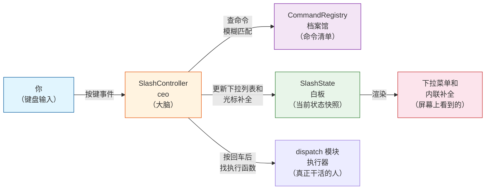
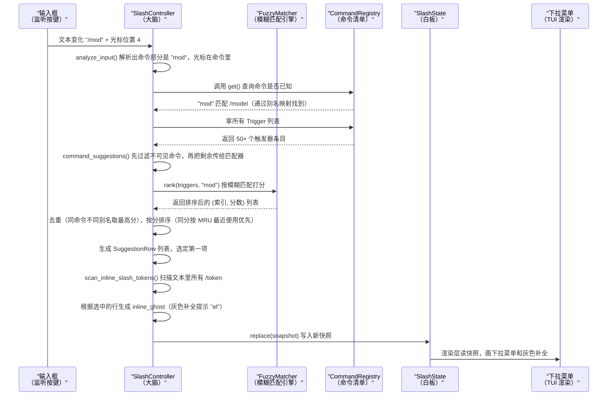

[← 返回首页](index.md)

# 斜杠命令系统

你在 Grok 里敲 `/model grok-4` 然后按回车——这个动作背后有一整套机制在工作：注册中心记住这 50+ 个命令都是谁，模糊匹配器看懂你打的字母然后猜你想找哪个，控制器把匹配结果整理好交给画面渲染成下拉菜单。我们就顺着这条链路走一遍。

## 一句话讲清楚它是干嘛的

斜杠命令系统是 Grok TUI 里的"快捷键执行器"。你在输入框里打 `/` 开头的内容，它负责三件事：

1. **认出**这是个命令还是普通聊天（`/model` 是命令，`/Users/foo/bar` 是文件路径，别搞混）。
2. **帮你补全**——打前两个字母就弹出下拉菜单，告诉你有哪些选择。
3. **执行**——按回车后找到对应的处理函数，把参数塞进去跑起来。

它不处理 AI 对话本身，也不管工具调用——那些是 Agent 运行时和工具箱的活。这里只负责"你打了 `/` 之后终端上发生的一切"。

## 架构总览：四个角色一台戏

整个斜杠命令系统可以理解成一个四人小组，分工很明确：



这四个角色长什么样，我们用代码说：

**CommandRegistry（档案馆）**——在 `crates/codegen/xai-grok-pager/src/slash/registry.rs` 里。它存着所有命令对象和它们的别名、触发器（显示在下拉菜单里的条目）。

```rust
// registry.rs — CommandRegistry 的核心数据结构
pub struct CommandRegistry {
    commands: Vec<Arc<dyn SlashCommand>>,  // 50+ 个命令对象（Arc 是引用计数指针，多个地方共用同一份数据）
    sources: Vec<CommandSource>,            // 每个命令的来源是内置还是 ACP 动态注册
    key_to_index: HashMap<String, usize>,   // 名字/别名 → 命令在 vec 里的位置
    triggers: Vec<CommandTrigger>,          // 下拉菜单里显示的条目（一个命令可能有多个别名入口）
    hidden: HashSet<String>,                // 功能开关关闭时藏起来的命令
    restricted: HashSet<String>,            // 套餐限制不可用的命令
    // ...
}
```

**SlashController（大脑）**——在 `crates/codegen/xai-grok-pager/src/slash/mod.rs` 里。它拿着 Registry 和模糊匹配器，每次你敲键盘就重新算一遍该显示什么。

**SlashState/SlashSnapshot（白板）**——也在 `mod.rs` 里。就是一个"当前画面需要的数据包"，渲染层只读这个就够了，不用关心背后的计算逻辑。

```rust
// mod.rs — SlashSnapshot 的字段就是下拉菜单需要的全部信息
pub struct SlashSnapshot {
    pub active: bool,                          // 是不是在输入斜杠命令模式
    pub open: bool,                            // 下拉菜单要不要打开
    pub query: String,                         // 当前查询内容（/ 后面的部分）
    pub matches: Vec<SuggestionRow>,           // 匹配到的建议行
    pub selected: usize,                       // 当前高亮选中第几个
    pub command_range: Option<Range<usize>>,   // 命令部分在输入文本里的字节范围
    pub command_recognized: bool,              // 打的内容是不是一个已知命令
    pub inline_ghost: Option<InlineGhost>,     // 内联补全的灰色提示文字
    // ...
}
```

**dispatch 模块（执行器）**——在 `crates/codegen/xai-grok-pager/src/app/dispatch/mod.rs` 里。按回车后，命令通过 `dispatch` 函数路由到对应的处理逻辑（比如 `/model` 会调到 `dispatch_send_prompt_inner` 这一类的函数）。这部分不算斜杠系统的核心，我们这里不展开。

## 每条命令的结构：SlashCommand trait

所有命令——不管是不是内置的——都实现同一个 trait（可以理解成"接口约定"），定义在 `crates/codegen/xai-grok-pager/src/slash/command.rs`。每个命令都要回答这些问题：

| 方法 | 作用 | 大白话 |
|---|---|---|
| `name()` | 返回命令的规范名称 | 这个命令叫啥 |
| `aliases()` | 返回别名列表 | 也叫啥（比如 `/exit` 也叫 `/quit`） |
| `description()` | 命令简介 | 它是干嘛的 |
| `usage()` | 用法示例 | 怎么用它 |
| `visible()` | 在当前条件下要不要显示 | 现在能不能用（比如 `/debug` 只在调试版本出现） |
| `takes_args()` | 是否接受参数 | 要不要跟内容（`/model grok-4` 需要，`/exit` 不需要） |
| `args_required()` | 参数是否必须 | 不填参数能不能直接执行 |
| `suggest_args()` | 返回参数的补全建议 | 敲 `/model` 后空格，弹出有哪些模型可以选 |
| `run()` | 真正执行的逻辑 | 干活的函数 |

这三个方法是"按键即执行"还是"必须填参数"的决策依据：

| `takes_args` | `args_required` | 没参数按回车 |
|---|---|---|
| `false` | `false` | 直接执行 |
| `true` | `false` | 直接执行（参数可选） |
| `true` | `true` | 拦住，不让执行 |

```rust
// mod.rs — 这个决策逻辑在 is_command_complete 函数里
pub fn is_command_complete(line: &str, registry: &CommandRegistry) -> bool {
    let Some(invocation) = parse_invocation(line) else {
        return false;
    };
    let Some(command) = registry.get_for_dispatch(invocation.token) else {
        return true;  // 不认识的命令放行，让 shell 处理
    };
    if !command.takes_args() { return true; }
    if !command.args_required() { return true; }
    !invocation.args.trim().is_empty()  // 必须参数的情况下，非空才放行
}
```

## 命令注册：两层来源，动态合并

命令从哪来的？两层。

**第一层：内置命令。**在 `crates/codegen/xai-grok-pager/src/slash/commands/` 目录下，每个命令一个文件。初始化时全部塞进 Registry：

```rust
// mod.rs — SlashController 的便捷构造方法
pub fn with_builtins(cwd: std::path::PathBuf) -> Self {
    Self::new(CommandRegistry::new(commands::builtin_commands()), cwd)
}
```

注册时一个命令可以产生多个"触发器"（Trigger）——规范名一个、每个别名各一个。触发器才是下拉菜单里真正显示的条目。比如 `/exit` 命令有 `aliases: &["quit"]`，注册后会生成两条 Trigger，一条显示 `/exit`，一条显示 `/quit`，但点击后执行的是同一个命令。

**第二层：ACP 动态命令。**Agent 在运行时会通过 ACP 协议（和 AI 后端通信的约定）推送一批可用命令过来——可能是安装的 Skill 暴露的新能力，也可能是插件注册的。这些命令通过 `registry.set_acp_commands()` 动态注入：

```rust
// registry.rs — ACP 命令替换逻辑
pub fn set_acp_commands(&mut self, commands: &[agent_client_protocol::AvailableCommand]) {
    // 1. 先删掉所有旧的 ACP 命令（保留内置命令不动）
    // 2. 检查新命令的名字会不会跟内置命令冲突
    // 3. 不冲突的塞进去，冲突的如果带着 scope 信息就改名（如 "local:login"）
    // 4. 重建触发器列表
}
```

**冲突解决**是个值得看一眼的逻辑：如果 ACP 推送了一个也叫 `login` 的命令，但已经有内置命令占了 `login` 这个名字，怎么处理？

- 如果 ACP 命令带着 `meta.scope` 标记（说明这是个 Skill），就给它改名成 `local:login` 或 `user:login`。
- 如果没有 scope 信息（普通 shell 命令），就直接丢弃，内置优先。

```rust
// registry.rs — 冲突时对非 Plugin 的 Skill 做重命名
fn client_collision_qualified_name(
    cmd: &agent_client_protocol::AvailableCommand,
) -> Option<String> {
    let meta = cmd.meta.as_ref()?;
    let scope: SkillScope = serde_json::from_value(meta.get("scope")?.clone()).ok()?;
    if scope == SkillScope::Plugin { return None; }  // 插件技能直接丢弃
    Some(format!("{}:{}", scope.as_ref(), cmd.name))  // local:xxx 或 user:xxx
}
```

### 三个屏蔽名单，三种语义

不是所有注册的命令都"可见"和"可执行"。Registry 用三套 HashSet 管这件事：

| 名单 | 存储字段 | 效果 | 典型用途 |
|---|---|---|---|
| **硬隐藏** | `hidden` | 既不看也不执行 | 功能开关关闭时（如 `/voice` 在远程关停时） |
| **仅菜单隐藏** | `menu_hidden` | 下拉菜单看不到，但手打全名仍可执行 | `/gboom` 彩蛋（只能手动输入完整命令） |
| **套餐限制** | `restricted` | 菜单里看得见，但执行会被拦截，弹出升级提示 | 免费套餐用户打 `/usage` 会看到"请升级" |

`get()` 方法（菜单查询）会同时过滤全部三个名单，而 `get_for_dispatch()`（执行查询）只过滤硬隐藏和套餐限制，故意放行菜单隐藏的命令——这样 `/gboom` 这种彩蛋不会被 autocomplete 暴露，但你手打全名回车还是能触发。

## 一次输入的全过程：从敲键到显示补全

场景：你在输入框里打了 `/mod`，光标停在 `d` 后面。来看看每一步发生了什么。



关键代码路径都集中在 `refresh()` 方法里（`crates/codegen/xai-grok-pager/src/slash/mod.rs`），一个大约 200 行的函数干了上面所有事。

### 输入解析：命令在哪、参数在哪

```rust
// mod.rs — analyze_input 把输入切成两段
fn analyze_input(text: &str, cursor: usize) -> Option<SlashInput> {
    // 1. 不以 / 开头？再见，不是命令
    if text.is_empty() || !text.starts_with('/') { return None; }

    // 2. 找命令部分的结尾（第一个空格的位置）
    // 3. 光标在命令部分还是参数部分？
    //    命令部分：/mod|el → cursor_in_command = true
    //    参数部分：/model grok-4| → cursor_in_command = false
    // 4. 分别在哪个字节范围里
    //    命令：0..6  参数：7..14
}
```

### 模糊匹配：nucleo 引擎

匹配器在 `crates/codegen/xai-grok-pager/src/slash/matcher.rs`，是对 nucleo 库（和 fzf 同源的模糊匹配算法）的薄封装。

```rust
// matcher.rs — rank 方法的签名
pub fn rank<T, F>(
    &mut self,
    items: &[T],           // 待匹配的条目列表
    query: &str,           // 用户打的查询内容
    limit: usize,          // 最多返回多少条
    mut key_fn: F,         // 从条目里提取用于匹配的文本
) -> Vec<(usize, u32)>    // 返回 (原始索引, 匹配分数)
```

匹配用的是 `CaseMatching::Smart`——全小写查询不区分大小写（打 `mod` 能匹配到 `Model`），查询里一旦出现大写字母就严格区分大小写。

### 排序魔法：三级权重

匹配结果出来后不是简单按分数排。在 `command_suggestions()` 方法里有一套精细的排序逻辑：

1. **模糊匹配分数**（nucleo 给的，越高越好）。
2. **最近使用（MRU）**——最近用过的命令加分，让常用命令浮上来。数据存在 `SlashMru` 里（`crates/codegen/xai-grok-pager/src/slash/mru.rs`），每次执行命令时通过 `record_command_use()` 记录，异步刷盘不阻塞 UI。
3. **内置优先**——同等条件下内置命令排在 ACP 动态命令前面。
4. **字典序**——还分不出胜负就按字母排。

这套设计保证了：你打 `/p` 时如果最近用过 `/plan`，它就会排第一；好久不用，内置的 `/plugins` 就会排前面。

## 特殊场景：文本中间的斜杠命令

你可以在聊天内容中间打命令，比如："do /model grok-4 now please"。系统需要认出 `/model` 是一个命令 token，而不是普通的斜杠路径。

```rust
// mod.rs — 扫描文本中所有的 /word token
pub fn scan_inline_slash_tokens(text: &str, cursor: usize) -> Vec<InlineSlashToken> {
    // 规则：/ 必须在行首或前面是空白字符
    //       / 后面必须跟着非空白字符
    //       foo/bar 不算，/Users/path 不算（/ 前面不是空白）
}
```

找到 token 后，如果鼠标正在 token 上或在它的参数区（token 之后、下一个 token 之前），就把这个 token 当成"当前活跃命令"来处理，弹出它的下拉菜单或参数建议。和行首命令用的是同一套 `refresh()` 逻辑，只是 `command_range` 不再是 `0..6` 而是 `13..19`（取决于 / 在文本里的位置）。

## 给自己写一个命令

给 Grok 加自定义命令有两条路：

**方案 A：写一个 SKILL.md 文件。**放在 `~/.grok/skills/你的命令名/SKILL.md`，在前言（frontmatter）里设置 `user-invocable: true`，重启后它就会作为 ACP 命令出现在斜杠菜单里。不需要写 Rust 代码。详见 [《插件与钩子系统》](26-plugins-and-hooks.md)。

**方案 B：如果你在改 Grok 源码**（比如想给内置命令加一个），需要三步：

1. 在 `crates/codegen/xai-grok-pager/src/slash/commands/` 下新建一个文件，实现 `SlashCommand` trait：

```rust
// 一个最小可用的命令示例
use crate::slash::command::{AppCtx, CommandExecCtx, CommandResult, SlashCommand};

struct HelloCommand;

impl SlashCommand for HelloCommand {
    fn name(&self) -> &str { "hello" }
    fn description(&self) -> &str { "打个招呼" }
    fn usage(&self) -> &str { "/hello [名字]" }
    fn takes_args(&self) -> bool { true }
    fn args_required(&self) -> bool { false }

    fn run(&self, ctx: &mut CommandExecCtx, args: &str) -> CommandResult {
        let name = if args.is_empty() { "世界" } else { args };
        // 把 "你好，世界！" 显示在聊天里
        ctx.add_system_message(format!("你好，{}！", name));
        CommandResult::Handled
    }
}
```

2. 在 `commands/mod.rs` 的 `builtin_commands()` 函数里注册它：

```rust
// commands/mod.rs — 把新命令加进列表
pub fn builtin_commands() -> Vec<Arc<dyn SlashCommand>> {
    vec![
        // ...已有的命令...
        Arc::new(HelloCommand),
    ]
}
```

3. 重新编译，打 `/hello Grok` 就能看到效果。

如果想支持参数补全，实现 `suggest_args()` 方法就行：

```rust
fn suggest_args(&self, _ctx: &AppCtx, query: &str) -> Option<Vec<ArgItem>> {
    let names = ["Alice", "Bob", "Charlie"];
    Some(
        names.iter()
            .filter(|n| n.to_lowercase().contains(&query.to_lowercase()))
            .map(|n| ArgItem {
                display: n.to_string(),
                match_text: n.to_string(),
                insert_text: n.to_string(),
                description: String::new(),
            })
            .collect()
    )
}
```

这样打 `/hello a` 就会弹出 "Alice" 的补全建议。

## 命令完整清单

所有内置命令的精确定义在 `crates/codegen/xai-grok-pager/src/slash/commands/` 目录下的各个文件里。用户文档在 `crates/codegen/xai-grok-pager/docs/user-guide/04-slash-commands.md`。下面按功能分组列出来：

### 会话管理

| 命令 | 作用 | 大白话 |
|---|---|---|
| `/new` | 开新会话 | 把当前聊天清了重新开始。别名叫 `/clear` |
| `/resume` | 打开历史会话选择器 | 从磁盘加载之前聊过的会话 |
| `/compact [内容]` | 压缩对话历史 | 聊太久了 token 快爆了，把老历史总结成摘要。可选指定要保留什么 |
| `/context` | 显示上下文窗口用量 | 看看 token 都用在哪了：系统提示、消息、工具定义各占多少 |
| `/session-info` | 显示会话详细信息 | 当前模型是啥、聊了多少轮、token 用了多少 |
| `/fork` | 分支当前会话 | 以当前对话为起点开一条新分支，保留历史 |
| `/rewind` | 回退对话 | 退回到之前的某一轮，后面的话都扔掉 |
| `/copy [N]` | 复制回复 | 把最近一条（或第 N 条）Agent 回复拷贝到剪贴板 |
| `/export` | 导出对话 | 把当前会话导出成文件或拷贝到剪贴板 |
| `/quit` | 退出程序 | 关掉 Grok。别名叫 `/exit` |
| `/home` | 回欢迎页 | 退出当前会话回到初始界面。别名叫 `/welcome` |
| `/rename 标题` | 重命名会话 | 给当前会话改个名字。别名叫 `/title` |

### 模式与模型

| 命令 | 作用 | 大白话 |
|---|---|---|
| `/model 名称` | 切换模型 | 换成另一个 AI 模型。别名叫 `/m` |
| `/effort 级别` | 设置推理深度 | 不改模型，只调当前模型的"思考努力程度"（low/medium/high/xhigh） |
| `/always-approve` | 切换全部批准模式 | 开：跳过所有权限弹窗。关：恢复询问。这是个开关，再打一次就关 |
| `/auto` | 切换自动模式 | 开：安全操作自动放行，危险操作才问。关：恢复询问。同样是开关 |
| `/multiline` | 切换多行输入 | 开：回车换行，Shift+回车发送。关：回车直接发送。别名叫 `/ml` |
| `/history` | 打开历史搜索 | 模糊搜索本会话之前发过的消息，选一条重新填进输入框 |
| `/compact-mode` | 切换紧凑模式 | 减少留白和间距，屏幕上塞更多内容 |
| `/vim-mode` | 切换 vim 键位 | 用 j/k 上下滚、g/G 跳首尾 |
| `/minimal` | 切到精简模式 | 不用全屏 TUI，改用纯文本输入输出 |
| `/fullscreen` | 切回全屏模式 | 从精简模式回到标准全屏 TUI。别名叫 `/full` |
| `/plan [描述]` | 进入规划模式 | 让 AI 先规划再执行 |
| `/view-plan` | 查看当前计划 | 看看 AI 正在执行的计划是啥 |

### 记忆系统

记忆相关的命令需要开启实验特性（`GROK_MEMORY=1`），`/remember` 除外。详见 [《记忆系统：AI 的长期小本本》](31-memory-system.md)。

| 命令 | 作用 | 大白话 |
|---|---|---|
| `/memory [on/off]` | 管理记忆 | 浏览、查看、开关记忆功能。别名叫 `/mem` |
| `/flush` | 立即保存记忆 | 让 LLM 总结当前会话的重要内容存入记忆 |
| `/dream` | 运行记忆整理 | 合并零散的会话日志成有组织的主题 |
| `/remember 内容` | 手动记一条 | 不等自动总结，直接记下你现在想保存的信息 |

### 扩展系统

| 命令 | 作用 | 大白话 |
|---|---|---|
| `/hooks` | 打开钩子管理 | 查看、添加、删除、启用、禁用钩子 |
| `/plugins` | 打开插件管理 | 查看已安装插件、从市场安装新插件、管理信任 |
| `/marketplace` | 打开插件市场 | 直接跳到扩展管理面板的市场标签页 |
| `/skills` | 打开技能管理 | 查看所有已安装的 Skill |

### 媒体与调度

| 命令 | 作用 | 大白话 |
|---|---|---|
| `/imagine 描述` | 生成图片 | 用文字描述生成一张图 |
| `/imagine-video 描述` | 生成视频 | 用文字描述生成一段视频 |
| `/loop [间隔] 内容` | 创建定时任务 | 每隔一段时间自动执行一次。如 `/loop 30m check deploy status` |

### 账户与配置

| 命令 | 作用 | 大白话 |
|---|---|---|
| `/login` | 登录 | 不离开会话就重新认证 |
| `/logout` | 登出 | 退出登录回到登录页面 |
| `/usage` | 查看用量 | 看用了多少积分、管账单 |
| `/privacy` | 隐私设置 | 查看或切换隐私和数据保留状态 |
| `/settings` | 打开设置 | 图形化修改所有配置项。别名：`/config`、`/preferences`、`/prefs` |
| `/theme` | 切换主题 | 换 TUI 的配色方案。别名叫 `/t` |
| `/timestamps` | 切换时间戳 | 是否在每条消息旁边显示时间 |
| `/terminal-setup` | 终端诊断 | 检测终端能力，告诉你颜色支持、剪贴板、键盘等配置情况。别名：`/terminal-check`、`/terminal-info` |

### 辅助功能

| 命令 | 作用 | 大白话 |
|---|---|---|
| `/feedback [消息]` | 发送反馈 | 报告问题或提建议 |
| `/btw 内容` | 旁白消息 | 给 AI 递句话但不打断它当前的任务 |
| `/mcps` | 管理 MCP 服务器 | 打开 MCP 连接管理面板 |
| `/docs [关键词]` | 浏览文档 | 打开 TUI 内的使用指南选择器，或跳转到在线文档 |
| `/release-notes` | 更新日志 | 查看当前版本的发布说明。别名叫 `/changelog` |
| `/goal` | 目标管理 | 设定、查看、暂停、清除自主目标 |
| `/import-claude` | 导入 Claude 配置 | 把 `~/.claude` 的设置迁过来（权限、环境变量、MCP 等） |
| `/config-agents` | 管理 Agent | 查看和切换 Agent 定义、设置默认 Agent。别名叫 `/agents` |
| `/personas` | 管理人设 | 创建、编辑、删除人设 |

### 调试与内部命令

| 命令 | 作用 | 大白话 |
|---|---|---|
| `/debug` | 调试命令 | 仅在调试版本编译时出现（`cfg!(debug_assertions)`） |

当 Agent 通过 ACP 协议推送了 Skill 或插件命令后，它们会动态出现在斜杠菜单里，带有来源标记（如 `skill` 或 `plugin`）。如果多个 Skill 同名，可以用 `local:xxx` 或 `user:xxx` 的限定形式区分。按回车提交命令后，系统会通过 `SlashController.record_command_use()` 记录到 MRU 里，下次排序时这个命令就会靠前——用得越多越容易找到。

理解了这一整条链路，你就知道从你敲 `/` 到命令执行之间，代码在忙些什么了。想深入看全局怎么串起来，可以翻 [《整体架构：TUI → Agent → Workspace 三层协作》](04-architecture-overview.md)；想看具体一个命令怎么在 Agent 那边执行，见 [《一次完整对话的旅程》](05-one-full-turn.md)和 [《Agent Client Protocol：与编辑器通信》](27-acp-protocol.md)。
