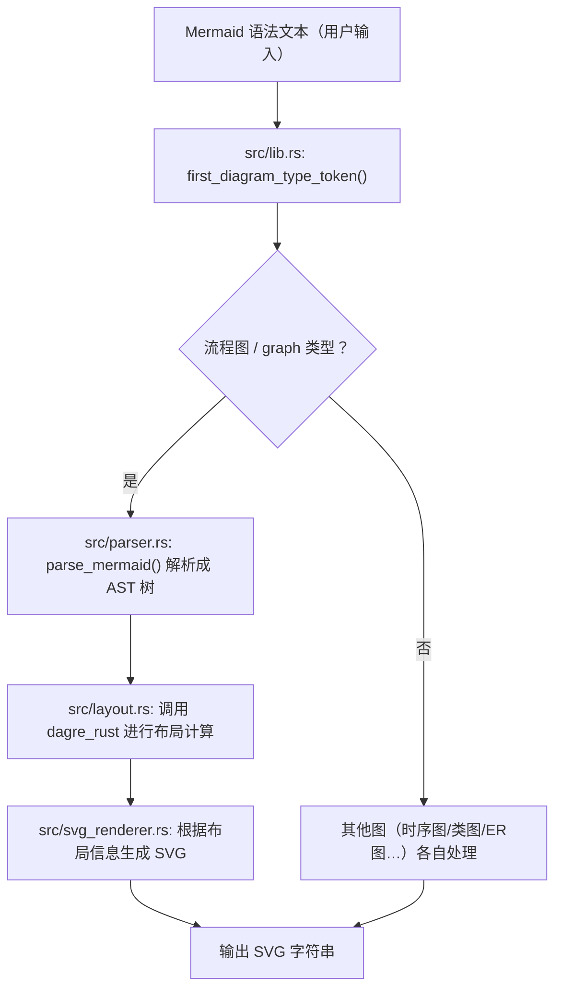
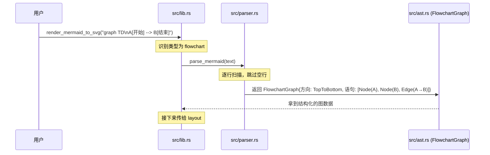
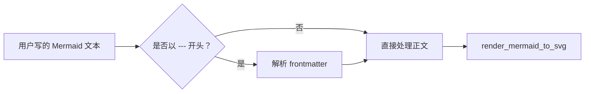

[← 返回首页](index.md)

# Mermaid 图表渲染（第三方库解析与 SVG 输出）

Grok Build 有一个很酷的能力：你说一句“画个流程图”，它就能在终端里给出一张漂亮的 SVG 图。这个能力背后的功臣就是 `third_party/mermaid-to-svg` 这个模块。它做了一件听起来挺复杂、但逻辑非常清晰的事：把 Mermaid 语法文本变成一张可以显示在屏幕上的 SVG 图片。

## 全模块概览：一条流水线

你可以把整个流程想象成一家 **“图片加工厂”**：

1. **原料进场（识别图类型）**：`src/lib.rs` 里的 `render_mermaid_to_svg` 函数先看一眼用户给的 Mermaid 文本，判断这是哪种图（流程图、时序图、类图……）。它通过 `first_diagram_type_token` 函数（`src/lib.rs` 第 158 行）找出文本的第一个关键词，然后根据关键词把活儿派给对应的“车间”（比如 `sequence_diagram::render_sequence_diagram_to_svg`）。
2. **设计图纸（解析语法）**：如果是流程图，就交给 `src/parser.rs`。这个文件里的 `parse_mermaid` 函数会把 Mermaid 文本“翻译”成一棵 AST 树（抽象语法树——就是计算机理解图结构的方式，把节点、边、子图这些要素拆成一个个小组件）。
3. **摆放位置（计算布局）**：光有节点和边还不够，你得知道每个方块放在哪里、线怎么拐。这就是 `src/layout.rs` 做的事。它调用了 `dagre_rust` 这个第三方库里的布局算法，算出每个节点的坐标、边的路径，给出一个 `LayoutResult`（说白了就是一份“位置清单”：A 节点在坐标 (100, 200)，B 节点在 (300, 200)，然后有一条线从 A 连到 B）。
4. **画成图片（生成 SVG）**：最后，`src/svg_renderer.rs` 拿着这份“位置清单”，拼出符合 SVG 规范的 XML 字符串——这就是最终能显示的那张图。



**真实代码入口**：整个流程的起点是 `src/lib.rs` 第 13 行的 `render_mermaid_to_svg` 函数。它接收一个 Mermaid 字符串和一个可选的主题，返回 SVG 字符串或错误。

## 入口“开关”：`render_mermaid_to_svg` 的调度逻辑

这个函数（`src/lib.rs` 第 29 行）就像一个 **“调度台”**，它先判断图类型，然后把活儿甩给不同的“车间”。

```rust
// src/lib.rs 第 33-70 行（简化）
pub fn render_mermaid_to_svg(mermaid_source: &str, theme: Option<&MermaidTheme>) -> Result<String, MermaidError> {
    // 1. 解析 frontmatter（YAML 配置块，比如 "--- config: ... ---"）
    let parsed_source = parse_mermaid_frontmatter(mermaid_source);
    // ... 主题处理 ...

    // 2. 识别第一个关键词
    let diagram_type = first_diagram_type_token(mermaid_source);

    // 3. 根据关键词派发
    if diagram_type == Some("erDiagram") {
        return er_diagram::render_er_diagram_to_svg(mermaid_source, theme);
    }
    if diagram_type == Some("sequenceDiagram") {
        return sequence_diagram::render_sequence_diagram_to_svg(mermaid_source, theme);
    }
    // ... 还有二十多种图类型 ...
}
```

**关键函数** `first_diagram_type_token`（第 158 行）的代码极其简单：它把文本按行切分，跳过空行和注释行，找到第一个非空行，取第一个单词。比如 "graph TD\nA --> B" 的第一个 token 就是 "graph"。

## 流程图的核心：解析 - 布局 - 渲染

对于流程图（`graph` 或 `flowchart` 开头），渲染过程最典型，也最能说明这条流水线。

### 第一步：解析成 AST（`src/parser.rs`）

`parse_mermaid` 函数（第 10 行）创建了一个 `Parser` 结构体，它会逐行扫描 Mermaid 文本，遇到 `graph TD` 就解析方向，遇到 `A[开始] --> B{是否登录?}` 就解析出节点和边。来看看它怎么处理“声明语句”：

```rust
// src/parser.rs 第 135-155 行（简化）
fn parse_graph_declaration(&mut self) -> Result<GraphDirection, MermaidError> {
    let line = self.current_line_content().ok_or(...)?;
    // 检查是否以 "graph " 或 "flowchart " 开头
    if line.starts_with("graph ") || line.starts_with("flowchart ") {
        let parts: Vec<&str> = line.split_whitespace().collect();
        // 取出第二个单词（比如 "TD"、"LR"），映射成方向枚举
        self.parse_direction(parts[1])
    }
}
```

另一个重要功夫是 **找边和识别节点形态**。`find_edge_start` 函数（第 200 行）负责在字符串里找到边的起始位置——但它必须避开被方括号、圆括号、花括号或双引号包裹的内容，因为那些是节点的标签文本。比如 `A[uses --> arrows]` 里面的 `-->` 是标签的一部分，不是真的边。

同时，`try_parse_node` 函数（第 289 行）通过字符串末尾的括号类型来判断节点形状：
- `[xxx]` → 矩形（`NodeShape::Rectangle`）
- `(xxx)` → 圆角矩形（`NodeShape::RoundedRectangle`）
- `{xxx}` → 菱形（`NodeShape::Diamond`）
- `((xxx))` → 圆形（`NodeShape::Circle`）

最后，解析结果被塞进 `FlowchartGraph` 结构体（定义在 `src/ast.rs` 里），它包含了图的 `direction` 和一个 `Vec<Statement>`。每个 `Statement` 可以是 `Node`、`Edge`、`Subgraph` 或 `Style`。



### 第二步：计算布局（`src/layout.rs`）

`layout::compute_layout` 函数（第 111 行）是布局阶段的入口。它创建一个 `LayoutEngine`，然后调用 `compute_with_dagre`。

这个函数的工作流程很清晰：

1. **收集节点和边**：`collect_nodes_and_edges` 把 AST 里的 `Statement` 展开成平面化的节点信息（`NodeInfo`）和边信息（`EdgeInfo`），同时记录每个节点属于哪个子图（`node_to_subgraph`）。
2. **构建 dagre 图**：`build_dagre_graph` 把 Rust 的图结构翻译成 `graphlib_rust::Graph`，并设置各个参数（比如 `rankDir: "tb"` 表示从上到下，`nodeSep` 表示节点间距）。
3. **调用布局算法**：`dagre_layout(&mut dagre_graph)` 是真正干活的——它运行 Dagre 算法（一种专门画有向图的网格布局算法），算出每个节点应该放在什么位置、边应该怎么走。
4. **提取结果**：`extract_layout_from_dagre` 从算好的 dagre 图里读出坐标和路径。
5. **微调**：`center_nodes_in_subgraphs` 把子图里的节点居中（如果它们之间有连边）；`clip_edge_to_boundaries` 把边的端点剪裁到节点边界上（而不是悬在中间）。
6. **计算边界**：最后算出整个图的宽度和高度，并加上边距（`MARGIN`，第 55 行，值是 8.0 像素）。

来看看布局引擎里的核心数据类型（`src/layout.rs` 第 65-100 行）：

```rust
pub struct LayoutNode {
    pub id: String,
    pub x: f64,       // 节点中心 x 坐标
    pub y: f64,       // 节点中心 y 坐标
    pub width: f64,
    pub height: f64,
    pub shape: NodeShape,
    pub label: String,
    pub fill_color: Option<String>,
    pub stroke_color: Option<String>,
}

pub struct LayoutEdge {
    pub from: String,
    pub to: String,
    pub label: Option<String>,  // 边中间的文字（比如“是”、“否”）
    pub style: EdgeStyle,
    pub points: Vec<(f64, f64)>,  // 路径经过的点序列
    pub label_pos: Option<(f64, f64)>,  // 边标签的位置
}

pub struct LayoutResult {
    pub nodes: HashMap<String, LayoutNode>,
    pub edges: Vec<LayoutEdge>,
    pub subgraphs: Vec<LayoutSubgraph>,
    pub width: f64,
    pub height: f64,
}
```

布局引擎里还有一些很细节的功能：

- **回边检测**：`detect_back_edges` 找出图中可能形成环的边（比如流程图的“重新登录”反向连接），在布局时给它们额外的路径规划。
- **状态图特殊处理**：如果发现图里包含 `StartState`、`EndState`、`ForkJoin` 等形状（通过 `graph_contains_state_shapes` 检测），布局引擎会额外调用 `snap_state_ranks` 来对齐状态的行位置。
- **子图节点居中**：`find_connected_subgraph_groups` 找出哪些子图之间有关联（有边相连），然后把它们内部的节点整体居中。

### 第三步：渲染成 SVG（`src/svg_renderer.rs`）

`svg_renderer::render` 函数拿着 `LayoutResult`，拼出一个完整的 SVG 字符串。它做这几件事：

1. 画 `<svg>` 根标签，设置 `viewBox`、`width`、`height`。
2. 画主题背景（根据 `MermaidTheme` 设置背景色）。
3. 对每个 `Subgraph`：画一个带圆角的矩形框，加上标题文字。
4. 对每个 `Node`：根据 `shape` 形状画出对应的 SVG 路径（矩形用 `<rect>`，菱形用 `<polygon>`，圆形用 `<circle>`）。
5. 对每个 `Edge`：用 `<path>` 画出连线，注意根据 `style` 选择实线、虚线还是粗线，并且箭头要用 `marker-end` 引用 SVG 的 `<defs>` 里定义的箭头标志。
6. 对每条边上的 `label`：在 `label_pos` 位置画一个 `<text>` 元素。

## 其他图类型的“特快通道”

不是所有图都走“解析 → 布局 → 渲染”这条通用流水线。有些图布局很简单，有自己的专属渲染函数。

例如 `src/er_diagram.rs` 里的 `render_er_diagram_to_svg` 处理 ER 图（实体关系图），`src/class_diagram.rs` 处理类图，`src/sequence_diagram.rs` 处理时序图。这些图类型的布局逻辑跟流程图差异很大（比如时序图是按时间顺序从上往下排列，不需要 dagre 算法），所以各自独立实现。

不过，最新版本中流程图也引入了一个 **“移植通道”**（`mermaid_port`，参见第 82 行）。当 `mermaid_port::is_enabled()` 返回 true 时，流程图会走一条不同的渲染路径——这个模块是从原版 Mermaid 项目移植过来的，提供更准确的 Mermaid 标准渲染效果。

## 附件管理：YAML 前置配置

Mermaid 支持在文本开头加一个 `---` 包裹的 YAML 区域来配置图，比如修改主题、字体等。`src/lib.rs` 里 `parse_mermaid_frontmatter` 函数（第 10 行）负责解析这个配置块。



解析的结果是 `ParsedMermaidSource` 结构体，它包含两个部分：
- `config`：解析出的 `RenderConfig`（包含主题、字体大小、流程图曲线模式等）
- `body`：去掉 frontmatter 之后的纯 Mermaid 正文

这些配置随后会传给布局引擎（`compute_layout_with_config`）和渲染引擎（`render_with_config`），让生成的 SVG 符合用户的设置。

有关主题的更多细节（比如黑暗模式、亮色模式），请参见《项目总览》。

## 测试：验证渲染的正确性

`src/lib.rs` 的测试部分（第 179 行起）包含了大量测试用例，覆盖了各种边界情况。让你看一下其中最有趣的一个：

```rust
// src/lib.rs 第 186-203 行
#[test]
fn test_open_edge_label_syntax_parses_as_labels_not_nodes() {
    // `B -- 是 --> C`: 这种 "开放标签" 写法，中间的文字是边的标签，
    // 而不是一个叫 "B -- 是" 的节点。
    let mermaid = "flowchart TD
    A[开始] --> B{是否登录?}
    B -- 是 --> C[进入主页]
    B -- 否 --> D[跳转登录页]
    D --> E[输入用户名和密码]
    E --> B
    C --> F[结束]";
    let svg = render_mermaid_to_svg(mermaid, None).expect("open-label flow renders");
    assert!(!svg.contains("B -- "), "no literal `B -- x` node: {svg}");
    for label in ["是", "否"] {
        assert!(svg.contains(label), "edge label {label:?} missing");
    }
    for node in ["开始", "是否登录?", "进入主页", "跳转登录页", "结束"] {
        assert!(svg.contains(node), "node label {node:?} missing");
    }
    let arrowheads = svg.matches(r#"marker-end="url(#arrowhead)""#).count();
    assert_eq!(arrowheads, 6, "all six edges must survive parsing");
}
```

这个测试验证的是：当用户写 `B -- 是 --> C` 时，解析器必须正确区分出这是一个带标签的边（`是`是标签），而不是创建一个叫 `B -- 是` 的奇怪节点。它还验证了最终 SVG 里有 6 个箭头（对应 6 条边），不多不少。

其他测试还覆盖了：
- 中文字符宽度计算（`test_cjk_display_width_counts_wide_chars_as_two_units`）
- 空流程图会不会 panic（`test_empty_flowchart_does_not_panic`）
- HTML 实体的转义与嵌套解码（`test_flowchart_decodes_html_entities_before_svg_escaping`）
- 换行标签的渲染（`test_flowchart_renders_escaped_newline_label_as_multiple_lines`）
- 主题覆盖优先级（`test_render_mermaid_to_svg_explicit_theme_overrides_frontmatter_theme`）

## 小结

`third_party/mermaid-to-svg` 模块是一个高度内聚的“图渲染引擎”。它不依赖任何外部网络服务，所有计算都在本地完成。从语法解析到布局计算再到 SVG 生成，每一步都对应单独的 Rust 源文件，职责清晰：

| 文件 | 职责 |
|------|------|
| `src/lib.rs` | 入口调度、图类型识别 |
| `src/parser.rs` | Mermaid 语法解析成 AST |
| `src/ast.rs` | 定义图的数据结构 |
| `src/layout.rs` | 调用 Dagre 算法计算布局 |
| `src/svg_renderer.rs` | 根据布局生成最终 SVG |
| `src/er_diagram.rs` | ER 图专属渲染 |
| `src/sequence_diagram.rs` | 时序图专属渲染 |
| `src/state_diagram.rs` | 状态图专属渲染 |
| 其他 `*_diagram.rs` | 各类图的专属渲染 |

如果你想深入理解 Grok Build 怎么把这张 SVG 放到终端里展示给用户，可以读读《整体架构》里关于 TUI 渲染的那部分。
