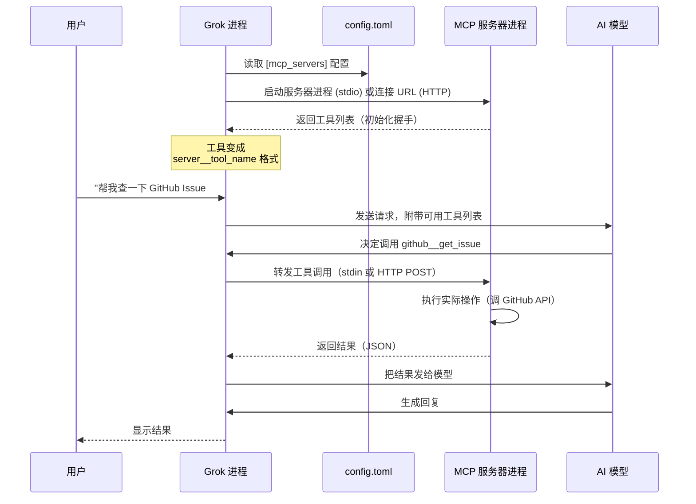
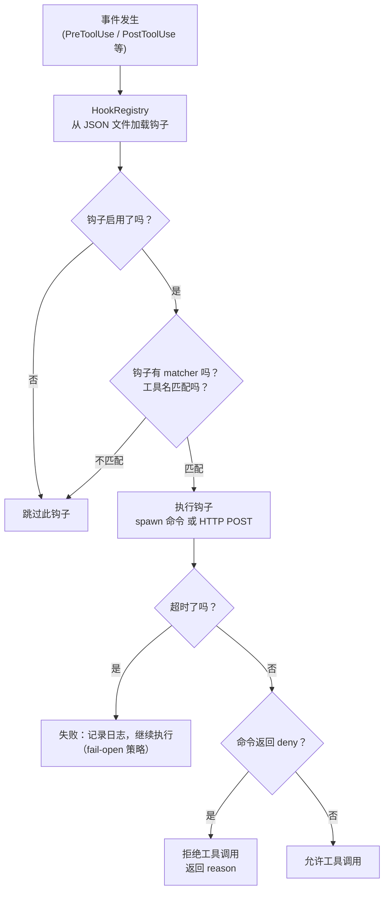
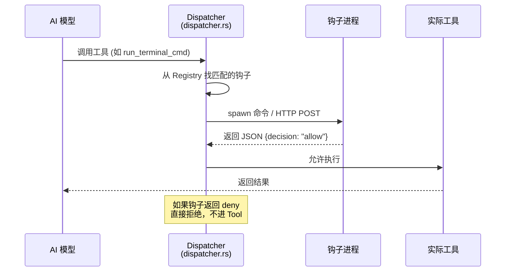
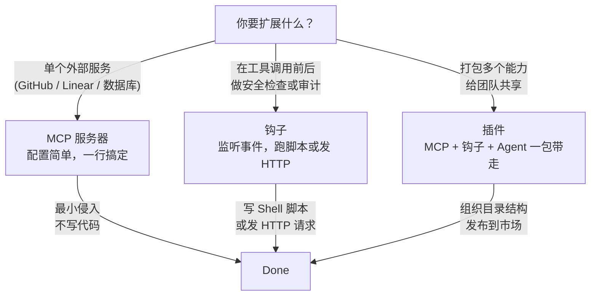
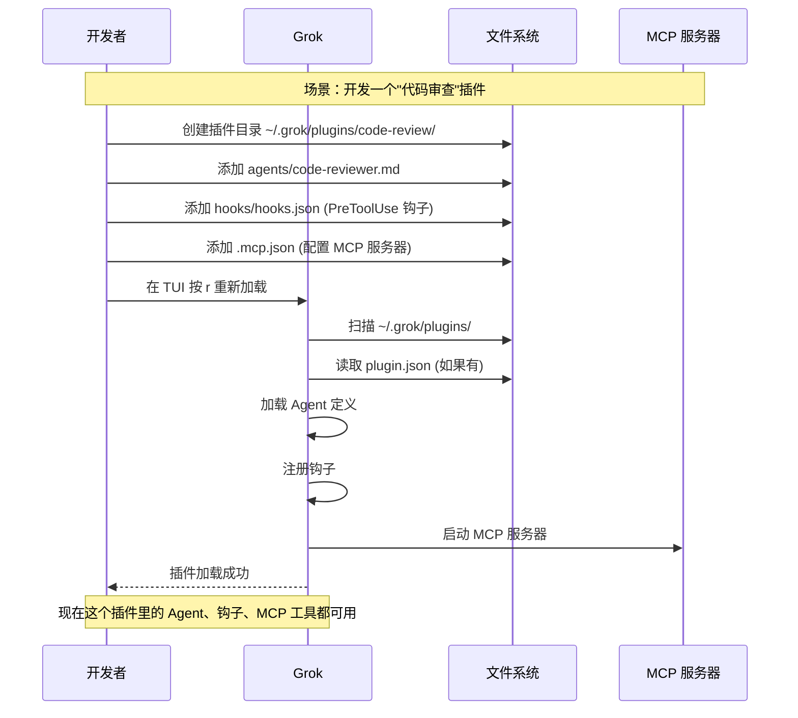

[← 返回首页](index.md)

# 扩展机制：MCP 服务器、钩子、插件

## MCP 服务器：给 Grok 接上外部工具

MCP（Model Context Protocol）说白了就是一个标准协议，让 Grok 能调用外部服务提供的工具。就像你的手机可以通过 USB-C 口接各种外设——接个键盘能打字，接个显示器能投屏。MCP 服务器就是那些"外设"，Grok 通过这个协议口跟它们通信。

### MCP 服务器的两种形态

**本地 stdio 服务器**：Grok 启动一个进程，通过标准输入/输出跟它聊天。适合文件系统访问、数据库查询这类需要本地资源的工具。

**远程 HTTP/SSE 服务器**：Grok 直接发 HTTP 请求。适合 GitHub、Linear、Sentry 这类 SaaS 服务。

配置都在 `~/.grok/config.toml` 或项目里的 `.grok/config.toml`：

```toml
# 本地 stdio 服务器
[mcp_servers.filesystem]
command = "npx"
args = ["-y", "@modelcontextprotocol/server-filesystem", "/path/to/allowed/directory"]
enabled = true

# 远程 HTTP 服务器
[mcp_servers.linear]
url = "https://mcp.linear.app/mcp"
enabled = true
```

配置参数说明（摘自 `crates/codegen/xai-grok-pager/docs/user-guide/07-mcp-servers.md`）：

| 参数 | 含义 |
|------|------|
| `command` | 可执行文件路径 |
| `args` | 命令行参数 |
| `env` | 环境变量（可用 `${VAR}` 引用进程环境变量） |
| `url` | 远程服务器地址 |
| `headers` | HTTP 请求头 |
| `startup_timeout_sec` | 启动超时（默认 30 秒） |
| `tool_timeout_sec` | 单次工具调用超时（默认 6000 秒） |

### 工具命名：避免撞车

MCP 工具的名字是带命名空间的：`<server_name>__<tool_name>`。比如 `filesystem` 服务器的 `read_file` 工具，在 Grok 看来叫 `filesystem__read_file`。这样不同服务器就算有同名工具也不会打架。

### 模型怎么发现和调用 MCP 工具？

Grok 给了模型两个内置工具（在 `xai-grok-tools` 包里）：

- `search_tool`：搜索所有已启用 MCP 服务器上的工具，按名字或描述查找
- `use_tool`：调用一个具体的 MCP 工具，传全限定名

### CLI 管理命令

```bash
# 列出所有配置的 MCP 服务器
grok mcp list

# 添加一个 stdio 服务器
grok mcp add filesystem -- npx -y @modelcontextprotocol/server-filesystem /path/to/dir

# 添加带环境变量的 stdio 服务器
grok mcp add postgres -e DATABASE_URL=postgres://localhost/mydb -- npx -y @modelcontextprotocol/server-postgres

# 添加远程 HTTP 服务器
grok mcp add --transport http sentry https://mcp.sentry.dev/mcp

# 添加带认证头的远程服务器
grok mcp add --transport http api https://mcp.example.com/mcp --header "Authorization: Bearer YOUR_TOKEN"

# 添加远程 SSE 服务器
grok mcp add --transport sse linear https://mcp.linear.app/sse

# 移除一个服务器
grok mcp remove github

# 诊断服务器配置和连通性
grok mcp doctor
grok mcp doctor github    # 只检查这一个

# 项目级作用域（写入 .grok/config.toml）
grok mcp add postgres --scope project -e DATABASE_URL=${DB_URL} -- npx -y @modelcontextprotocol/server-postgres
```

`grok mcp list` 会展示来自用户级和项目级两个范围的全部服务器，项目级的会标 `(project)`。

### MCP 服务器的完整生命周期

下面这张图展示了从 Grok 启动到模型调用 MCP 工具的完整流程：



## 钩子系统：在关键节点插一脚

钩子（Hook）就是 Grok 在某些事件发生时自动执行的外部脚本或 HTTP 请求。类似 Git 的 pre-commit hook，但粒度更细——可以针对具体的工具调用、会话启动、会话结束等事件。

### 事件类型

（定义在 `crates/codegen/xai-grok-hooks/src/event.rs`）

| 事件名 | 触发时机 | 是否阻塞 |
|--------|----------|----------|
| `PreToolUse` | 工具调用前 | 是（可以拒绝） |
| `PostToolUse` | 工具调用成功后 | 否 |
| `PostToolUseFailure` | 工具调用失败后 | 否 |
| `SessionStart` | 会话开始时 | 否 |
| `SessionEnd` | 会话结束时 | 否 |
| `Notification` | 通知事件 | 否 |

### 钩子配置文件长啥样

钩子配置写在 JSON 文件里，兼容 Claude Code 的 `~/.claude/settings.json` 格式。每个钩子可以指定匹配哪个工具、执行什么动作：

```json
{
  "hooks": {
    "PreToolUse": [
      {
        "matcher": "run_terminal_cmd",
        "hooks": [
          {
            "type": "command",
            "command": "/path/to/security-check.sh",
            "timeout": 5
          }
        ]
      }
    ],
    "PostToolUse": [
      {
        "hooks": [
          {
            "type": "http",
            "url": "https://my-logger.example.com/audit",
            "timeout": 3
          }
        ]
      }
    ]
  }
}
```

每个 `matcher` 是一个正则表达式，只匹配名字符合的工具。空字符串或缺失表示匹配所有工具。

### 钩子的运转流程

（代码在 `crates/codegen/xai-grok-hooks/src/dispatcher.rs`）



关键的设计决策（摘自 `crates/codegen/xai-grok-hooks/src/dispatcher.rs` 的注释）：

> **Fail-open 策略**：钩子执行失败（超时、崩溃、命令找不到、输出格式错误），Grok **不会**阻止工具调用。之前的 fail-closed 策略导致无辜的工具调用被误杀。Grok 运行在受保护的环境中，故意让钩子失败来绕过安全审查不是威胁模型的一部分。

简单说：钩子如果挂了，工具照常跑，只是记一笔日志。只有钩子明确返回 `{"decision": "deny", "reason": "..."}` 才能阻止工具调用。

### 配图：PreToolUse 时序图



### 让钩子可控：matcher 和 enabled

两个开关控制钩子是否执行：

1. **`enabled` 字段**：`false` 则完全跳过
2. **`matcher` 正则**：只对匹配的工具名触发。比如只对 `run_terminal_cmd` 做安全检查，对其他工具不拦截

（代码示例摘自 `crates/codegen/xai-grok-hooks/src/dispatcher.rs` 的测试）

```rust
// 只拦截 read_file 工具，其他不管
let spec = make_command_spec(
    "read-only-deny",
    Some("read_file"),   // matcher 正则
    true,
    "echo '{\"decision\":\"deny\",\"reason\":\"blocked\"}'; exit 2",
);
let result = dispatch_pre_tool_use(&registry, &envelope, &run_ctx()).await;
assert_eq!(result.decision, HookDecision::Allow); // 因为工具名不是 read_file
```

### 钩子的安全机制

（代码在 `crates/codegen/xai-grok-hooks/src/config.rs`）

Grok 在加载钩子配置时做了几件事保证安全：

1. **剥离保留的环境变量键**：用户即使设了 `GROK_HOOK_EVENT`、`GROK_SESSION_ID` 这些键，也会被静默移除。因为 spawn 时这些变量必须由 Grok 自己注入，防止用户伪造事件信息。
2. **生命周期事件不允许 matcher**：`SessionStart`、`SessionEnd` 这些事件不能加 matcher，写了会报错。
3. **命令行和 URL 的 `${VAR}` 展开**：配置里的 `${SOME_VAR}` 在加载时就被展开，但展开不掉的保留原样留给运行时处理。

## 插件系统：全家桶安装

插件是 MCP 服务器、钩子、Agent、技能、斜杠命令的集合包。安装一个插件就把所有东西一起装上了。

### 插件里能放什么

（摘自 `crates/codegen/xai-grok-pager/docs/user-guide/09-plugins.md`）

一个插件目录可以包含：

| 组件 | 目录/文件 | 说明 |
|------|-----------|------|
| Skills | `skills/` | SKILL.md 文件，教 Grok 怎么做某件事 |
| Slash commands | `commands/` | 斜杠命令定义 |
| Agents | `agents/` | Agent 定义文件（`.grok/agents/*.md`） |
| Hooks | `hooks/hooks.json` | 生命周期钩子 |
| MCP servers | `.mcp.json` | MCP 服务器配置 |
| LSP servers | `.lsp.json` | 语言服务器配置 |

插件还可以带一个可选的 `plugin.json` 清单文件（`manifest`），可以覆盖路径或加元数据。没有的话 Grok 就从默认目录找。

### 插件发现优先级

（代码在 `crates/codegen/xai-grok-agent/src/plugins/discovery.rs`）

Grok 从这几个地方找插件，优先级从高到低：

| 来源 | 范围 | 信任 |
|------|------|------|
| `_meta.pluginDirs` (session/new 参数) | 当前会话 | 自动信任 |
| `--plugin-dir` 命令行参数 | 当前进程 | 自动信任 |
| `.grok/plugins/` | 项目（可提交到 Git） | 需要手动信任 |
| `~/.grok/plugins/` | 用户全局 | 自动信任 |
| `[plugins].paths` (config.toml) | 自定义目录 | 取决于位置 |

### TUI 里管理插件

打开插件面板：

- `Ctrl+L`（非 VS Code 家族）→ 直接打开
- `/plugins` 命令 → 任何终端都行

面板里有五个 Tab：Hooks、Plugins、Marketplace、Skills、MCP Servers。用 `Tab` / `Shift+Tab` 切换。

**Plugins 标签页快捷键**：

| 按键 | 动作 |
|------|------|
| `Enter` | 展开/收起插件详情 |
| `Space` | 启用/禁用插件 |
| `r` | 重新加载所有插件 |
| `a` | 添加插件（输入 `owner/repo`、URL 或本地路径） |
| `x` | 卸载插件 |
| `f` | 按状态过滤（全部/启用/禁用） |
| `/` | 搜索插件名字 |

### 插件的钩子适配器

（代码在 `crates/codegen/xai-grok-agent/src/plugins/hooks_adapter.rs`）

插件里的钩子（`hooks/hooks.json`）加载时，Grok 会额外注入两个环境变量：

- `GROK_PLUGIN_ROOT`：插件安装目录的绝对路径
- `GROK_PLUGIN_DATA`：插件可写数据目录的绝对路径

这两个变量会覆盖用户 `env` 里同名的值，保证插件总能找到自己的资源。

### 三种扩展方式选哪个？



**建议**：
- 只想接一个外部 API？→ **MCP 服务器**，写几行配置就行
- 想在每个工具调用前跑个检查？→ **钩子**，写个 shell 脚本或发个 HTTP
- 有一整套工具和流程要分享给团队？→ **插件**，打包发到插件市场



详见《Agent 生命周期与多 Agent 协同》了解插件里的 Agent 怎么工作，详见《Mermaid 图表渲染》了解插件如何扩展 Grok 界面能力。
