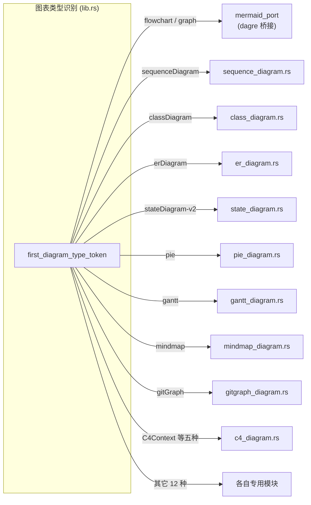
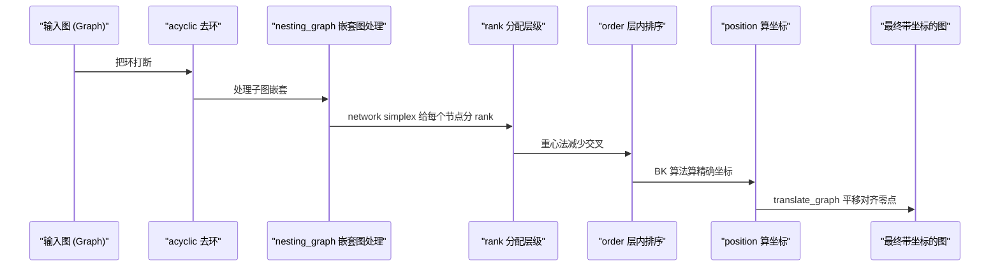
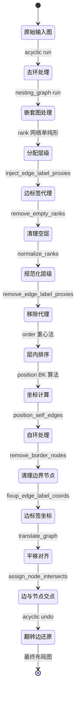

[← 返回首页](index.md)

# Mermaid 图表渲染

你写了一段 Mermaid 代码想让 AI 画成图，它怎么把这堆纯文本变成一张正经的 SVG 的？这条流水线分三步：**解析**（把文本变成结构化的东西）、**布局**（算清楚每个框框和线条该放哪）、**渲染**（最后画成 SVG 标签）。整个过程中最重头的活——流程图的自动布局——由一个完整的 Dagre 算法实现扛着。

Grok Build 支持两种渲染引擎：
- **纯 Rust 引擎**（默认）：把上面三步全在自己进程里跑完，不需要装任何外部工具。我们后面聊的解析、布局、渲染三大块说的就是这个引擎。
- **mmdc 子进程**（备用）：调用系统的 `mmdc`（Mermaid CLI）来渲染，配置走[配置体系里的 Mermaid 相关字段](28-config-system.md)。

## 一张图看清全过程


## 第一步：识别图表类型——"你是什么图？"

入口函数只有一个：`render_mermaid_to_svg`，在 `third_party/mermaid-to-svg/src/lib.rs` 里。

它先做两件准备工作：

1. **剥掉 YAML 前置头**（frontmatter）。Mermaid 支持在代码最前面用 `---` 包一段配置，比如设置主题。`parse_mermaid_frontmatter` 专门把它摘出来，剩下的纯文本才拿去解析。

2. **嗅探图表类型**。函数 `first_diagram_type_token` 直接找第一行非空非注释文本的第一个单词——如果是 `erDiagram`，就交给 ER 图解析器；如果是 `sequenceDiagram`，就交给时序图解析器；以此类推。

什么叫"第一行非空非注释文本"？看代码：

```rust
// 来自 third_party/mermaid-to-svg/src/lib.rs
fn first_diagram_type_token(input: &str) -> Option<&str> {
    input
        .lines()
        .map(|l| l.trim())
        .find(|l| !l.is_empty() && !l.starts_with("%%"))  // 跳过空行和 %% 开头的注释
        .and_then(|l| l.split_whitespace().next())          // 取第一个词
}
```

确定了图表类型，后面就是分派——每种图表有自己的解析和渲染模块。测试文件里这个分派写得明明白白：

```rust
// 来自 third_party/mermaid-to-svg/src/lib.rs 的测试
#[test]
fn test_simple_flowchart() {
    let mermaid = r#"graph TD
    A[Start] --> B[End]"#;
    let result = render_mermaid_to_svg(mermaid, None);
    assert!(result.is_ok());
    let svg = result.unwrap();
    assert!(svg.contains("<svg"));
    assert!(svg.contains("</svg>"));
}
```

支持的图表类型打包如下，全在 `third_party/mermaid-to-svg/src/` 下各有自己的模块文件：



## 第二步：解析——"把文本变成零件清单"

以流程图为例，解析器在 `third_party/mermaid-to-svg/src/parser.rs` 里，它就是一个状态机，一行一行吃进去，吐出 `FlowchartGraph` 这个 AST（抽象语法树，说白了就是把代码文本翻译成程序能直接操作的结构体）。

### 它产出了什么？

解析完得到的 `FlowchartGraph` 里装着这么几样东西（定义在 `third_party/mermaid-to-svg/src/ast.rs`）：

- **GraphDirection**：图的方向——`TD`（从上到下）、`LR`（从左到右）等。
- **Statement 列表**：每个 Statement 要么是一个节点（Node）、要么是一条边（Edge）、要么是一个子图（Subgraph）、要么是一条样式声明（Style）。

节点的结构长这样：

```rust
// 概念结构，来自 ast.rs
Node {
    id: String,               // 节点唯一 ID，比如 "A"
    label: Option<String>,    // 显示文字，比如 "开始"
    shape: NodeShape,         // 形状：矩形、菱形、圆形、六边形……
}
```

边的结构：

```rust
Edge {
    from: String,             // 起点节点 ID
    to: String,               // 终点节点 ID
    label: Option<String>,    // 边上的文字，比如 "是"、"否"
    style: EdgeStyle,         // 实线箭头、虚线、粗线……
}
```

### 解析器怎么读每行？

`Parser` 结构体维护一个行指针 `current_line`，核心入口是 `parse_statements`——循环读每一行，跳到对应的处理方法：

- 碰到 `subgraph` 开头 → `parse_subgraph`，递归解析子图内部，读到 `end` 才返回。
- 碰到 `style` 开头 → `parse_style`，读节点 ID 和样式属性。
- 碰到一行里能识别出边语法（`-->`、`---` 这些箭头）→ `parse_edge_chain`，把整条链路拆成多段边。
- 其它 → `try_parse_node`，看能不能匹配成节点。

### 怎么识别边语法？

这是解析器里最巧妙的部分。`parse_edge_syntax` 支持三种边标签写法：

1. **紧凑型**：`A-->|标签文字|B`，标签夹在 `|` 里。
2. **开放式**：`A -- 标签文字 --> B`，标签夹在 `--` 和 `-->` 中间。
3. **无标签**：`A --> B`，直接连线。

看 `lib.rs` 里专门有一段测试验证了这个功能，包括中文标签：

```rust
// 来自 third_party/mermaid-to-svg/src/lib.rs
#[test]
fn test_open_edge_label_syntax_parses_as_labels_not_nodes() {
    let mermaid = "flowchart TD
    A[开始] --> B{是否登录?}
    B -- 是 --> C[进入主页]
    B -- 否 --> D[跳转登录页]
    D --> E[输入用户名和密码]
    E --> B
    C --> F[结束]";
    let svg = render_mermaid_to_svg(mermaid, None).expect("open-label flow renders");
    for label in ["是", "否"] {
        assert!(svg.contains(label), "edge label {label:?} missing");
    }
    // 还要保证边上的文字没被当成节点
    assert!(!svg.contains("B -- "), "no literal `B -- x` node");
}
```

### 节点形状怎么识别？

`try_parse_node` 靠括号组合来识别形状——这就是 Mermaid 的语法：

| 语法 | 形状 | NodeShape |
|------|------|-----------|
| `A[文字]` | 矩形 | Rectangle |
| `A(文字)` | 圆角矩形 | RoundedRectangle |
| `A{文字}` | 菱形 | Diamond |
| `A((文字))` | 圆形 | Circle |
| `A>文字]` | 不对称旗形 | Asymmetric |
| `A{{文字}}` | 六边形 | Hexagon |
| `A[[文字]]` | 子程序形 | Subroutine |
| `A[(文字)]` | 圆柱形 | Cylinder |
| `A([文字])` | 体育场形 | Stadium |

关注代码怎么实现的——顺序很重要，括号多的先匹配：

```rust
// 来自 third_party/mermaid-to-svg/src/parser.rs，简化示意
fn try_parse_node(&self, s: &str) -> Option<Node> {
    // 先匹配 (()) -> Circle
    if let Some(start) = s.find("((") {
        if s.ends_with("))") { /* 提取 label，返回 Circle */ }
    }
    // 再匹配 [[]] -> Subroutine
    if let Some(start) = s.find("[[") { /* ... */ }
    // 然后 {{}} -> Hexagon
    // 然后 [] -> Rectangle（但要和 [[]] 区分开）
    // 然后 () -> RoundedRectangle（但要和 (()) 区分开）
    // 然后 {} -> Diamond（但要和 {{}} 区分开）
    // 最后处理纯字母（没括号的简单 id）
}
```

## 第三步：布局——"算好每个零件放哪儿"

这一步是整个渲染系统最核心、最复杂的部分。流程图和图状态图共用同一套布局引擎——`third_party/dagre_rust/` 里的 Dagre 算法实现。

Dagre 是一种**分层自动布局**算法，专门为有向图（就是带箭头的图）设计。它让图看起来像一棵棵从上往下排列的树状结构，节点大小自动适配文字，边的交叉尽量少。

Dagre 算法分五个阶段。`third_party/dagre_rust/src/layout/mod.rs` 里的 `run_layout` 函数把它们串了起来：



### 阶段1：去环（acyclic）

有向图里可能有环——A 指向 B，B 又指回 A。Dagre 框架要求图必须是无环的（DAG），所以第一步就是把所有环上的某条边"翻转"一下方向，让图变成 DAG。最后布局完了再翻回来。

代码在 `third_party/dagre_rust/src/layout/acyclic.rs`。

### 阶段2：分配层级（rank）

**"这个节点应该放在第几行？"**

这一步用 network simplex 算法来决策。每条边有一个 `minlen` 属性（最小跨越层数），算法为每个节点分配一个整数 rank，使得所有边满足约束，同时尽可能让层级紧凑。

看默认值怎么设的：

```rust
// 来自 third_party/dagre_rust/src/layout/mod.rs
pub fn set_edge_label_default_values(edge_label: &mut GraphEdge) {
    if edge_label.minlen.is_none() {
        edge_label.minlen = Some(1.0);  // 默认每条边至少跨越一层
    }
    // ...
}
```

如果图的声明是 `flowchart TD`，rank 大的节点就在下面；如果是 `LR`，rank 大的就在右边。

代码在 `third_party/dagre_rust/src/layout/rank.rs`。

### 阶段3：层内排序（order）

**"同一行里那么多节点，谁在左谁在右？"**

这道工序用**重心法**（barycenter heuristic）：把每个节点放在它相邻上一层那些节点位置的"重心"附近，尽可能减少边交叉。算法会多轮迭代，每一轮换一个方向扫（从上到下 or 从下到上），直到收敛。

代码在 `third_party/dagre_rust/src/layout/order.rs`。

### 阶段4：坐标计算（position）

**"每个节点的 x, y 到底是多少像素？"**

到这步时每个节点已经有了 rank（第几行）和 order（行内第几个），position 阶段把它们变成真实的坐标值——x 坐标由 BK 算法算出（专门用来对齐跨多层长边的节点），y 坐标由 `ranksep`（行间距）和节点自身高度算出。

默认间距值在这里：

```rust
// 来自 third_party/dagre_rust/src/layout/mod.rs
const DEFAULT_RANK_SEP: f32 = 50.0;  // 层与层之间默认 50 像素

pub fn set_graph_label_default_values(graph_label: &mut GraphConfig) {
    if graph_label.ranksep.is_none() { graph_label.ranksep = Some(50.0); }
    if graph_label.nodesep.is_none() { graph_label.nodesep = Some(50.0); }  // 同一层节点间隔
    if graph_label.edgesep.is_none() { graph_label.edgesep = Some(20.0); }
}
```

代码在 `third_party/dagre_rust/src/layout/position.rs`。

### 阶段5：收尾工作

坐标算完后，`run_layout` 还有一连串后处理：

- `remove_border_nodes`：去掉布局过程中添加的临时"边界节点"，把子图的真实宽高算出来。
- `translate_graph`：把所有坐标往零点平移（让生成的 SVG 没有大片空白边距）。
- `assign_node_intersects`：把边的起点和终点精确投射到节点形状的边框上，而不是画到圆心。



## 第四步：渲染——"把带坐标的零件画成 SVG"

布局引擎把每个框框的坐标和每条线的路径算好之后，`svg_renderer.rs` 就上场了。它的工作非常直白：

**拿到 `LayoutResult`（装了所有带坐标的节点和边），逐个翻译成 SVG 标签，拼成一个完整的 SVG 字符串。**

`SvgRenderer` 的 `render` 方法一步步来：

1. `write_header`：输出 `<svg width="..." height="...">` 和背景色矩形。
2. `write_defs`：定义箭头标记（`<marker id="arrowhead">`），后面边线引用它。
3. 循环画子图背景 → 画边线 → 画节点 → 画子图标题 → 最后画边标签。

每条边线的 SVG 路径怎么画？`render_edge_line` 拿到 `edge.points`（一系列坐标点），分两种模式生成 path 的 `d` 属性：

- **Basis 曲线**（默认）：用三次贝塞尔曲线，拐角处圆滑过渡。
- **Linear 直线**：直接用 `L` 命令连成折线。

箭头怎么处理？SVG 的 `marker-end` 属性引用 `<defs>` 里定义好的箭头标记，渲染时自动画在路径末端。由于标记会往前"突出"一段，代码里专门给箭头边做了缩短：

```rust
// 来自 third_party/mermaid-to-svg/src/svg_renderer.rs
const EDGE_ARROWHEAD_OFFSET: f64 = 4.0;  // 普通箭头缩 4 像素

fn render_edge_line(&mut self, edge: &LayoutEdge) {
    let has_arrow = matches!(edge.style, EdgeStyle::Arrow | EdgeStyle::DottedArrow | EdgeStyle::ThickArrow);
    let mut points = edge.points.clone();
    if has_arrow {
        let offset = if is_thick { EDGE_ARROWHEAD_OFFSET_THICK } else { EDGE_ARROWHEAD_OFFSET };
        Self::shorten_end_for_marker(&mut points, offset);  // 把最后一个点往回缩
    }
    let d = self.edge_path_d(&points);  // 生成 M/L/C 路径
    // 拼成 <path d="..." marker-end="url(#arrowhead)" ... />
}
```

### 主题怎么影响渲染？

`MermaidTheme` 定义了整个 SVG 的配色方案——背景色、节点填充色、描边色、文字色、边线色……全部在这里。`lib.rs` 里的 `render_mermaid_to_svg` 接收可选的 `theme` 参数，如果用户没传，就用 Mermaid 前置头里声明的主题，再没有就用默认（浅色）。

`pure.rs` 里专门做了背景色覆盖——让 SVG 背景和终端滚动区的底色融为一体：

```rust
// 来自 crates/codegen/xai-grok-mermaid/src/pure.rs
fn theme_for(theme: MermaidTheme) -> EngineTheme {
    match theme {
        MermaidTheme::Light => {
            let mut t = EngineTheme::light();
            t.background = crate::LIGHT_SURFACE.to_hex();  // 覆盖为终端的浅色表面
            t
        }
        MermaidTheme::Dark => {
            let mut t = EngineTheme::dark();
            t.background = crate::DARK_SURFACE.to_hex();   // 覆盖为终端的暗色表面
            t
        }
    }
}
```

## 边标签的碰撞避免

边标签（就是箭头上 "是"、"否" 那种小字）会贴一个半透明背景。但图表复杂时标签可能重叠在一起。`svg_renderer.rs` 里 `render_edge_labels` 方法在画完所有边标签后，多跑了一轮迭代式碰撞检测：

```rust
// 来自 third_party/mermaid-to-svg/src/svg_renderer.rs，逻辑概述
const MAX_ITERATIONS: usize = 10;  // 最多迭代 10 轮
// 对每一对标签，检查它们的边界框是否重叠
// 如果重叠了，选重叠量较小的那个方向（x 或 y）把它们推开
// 重复直到完全没有重叠，或者达到最大迭代次数
```

这个算法不保证完美（10 轮后还有重叠就算了），但大部分常见场景都能解掉。

## SVG 出来之后：变成终端能显示的图

纯 Rust 引擎返回的 SVG 还不是最终产品。`crates/codegen/xai-grok-mermaid/src/pure.rs` 里的 `MermaidEngine::render` 把它交给 `crate::rasterize`，转成 PNG 字节流——这样才能在终端里用图片协议显示。

这个过程属于[终端渲染流水线](09-tui-rendering.md)管辖的范围，这里不展开。

## 中文和多语言文字处理

Mermaid 图表里的中文标签能正常渲染，靠的是两层功夫：

1. **解析层**：`parser.rs` 里的 `normalize_label` 不做任何字符集过滤，UTF-8 直接透传。

2. **测量层**：`third_party/mermaid-to-svg/src/text_wrap.rs` 里有一个 `display_width_units` 函数，它知道中文等宽字符的显示宽度是 ASCII 的两倍：

```rust
// 来自 third_party/mermaid-to-svg/src/lib.rs 的测试
#[test]
fn test_cjk_display_width_counts_wide_chars_as_two_units() {
    use crate::text_wrap::{display_width_units, line_width};
    assert_eq!(display_width_units("abcd"), 4.0);
    assert_eq!(display_width_units("提交代码"), 8.0);       // 4 个中文字 = 8 单位
    assert_eq!(display_width_units("修复bug"), 7.0);        // 2 中文 + 3 英文 = 4+3
}
```

这意味着布局引擎在计算节点宽度时，中文节点的宽度会是同字符数英文节点的两倍——这样可以保证文字不会溢出边框。

## 纯 Rust 引擎的确定性

一个值得注意的特性：`pure.rs` 的测试里有一项验证了**同进程内的确定性**——相同输入、相同参数，两次调用产出的 PNG 字节完全一致：

```rust
// 来自 crates/codegen/xai-grok-mermaid/src/pure.rs
#[test]
fn render_is_deterministic_in_process() {
    let engine = PureRustEngine::new();
    let p = RenderParams::default();
    let a = engine.render("flowchart LR\nA-->B-->C", &p).expect("a");
    let b = engine.render("flowchart LR\nA-->B-->C", &p).expect("b");
    assert_eq!(a.png, b.png, "same source+params must yield identical png");
}
```

这是因为文字测量用的是固定字符宽度（`DEFAULT_CHAR_WIDTH`），不依赖系统字体。这有什么好处？AI 返回的图表你这边画出来是什么样，别人那边也是什么样——不会因为操作系统不同导致图文错位。

## 错误处理：不干净的输入也不会崩

AI 生成的内容不可靠——它可能写出语法错误的 Mermaid，可能写一半就断了，可能直接扔一堆乱码进来。整个引擎用两层防护兜底：

1. **引擎层**：`mermaid-to-svg` 对不支持的类型返回 `UnsupportedDiagramType` 错误，对语法错误返回 `ParseError`，对布局失败返回 `LayoutError`。这些错误在 `pure.rs` 的 `map_engine_error` 里重新分类。

2. **入口层**：`render_checked`（在 `crates/codegen/xai-grok-mermaid/src/lib.rs`）统一 catch 所有 panic，所以即使引擎内部某处写挂了，也不会把整个 TUI 搞崩——它会把异常转成一个 `MermaidError::Panic`，上层拿到错误就走代码块降级显示。

测试覆盖了各种恶意输入：

```rust
// 来自 crates/codegen/xai-grok-mermaid/src/pure.rs
#[test]
fn garbage_input_never_panics() {
    for garbage in [
        "",
        "@@@@",
        "%% only a comment",
        "\u{0}\u{1}\u{2}\u{3}",                // 控制字符
        "flowchart LR\n  A[unterminated --> ",  // 未闭合的语法
        "pie\n  : :",                            // 残缺的饼图
    ] {
        let out = render_checked(&engine, garbage, &params, &limits);
        assert!(!matches!(out, Err(MermaidError::Panic(_))));
    }
}
```

## mmdc 子进程后端（一句话）

纯 Rust 引擎覆盖了绝大多数场景，但有些冷门图表类型（比如桑基图、象限图、XY 图的部分高级特性）dagre_layout 还没完整支持。这时候系统会切到外部 `mmdc` 进程——fork 一个子进程，把 Mermaid 文本通过 stdin 喂给它，读回 SVG。配置入口在[配置体系](28-config-system.md)的 Mermaid 相关字段，进程管理细节见[终端执行与权限控制](20-terminal-tools.md)。
