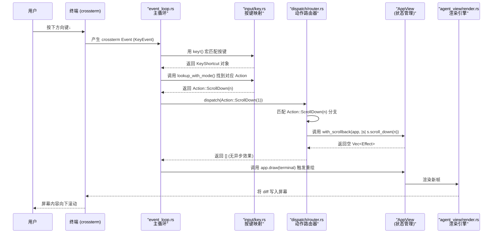
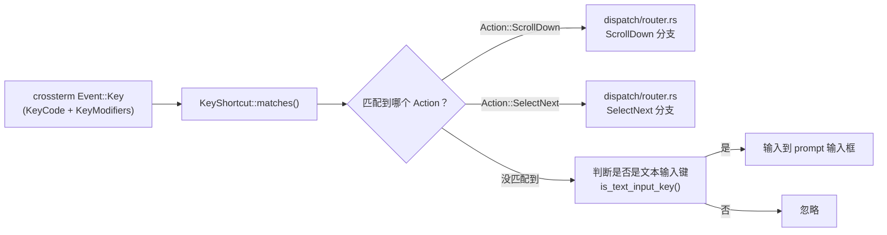
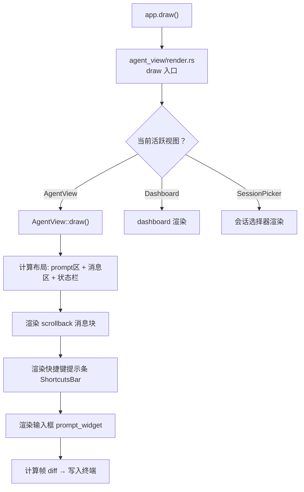

[← 返回首页](index.md)

# Pager 终端 UI 与端到端测试

跟着用户按一下方向键，看看它怎么从终端一路跑到屏幕上。

## 整体流程：从手指到屏幕的完整路径

用户按下一个键，经过**输入捕获 → 按键匹配 → 事件循环 → 动作路由 → 状态更新 → 重新渲染**六个环节，最终屏幕刷新。整个过程在同一个 `tokio::select!` 事件循环里完成，核心文件是 `src/app/event_loop.rs`。



## 第一站：终端输入捕获 (`event_loop.rs`)

事件循环的主逻辑在 `src/app/event_loop.rs`，它是个 `tokio::select!` 循环，同时监听五个通道：

1. **终端事件**（键盘输入、鼠标操作、窗口大小变化）
2. **ACP 通道**（代理间通信消息）
3. **异步任务结果**（已 spawn 的 task 执行完毕）
4. **动画定时器**（闪烁光标、旋转动画等）
5. **配置文件热更新**

```rust
// src/app/event_loop.rs (简化)
loop {
    tokio::select! {
        // 1. 从 crossterm 的 input reader 读事件
        Some(event) = input_rx.recv() => {
            // 根据按键类型分发
            match event {
                Event::Key(key_event) => {
                    // 映射按键 → Action
                    let action = key_map.lookup(key_event);
                    // 执行 Action → 得到 Effects
                    let effects = dispatch(action, &mut app);
                    // spawn 异步效果、触发重绘
                    process_effects(effects);
                    app.draw(&mut terminal);
                }
                Event::Resize(..) => {
                    // 窗口变化 → 重新计算布局
                    app.resize(&mut terminal);
                }
                _ => {}
            }
        }
        // 2. ACP 消息 → acp_handler
        // 3. 任务结果 → task_result_handler
        // 4. 动画 tick → draw
        // 5. 配置变更 → reload_theme
    }
}
```

关键细节：`event_loop.rs` 不处理任何业务逻辑，它只负责**管道**——把事件转交出去，把结果写回屏幕。注释写得很清楚："A thin `tokio::select!` loop. All input routing, rendering, and state management is delegated to [`AppView`]."

## 第二站：按键映射 (`input/key.rs`)

用户按下的方向键，到了这儿变成程序能理解的对象。`src/input/key.rs` 定义了 `KeyShortcut` 结构体和配套的 `key!()` 宏。

```rust
// src/input/key.rs
/// 一个键 + 修饰符的组合，用来匹配 crossterm 事件
pub struct KeyShortcut {
    pub code: KeyCode,        // 哪个键：Char('↓')、Enter、F(1)...
    pub modifiers: KeyModifiers, // 修饰符：Ctrl、Alt、Shift...
}
```

`key!()` 宏让你写出很直观的匹配：

```rust
// 创建一个快捷键对象
let down = key!(Down);                          // ↓ 键
let ctrl_c = key!('c', CONTROL);               // Ctrl+C
let ctrl_shift_z = key!('z', CONTROL | SHIFT); // Ctrl+Shift+Z
let shift_tab = key!(BackTab);                 // 实际终端发来的 Shift+Tab

// 判断事件是否匹配
let event = KeyEvent::new(KeyCode::Char('c'), KeyModifiers::CONTROL);
assert!(ctrl_c.matches(&event));
```

有意思的设计点：它自动做了**大小写归一化**。不管你按键时 CapsLock 开没开、Shift 按没按，`key!('G')` 都能匹配。背后逻辑在 `normalize_case()` 里：

```rust
// 如果键是小写但有 Shift 修饰，转成大写键 + 保留 Shift
// 如果键是大写但没有 Shift 修饰，自动加上 Shift
fn normalize_case(mut self) -> Self {
    // ...
    if c.is_ascii_uppercase() {
        self.modifiers.insert(KeyModifiers::SHIFT);
    } else if self.modifiers.contains(KeyModifiers::SHIFT) {
        self.code = KeyCode::Char(c.to_ascii_uppercase());
    }
}
```

### 按键映射的完整流程



### 常见的按键映射组合

| 快捷键 | 匹配代码（key.rs 中的写法） | 对应 Action |
|--------|---------------------------|-------------|
| ↓ | `key!(Down)` | `Action::ScrollDown(1)` |
| ↑ | `key!(Up)` | `Action::ScrollUp(1)` |
| Ctrl+↓ | `key!(Down, CONTROL)` | `Action::NextResponse` |
| Ctrl+↑ | `key!(Up, CONTROL)` | `Action::PrevResponse` |
| PageDown | `key!(PageDown)` | `Action::ScrollDown(screen_height)` |
| PageUp | `key!(PageUp)` | `Action::ScrollUp(screen_height)` |
| g（到底部） | `key!('g', SHIFT)` | `Action::GotoBottom` |
| Shift+G（到底部另一种） | `key!('G')` | `Action::GotoBottom` |

## 第三站：动作路由 (`dispatch/router.rs`)

拿到 `Action::ScrollDown(1)` 之后，进入 `src/app/dispatch/router.rs` 的 `dispatch()` 函数。这是个巨大的 `match` 语句（100+ 个分支），每个 `Action` 变体对应一个处理函数。

```rust
// src/app/dispatch/router.rs (方向键相关分支)
pub(crate) fn dispatch(action: Action, app: &mut AppView) -> Vec<Effect> {
    let effects = match action {
        Action::ScrollDown(n) => {
            with_scrollback(app, |s| s.scroll_down(n));
            vec![]  // 纯状态变更，无异步效果
        }
        Action::ScrollUp(n) => {
            with_scrollback(app, |s| s.scroll_up(n));
            vec![]
        }
        Action::GotoTop => {
            navigate_clearing_selection(app, |s| s.goto_top());
            vec![]
        }
        Action::GotoBottom => {
            navigate_clearing_selection(app, |s| s.goto_bottom());
            vec![]
        }
        Action::NextTurn => {
            with_scrollback(app, |s| s.next_turn());
            vec![]
        }
        Action::PrevTurn => {
            with_scrollback(app, |s| s.prev_turn());
            vec![]
        }
        // ... 还有其他 100+ 分支
    };
    
    // 尾部逻辑：同步睡眠抑制器、记录遥测等
    sync_sleep_inhibitor(app);
    effects
}
```

这里的设计哲学是**纯状态变更 vs 异步效果**。`scroll_down` 只是改变了滚动缓存区（scrollback）的内部位移量，没有网络请求、没有文件读写，所以直接返回空 `Vec<Effect>`。如果动作需要异步操作（比如加载会话列表、发送消息到 AI），`dispatch` 会返回 `Effect::FetchSessionList` 或 `Effect::SendPrompt` 这样的枚举变体，事件循环会 spawn 对应的异步任务。

## 第四站：滚动状态更新

`with_scrollback` 是个辅助宏，帮你从当前活跃的 `AgentView` 中取出滚动缓存区：

```rust
// 内部大致等价于：
pub fn with_scrollback(app: &mut AppView, f: impl FnOnce(&mut Scrollback)) {
    if let Some(agent) = app.active_agent_mut() {
        f(&mut agent.scrollback);
    }
}
```

`scroll_down(n)` 会调整滚动缓存区的视口偏移量，同时如果用户在切换方向时清除了选区，`navigate_clearing_selection` 还会额外处理文本选区的清除。

> 滚动缓存区的详细设计，包括消息块（Block）的存储、按轮次（Turn）分组、增量追加等，详见《聊天状态与智能体生命周期》。

## 第五站：重新渲染 (`agent_view/render.rs`)

状态改完之后，`event_loop` 调用 `app.draw(&mut terminal)`，这触发 `src/app/agent_view/render.rs` 里的渲染逻辑。渲染器把 `AppView` 的当前状态（滚动位置、消息列表、用户输入、快捷键提示等）转换成终端的字符缓冲区（ratatui 的 `Buffer`）。



渲染的核心是**差分更新**：每次 `draw` 并不是重绘整个屏幕，而是计算前后两帧的差异，只把变化的部分写到终端。这避免了全屏闪烁，也省带宽。

## 第六站：端到端测试（看看机器人怎么按方向键）

为了验证整个流程（从输入到输出）不出 bug，仓库在 `src/../tests/pty_e2e/` 下有一整套端到端测试。思路很简单：启动一个伪终端（pty），往里塞键盘事件，然后抓屏幕内容看看对不对。

测试基础设施在 `tests/pty_e2e/common.rs`，核心是 `PtySession` 结构体：

```rust
// tests/pty_e2e/common.rs (简化)
pub struct PtySession {
    pty: PseudoTerminal,
}

impl PtySession {
    /// 模拟按键
    pub fn send_keys(&mut self, keys: &str) {
        self.pty.write_all(keys.as_bytes()).unwrap();
    }
    
    /// 等待屏幕出现指定文字（超时则失败）
    pub fn wait_for_text(&mut self, text: &str) {
        // 循环读取 pty 输出，直到 text 出现
    }
    
    /// 抓取当前屏幕快照
    pub fn take_screenshot(&self) -> String {
        self.pty.read_screen()
    }
}
```

比如测方向键滚动的场景：

```rust
// tests/pty_e2e/scroll.rs (推测的测试用例)
#[test]
fn test_down_key_scrolls() {
    let mut session = PtySession::new("xai-grok-pager");
    
    // 先让 AI 生成一些消息，制造可滚动的内容
    session.wait_for_text("Hello");
    
    // 获取滚动前的屏幕内容
    let before = session.take_screenshot();
    
    // 按方向键↓
    session.send_keys("\x1b[B");  // ANSI 转义码：方向键↓
    
    // 等一小会儿让渲染完成
    std::thread::sleep(Duration::from_millis(100));
    
    // 获取滚动后的屏幕内容
    let after = session.take_screenshot();
    
    // 内容应该变了（滚动偏移变了）
    assert_ne!(before, after, "按↓键后屏幕内容应该变化");
}
```

测试用例按功能分组到 `tests/pty_e2e/` 目录下：
- `smoke.rs` —— 冒烟测试：启动后能看到界面，不崩
- `scroll.rs` —— 滚动测试：方向键、PageUp/Down、Home/End
- `queue.rs` —— 队列测试：发送多个消息，查看队列行为
- `paste.rs` —— 粘贴测试：Ctrl+V 粘贴大段文本
- `minimal.rs` —— 极简模式测试

还有专门针对 leader 模式的测试在 `tests/leader_pty_e2e/` 下。

## 关键设计原则总结

1. **职责分离**：`event_loop.rs` 只做 IO 管道，`router.rs` 只做状态变更，`render.rs` 只做屏幕输出
2. **纯状态优先**：能同步改的就同步改（如滚动、切换标签），不返回 `Effect`
3. **差分渲染**：每次 `draw` 只重绘变化部分，不是全屏刷新
4. **测试贴近真实**：用伪终端模拟真实用户，连 ANSI 控制序列都原样发送

看完这一趟，你应该能体会到：一个简单的方向键按下，背后经过的是精心设计的六站流水线。每个站只做自己那点事，合起来就成了丝滑的终端聊天体验。
