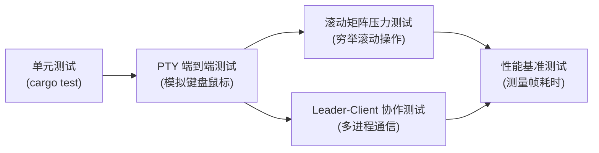
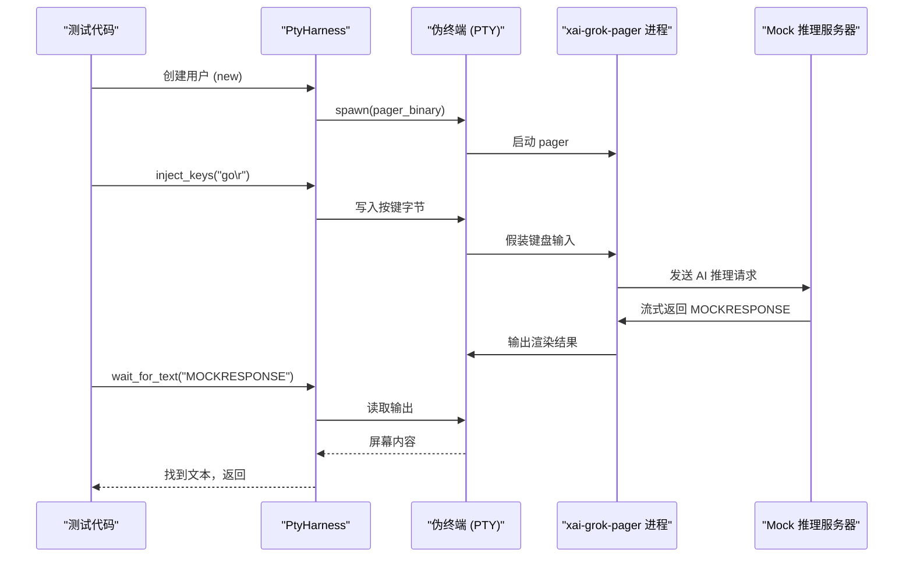
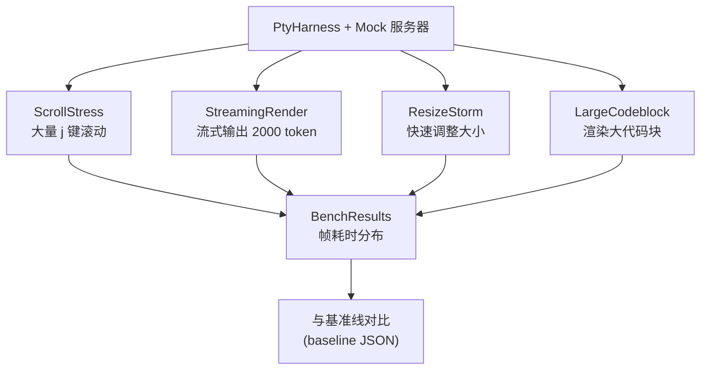

[← 返回首页](index.md)

# 测试策略：怎么保证这个复杂的东西不出 bug

Grok Build 有几千个 `.rs` 文件，涉及终端渲染、AI 对话、文件操作、git 交互……这么多零件凑在一起，怎么保证改了一行代码不把其他地方搞崩？靠的就是一整套测试体系：从最细的单元测试，到模拟真人按键的 PTY 端到端测试，再到压力测试和集群协作测试。

这套体系像一个层层过滤的筛子：



## 单元测试：最底层的守卫

每个 crate 里都有大量 `#[cfg(test)] mod tests`，测试单个函数或模块的行为。比如 `xai-grok-hooks::discovery::tests` 里验证“从同一个源码加载 Hook 不会重复”——这个 bug 如果在单元测试里没发现，到端到端测试里排查就费劲了。

**怎么运行：**

```bash
# 跑所有 crate 的单元测试
cargo test --lib

# 只跑一个 crate 的
cargo test -p xai-grok-hooks --lib
```

## PTY 端到端测试：模拟真人操作

这是最重要的测试手段。它不直接调函数，而是启动一个真实的 `xai-grok-pager` 进程，套在一个伪终端（PTY）里，然后像真人一样往里敲键盘、读屏幕输出。

### 核心工具：`PtyHarness`

这个结构体在 `crates/codegen/xai-grok-pager-pty-harness/src/lib.rs` 里，它把三件事组合在一起：

1. **`PtyController`**（pty 模块）—— 管理 PTY 进程的启动、写入按键、读取输出
2. **`ScreenTracker`**（screen 模块）—— 用 `alacritty_terminal` 模拟终端状态，记录屏幕上每个格子（cell）的内容
3. **`FrameTimingParser`**（timing 模块）—— 测量每一帧的耗时



### 真实测试怎么写

以 `crates/codegen/xai-grok-pager/tests/pty_e2e/common.rs` 里的 `spawn_polling_session` 为例：

```rust
// 1. 先用 ContentController 启动一个 Mock 推理服务器
let content = ContentController::start_with_models(vec![
    MockModel::new("default-model"),
]).await.expect("start content");

// 2. 设置 mock 服务器会返回什么
content.set_response("# Hello\n\nMOCKRESPONSE here.");

// 3. 给 mock 环境注入 OAuth 假凭证
seed_fake_oauth(&content, "test-user");

// 4. 用 pager 二进制 + 环境变量启动 PTY
let binary = pager_binary().expect("resolve pager binary");
let mut harness = PtyHarness::new_in_dir(
    &binary,
    50,  // 50 行
    120, // 120 列
    &[],
    &env_refs,
    Some(content.home()),
).expect("spawn pager");

// 5. 等欢迎界面出现（"Quit" 是菜单按钮的文本）
harness.wait_for_text("Quit", Duration::from_secs(20))
    .expect("welcome text");

// 6. 模拟输入："go" + 回车
harness.inject_keys(format!("go\r").as_bytes())
    .expect("submit prompt");

// 7. 等待 mock 响应的标记词出现
harness.wait_for_text("MOCKRESPONSE", Duration::from_secs(30))
    .expect("session response");
```

### 三种注入方式

测试里经常需要模拟各种用户操作，`PtyHarness` 支持：

- **按键注入**：`inject_keys(b"hello\r")` 直接写入字节
- **逐键注入**：`inject_keys_paced()`（`common.rs` 里的辅助函数）—— 每个字节之间加 50ms 延迟，防止被当成粘贴合并
- **特殊按键**：预定义的常量如 `CTRL_L`（换页符 `0x0c`）、`CTRL_ENTER`（`\x1b[13;5u`）等

```rust
// 来自 common.rs 的逐键注入函数
fn inject_keys_paced(harness: &mut PtyHarness, keys: &[u8]) {
    for &b in keys {
        harness.inject_keys(&[b]).expect("inject paced key");
        harness.update(Duration::from_millis(50));
    }
}
```

### 常见的测试场景

`crates/codegen/xai-grok-pager/tests/pty_e2e/` 下面有几十个测试文件，覆盖了各种场景：

| 测试文件 | 测什么 |
|---|---|
| `minimal_commits_response_to_scrollback` | 最小模式响应是否正确地提交到回滚缓冲区 |
| `minimal_ctrl_c_arms_and_quits` | 按 Ctrl+C 是否能正常退出 |
| `minimal_resize_preserves_committed_scrollback` | 调整终端大小后已提交内容不丢 |
| `minimal_short_response_stays_on_screen` | 短响应不滚动出屏幕 |
| `mouse_toggle` 相关 | 鼠标报告模式的开关 |

**怎么运行所有 PTY 端到端测试：**

```bash
cargo test -p xai-grok-pager --test pty_e2e -- --nocapture

# 只跑最小模式的
cargo test -p xai-grok-pager --test pty_e2e minimal -- --nocapture
```

## 滚动矩阵压力测试：穷举滚动操作

终端分页器最怕什么？用户疯狂滚动。如果滚动得太快或者连续执行多个滚动操作，分页器可能丢字、错行或者崩溃。

`scroll_matrix` 模块（`xai-grok-pager-pty-harness/src/scroll_matrix/`）像一个穷举机器人，它：

1. 生成所有可能的滚动操作序列（上翻一页、下翻一页、上翻半页、跳到开头……）
2. 自动向分页器注入这些操作
3. 检查屏幕上每个格子（cell）的内容是否一致

比如它会测试：连续按 10 次 `j`（向下滚动），再按 5 次 `k`（向上滚动），再按 `Ctrl+U`（向上翻页）——各种组合。如果哪次操作后屏幕出现乱码或者内容缺失，测试就会失败。

## Leader-Client 协作测试：多进程通信

在多 Agent 模式下（Leader 协调多个 Client 进程），出问题的概率更大。`tests/leader_pty_e2e/` 目录下的测试专门测这些事情：

- Leader 挂了以后 Client 能否自动恢复
- 多个 Client 同时写文件会不会冲突
- 版本不兼容时（Client 版本比 Leader 旧）能否优雅处理

这些测试跟普通 PTY 测试一样用 `PtyHarness`，但会同时启动多个进程：

```rust
// 用 LeaderCluster 管理多个进程
// 来自 xai_grok_pager_pty_harness::leader 模块
let mut cluster = LeaderCluster::start(leader_binary, client_binaries, env);
cluster.wait_for_clients_connected(Duration::from_secs(30));
cluster.submit_turn("fix the bug in worker.rs");
```

## Shell 集成测试：验证代码生成工具

`crates/codegen/xai-grok-shell/tests/` 里是一组针对“代码生成后端”的集成测试。它们不测试终端界面，而是测试：给一组合法输入，shell 能不能正确调用 AI 推理、写文件、处理 git。

测试的核心模式在 `tests/common/mod.rs` 里：

```rust
// 创建一个连到 mock 服务器的采样客户端
let client = create_test_client("http://localhost:1234", ApiBackend::Xai);

// 然后各种测试用这个 client 发送请求，检查返回
let result = client.complete("add a function to calculate fibonacci").await;
assert!(result.is_ok());
```

这些测试覆盖了：
- 并发写文件冲突（`git_contention_e2e`）
- Leader 版本兼容性（`test_leader_version_skew`）
- 采样器正确性（`test_sampling_client`）

## 性能基准测试：改代码会不会变慢

除了正确性，还要保证性能不退化。`benches/pty_bench.rs` 用 `PtyHarness` 运行一系列计时场景：



这些场景定义在 `xai-grok-pager-pty-harness/src/scenarios/` 下。每个场景跑完后输出帧耗时的统计数据（P50、P95、P99），再跟保存的基线对比。如果改代码后渲染一帧慢了一倍，基准测试就会报警。

**怎么运行基准测试：**

```bash
cargo bench -p xai-grok-pager-pty-harness
```

## 辅助工具：调试专用

测试没通过时，`PtyHarness` 有几个救命功能：

- **`write_cast()`** —— 把整个 PTY 对话过程导出为 asciinema 格式（`.cast` 文件），可以用 `asciinema play` 回放，看到底发生了什么
- **`screen_html()`** —— 把终端屏幕转成 HTML，方便在浏览器里看
- **`screen_contents()`** —— 直接看纯文本屏幕内容
- **`raw_output()`** —— 看看分页器到底输出了什么字节

```rust
// 在测试失败时生成回放文件
harness.write_cast(Path::new("failure.cast")).expect("write cast");
// 然后跑 asciinema play failure.cast
```

## 小结

| 测试类型 | 位置 | 用途 | 怎么跑 |
|---|---|---|---|
| 单元测试 | 各 crate 的 `tests` 模块 | 验证单个函数/模块 | `cargo test --lib` |
| PTY 端到端测试 | `xai-grok-pager/tests/pty_e2e/` | 模拟真人操作整个 pager | `cargo test -p xai-grok-pager --test pty_e2e` |
| 滚动矩阵压力测试 | `pty-harness/src/scroll_matrix/` | 穷举滚动操作，验证屏幕一致性 | 集成在 PTY 测试中 |
| Leader-Client 测试 | `xai-grok-pager/tests/leader_pty_e2e/` | 多进程协作场景 | `cargo test -p xai-grok-pager --test leader_pty_e2e` |
| Shell 集成测试 | `xai-grok-shell/tests/` | 验证代码生成后端 | `cargo test -p xai-grok-shell --test *` |
| 性能基准测试 | `pty-harness/benches/` | 测量帧耗时，对比基线 | `cargo bench -p xai-grok-pager-pty-harness` |

如果你想写一个新的 PTY 测试，最快的方式就是照着 `pty_e2e/minimal/mod.rs` 里那些测试抄一个——引入 `crate::common::*` 的辅助函数，创建 `ContentController` 开 mock 服务器，然后用 `PtyHarness::new_in_dir` 启动 pager，最后用 `wait_for_text` 断言输出。
