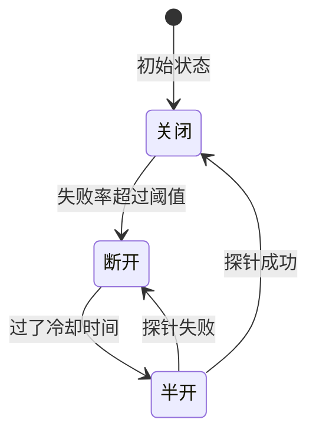
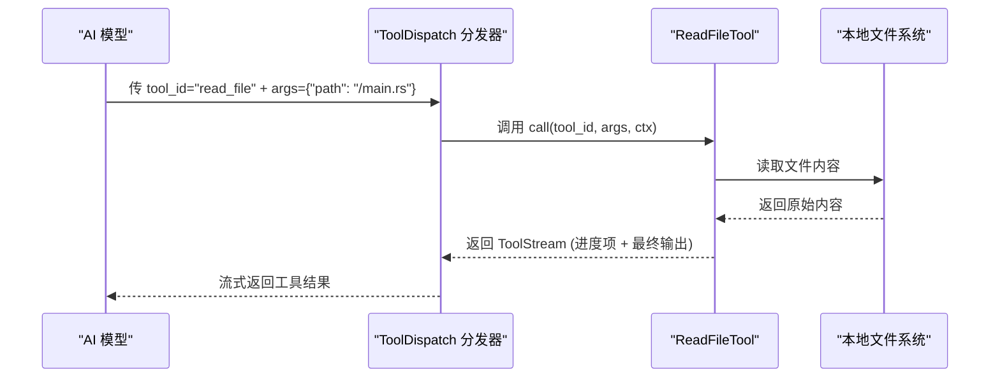
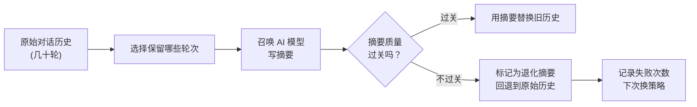
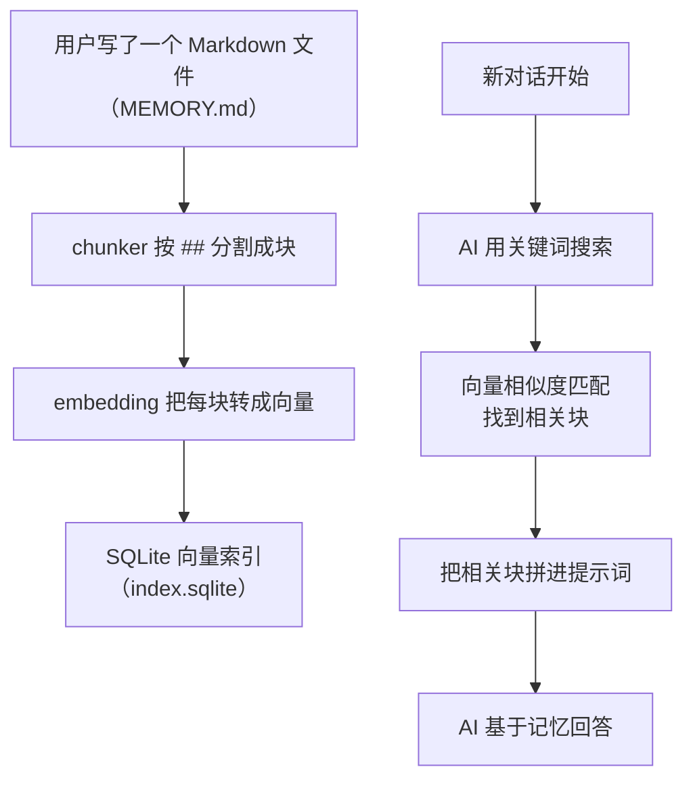

[← 返回首页](index.md)

# 通用基础设施：断路器、工具协议、压缩、记忆

## 断路器：别让一个模块炸翻全世界

想象一下你家小区的水管系统——一个水龙头突然爆了，如果水压全涌向那个破口，整栋楼的水管都会跟着震，最后所有人都没水用。断路器的思路就是：一旦发现某个接口老出故障，就主动把那个口子暂时"拧死"，让水（请求）绕道走，等修好了再重新开闸。

在 grok-build 里，`crates/common/xai-circuit-breaker/src/breaker.rs` 里 `CircuitBreaker` 这个结构体干的就是这事。它有三个状态来回切换：



**怎么工作的？** 只要一个接口（比如调 AI 模型）失败率超过了你设的阈值，断路器"啪"地断开——后续请求直接返回 `Err(BreakerOpen)`，连网络都不碰，这叫"快速失败"。过一会（`open_duration`），它会偷偷放一个"探针"请求进去试探，成功了就全量恢复（关闭状态），失败了就继续断开。

代码里最精妙的是 `is_open_fast` 这个原子布尔值（见 `breaker.rs` 第 64-67 行）：
```rust
// Lock-free 的快速检查门，不用加锁，闭着眼读就行了
is_open_fast: AtomicBool,
```
`check()` 和 `record()` 是两个主要方法。`check()` 决定"这请求能放行吗"，`record()` 则记录这次调用是成功还是失败，滑动窗口会据此算错误率。

## 工具协议：AI 的"万能插座"

AI 模型要调用外部工具（读文件、搜代码、执行命令），总得有个标准化的通信协议吧？`crates/common/xai-tool-protocol` 和 `crates/common/xai-tool-runtime` 就是干这个的。

**协议分两层：**

### 连接形状（ConnectionKind）
在 `crates/common/xai-tool-protocol/src/connection.rs` 里，定义了一个 WebSocket 连接的角色：
- `Harness` —— 测试支架，用来模拟工具调用
- `ToolServer` —— 真正的工具服务器

### 工具定义模式（ToolDefinitionMode）
```rust
pub enum ToolDefinitionMode {
    Full,        // 把所有工具描述一股脑全告诉模型
    Concise {    // 只告诉模型两个"元工具"：一个搜，一个调
        meta_search: ToolId,
        meta_call: ToolId,
    },
}
```
`Full` 模式就是直接甩给模型一大串 JSON 描述；`Concise` 模式更聪明——模型先通过 `meta_search` 找到要用的工具，再通过 `meta_call` 调用它，省 token。

### 运行时调度（ToolDispatch）
`crates/common/xai-tool-runtime/src/dispatch.rs` 里定义了 `ToolDispatch` 这个 trait：
```rust
#[async_trait]
pub trait ToolDispatch: Send + Sync {
    /// 流式调用工具，返回一个流（Stream），里面既有中间进度也有最终结果
    async fn call(
        &self,
        tool_id: ToolId,
        args: Value,      // 任意 JSON，由具体工具自己解析
        ctx: ToolCallContext,
    ) -> ToolStream<TypedToolOutput>;

    /// 等不及流的可以直接等最终结果
    async fn call_terminal(
        &self,
        tool_id: ToolId,
        args: Value,
        ctx: ToolCallContext,
    ) -> Result<TypedToolOutput, ToolError>;
}
```
每个工具实现自己的 `call`，比如读文件工具会去读本地文件，搜代码工具会去问工作树索引。分发器根据 `tool_id` 路由到正确的工具。



## 压缩：对话"减肥"，省 token 省钱

AI 对话越聊越长，token 开销嗖嗖涨。`crates/common/xai-grok-compaction/` 就是负责给对话"抽脂"的——把不重要的轮次提炼成一段摘要，省下的 token 给更重要的事。

### 两种压缩策略

**1. 轮次内压缩（Intra Compaction）**：每次对话结束前，把最近的几轮对话合并成一段摘要。像记笔记一样，只留关键流程。

**2. 轮次间压缩（Inter Compaction）**：跨多个会话，把之前会话的公共部分（项目背景、用户偏好）提炼成一段固化记忆。

在 `crates/common/xai-grok-compaction/src/lib.rs` 里，暴露了关键结构：
```rust
pub trait CompactionItem: ... { /* 一"轮"对话：用户说了啥、AI 回了啥、调了啥工具 */ }
pub trait CompactionSampler: ... { /* 让 AI 模型亲自写摘要 */ }
pub trait ItemTokenCounter: ... { /* 统计一轮对话用了多少 token */ }
```

### 全替换压缩（FullReplace Compaction）

有一种最狠的压缩叫"全替换"——直接把整个旧历史扔掉，让 AI 重新写一份更简洁的版本。`crates/common/xai-grok-compaction/src/code_compaction.rs` 里的 `apply_full_replace_compaction` 就是这个流程：



## 记忆：让 AI 记住你是谁

每次新开一个会话，AI 都像失忆了一样。`crates/codegen/xai-grok-memory/` 这个 crate 就是为了解决这个问题——它把重要信息存成 Markdown 文件，下次对话时自动读进来。

### 文件结构

记忆文件存在 `~/.grok/memory/` 目录下，分三层：

| 层级 | 路径 | 作用 |
|------|------|------|
| 全局 | `~/.grok/memory/MEMORY.md` | 跨所有项目的通用知识，比如个人偏好 |
| 项目级 | `~/.grok/memory/{项目哈希}/MEMORY.md` | 当前项目的特定知识 |
| 会话 | `~/.grok/memory/{项目哈希}/sessions/2026-02-23-{slug}-{sid8}.md` | 每次对话的完整日志 |

### 读和写

`crates/codegen/xai-grok-memory/src/storage.rs` 里的 `MemoryStorage` 提供了主要的读写接口：

**写全局记忆（跨所有项目都能读到）：**
```rust
let storage = MemoryStorage::new(cwd, None);
storage.append_to_memory(MemoryScope::Global, "## 用户偏好\n- 喜欢用 Rust\n- 偏好 Vim 模式").unwrap();
```

**写项目级记忆（只在这个项目里有效）：**
```rust
storage.write_long_term(MemoryScope::Workspace, "# 项目约定\n- 用 snake_case 命名函数\n- 控制层叫 handlers/").unwrap();
```

**读记忆文件（安全限制，只允许读 `~/.grok/memory/` 内的文件）：**
```rust
let content = storage.read_file(
    &storage.workspace_memory_file(),
    Some(0),    // 从第 0 行开始
    Some(100),  // 最多 100 行
).unwrap();
```
注意第 79-96 行有路径安全检查——只允许读 `global_dir` 目录之内的文件，防止路径穿越攻击。

### 记忆的"养成"：嵌入（Embedding）

记忆文件是 Markdown 格式，按 `##` 标题分割成块（`chunker` 模块负责这个）。每个块会被嵌入（`embed_missing_chunks` 函数，在 `lib.rs` 第 55-100 行）成向量，存到 SQLite 的向量索引里。下次对话时，AI 可以按相似度搜索出最相关的记忆块。



### 日常清理（GC）

记忆文件攒多了会占空间。`storage.gc(max_age_days)` 会删除过期的、空的、或者临时目录的记忆：

- `tmp*` 前缀的目录：空的直接删，非空且超过 7 天的也删
- 其他没有会话文件的目录：超过 `max_age_days` 就删
- 有会话文件的目录：永远不动（可能是用户自己建的）
