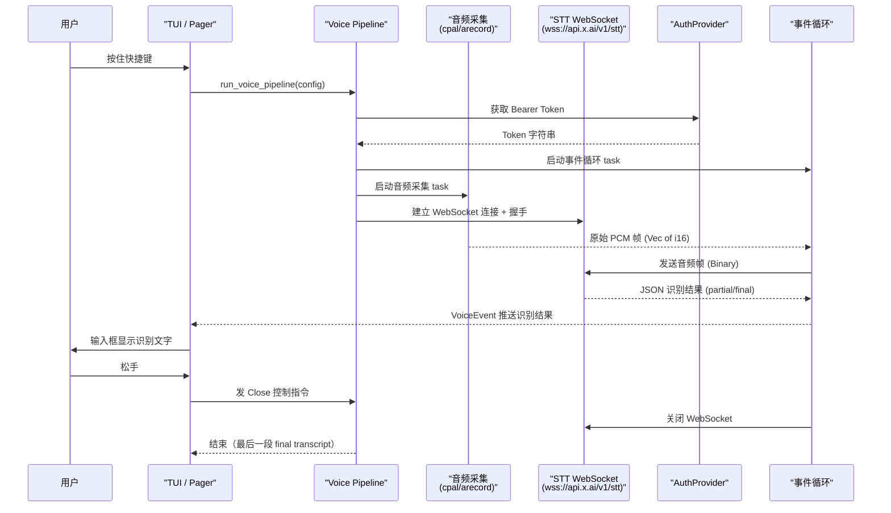

[← 返回首页](index.md)

# 语音输入：按住说话、松手转文字

## 这东西解决什么问题

你在终端里跟 Grok Build 聊天，敲键盘敲累了，想直接说话。按住快捷键、对着麦克风说几句话、松手——文字就出现在输入框里了。

这跟手机上的语音输入一样，但它跑在终端里，而且跨平台：macOS 用 CoreAudio、Windows 用 WASAPI、Linux 直接调系统自带的 `arecord` 命令。

背后的流程是：麦克风 → 音频帧 → WebSocket 流式发给 xAI 的 STT（Speech-to-Text，语音转文字）服务 → 实时返回识别结果 → 塞进你的输入框。

```
输入框按快捷键（或点击麦克风图标）
  → pipeline 启动
    → 三个 tokio task 并行跑：音频采集、WebSocket STT 连接、事件循环
      → 音频帧 → STT 服务 → 逐句返回识别文字 → VoiceEvent 发给 UI 层
```

## 跑起来的流程

先看一张图，搞清楚谁在什么时候调用谁：



三个 tokio task 的协作方式就是标准的 `tokio::select!`：事件循环同时监听三条消息来源——STT 推送的识别结果、音频采集吐出的 PCM 帧、以及调用方（UI 层）发来的控制指令。谁先有数据就处理谁，不会互相阻塞。

## 核心 API

整个 crate 的入口文件是 `crates/codegen/xai-grok-voice/src/lib.rs`，只暴露了这几个东西给外部用：

| 类型/函数 | 作用 | 一句话说明 |
|---|---|---|
| `run_voice_pipeline` | 启动整个语音识别流程 | 传入配置、认证 provider 和一个事件发送 channel，它内部拉起所有子 task 然后一直跑到被关闭 |
| `VoiceEvent` | 对外的状态变化通知 | 包含了"识别到新的文字片段"、"最终确认结果"、"出错了"等所有事件 |
| `VoiceCommand` | 调用方发给 pipeline 的控制信号 | 暂停、恢复、关闭——相当于遥控器上的三个按钮 |
| `VoiceConfig` | 配置入口 | 认证信息、STT 服务地址、语言选择都在这里 |
| `AUDIO_SUPPORTED` | 编译时常量，标记这个构建是否支持音频采集 | Linux 上值为 true 不代表能采集，只代表采集代码编译进去了，实际有没有 `arecord` 得运行时检测 |

这里的关键设计是：调用方通过 `VoiceCommand` 发信号、通过 `VoiceEvent` 收结果，完全不用关心底层是 cpal 还是 `arecord` 子进程。这就是所谓的控制反转——底层细节被封装在 pipeline 内部，外部只看到几个干净的 enum。

## 跨平台音频采集：两套实现，一个接口

源码在 `crates/codegen/xai-grok-voice/src/audio/mod.rs`，开头就讲清楚了为什么要有两套实现：

```rust
//! Two backends share one interface (`spawn_pcm_capture`,
//! `capture_pcm_for_duration`, `CaptureHandle`):
//! - non-Linux (macOS/Windows): `cpal` (coreaudio/wasapi), linked into the binary;
//! - Linux: a subprocess recorder (`pw-record`/`parec`/`arecord`), because the
//!   static-musl release binary cannot link `cpal` -> `alsa-sys`.
```

翻译成人话：非 Linux 平台直接用 cpal 库（一个 Rust 的跨平台音频库，底层对接 macOS 的 CoreAudio 和 Windows 的 WASAPI）链接进二进制。Linux 不行——因为 Grok Build 发版用的是静态 musl 编译，cpal 依赖 alsa-sys 这个动态链接库，根本链不进去。所以 Linux 上只能另辟蹊径：直接调系统自带命令行工具来录音。

三个 Linux 上的录音工具，按优先级自动选：

```
# 如果装了 pw-record（PipeWire）就用它，最新的 Linux 桌面都在用
pw-record --channels 1 --rate 16000 --format s16_le -

# 退而求其次用 parec（PulseAudio）
parec --format=s16le --rate=16000 --channels=1

# 古老但靠谱的 arecord（ALSA），几乎所有 Linux 发行版都内置
arecord -q -f S16_LE -r 16000 -c 1
```

这三个命令的输出格式完全一样：单声道、16kHz 采样率、16-bit little-endian 的原始 PCM 数据。"原始 PCM"说得直白点就是没经过任何压缩的音频数据——每个采样点就是一个 16 位整数，代表那一瞬间麦克风振膜的位移。

所以对外暴露的函数名完全统一：无论在哪个平台，调用方都调 `spawn_pcm_capture`，拿到一个 `CaptureHandle`。平台差异被编译时条件选择完全吞掉了：

```rust
#[cfg(not(target_os = "linux"))]
mod capture;           // cpal 实现
#[cfg(target_os = "linux")]
mod capture_linux;     // 子进程实现

// 对外暴露完全相同的接口
#[cfg(not(target_os = "linux"))]
pub use capture::{CaptureHandle, capture_pcm_for_duration, spawn_pcm_capture};
#[cfg(target_os = "linux")]
pub use capture_linux::{CaptureHandle, capture_pcm_for_duration, spawn_pcm_capture};
```

`CaptureHandle` 是一个带 `Drop` 的结构体——你拿到它之后，音频采集就在后台跑着。当你不需要了（比如用户松手了），直接 drop 掉它，底层该杀子进程杀子进程、该关音频流关音频流，不会漏资源。

## 流式语音识别：WebSocket 长连接 + JSON 协议

STT 部分的代码在 `crates/codegen/xai-grok-voice/src/stt/` 下，核心是 `StreamingSttSession`：

```rust
// crates/codegen/xai-grok-voice/src/stt/mod.rs
pub use streaming::{StreamingSttEvent, StreamingSttSession};
pub use types::{SttServerEvent, SttTranscriptPartial};
```

`StreamingSttSession` 是对 `tokio-tungstenite` WebSocket 连接的封装。建立连接的流程：

1. 拿着 Bearer Token 去连 `wss://api.x.ai/v1/stt`
2. 发送一条握手 JSON 消息，告诉服务端"我要开始听写了，语言选中文"
3. 之后每收到一帧音频数据，就 Binary 帧发过去
4. 服务端不断推回 JSON 格式的识别结果：可能是部分结果（还没说完、还在修正），也可能是最终确认结果（这句说完了）

服务端推送的 JSON 结构在 `types.rs` 里定义，核心是 `SttServerEvent` 枚举——一个 `partial` 变体拿 `SttTranscriptPartial`、一个 `final` 变体拿完整识别文本。

关于服务端返回的具体 JSON 字段和握手协议细节，[详见《MCP 协议：接入外部工具服务》](25-mcp-integration.md)，STT 的协议逻辑和 ACP/MCP 的流式响应模型非常相似。

## 心跳保活和自动重连

WebSocket 连接不能一直空着——网络中间件可能会断开空闲连接。所以 `StreamingSttSession` 内部有定时发送心跳帧的逻辑（ping/pong）。

如果连接断了怎么办？`run_voice_pipeline` 内置了自动重连策略：它不直接持有 `StreamingSttSession`，而是在事件循环里检测连接状态。一旦发现 WebSocket 挂了，就重新走一遍握手流程、建新连接。

这个重连逻辑的设计思想和 Agent 层的采样器重试策略非常像——都是通过 tokio 的异步循环实现透明的断线恢复。[详见《采样器与重试策略》](18-sampler-and-retry.md)。

## 认证：怎么拿到 Token

`crates/codegen/xai-grok-voice/src/auth.rs` 定义了 `VoiceAuthProvider` trait：

```rust
pub use auth::{SharedVoiceAuth, StaticVoiceAuth, VoiceAuthProvider};
```

一个 trait、两个实现：

- `StaticVoiceAuth`：简单粗暴，直接用写死在配置里的 token 字符串
- `SharedVoiceAuth`：外面持有 `Arc<RwLock<Option<String>>>`，可以在运行时换 token（比如 token 过期后用户重新登录，UI 层更新这个值，语音 session 下次请求自动用新的）

底层都是返回一个 `Bearer xxx` 格式的字符串，往 WebSocket 请求头里一塞就行。

## 语言选择

```rust
pub use language::{
    STT_LANGUAGE_AUTO, STT_LANGUAGE_DEFAULT, STT_LANGUAGES, SttLanguage,
    canonicalize_stt_language, language_for_api, stt_language_by_code,
};
```

`crates/codegen/xai-grok-voice/src/language.rs` 里定义了所有支持的语言代码。常用的是 `STT_LANGUAGE_AUTO`（让服务端自己检测你说了什么语言）和 `STT_LANGUAGE_DEFAULT`（英语）。你要说中文，传 `zh` 就行。

`canonicalize_stt_language` 这个函数挺有意思——它会把用户输入的乱七八糟的语言代码（`zh-CN`、`chinese`、`中文`）标准化成服务端认识的格式。背后是一张 `SttLanguage` 枚举，包含了所有 xAI STT 服务支持的语言清单。

## 健康探测：确认环境能不能跑

在真正启动语音 session 之前，系统会先跑一个探测（probe）。`crates/codegen/xai-grok-voice/src/probe.rs` 提供了两个探测函数：

- `run_mic_only_probe`：只检测麦克风能不能打开、能不能读到音频数据（几秒钟就行）。这个功能需要 `audio` feature，所以用 `#[cfg(feature = "audio")]` 条件编译。
- `run_streaming_probe`：完整链路探测——开麦克风、连 STT 服务、发几帧音频、看能不能收到识别结果。

探测的结果用 `VoiceProbeReport` 结构体返回，里面包含每个步骤是否成功、失败原因。UI 层可以调用 `format_probe_report` 把它格式化成用户看得懂的文字。

这比直接启动语音会话然后弹个错误窗口好得多——用户在点麦克风按钮之前，就能知道"你的 Linux 没装 arecord，语音输入用不了"。

## 和其他页面的关系

语音识别是终端 TUI 交互的一种输入方式，识别出来的文字最终会出现在输入框里，和键盘输入的文字走完全相同的处理路径——都是发给 Agent runtime、生成回复、渲染到屏幕。这个后续流程 [详见《一次完整对话的旅程》](05-one-full-turn.md)。

TUI 里的斜杠命令里有一个 `/voice` 命令用来切换语音输入开关，[详见《斜杠命令系统》](11-slash-command-system.md)。

语音采集用到的 tokio 异步 runtime 和事件循环模式，跟整个 Grok Build 后端用的是一样的基础设施，[详见《整体架构》](04-architecture-overview.md)。
